# Feature research: what similar projects do that karpathy.app could use

*2026-09-26 · autonomous research run · 30 features, filed as GitHub issues [#64–#93](https://github.com/tillg/karpathy.app/issues?q=label%3Afeature-research)*

We surveyed about 50 projects near karpathy.app's niche (a mobile PWA for a Markdown vault with an agentic LLM that maintains an "LLM wiki"). They fall into four groups:

- **AI-augmented note apps:** Obsidian Copilot, Smart Connections, Khoj, Reor, Mem, NotebookLM, Notion AI, Tana, Heptabase, Capacities, Cursor/Canvas-style editing.
- **PKM and Markdown web tools:** Obsidian core plugins, Bases/Dataview, SilverBullet, Logseq, Foam, Dendron, Trilium, HedgeDoc, Memos, Quartz, Flowershow.
- **LLM-wiki implementations and agent UIs:** [Karpathy's gist](https://gist.github.com/karpathy/442a6bf555914893e9891c11519de94f), nashsu/llm_wiki, Claudian, Obsidian Agent Client, Cline, Roo Code, OpenHands, Open WebUI, LibreChat, AnythingLLM, GPT Researcher, qmd.
- **Git-backed and mobile-first note apps:** Obsidian Git, Working Copy, GitJournal, Drafts, 1Writer, iA Writer, Bear, Typora, GitHub Mobile.

About 50 raw ideas were deduplicated into **30 features**, each filed as an issue and ranked.

## Table of contents

- [Overview](#overview)
  - [The features in the LLM-wiki loop](#the-features-in-the-llm-wiki-loop) · [Value vs effort](#value-vs-effort) · [Ranking](#ranking) · [Roadmap](#suggested-roadmap) · [Building blocks](#shared-building-blocks)
- Features
  01. [Slash commands and one-tap skill chips in the chat](#01-slash-commands-and-one-tap-skill-chips-in-the-chat)
  02. [Clip URLs / text / files into raw/ with an ingest inbox](#02-clip-urls--text--files-into-raw-with-an-ingest-inbox)
  03. [Per-turn review and undo of AI edits](#03-per-turn-review-and-undo-of-ai-edits)
  04. ["Save to wiki": file a chat answer as a synthesis page](#04-save-to-wiki-file-a-chat-answer-as-a-synthesis-page)
  05. [Backlinks panel with unlinked mentions and a one-tap "Link"](#05-backlinks-panel-with-unlinked-mentions-and-a-one-tap-link)
  06. [Quick switcher: fuzzy open/create with recent and pinned notes](#06-quick-switcher-fuzzy-opencreate-with-recent-and-pinned-notes)
  07. [Markdown toolbar above the on-screen keyboard](#07-markdown-toolbar-above-the-on-screen-keyboard)
  08. [Plan mode: agent proposes the pages it will touch, user approves before writing](#08-plan-mode-agent-proposes-the-pages-it-will-touch-user-approves-before-writing)
  09. [Clickable citations and source provenance](#09-clickable-citations-and-source-provenance)
  10. [@-mention notes and folders as chat context](#10--mention-notes-and-folders-as-chat-context)
  11. [Auto-fetch on open with a "behind remote" badge and one-tap pull](#11-auto-fetch-on-open-with-a-behind-remote-badge-and-one-tap-pull)
  12. [Per-file history: git log, diff and restore an old version](#12-per-file-history-git-log-diff-and-restore-an-old-version)
  13. [Scheduled background agent jobs (nightly lint, inbox ingest, weekly digest)](#13-scheduled-background-agent-jobs-nightly-lint-inbox-ingest-weekly-digest)
  14. [Push notifications when a turn/job finishes or needs approval](#14-push-notifications-when-a-turnjob-finishes-or-needs-approval)
  15. [Quick capture and daily notes](#15-quick-capture-and-daily-notes)
  16. [Outline / table of contents and note info (words, reading time)](#16-outline--table-of-contents-and-note-info-words-reading-time)
  17. [Rename/move notes and update every wikilink](#17-renamemove-notes-and-update-every-wikilink)
  18. [Semantic search and "Related notes" (embeddings, also exposed to the agent)](#18-semantic-search-and-related-notes-embeddings-also-exposed-to-the-agent)
  19. [Properties (frontmatter) editor with wiki-schema validation](#19-properties-frontmatter-editor-with-wiki-schema-validation)
  20. [Inline AI edit on a selection (Cmd-K style) with accept/reject](#20-inline-ai-edit-on-a-selection-cmd-k-style-with-acceptreject)
  21. [Model and agent switcher per chat](#21-model-and-agent-switcher-per-chat)
  22. [Token, cost and context meter](#22-token-cost-and-context-meter)
  23. [Deep research into the wiki (`/research <topic>`)](#23-deep-research-into-the-wiki-research-topic)
  24. [Attach photos and PDFs (camera → raw/, chat attachments)](#24-attach-photos-and-pdfs-camera--raw-chat-attachments)
  25. [Voice memos → transcript in raw/ (optional auto-ingest)](#25-voice-memos--transcript-in-raw-optional-auto-ingest)
  26. [Hover / long-press wikilink preview](#26-hover--long-press-wikilink-preview)
  27. [Tag browser (inline and frontmatter tags)](#27-tag-browser-inline-and-frontmatter-tags)
  28. [Wiki dashboards: Bases-compatible query tables](#28-wiki-dashboards-bases-compatible-query-tables)
  29. [Local graph view of the open note](#29-local-graph-view-of-the-open-note)
  30. [Fork a chat from any message](#30-fork-a-chat-from-any-message)
- [Appendix A: Researched but not filed](#appendix-a-researched-but-not-filed)
- [Appendix B: Platform facts that constrain the design](#appendix-b-platform-facts-that-constrain-the-design)
- [Appendix C: opencode endpoints that make many features cheap](#appendix-c-opencode-endpoints-that-make-many-features-cheap)

## How to read this report

- **Rank** is a judgement of *fit* (how directly the feature serves the mobile ingest → query → lint loop), *helpfulness* (how much friction it removes day to day) and *cool* factor, weighed against *effort* (S ≈ days, M ≈ 1–2 weeks, L ≈ several weeks).
- Each chapter has a **screen drawing** (an ASCII wireframe of the app with the feature in place), a **Mermaid diagram** of how it works (inline, plus an SVG in [`docs/diagrams/`](../../docs/diagrams/)), an implementation sketch, caveats and prior art with links.
- Hard constraints that shaped every proposal:
  - the AI never commits ([ADR 0001](../../docs/adr/0001-user-triggered-commits.md));
  - no provider lock-in (everything goes through opencode);
  - the Markdown round-trip must be lossless;
  - iOS PWA limits apply: no Web Share Target, no Web Speech in installed apps, and Web Push only for Home-Screen apps.
- Open enhancements that already exist and were **not** re-filed: [#59](https://github.com/tillg/karpathy.app/issues/59) image embeds, [#60](https://github.com/tillg/karpathy.app/issues/60) templates, [#61](https://github.com/tillg/karpathy.app/issues/61) multi-word/accent-insensitive search.

## Overview

### The features in the LLM-wiki loop

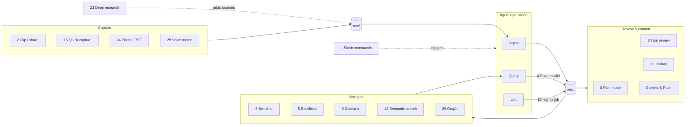
```mermaid
flowchart LR
    subgraph CAPTURE["Capture"]
        C1["2 Clip / share"]
        C2["15 Quick capture"]
        C3["24 Photo / PDF"]
        C4["25 Voice memo"]
    end
    RAW[("raw/")]
    subgraph AGENT["Agent operations"]
        I["Ingest"]
        Q["Query"]
        L["Lint"]
    end
    WIKI[("wiki/")]
    subgraph REVIEW["Review & commit"]
        R1["8 Plan mode"]
        R2["3 Turn review"]
        R3["12 History"]
        CP["Commit & Push"]
    end
    subgraph NAV["Navigate"]
        N1["6 Switcher"]
        N2["5 Backlinks"]
        N3["9 Citations"]
        N4["18 Semantic search"]
        N5["29 Graph"]
    end
    CAPTURE --> RAW --> I --> WIKI
    Q -- "4 Save to wiki" --> WIKI
    L -- "13 nightly job" --> WIKI
    WIKI --> REVIEW --> CP
    WIKI --> NAV --> Q
    SC["1 Slash commands"] -.triggers.-> AGENT
    SC2["23 Deep research"] -.adds sources.-> RAW
```



### Value vs effort

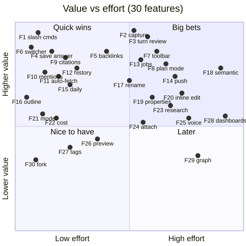

<details><summary>Mermaid source</summary>

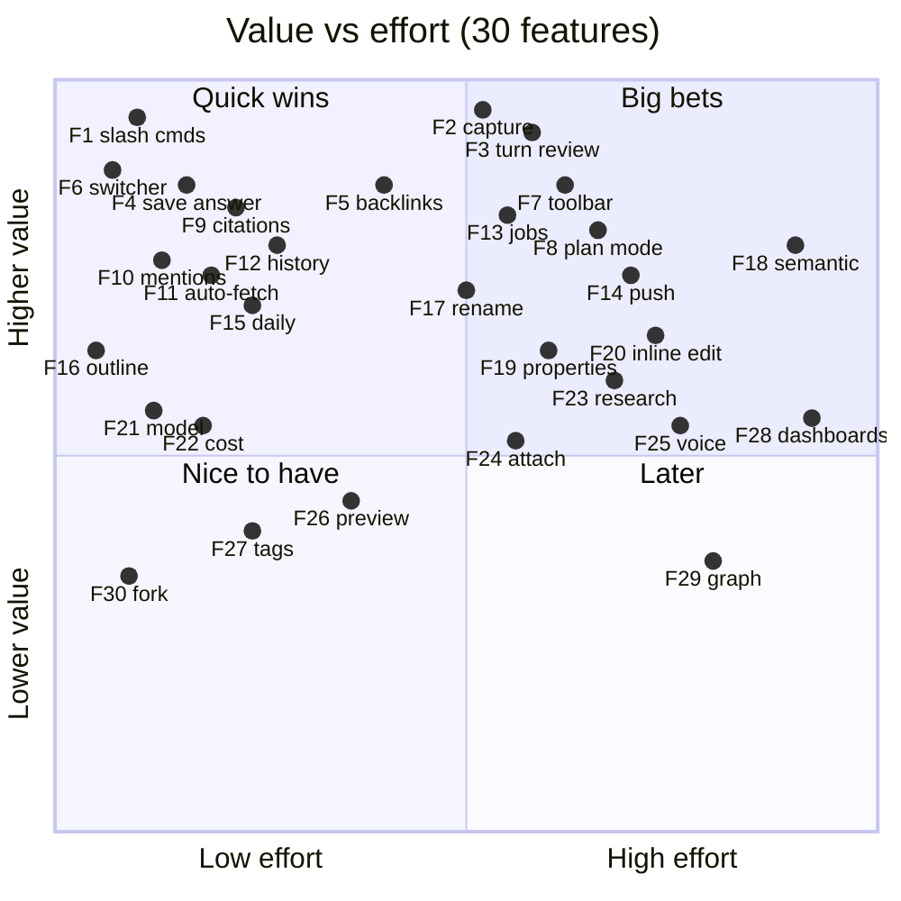
```mermaid
quadrantChart
    title Value vs effort (30 features)
    x-axis Low effort --> High effort
    y-axis Lower value --> Higher value
    quadrant-1 Big bets
    quadrant-2 Quick wins
    quadrant-3 Nice to have
    quadrant-4 Later
    F1 slash cmds: [0.10, 0.95]
    F2 capture: [0.52, 0.96]
    F3 turn review: [0.58, 0.93]
    F4 save answer: [0.16, 0.86]
    F5 backlinks: [0.40, 0.86]
    F6 switcher: [0.07, 0.88]
    F7 toolbar: [0.62, 0.86]
    F8 plan mode: [0.66, 0.80]
    F9 citations: [0.22, 0.83]
    F10 mentions: [0.13, 0.76]
    F11 auto-fetch: [0.19, 0.74]
    F12 history: [0.27, 0.78]
    F13 jobs: [0.55, 0.82]
    F14 push: [0.70, 0.74]
    F15 daily: [0.24, 0.70]
    F16 outline: [0.05, 0.64]
    F17 rename: [0.50, 0.72]
    F18 semantic: [0.90, 0.78]
    F19 properties: [0.60, 0.64]
    F20 inline edit: [0.73, 0.66]
    F21 model: [0.12, 0.56]
    F22 cost: [0.18, 0.54]
    F23 research: [0.68, 0.60]
    F24 attach: [0.56, 0.52]
    F25 voice: [0.76, 0.54]
    F26 preview: [0.36, 0.44]
    F27 tags: [0.24, 0.40]
    F28 dashboards: [0.92, 0.55]
    F29 graph: [0.80, 0.36]
    F30 fork: [0.09, 0.34]
```

</details>

### Ranking

| # | Feature | Issue | Effort | Fit | Help | Cool |
|---:|---|---|:-:|:-:|:-:|:-:|
| 1 | [Slash commands and one-tap skill chips in the chat](#01-slash-commands-and-one-tap-skill-chips-in-the-chat) | [#64](https://github.com/tillg/karpathy.app/issues/64) | S | 5 | 5 | 3 |
| 2 | [Clip URLs / text / files into raw/ with an ingest inbox](#02-clip-urls--text--files-into-raw-with-an-ingest-inbox) | [#65](https://github.com/tillg/karpathy.app/issues/65) | M | 5 | 5 | 4 |
| 3 | [Per-turn review and undo of AI edits (turn diff, undo turn, per-hunk keep/undo)](#03-per-turn-review-and-undo-of-ai-edits) | [#66](https://github.com/tillg/karpathy.app/issues/66) | M | 5 | 5 | 4 |
| 4 | ["Save to wiki": file a chat answer as a synthesis page](#04-save-to-wiki-file-a-chat-answer-as-a-synthesis-page) | [#67](https://github.com/tillg/karpathy.app/issues/67) | S | 5 | 4 | 3 |
| 5 | [Backlinks panel with unlinked mentions and a one-tap "Link"](#05-backlinks-panel-with-unlinked-mentions-and-a-one-tap-link) | [#68](https://github.com/tillg/karpathy.app/issues/68) | M | 5 | 4 | 3 |
| 6 | [Quick switcher: fuzzy open/create with recent and pinned notes](#06-quick-switcher-fuzzy-opencreate-with-recent-and-pinned-notes) | [#69](https://github.com/tillg/karpathy.app/issues/69) | S | 4 | 5 | 3 |
| 7 | [Markdown toolbar above the on-screen keyboard](#07-markdown-toolbar-above-the-on-screen-keyboard) | [#70](https://github.com/tillg/karpathy.app/issues/70) | M | 4 | 5 | 2 |
| 8 | [Plan mode: agent proposes the pages it will touch, user approves before writing](#08-plan-mode-agent-proposes-the-pages-it-will-touch-user-approves-before-writing) | [#71](https://github.com/tillg/karpathy.app/issues/71) | M | 4 | 4 | 4 |
| 9 | [Clickable citations and source provenance](#09-clickable-citations-and-source-provenance) | [#72](https://github.com/tillg/karpathy.app/issues/72) | S | 5 | 4 | 3 |
| 10 | [@-mention notes and folders as chat context](#10--mention-notes-and-folders-as-chat-context) | [#73](https://github.com/tillg/karpathy.app/issues/73) | S | 4 | 4 | 3 |
| 11 | [Auto-fetch on open with a "behind remote" badge and one-tap pull](#11-auto-fetch-on-open-with-a-behind-remote-badge-and-one-tap-pull) | [#74](https://github.com/tillg/karpathy.app/issues/74) | S | 4 | 4 | 2 |
| 12 | [Per-file history: git log, diff and restore an old version](#12-per-file-history-git-log-diff-and-restore-an-old-version) | [#75](https://github.com/tillg/karpathy.app/issues/75) | S | 4 | 4 | 3 |
| 13 | [Scheduled background agent jobs (nightly lint, inbox ingest, weekly digest)](#13-scheduled-background-agent-jobs-nightly-lint-inbox-ingest-weekly-digest) | [#76](https://github.com/tillg/karpathy.app/issues/76) | M | 5 | 4 | 5 |
| 14 | [Push notifications when a turn/job finishes or needs approval](#14-push-notifications-when-a-turnjob-finishes-or-needs-approval) | [#77](https://github.com/tillg/karpathy.app/issues/77) | M | 4 | 4 | 4 |
| 15 | [Quick capture and daily notes](#15-quick-capture-and-daily-notes) | [#78](https://github.com/tillg/karpathy.app/issues/78) | S | 4 | 4 | 2 |
| 16 | [Outline / table of contents and note info (words, reading time)](#16-outline--table-of-contents-and-note-info-words-reading-time) | [#79](https://github.com/tillg/karpathy.app/issues/79) | S | 3 | 4 | 2 |
| 17 | [Rename/move notes and update every wikilink](#17-renamemove-notes-and-update-every-wikilink) | [#80](https://github.com/tillg/karpathy.app/issues/80) | M | 4 | 4 | 2 |
| 18 | [Semantic search and "Related notes" (embeddings, also exposed to the agent)](#18-semantic-search-and-related-notes-embeddings-also-exposed-to-the-agent) | [#81](https://github.com/tillg/karpathy.app/issues/81) | L | 4 | 4 | 5 |
| 19 | [Properties (frontmatter) editor with wiki-schema validation](#19-properties-frontmatter-editor-with-wiki-schema-validation) | [#82](https://github.com/tillg/karpathy.app/issues/82) | M | 4 | 3 | 3 |
| 20 | [Inline AI edit on a selection (Cmd-K style) with accept/reject](#20-inline-ai-edit-on-a-selection-cmd-k-style-with-acceptreject) | [#83](https://github.com/tillg/karpathy.app/issues/83) | M | 3 | 4 | 4 |
| 21 | [Model and agent switcher per chat](#21-model-and-agent-switcher-per-chat) | [#84](https://github.com/tillg/karpathy.app/issues/84) | S | 3 | 3 | 3 |
| 22 | [Token, cost and context meter](#22-token-cost-and-context-meter) | [#85](https://github.com/tillg/karpathy.app/issues/85) | S | 3 | 3 | 3 |
| 23 | [Deep research into the wiki (`/research <topic>`)](#23-deep-research-into-the-wiki-research-topic) | [#86](https://github.com/tillg/karpathy.app/issues/86) | M | 4 | 3 | 5 |
| 24 | [Attach photos and PDFs (camera → raw/, chat attachments)](#24-attach-photos-and-pdfs-camera--raw-chat-attachments) | [#87](https://github.com/tillg/karpathy.app/issues/87) | M | 3 | 3 | 3 |
| 25 | [Voice memos → transcript in raw/ (optional auto-ingest)](#25-voice-memos--transcript-in-raw-optional-auto-ingest) | [#88](https://github.com/tillg/karpathy.app/issues/88) | M | 3 | 3 | 4 |
| 26 | [Hover / long-press wikilink preview](#26-hover--long-press-wikilink-preview) | [#89](https://github.com/tillg/karpathy.app/issues/89) | S | 3 | 3 | 3 |
| 27 | [Tag browser (inline and frontmatter tags)](#27-tag-browser-inline-and-frontmatter-tags) | [#90](https://github.com/tillg/karpathy.app/issues/90) | S | 3 | 3 | 2 |
| 28 | [Wiki dashboards: Bases-compatible query tables](#28-wiki-dashboards-bases-compatible-query-tables) | [#91](https://github.com/tillg/karpathy.app/issues/91) | L | 3 | 3 | 4 |
| 29 | [Local graph view of the open note](#29-local-graph-view-of-the-open-note) | [#92](https://github.com/tillg/karpathy.app/issues/92) | M | 2 | 2 | 5 |
| 30 | [Fork a chat from any message](#30-fork-a-chat-from-any-message) | [#93](https://github.com/tillg/karpathy.app/issues/93) | S | 2 | 2 | 3 |

### Suggested roadmap



<details><summary>Mermaid source</summary>


```mermaid
flowchart LR
    subgraph W1["Wave 1 · quick wins (S, mostly opencode-native)"]
        F1["1 Slash commands"]
        F4["4 Save to wiki"]
        F6["6 Quick switcher"]
        F9["9 Citations"]
        F10["10 @-mentions"]
        F11["11 Auto-fetch"]
        F12["12 File history"]
        F15["15 Daily capture"]
        F16["16 Outline"]
        F21["21 Model switcher"]
        F22["22 Cost meter"]
        F30["30 Fork chat"]
    end
    subgraph W2["Wave 2 · trust & capture"]
        F2["2 Capture inbox"]
        F3["3 Turn review"]
        F5["5 Backlinks"]
        F7["7 Mobile toolbar"]
        F8["8 Plan mode"]
        F17["17 Safe rename"]
        F26["26 Link preview"]
        F27["27 Tag browser"]
    end
    subgraph W3["Wave 3 · autonomy"]
        F13["13 Scheduled jobs"]
        F14["14 Push"]
        F23["23 Deep research"]
        F24["24 Attachments"]
        F25["25 Voice memos"]
    end
    subgraph W4["Wave 4 · intelligence & visuals"]
        F18["18 Semantic search"]
        F19["19 Properties editor"]
        F20["20 Inline AI edit"]
        F28["28 Dashboards"]
        F29["29 Local graph"]
    end
    W1 --> W2 --> W3 --> W4
```

</details>

### Shared building blocks

Several features need the same piece of infrastructure. Building that piece once makes each later feature cheap. The **link & frontmatter index** that feature 5 (Backlinks) introduces is the biggest multiplier, because it is reused by seven features.

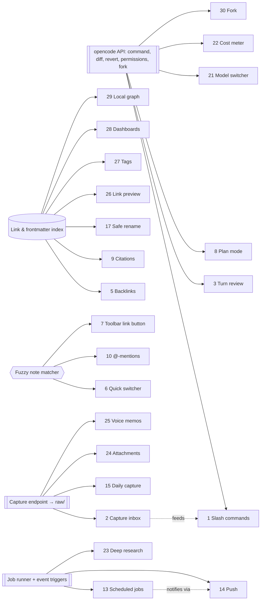
```mermaid
flowchart LR
    LI[("Link & frontmatter index")]
    FM{{"Fuzzy note matcher"}}
    OC[["opencode API: command, diff, revert, permissions, fork"]]
    JR[["Job runner + event triggers"]]
    CE[["Capture endpoint → raw/"]]
    LI --> F5["5 Backlinks"] & F9["9 Citations"] & F17["17 Safe rename"] & F26["26 Link preview"] & F27["27 Tags"] & F28["28 Dashboards"] & F29["29 Local graph"]
    FM --> F6["6 Quick switcher"] & F10["10 @-mentions"] & F7["7 Toolbar link button"]
    OC --> F1["1 Slash commands"] & F3["3 Turn review"] & F8["8 Plan mode"] & F21["21 Model switcher"] & F22["22 Cost meter"] & F30["30 Fork"]
    JR --> F13["13 Scheduled jobs"] & F14["14 Push"] & F23["23 Deep research"]
    CE --> F2["2 Capture inbox"] & F15["15 Daily capture"] & F24["24 Attachments"] & F25["25 Voice memos"]
    F2 -.feeds.-> F1
    F13 -.notifies via.-> F14
```



---

## 01. Slash commands and one-tap skill chips in the chat

> **Issue:** [#64](https://github.com/tillg/karpathy.app/issues/64) · **Effort:** S · **Seen in:** Obsidian Copilot, Open WebUI, Claudian, Agent Client (Obsidian ACP)

Typing `/` in the chat composer opens a palette of the vault's opencode commands and skills (`/ingest`, `/lint`, `/query`, `/timeline`, plus your own prompts stored as `.md` in the vault), each with a description and an argument hint. An empty chat shows one-tap chips like "Ingest inbox", "Lint wiki" and "Ask the wiki", so the most common LLM-wiki operations are a single tap instead of a paragraph typed on a phone keyboard.

### Screen drawing

```text
┌──────────────────────────────────────┐
│ ‹ Chats       qwen3-coder         ✎  │
├──────────────────────────────────────┤
│                                      │
│   New chat · ask about this vault    │
│                                      │
│  ╭──────────────╮ ╭───────────╮      │ ①
│  │ Ingest inbox │ │ Lint wiki │      │
│  ╰──────────────╯ ╰───────────╯      │
│  ╭──────────────╮                    │
│  │ Ask the wiki │                    │
│  ╰──────────────╯                    │
│                                      │
│ ┌──────────────────────────────────┐ │ ②
│ │ /ingest   Ingest a raw source    │ │
│ │           ‹path in raw/›         │ │
│ │ /lint     Wiki health check      │ │
│ │           ‹category or page›     │ │
│ │ /query    Answer from the wiki   │ │
│ │ /timeline Timeline of dated      │ │
│ │           events                 │ │
│ │ /weekly   Weekly review (vault)  │ │ ③
│ └──────────────────────────────────┘ │
│ ┌──────────────────────────────┐ ╭─╮ │
│ │ /ing▌                        │ │↑│ │ ④
│ └──────────────────────────────┘ ╰─╯ │
├──────────────────────────────────────┤
│  Files   Search   [Chat]   Changes   │
└──────────────────────────────────────┘
```

1. ① Empty-state chips: the 3–4 most used commands of this vault; one tap starts a turn.
2. ② Palette opened by `/`, filtered as you type, with description and argument hint per entry.
3. ③ A user prompt stored as a `.md` file in the vault, synced via git like any note.
4. ④ Composer; picking an entry fills in the command and leaves the cursor at the argument.

### How it works

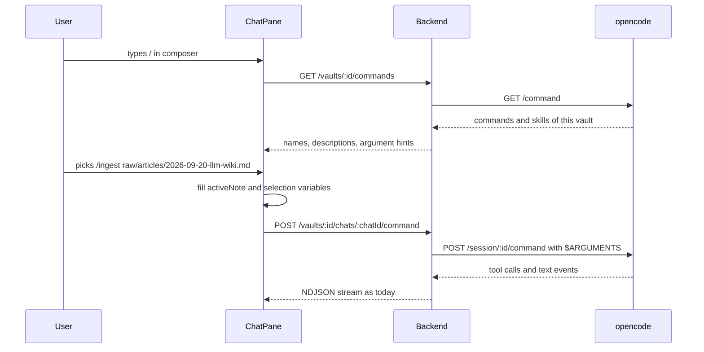
```mermaid
sequenceDiagram
    participant U as User
    participant W as ChatPane
    participant B as Backend
    participant O as opencode
    U->>W: types / in composer
    W->>B: GET /vaults/:id/commands
    B->>O: GET /command
    O-->>B: commands and skills of this vault
    B-->>W: names, descriptions, argument hints
    U->>W: picks /ingest raw/articles/2026-09-20-llm-wiki.md
    W->>W: fill activeNote and selection variables
    W->>B: POST /vaults/:id/chats/:chatId/command
    B->>O: POST /session/:id/command with $ARGUMENTS
    O-->>B: tool calls and text events
    B-->>W: NDJSON stream as today
```
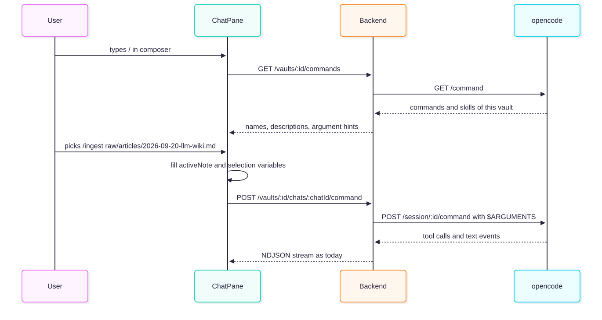

- Backend: a thin per-vault proxy of opencode `GET /command` (plus the skill list, if skills are not in it) in `apps/backend/src/harness/opencode.ts`, exposed as a new vault route next to the chat routes in `apps/backend/src/app.ts`.
- Sending: `POST /session/:id/command` with `$ARGUMENTS`; the existing NDJSON chat stream (`/vaults/:id/chats/:chatId/stream`) shows the result unchanged.
- Frontend: a filterable popover on `/` in the composer of `apps/web/src/components/ChatPane.tsx`; the client fills `{activeNote}` / `{selection}` from the open note before sending.
- Empty state: replace the "New chat · ask about this vault" line with chips for the 3–4 most used commands of this vault.
- User prompts are opencode command files (`.md`) inside the vault, so they sync with Obsidian desktop and mobile via git.

### Why it's worth it

Typing "please ingest raw/articles/foo.md following the ingest skill" on a phone keyboard is the single most tedious step in the mobile loop today. With the palette, ingest, lint and query become one tap each, and skills a user didn't know the vault had become discoverable. Because prompts live in the vault, a command written on the Mac shows up on the phone after the next pull.

### Caveats & open questions

- Verify whether skills appear in `GET /command` or need a separate listing.
- The list is per vault, because skills differ per vault; cache it per vault and refresh on vault switch.
- Ranking "most used" needs a small per-vault counter; a fixed default set is fine for a first cut.
- Commands that expect arguments should not fire from a chip without one (e.g. `/ingest` needs a path).

### Prior art

| Project | What they do |
|---|---|
| [Obsidian Copilot custom commands](https://docs.obsidiancopilot.com/custom-commands/) | User-defined prompts, stored as notes, run from a command menu |
| [Open WebUI prompts as slash commands](https://docs.openwebui.com/features/workspace/prompts/) | `/` in the chat input lists saved prompts with variables |
| [Claudian](https://github.com/YishenTu/claudian) | Claude Code in Obsidian with slash commands and skills in the chat |
| [Agent Client (Obsidian ACP)](https://github.com/RAIT-09/obsidian-agent-client) | ACP agents in Obsidian, surfacing the agent's slash commands |
| [opencode commands](https://opencode.ai/docs/commands/) | Markdown command files with `$ARGUMENTS`, runnable via the server API |

---

## 02. Clip URLs / text / files into raw/ with an ingest inbox

> **Issue:** [#65](https://github.com/tillg/karpathy.app/issues/65) · **Effort:** M · **Seen in:** Karpathy LLM wiki gist, nashsu/llm_wiki, Obsidian Web Clipper

A capture screen (paste a URL or text, or share into the app from another app) saves the source to `raw/` as clean Markdown with `url` and `clipped` frontmatter. An "Inbox" view lists the raw sources that have not been ingested yet, each with an "Ingest" button that starts the chat turn for it.

### Screen drawing

```text
┌──────────────────────────────────────┐
│ ‹ Files        Inbox           +     │ ①
├──────────────────────────────────────┤
│ ┌──────────────────────────────────┐ │
│ │ https://gist.github.com/karpat…  │ │ ②
│ └──────────────────────────────────┘ │
│   [ Paste text ]   [ Clip URL  ↓ ]   │
│                                      │
│  Saved raw/articles/                 │
│   2026-09-26-llm-wiki.md  ✓          │ ③
│                                      │
│ NOT INGESTED YET · 3                 │
│ ┌──────────────────────────────────┐ │
│ │ ▤ 2026-09-26-llm-wiki.md         │ │ ④
│ │   raw/articles · clipped today   │ │
│ │                       [ Ingest ] │ │
│ ├──────────────────────────────────┤ │
│ │ ▤ 2026-09-24-software-3-0.md     │ │
│ │   raw/articles · 2 days ago      │ │
│ │                       [ Ingest ] │ │
│ ├──────────────────────────────────┤ │
│ │ ▤ attention-is-all-you-need.pdf  │ │
│ │   raw/papers · 5 days ago        │ │
│ │                       [ Ingest ] │ │
│ └──────────────────────────────────┘ │
│                                      │
│ ● 1 uncommitted                      │ ⑤
├──────────────────────────────────────┤
│  Files   Search   Chat   Changes·1   │
└──────────────────────────────────────┘
```

1. ① Capture entry point; also the target of the Android share sheet and the iOS Shortcut.
2. ② Paste a URL (or switch to text); the backend fetches and cleans it.
3. ③ Result: a new file under `raw/articles/` with `url:` / `clipped:` frontmatter.
4. ④ Inbox = raw files not referenced by any `sources:` frontmatter or `log.md` entry; "Ingest" runs `/ingest` on it.
5. ⑤ The captured file stays uncommitted like every other edit (ADR 0001).

### How it works

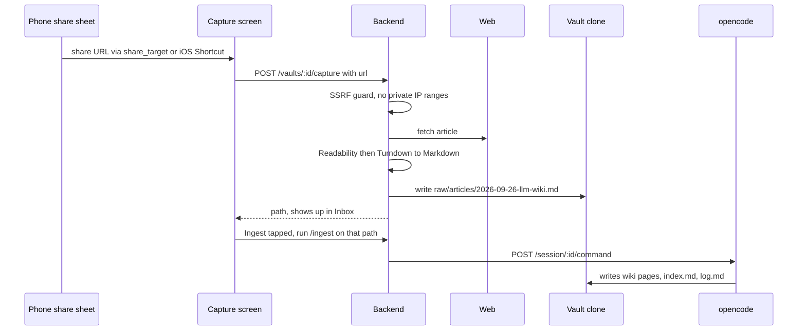
```mermaid
sequenceDiagram
    participant P as Phone share sheet
    participant W as Capture screen
    participant B as Backend
    participant N as Web
    participant V as Vault clone
    participant O as opencode
    P->>W: share URL via share_target or iOS Shortcut
    W->>B: POST /vaults/:id/capture with url
    B->>B: SSRF guard, no private IP ranges
    B->>N: fetch article
    B->>B: Readability then Turndown to Markdown
    B->>V: write raw/articles/2026-09-26-llm-wiki.md
    B-->>W: path, shows up in Inbox
    W->>B: Ingest tapped, run /ingest on that path
    B->>O: POST /session/:id/command
    O->>V: writes wiki pages, index.md, log.md
```
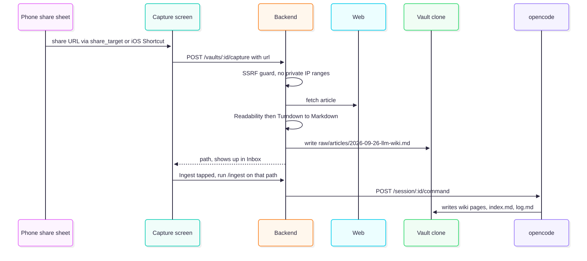

- New endpoint `POST /vaults/:id/capture` `{url|text|file}` in `apps/backend/src/app.ts`; fetch plus Readability + Turndown, write via the same path guards as `PUT /vaults/:id/file` (`apps/backend/src/files.ts`, `paths.ts`).
- Android: a `share_target` entry in the web manifest posts to the capture screen. iOS: ship an Apple Shortcut that appears in the share sheet and POSTs to the same endpoint with the bearer token.
- Inbox: computed from `GET /vaults/:id/files` plus a scan of `sources:` frontmatter and `wiki/log.md`; a new sidebar view next to `FileTree.tsx` / `ChangesPanel.tsx`.
- "Ingest" reuses the slash-command path (feature 01): it starts a chat turn with `/ingest <path>`.

### Why it's worth it

Getting sources into `raw/` from the phone is the biggest gap in the mobile LLM-wiki loop today, and it is the entry point of Karpathy's ingest operation. Reading an article on the phone and having it in the wiki two taps later closes the loop without a laptop. The inbox also makes the backlog visible, so nothing clipped gets forgotten.

### Caveats & open questions

- Web Share Target is not supported on iOS Safari ([WebKit bug 194593](https://bugs.webkit.org/show_bug.cgi?id=194593)), so iOS needs the Shortcut fallback.
- Server-side fetching needs SSRF guards (no private IP ranges, no redirects into them).
- The Shortcut stores a token on the device; consider a capture-only token later.
- The captured file stays uncommitted (ADR 0001).
- "Not ingested" is a heuristic; a source cited only in prose would still show up.

### Prior art

| Project | What they do |
|---|---|
| [Karpathy LLM wiki gist](https://gist.github.com/karpathy/442a6bf555914893e9891c11519de94f) | Defines the `raw/` → ingest → wiki loop this feeds |
| [nashsu/llm_wiki](https://github.com/nashsu/llm_wiki) | Web clipper plus an ingest queue for new sources |
| [Obsidian Web Clipper](https://obsidian.md/clipper) | Browser extension saving pages as Markdown with frontmatter |
| [Obsidian iOS share sheet](https://obsidian.md/help/ios) | Share text and links from other iOS apps into a vault |
| [MDN share_target](https://developer.mozilla.org/en-US/docs/Web/Progressive_web_apps/Manifest/Reference/share_target) | Manifest member that registers a PWA as a share target |
| [WebKit bug 194593](https://bugs.webkit.org/show_bug.cgi?id=194593) | Tracks the missing Web Share Target support in Safari |

---

## 03. Per-turn review and undo of AI edits

> **Issue:** [#66](https://github.com/tillg/karpathy.app/issues/66) · **Effort:** M · **Seen in:** Cline, Cursor, Obsidian Git

After each chat turn a "Changes in this turn" card lists the files the AI changed, with inline diffs and Keep/Undo per hunk and per file. "Undo this turn" restores exactly what that turn changed and leaves your own edits alone, so reviewing a 12-page ingest on the phone no longer means all-or-nothing.

### Screen drawing

```text
┌──────────────────────────────────────┐
│ ‹ Chats       qwen3-coder         ✎  │
├──────────────────────────────────────┤
│              ┌─────────────────────┐ │
│              │ /ingest raw/article │ │
│              │ s/2026-09-26-llm-wi │ │
│              └─────────────────────┘ │
│ ✦ karpathy.app · qwen3-coder          │
│ Ingested the gist: 1 new source,     │
│ 2 pages updated.                     │
│ ┌──────────────────────────────────┐ │
│ │ CHANGES IN THIS TURN · 3 files   │ │ ①
│ │ ▾ wiki/entities/andrej-karpathy  │ │
│ │  @@ -4,3 +4,4 @@                 │ │
│ │  -updated: 2026-09-12            │ │
│ │  +updated: 2026-09-26            │ │
│ │  +sources: [llm-wiki-gist.md]    │ │
│ │               [ Keep ] [ Undo ]  │ │ ②
│ │ ▸ wiki/sources/llm-wiki-gist  +42│ │
│ │ ▸ wiki/log.md                  +4│ │
│ │ ⚠ log.md edited by you since     │ │ ③
│ │ ┌──────────────────────────────┐ │ │
│ │ │       Undo this turn         │ │ │ ④
│ │ └──────────────────────────────┘ │ │
│ └──────────────────────────────────┘ │
│ ┌──────────────────────────────┐ ╭─╮ │
│ │ Ask about your vault…        │ │↑│ │
│ └──────────────────────────────┘ ╰─╯ │
├──────────────────────────────────────┤
│  Files   Search   [Chat]   Changes   │
└──────────────────────────────────────┘
```

1. ① Turn card: only the files this turn wrote, with the diff against the state before the turn (not against HEAD).
2. ② Keep/Undo per hunk; the same pair exists per file in its collapsed header.
3. ③ Warning when the user edited a file after the turn, shown before any revert.
4. ④ "Undo this turn" reverts every change of this turn and nothing else.

### How it works

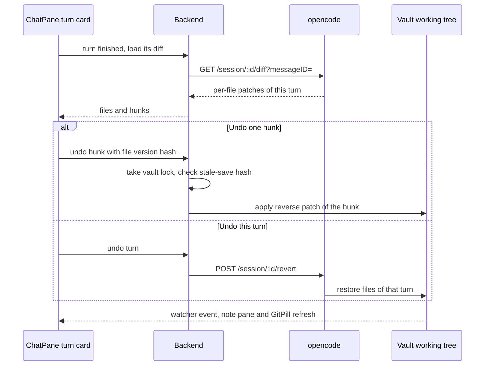
```mermaid
sequenceDiagram
    participant W as ChatPane turn card
    participant B as Backend
    participant O as opencode
    participant V as Vault working tree
    W->>B: turn finished, load its diff
    B->>O: GET /session/:id/diff?messageID=
    O-->>B: per-file patches of this turn
    B-->>W: files and hunks
    alt Undo one hunk
        W->>B: undo hunk with file version hash
        B->>B: take vault lock, check stale-save hash
        B->>V: apply reverse patch of the hunk
    else Undo this turn
        W->>B: undo turn
        B->>O: POST /session/:id/revert
        O->>V: restore files of that turn
    end
    V-->>W: watcher event, note pane and GitPill refresh
```
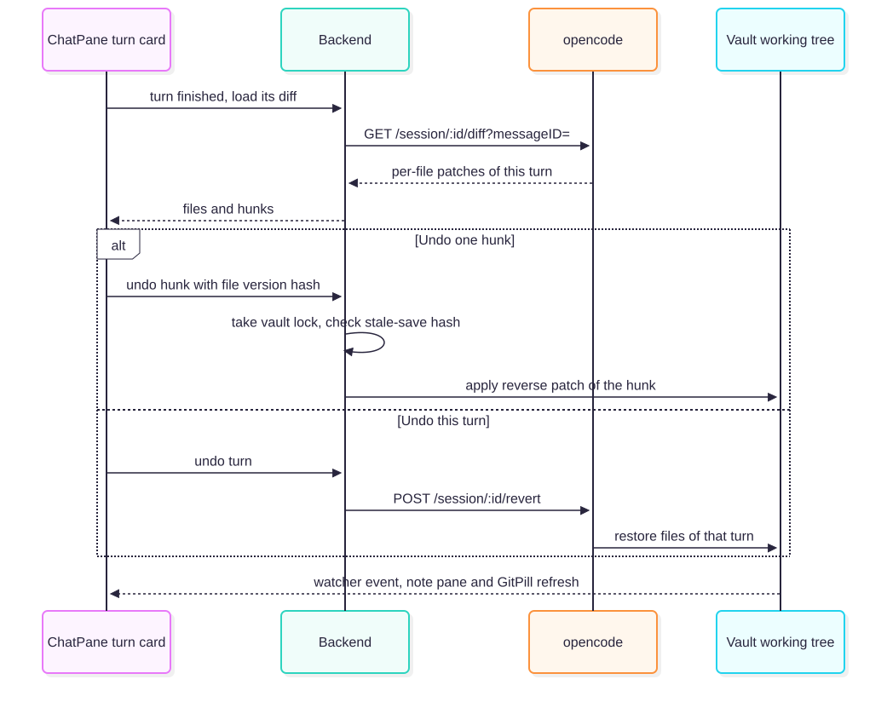

- Turn data: opencode `GET /session/:id/diff?messageID=`; whole-turn undo via `POST /session/:id/revert`, redo via `unrevert`. Wrapped in `apps/backend/src/harness/opencode.ts` and exposed under `/vaults/:id/chats/:chatId/...`.
- Hunk undo: the backend applies the reverse patch to the working tree under the vault lock (`apps/backend/src/lock.ts`) with the same stale-save hash check as `PUT /vaults/:id/file`.
- UI: a card under each assistant turn that wrote files in `apps/web/src/components/ChatPane.tsx`, next to today's "changed <path>" tool chips.
- Optional: a CM6 change gutter in `apps/web/src/lib/cm.ts` marking lines changed vs HEAD, with tap-to-revert-hunk.

### Why it's worth it

An ingest touches 5–15 pages. Today the only undo is per-file Discard against HEAD, which also wipes the human's edits in the same file. Per-turn and per-hunk review is the missing trust layer: you can let the AI ingest from the phone and keep 11 good edits while dropping the one bad claim on `wiki/concepts/…`.

### Caveats & open questions

- Two diff baselines coexist (this turn vs. uncommitted vs. HEAD); the UI has to keep them visibly apart from the Changes panel.
- opencode snapshots are currently disabled (`snapshot: false`); enabling them or implementing turn snapshots in the backend is a design decision and needs a new ADR.
- opencode undo has had revert bugs (anomalyco/opencode #4704, #5474), so this needs e2e tests.
- If the user edited the file after the turn, warn before reverting.

### Prior art

| Project | What they do |
|---|---|
| [Cline checkpoints](https://docs.cline.bot/features/checkpoints) | Snapshot per step; restore files, task, or both |
| [Cursor inline edit / keep-undo](https://cursor.com/docs/inline-edit/overview) | Keep/Undo per AI change right in the editor |
| [Obsidian Git – signs in editor](https://github.com/Vinzent03/obsidian-git/blob/master/README.md) | Gutter signs for changed lines, revert per hunk |
| [opencode server API](https://opencode.ai/docs/server/) | Session diff, revert and unrevert endpoints |
| [opencode snapshots](https://opencode.ai/v2/docs/snapshots/) | Working-tree snapshots that make per-turn revert possible |

---

## 04. "Save to wiki": file a chat answer as a synthesis page

> **Issue:** [#67](https://github.com/tillg/karpathy.app/issues/67) · **Effort:** S · **Seen in:** Karpathy LLM wiki gist, nashsu/llm_wiki, Khoj, Heptabase

Every finished assistant answer gets a "Save to wiki" button that turns it into `wiki/synthesis/<slug>.md` with proper frontmatter (`sources`, `related`, `confidence`), links it from the related pages and appends entries to `index.md` and `log.md`. Two lighter actions, "Append to current note" and "Insert at cursor", drop the answer into the note you are editing without any AI call.

### Screen drawing

```text
┌──────────────────────────────────────┐
│ ‹ Chats       qwen3-coder         ✎  │
├──────────────────────────────────────┤
│        ┌───────────────────────────┐ │
│        │ How does Karpathy's LLM   │ │
│        │ wiki relate to RAG?       │ │
│        └───────────────────────────┘ │
│ ✦ karpathy.app · qwen3-coder          │
│ ✓ read wiki/index.md                 │
│ ✓ read wiki/concepts/rag.md          │
│ ✓ read wiki/sources/llm-wiki-gist.md │
│                                      │
│ The wiki is a *compiled* artifact:   │
│ the LLM digests each source once at  │
│ ingest time, while RAG re-retrieves  │
│ raw chunks on every question …       │
│                                      │
│ ┌──────────────┐ ┌────────┐ ┌──────┐ │ ①
│ │ Save to wiki │ │ Append │ │Insert│ │ ②
│ └──────────────┘ └────────┘ └──────┘ │
│                                      │
│ ✦ karpathy.app · qwen3-coder          │
│ ✎ changed wiki/synthesis/            │ ③
│    llm-wiki-vs-rag.md                │
│ ✎ changed wiki/concepts/rag.md       │
│ ✎ changed wiki/index.md              │
│ ✎ changed wiki/log.md                │
│ Filed: [[synthesis/llm-wiki-vs-rag]] │
├──────────────────────────────────────┤
│  Files   Search   [Chat]   Changes·4 │ ④
└──────────────────────────────────────┘
```

1. ① "Save to wiki" sends a canned follow-up to the same session: "file the previous answer per the query skill".
2. ② "Append to current note" / "Insert at cursor" are client-side edits of the open note, no AI call.
3. ③ The follow-up turn writes the synthesis page, a backlink on a related page, and index/log entries.
4. ④ Everything stays uncommitted until the user commits (ADR 0001).

### How it works

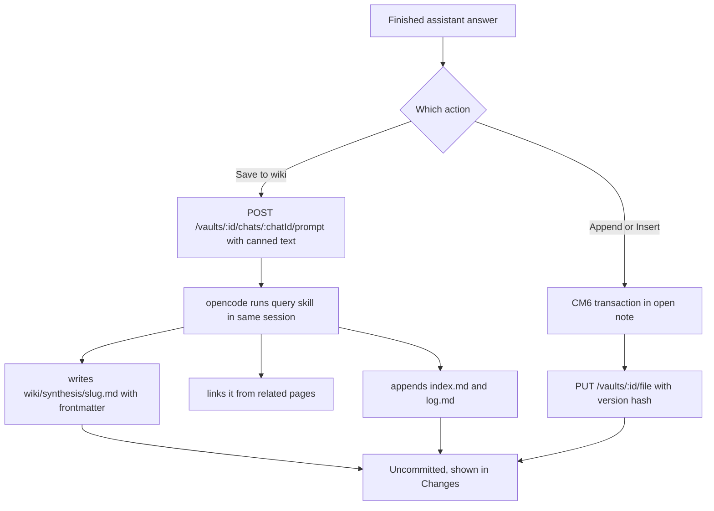
```mermaid
flowchart TD
    A["Finished assistant answer"] --> B{"Which action"}
    B -->|Save to wiki| C["POST /vaults/:id/chats/:chatId/prompt with canned text"]
    C --> D["opencode runs query skill in same session"]
    D --> E["writes wiki/synthesis/slug.md with frontmatter"]
    D --> F["links it from related pages"]
    D --> G["appends index.md and log.md"]
    B -->|Append or Insert| H["CM6 transaction in open note"]
    H --> I["PUT /vaults/:id/file with version hash"]
    E --> J["Uncommitted, shown in Changes"]
    G --> J
    I --> J
```


- Button row under each finished `assistant-message` in `apps/web/src/components/ChatPane.tsx` (only when the turn is idle).
- "Save to wiki" posts a fixed prompt to the existing `POST /vaults/:id/chats/:chatId/prompt`; the session already holds the answer, so no text is re-sent.
- The vault's query skill (`SKILL.md`) defines slug, frontmatter and where to link; the app hard-codes none of that.
- "Insert at cursor" uses the `EditorHandle` of `apps/web/src/components/Editor.tsx`; "Append" edits the draft and saves via the normal `PUT /vaults/:id/file` path.

### Why it's worth it

Karpathy's gist says good query answers should be filed back into the wiki; that is how knowledge compounds instead of evaporating in chat history. Today that takes typing a follow-up prompt on the phone. With one tap, the query operation feeds the wiki the same way ingest does, and the next question can build on the saved synthesis.

### Caveats & open questions

- Pure prompt/skill work: quality depends on the vault's query skill describing how to file answers.
- The result stays uncommitted (ADR 0001) and shows up in Changes like any AI edit.
- Hide or disable "Insert at cursor" when no note is open in Write mode.

### Prior art

| Project | What they do |
|---|---|
| [Karpathy LLM wiki gist](https://gist.github.com/karpathy/442a6bf555914893e9891c11519de94f) | Recommends filing valuable query answers back as wiki pages |
| [nashsu/llm_wiki](https://github.com/nashsu/llm_wiki) | Saves chat answers into the wiki |
| [Khoj Obsidian UX (insert response)](https://blog.khoj.dev/posts/obsidian-ux-revamp/) | Insert or copy a chat response into the open note |
| [Heptabase: work with AI](https://wiki.heptabase.com/work-with-ai) | Turns AI chat answers into cards on the whiteboard |

---

## 05. Backlinks panel with unlinked mentions and a one-tap "Link"

> **Issue:** [#68](https://github.com/tillg/karpathy.app/issues/68) · **Effort:** M · **Seen in:** Obsidian, SilverBullet, Foam, Quartz

Under the note (or in a side panel on iPad) a "Linked mentions" list shows every note that links to this one, with a context snippet. "Unlinked mentions" shows plain-text occurrences of the note's title or aliases, each with a one-tap "Link" that turns exactly that occurrence into a `[[wikilink]]`.

### Screen drawing

```text
┌──────────────────────────────────────────────────────────────────────────┐
│ [Files]Search Changes  ⚙ │ ▯ entities › andrej-karpathy  [Write|Read] ✦  │
├──────────────────────────┼───────────────────────────────────────────────┤
│ ▾ Frechen (main)         │ andrej-karpathy                               │
│ ▾ wiki                   │ type     entity                               │
│   ▾ entities             │ sources  llm-wiki-gist.md                     │
│     andrej-karpathy  ●   │ related  [[concepts/llm-wiki]]                │
│     openai               │ confidence  high                              │
│   ▸ concepts             │                                               │
│   ▸ sources              │ Andrej Karpathy is an AI researcher, founding │
│   index.md               │ member of OpenAI and former head of AI at …   │
│   log.md                 │                                               │
│ ▸ raw                    │ ───────────────────────────────────────────── │
│                          │ LINKED MENTIONS · 3                         ① │
│                          │ concepts/llm-wiki                             │
│                          │   …pattern proposed by [[andrej-karpathy]]…   │
│                          │ sources/llm-wiki-gist                         │
│                          │   …gist by [[andrej-karpathy|Karpathy]] on…   │
│                          │ topics/ai-tooling                             │
│                          │   …see [[andrej-karpathy]] for background…    │
│                          │                                               │
│                          │ UNLINKED MENTIONS · 2                       ② │
│                          │ concepts/software-3-0                         │
│                          │   …as Andrej Karpathy argued in…    [ Link ] ③│
│                          │ sources/nanogpt-readme                        │
│                          │   …written by Karpathy (alias)…     [ Link ]  │
├──────────────────────────┤                                               │
│ ● 2 uncommitted          │ Saved                                         │
└──────────────────────────┴───────────────────────────────────────────────┘
```

1. ① Linked mentions: every note linking here (body wikilinks and frontmatter lists), with a snippet; tap opens it.
2. ② Unlinked mentions: plain-text hits of the title or a frontmatter `aliases` entry.
3. ③ "Link" splices `[[andrej-karpathy|Andrej Karpathy]]` into that one occurrence and saves; the row moves up to Linked.

### How it works

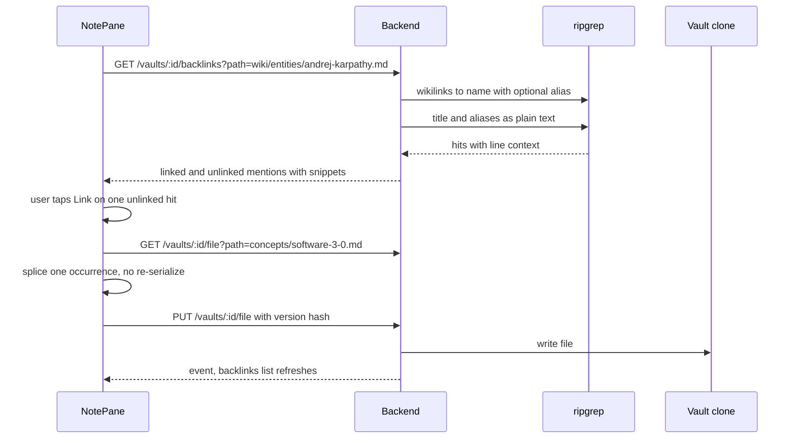
```mermaid
sequenceDiagram
    participant N as NotePane
    participant B as Backend
    participant R as ripgrep
    participant V as Vault clone
    N->>B: GET /vaults/:id/backlinks?path=wiki/entities/andrej-karpathy.md
    B->>R: wikilinks to name with optional alias
    B->>R: title and aliases as plain text
    R-->>B: hits with line context
    B-->>N: linked and unlinked mentions with snippets
    N->>N: user taps Link on one unlinked hit
    N->>B: GET /vaults/:id/file?path=concepts/software-3-0.md
    N->>N: splice one occurrence, no re-serialize
    N->>B: PUT /vaults/:id/file with version hash
    B->>V: write file
    B-->>N: event, backlinks list refreshes
```
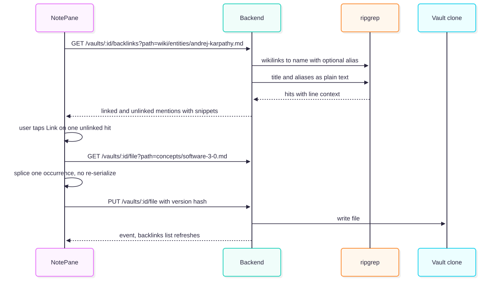

- New endpoint `GET /vaults/:id/backlinks?path=` in `apps/backend/src/app.ts`, reusing the ripgrep runner behind `GET /vaults/:id/search`: pattern `\[\[name(\|.*)?\]\]` plus frontmatter lists, and a title/alias search for unlinked mentions.
- "Link" is a minimal text splice (offset + length) sent via the normal `PUT /vaults/:id/file` with the version hash, so the stale-save dialog protects concurrent edits.
- UI: a section under the document in `apps/web/src/components/NotePane.tsx`, rendered in both Read and Write mode; snippets reuse the `Linked` wikilink renderer.
- The same reverse index powers "pages derived from this source" in feature 09.

### Why it's worth it

Checking that the LLM wove a new source into existing pages is the main review loop of an LLM wiki. Unlinked mentions are exactly the gaps the lint skill hunts for, and fixing them by tapping "Link" works on a phone where editing text precisely does not. It also makes the result of an ingest visible from the entity's side: "which pages now point here?"

### Caveats & open questions

- Link resolution (shortest path, aliases, case) must match Obsidian's, or the app and Obsidian disagree about what links where.
- Splice, never re-serialize the file: frontmatter and formatting must round-trip byte for byte.
- Short titles ("RAG", "AI") produce noisy unlinked hits; limit to word boundaries and skip hits inside existing links and code.
- Large vaults: cache the index or run the search only when the panel is expanded.

### Prior art

| Project | What they do |
|---|---|
| [Obsidian backlinks](https://obsidian.md/help/plugins/backlinks) | Linked and unlinked mentions with a "Link" button |
| [SilverBullet linked mentions](https://silverbullet.md/) | Linked mentions shown at the bottom of every page |
| [Foam backlinking](https://docs.foam.md/features/backlinking) | Backlinks panel for Markdown notes in VS Code |
| [Quartz](https://quartz.jzhao.xyz/) | Published Obsidian vaults with a backlinks section per page |

---

## 06. Quick switcher: fuzzy open/create with recent and pinned notes

> **Issue:** [#69](https://github.com/tillg/karpathy.app/issues/69) · **Effort:** S · **Seen in:** Obsidian, SilverBullet

Cmd/Ctrl-K (or a search button on the phone) opens a fuzzy list of note names and frontmatter `aliases`. With an empty query it shows pinned and recent notes; pressing Enter on a name that does not exist creates that note. It is the fastest way to jump to `index.md`, `log.md` or an entity page without scrolling the tree.

### Screen drawing

```text
┌──────────────────────────────────────┐
│ ‹ Files   andrej-karpathy   Write ✦  │
├──────────────────────────────────────┤
│ ┌──────────────────────────────────┐ │
│ │ ⌕ karp▌                          │ │ ①
│ └──────────────────────────────────┘ │
│  andrej-karpathy                     │ ②
│   wiki/entities · alias "Karpathy"   │
│  karpathy-llm-wiki-gist              │
│   wiki/sources                       │
│  2026-09-26-karpathy-llm-wiki        │
│   raw/articles                       │
│ ──────────────────────────────────── │
│  + Create "karp.md" in wiki/         │ ③
│ ──────────────────────────────────── │
│ PINNED                               │ ④
│  ★ index                  wiki/      │
│  ★ log                    wiki/      │
│ RECENT                               │
│  ◷ software-3-0   wiki/concepts      │
│  ◷ rag            wiki/concepts      │
│                                      │
├──────────────────────────────────────┤
│  Files  [Search]   Chat    Changes   │
└──────────────────────────────────────┘
```

1. ① Opened with Cmd/Ctrl-K on a keyboard, or a button in the header on phone.
2. ② Fuzzy hits over file names and `aliases` from frontmatter; the matched alias is shown.
3. ③ No exact match: Enter creates the note (folder picked from the current one).
4. ④ Empty query shows pinned and recent notes, stored per vault on the backend so they follow you across devices.

### How it works

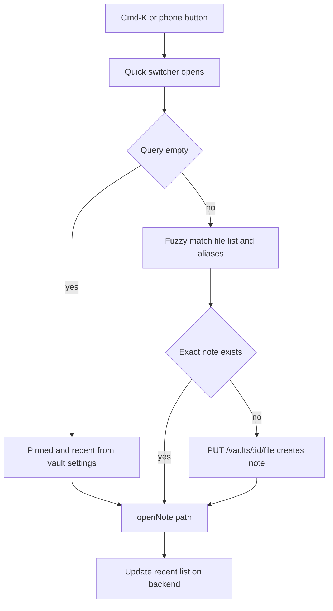
```mermaid
flowchart TD
    A["Cmd-K or phone button"] --> B["Quick switcher opens"]
    B --> C{"Query empty"}
    C -->|yes| D["Pinned and recent from vault settings"]
    C -->|no| E["Fuzzy match file list and aliases"]
    E --> F{"Exact note exists"}
    F -->|yes| G["openNote path"]
    F -->|no| H["PUT /vaults/:id/file creates note"]
    D --> G
    H --> G
    G --> I["Update recent list on backend"]
```


- Client-side fuzzy match over the file list the app already loads via `GET /vaults/:id/files` (see `apps/web/src/lib/tree.ts`), plus `aliases` parsed from frontmatter.
- Aliases: parse them once and cache them alongside the file list (backend could return them with `GET /vaults/:id/files`, or the client parses lazily).
- Recent and pinned notes stored per vault in the backend config (`apps/backend/src/config-store.ts`, via `PATCH /vaults/:id`) so they sync across devices.
- New dialog component in `apps/web/src/components/`, opened from `Shell.tsx` (global Cmd/Ctrl-K) and a header button on phone; create reuses the store's note creation path.
- The matcher is reused by the `[[` toolbar button (feature 07) and `@`-mentions (feature 10).

### Why it's worth it

Scrolling a 130-note tree on a phone is slow (#53). After an ingest you want to jump to `log.md` to see what happened, to `index.md` to check the new entry, or to the entity page the answer mentioned; each of those becomes three keystrokes. Create-on-Enter also makes "new concept page" a one-step action during a lint pass.

### Caveats & open questions

- Aliases need frontmatter parsing; cache it alongside the file list and refresh on file events.
- Match ranking should prefer basename over path, and wiki pages over `raw/` sources for equal scores.
- Where does a created note go: current folder, `wiki/` root, or a per-vault default?

### Prior art

| Project | What they do |
|---|---|
| [Obsidian quick switcher](https://obsidian.md/help/plugins/quick-switcher) | Fuzzy open by name, create on Enter when nothing matches |
| [SilverBullet page picker](https://v2.silverbullet.md/Page%20Picker) | Keyboard page picker with aliases and recent pages |
| [Obsidian bookmarks](https://obsidian.md/help/plugins/bookmarks) | Pinned notes and searches for quick access |

---

## 07. Markdown toolbar above the on-screen keyboard

> **Issue:** [#70](https://github.com/tillg/karpathy.app/issues/70) · **Effort:** M · **Seen in:** Obsidian mobile, 1Writer, Prose

A swipeable row pinned directly above the software keyboard with heading, bold/italic, list, checkbox, `[[` link (opens a note picker), `#` tag, indent/outdent, undo/redo and cursor arrows. The characters that Markdown and an LLM wiki need most are one tap away instead of two keyboard-layer switches.

### Screen drawing

```text
┌──────────────────────────────────────┐
│ ‹ Files              [Write|Read] ✦  │
├──────────────────────────────────────┤
│ software-3-0                         │
│ ---                                  │
│ type: concept                        │
│ tags: [llm, programming]             │
│ confidence: medium                   │
│ ---                                  │
│ # Software 3.0                       │
│ Prompts are programs, the LLM is the │
│ new computer, as argued by           │
│ [[andrej-karpathy▌                   │ ①
│  ┌────────────────────────────────┐  │
│  │ andrej-karpathy  wiki/entities │  │ ②
│  │ karpathy-llm-wiki-gist         │  │
│  └────────────────────────────────┘  │
│ ● Unsaved changes                    │
├──────────────────────────────────────┤
│ H  B  I  •  ☐  [[  #  ⇥  ⇤  ↶  ↷  ‹ ›│ ③
├──────────────────────────────────────┤
│  q  w  e  r  t  z  u  i  o  p        │ ④
│   a  s  d  f  g  h  j  k  l          │
│  ⇧  y  x  c  v  b  n  m  ⌫           │
│  123   ◍   space         return      │
└──────────────────────────────────────┘
```

1. ① Caret in the CM6 editor; the toolbar never covers it.
2. ② The `[[` button opens the quick-switcher list (feature 06) and inserts the chosen `[[wikilink]]`.
3. ③ Swipeable toolbar row: heading, bold, italic, list, checkbox, link, tag, indent, outdent, undo, redo, cursor arrows; every target ≥ 44 px.
4. ④ iOS software keyboard; with a hardware keyboard attached the toolbar is hidden.

### How it works

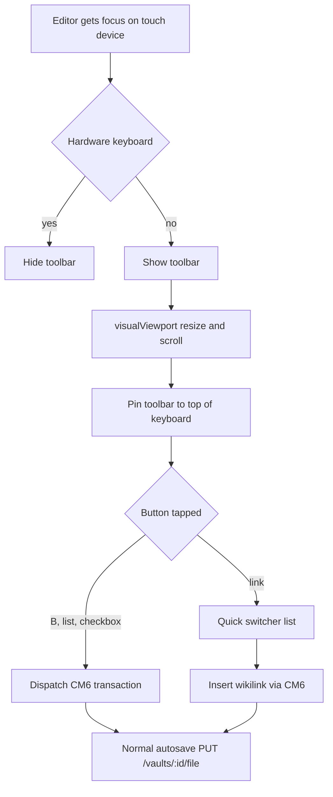
```mermaid
flowchart TD
    A["Editor gets focus on touch device"] --> B{"Hardware keyboard"}
    B -->|yes| X["Hide toolbar"]
    B -->|no| C["Show toolbar"]
    C --> D["visualViewport resize and scroll"]
    D --> E["Pin toolbar to top of keyboard"]
    E --> F{"Button tapped"}
    F -->|B, list, checkbox| G["Dispatch CM6 transaction"]
    F -->|link| H["Quick switcher list"]
    H --> I["Insert wikilink via CM6"]
    G --> J["Normal autosave PUT /vaults/:id/file"]
    I --> J
```


- Rendered only while the editor has focus on touch devices, from `apps/web/src/components/Editor.tsx`; positioned with `visualViewport` resize/scroll events.
- Each button dispatches a CM6 transaction (commands in `apps/web/src/lib/cm.ts`), so undo/redo and the raw-Markdown round-trip stay intact.
- `[[` opens the quick-switcher matcher and inserts the chosen link; `#` opens a tag list built from existing `tags:`.
- Toolbar styles in `apps/web/src/styles.css` (safe-area insets, ≥ 44 px targets, horizontal scroll).
- No backend change: saving goes through the existing `PUT /vaults/:id/file`.

### Why it's worth it

Typing `[[`, `#` and `- [ ]` on the iOS keyboard needs several layer switches each. Fixing a claim, adding a wikilink found during lint, or ticking a TODO in a note are the edits you actually do on the phone, and each becomes a single tap. It is the biggest win for editing on the phone rather than just reading.

### Caveats & open questions

- iOS has no VirtualKeyboard API; `visualViewport` positioning is quirky (scroll jumps, delayed resize), so test on real devices.
- Hide it when a hardware keyboard is attached (iPad Magic Keyboard), detected via viewport height.
- Decide which buttons are visible without swiping on a 375 px phone.

### Prior art

| Project | What they do |
|---|---|
| [Obsidian mobile toolbar](https://obsidian.md/help/mobile) | Configurable toolbar above the keyboard |
| [1Writer extended keyboard](https://1writerapp.com/) | Extra Markdown key row on iOS |
| [Prose](https://github.com/prose/prose/blob/master/about.md) | Web Markdown editor for GitHub repos with a formatting toolbar |
| [VirtualKeyboard API (MDN)](https://developer.mozilla.org/en-US/docs/Web/API/VirtualKeyboard) | Keyboard geometry API, not available in Safari |

---

## 08. Plan mode: agent proposes the pages it will touch, user approves before writing

> **Issue:** [#71](https://github.com/tillg/karpathy.app/issues/71) · **Effort:** M · **Seen in:** Cline, Roo Code, opencode

A Plan/Act toggle in the chat composer. In Plan mode the agent reads the vault and proposes which pages it will create or change, without writing anything; "Go" continues the same session in Build mode. An optional "ask" mode shows each edit as an approval card with its diff before it lands.

### Screen drawing

```text
┌──────────────────────────────────────┐
│ ‹ Chats       qwen3-coder         ✎  │
├──────────────────────────────────────┤
│  ┌────────────────────────────────┐  │
│  │ /ingest raw/articles/2026-09-2 │  │
│  │ 4-software-3-0.md              │  │
│  └────────────────────────────────┘  │
│ ✦ karpathy.app · plan                 │
│ ✓ read raw/articles/…software-3-0.md │
│ ✓ read wiki/index.md                 │
│ PLAN · no files changed yet          │ ①
│  + wiki/sources/software-3-0.md      │
│  + wiki/concepts/software-3-0.md     │
│  ~ wiki/entities/andrej-karpathy.md  │
│  ~ wiki/index.md   ~ wiki/log.md     │
│ ┌────────────────┐ ┌───────────────┐ │
│ │      Go        │ │  Refine plan  │ │ ②
│ └────────────────┘ └───────────────┘ │
│ ┌──────────────────────────────────┐ │
│ │ ASK · edit wiki/index.md         │ │ ③
│ │ + - [[concepts/software-3-0]] —  │ │
│ │ +   Prompts as programs          │ │
│ │          [ Reject ] [ Approve ]  │ │
│ └──────────────────────────────────┘ │
│ ┌─────────────┐ ┌──────────────┐ ╭─╮ │
│ │[Plan]Act Ask│ │ Ask about…   │ │↑│ │ ④
│ └─────────────┘ └──────────────┘ ╰─╯ │
├──────────────────────────────────────┤
│  Files   Search   [Chat]   Changes   │
└──────────────────────────────────────┘
```

1. ① The plan: pages to create (`+`) and change (`~`); the agent only read files, nothing was written.
2. ② "Go" continues the same session with the build agent; "Refine plan" keeps planning.
3. ③ In ask mode each write arrives as a permission request with its diff.
4. ④ Mode toggle in the composer, sent per prompt.

### How it works

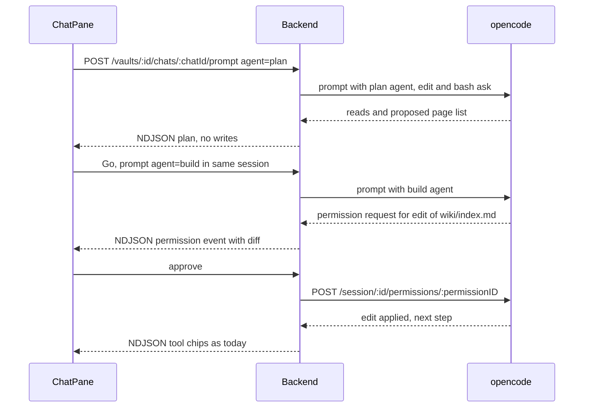
```mermaid
sequenceDiagram
    participant W as ChatPane
    participant B as Backend
    participant O as opencode
    W->>B: POST /vaults/:id/chats/:chatId/prompt agent=plan
    B->>O: prompt with plan agent, edit and bash ask
    O-->>B: reads and proposed page list
    B-->>W: NDJSON plan, no writes
    W->>B: Go, prompt agent=build in same session
    B->>O: prompt with build agent
    O-->>B: permission request for edit of wiki/index.md
    B-->>W: NDJSON permission event with diff
    W->>B: approve
    B->>O: POST /session/:id/permissions/:permissionID
    O-->>B: edit applied, next step
    B-->>W: NDJSON tool chips as today
```
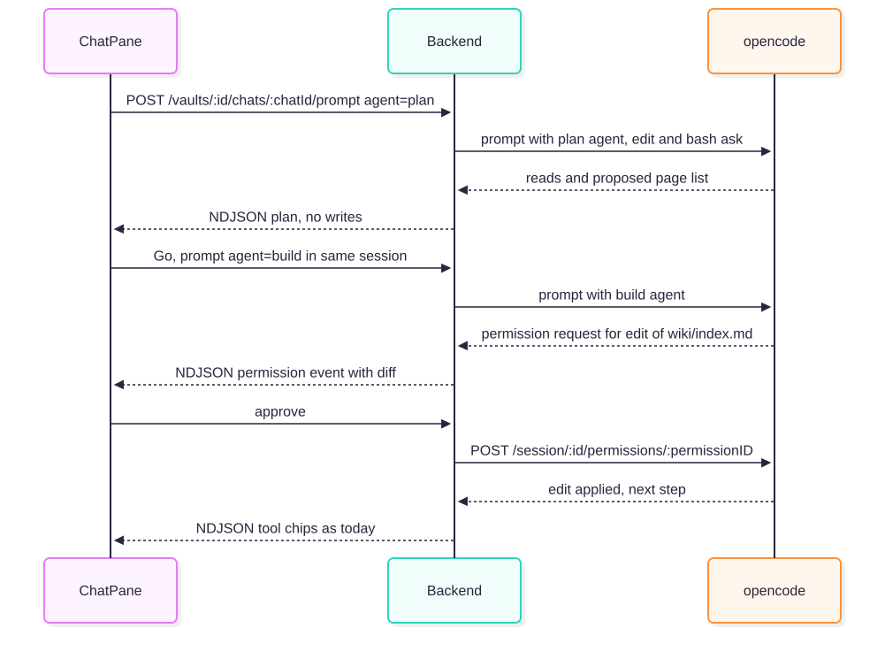

- Use opencode's built-in `plan` agent (edit/bash = ask) and per-agent permissions from the opencode config; select the agent per prompt in `apps/backend/src/harness/opencode.ts`.
- Extend `POST /vaults/:id/chats/:chatId/prompt` with the chosen mode; map it to an opencode agent in `apps/backend/src/chat.ts`.
- Stream permission requests as new NDJSON events on `/vaults/:id/chats/:chatId/stream` (shared `ChatEvent` type), answered via `POST /session/:id/permissions/:permissionID` behind a new backend route.
- UI: toggle in the composer and approve/reject cards in `apps/web/src/components/ChatPane.tsx`; the existing "denied" tool chip covers rejected edits.

### Why it's worth it

Before a 15-page ingest on the phone, you want to see the plan and trust it, rather than clean up afterwards in the Changes panel. The plan also catches wrong decisions early (e.g. creating `software-3.0.md` next to an existing `software-3-0.md`), which is cheaper than any undo. Ask mode lets a cautious user approve edits to `index.md` one by one.

### Caveats & open questions

- Pending permission requests must survive a reload (the chat reattaches to its stream) and must time out gracefully.
- Glob rules (e.g. allow `wiki/**`, ask for `raw/**`) could come later.
- Needs a check that the plan agent in the pinned opencode version really cannot write.

### Prior art

| Project | What they do |
|---|---|
| [Cline Plan & Act](https://docs.cline.bot/core-workflows/plan-and-act) | Separate plan and act modes; switching keeps the context |
| [Roo Code auto-approve](https://docs.roocode.com/features/auto-approving-actions) | Per-action approval or auto-approve for reads, writes, commands |
| [opencode agents](https://opencode.ai/docs/agents/) | Built-in `plan` and `build` agents, selectable per prompt |
| [opencode permissions](https://opencode.ai/docs/permissions/) | allow / ask / deny per tool, answered over the server API |

---

## 09. Clickable citations and source provenance

> **Issue:** [#72](https://github.com/tillg/karpathy.app/issues/72) · **Effort:** S · **Seen in:** NotebookLM, AnythingLLM, GPT Researcher, nashsu/llm_wiki

Answers cite `[[wiki/page#Heading]]`, and the chat renders these citations (and the files the turn read) as tappable chips that open the note scrolled to that heading. The note pane shows `sources:` frontmatter as links into `raw/`, and a raw file shows the wiki pages derived from it, so every claim can be traced back to where it came from.

### Screen drawing

```text
┌──────────────────────────────────────┐
│ ‹ Chats       qwen3-coder         ✎  │
├──────────────────────────────────────┤
│        ┌───────────────────────────┐ │
│        │ Where did Karpathy first  │ │
│        │ describe the LLM wiki?    │ │
│        └───────────────────────────┘ │
│ ✦ karpathy.app · qwen3-coder          │
│ In his LLM-wiki GitHub gist ¹, which │
│ builds on "Software 3.0" ²: the LLM  │
│ compiles raw sources into a          │
│ persistent wiki ³.                   │
│                                      │
│ ╭──────────────────────────────────╮ │ ①
│ │¹ sources/llm-wiki-gist › Summary │ │
│ ╰──────────────────────────────────╯ │
│ ╭──────────────────────────────────╮ │
│ │² concepts/software-3-0 › Origin  │ │
│ ╰──────────────────────────────────╯ │
│ ╭──────────────────────────────────╮ │ ②
│ │³ ⚠ concepts/compiled-wiki › Idea │ │
│ ╰──────────────────────────────────╯ │
│ ✓ read wiki/index.md                 │ ③
│ ✓ read wiki/sources/llm-wiki-gist.md │
├──────────────────────────────────────┤
│ ─ NOTE PANE, raw file ─              │
│ raw/articles/2026-09-26-llm-wiki.md  │
│ DERIVED PAGES · 3                    │ ④
│  sources/llm-wiki-gist               │
│  entities/andrej-karpathy            │
│  concepts/llm-wiki                   │
└──────────────────────────────────────┘
```

1. ① Citation chip: tap opens `wiki/sources/llm-wiki-gist.md` scrolled to `## Summary`.
2. ② Dead citation (page or heading does not exist) is marked, not silently rendered as a link.
3. ③ Files the turn read, also tappable (today's tool chips).
4. ④ On a raw file: wiki pages whose `sources:` frontmatter lists it.

### How it works

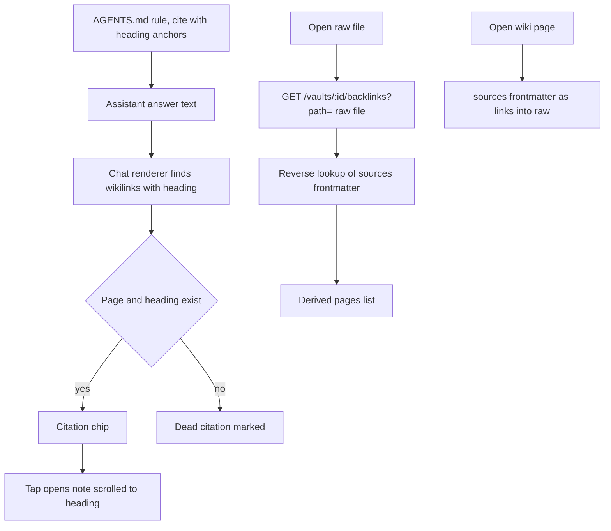
```mermaid
flowchart TD
    A["AGENTS.md rule, cite with heading anchors"] --> B["Assistant answer text"]
    B --> C["Chat renderer finds wikilinks with heading"]
    C --> D{"Page and heading exist"}
    D -->|yes| E["Citation chip"]
    D -->|no| F["Dead citation marked"]
    E --> G["Tap opens note scrolled to heading"]
    H["Open raw file"] --> I["GET /vaults/:id/backlinks?path= raw file"]
    I --> J["Reverse lookup of sources frontmatter"]
    J --> K["Derived pages list"]
    L["Open wiki page"] --> M["sources frontmatter as links into raw"]
```


- A rule in the vault's `AGENTS.md`/`CLAUDE.md`: cite with `[[page#Heading]]` anchors. No change to opencode.
- Chat renderer in `apps/web/src/components/ChatPane.tsx` (the `Markdown` component from `NotePane.tsx`) resolves links with the existing `exists()` check and `apps/web/src/lib/wikilink.ts`, and flags dead ones like missing wikilinks today (`wl miss`).
- `followLink` in `apps/web/src/store.tsx` learns heading anchors: open the note, then scroll (Read) or jump to the line (Write, `gotoLine`).
- "Derived pages" = reverse lookup of `sources:` frontmatter, using the same index as backlinks (feature 05); `sources:` values render as links into `raw/` via `PropValue`.

### Why it's worth it

It makes answers checkable on the phone: one tap from a claim to the paragraph it came from, and one more to the raw source. Chat turns into navigation of the wiki, not a dead end. Lint's "stale claim" findings become something you can act on, because you can see which pages derive from an outdated source.

### Caveats & open questions

- Relies on the model following the citation rule, so validate on the client and never trust an unresolved link.
- Prefer heading anchors over line numbers, which drift with every edit.
- Heading matching must follow Obsidian's rules (case, punctuation) to jump to the same place.

### Prior art

| Project | What they do |
|---|---|
| [NotebookLM](https://en.wikipedia.org/wiki/NotebookLM) | Inline numbered citations that open the source passage |
| [AnythingLLM citations](https://docs.anythingllm.com/chatting-with-documents/introduction) | Shows the source documents behind each chat answer |
| [GPT Researcher](https://github.com/assafelovic/gpt-researcher) | Research reports with cited sources |
| [nashsu/llm_wiki](https://github.com/nashsu/llm_wiki) | LLM wiki that tracks which sources feed which pages |

---

## 10. @-mention notes and folders as chat context

> **Issue:** [#73](https://github.com/tillg/karpathy.app/issues/73) · **Effort:** S · **Seen in:** Obsidian Copilot, Notion AI, Capacities

Typing `@` in the chat composer opens a fuzzy note/folder search; picked items become removable chips that are sent with the prompt as explicit context. Two shortcuts cover the common cases: `@current` for the open note and `@selection` for the selected text.

### Screen drawing

```text
┌──────────────────────────────────────┐
│ ‹ Chats       qwen3-coder         ✎  │
├──────────────────────────────────────┤
│                                      │
│   New chat · ask about this vault    │
│                                      │
│ ┌──────────────────────────────────┐ │ ①
│ │ @current   andrej-karpathy.md    │ │
│ │ @selection 3 lines               │ │
│ │ ──────────────────────────────── │ │
│ │ ▤ concepts/software-3-0.md       │ │
│ │ ▤ concepts/llm-wiki.md           │ │
│ │ ▸ wiki/concepts/     (folder)    │ │
│ └──────────────────────────────────┘ │
│ ╭────────────────────╮ ╭──────────╮  │ ②
│ │ andrej-karpathy  × │ │ log.md × │  │
│ ╰────────────────────╯ ╰──────────╯  │
│ ┌──────────────────────────────┐ ╭─╮ │
│ │ Which concepts don't link    │ │↑│ │ ③
│ │ back to him? @conc▌          │ ╰─╯ │
│ └──────────────────────────────┘     │
├──────────────────────────────────────┤
│  Files   Search   [Chat]   Changes   │
└──────────────────────────────────────┘
```

1. ① Picker opened by `@`: shortcuts first, then fuzzy note and folder hits (same matcher as the quick switcher).
2. ② Context chips, removable with × before sending.
3. ③ Composer; the prompt text stays clean, the chips travel as file parts.

### How it works

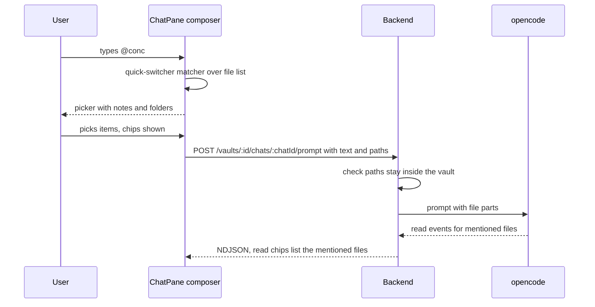
```mermaid
sequenceDiagram
    participant U as User
    participant W as ChatPane composer
    participant B as Backend
    participant O as opencode
    U->>W: types @conc
    W->>W: quick-switcher matcher over file list
    W-->>U: picker with notes and folders
    U->>W: picks items, chips shown
    W->>B: POST /vaults/:id/chats/:chatId/prompt with text and paths
    B->>B: check paths stay inside the vault
    B->>O: prompt with file parts
    O-->>B: read events for mentioned files
    B-->>W: NDJSON, read chips list the mentioned files
```
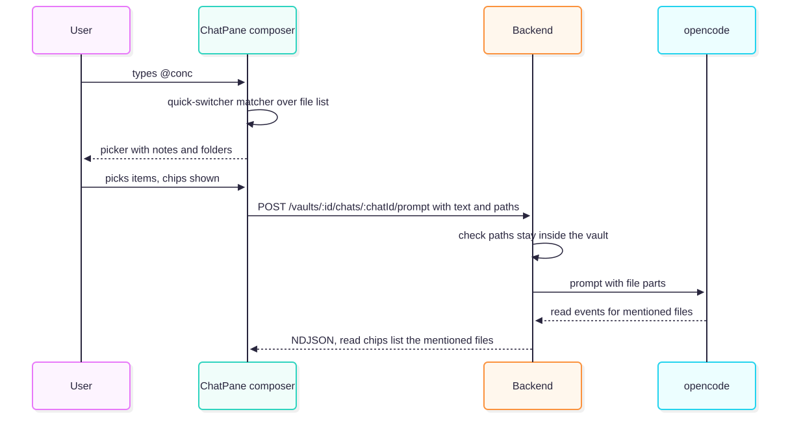

- Picker: reuse the quick-switcher matcher (feature 06) over the loaded file list, or opencode `GET /find/file`.
- Composer chips and `@current` / `@selection` in `apps/web/src/components/ChatPane.tsx`; the selection comes from the `EditorHandle` of `apps/web/src/components/Editor.tsx`.
- Extend the body of `POST /vaults/:id/chats/:chatId/prompt` with a list of vault paths; `apps/backend/src/chat.ts` validates them with `apps/backend/src/paths.ts`.
- Send as opencode file parts in `apps/backend/src/harness/opencode.ts`; fall back to injecting the paths as text.

### Why it's worth it

Typing `wiki/entities/andrej-karpathy.md` on a phone keyboard is painful, and "this note" is ambiguous to the agent. Explicit context makes answers cheaper and more precise than letting the agent grep the whole vault, which matters for query and for targeted lint ("check @wiki/concepts/ for contradictions").

### Caveats & open questions

- Verify opencode file-part support for text files in the pinned version.
- Folders can be large; cap the number of files or send the folder path as text and let the agent list it.
- `@selection` needs the selection captured when the chat opens on phone, because switching tabs drops editor focus.

### Prior art

| Project | What they do |
|---|---|
| [Obsidian Copilot](https://community.obsidian.md/plugins/copilot) | `@`/`[[` to add notes and folders as chat context |
| [Notion AI](https://www.notion.com/product/ai) | `@`-mention pages to ground an AI answer |
| [Capacities AI assistant](https://docs.capacities.io/reference/ai-assistant) | Add objects as context to the AI chat |

---

## 11. Auto-fetch on open with a "behind remote" badge and one-tap pull

> **Issue:** [#74](https://github.com/tillg/karpathy.app/issues/74) · **Effort:** S · **Seen in:** Obsidian Git, Working Copy, GitJournal

When you open the app, the backend fetches from GitHub right away and again every few minutes. The header tells you how far behind your copy is ("↓ 3 behind"). One tap pulls, so you stop editing an old copy of a page that Obsidian desktop changed an hour ago.

### Screen drawing

```text
┌────────────────────────────────────────┐
│ ☰  Frechen ▾        ● All committed    │
│                     ┌──────────────┐   │
│                     │ ↓ 3 behind  ①│   │
│                     └──────────────┘   │
├────────────────────────────────────────┤
│ ‹ Files  andrej-karpathy.md Write│Read │
├────────────────────────────────────────┤
│ ┌────────────────────────────────────┐ │
│ │ GitHub has 3 new commits.          │ │
│ │ Last: "ingest: raw/articles/       │ │
│ │ software-2-0.md" · Mac · 12 min ②  │ │
│ │                  [ Pull now ]  ③   │ │
│ └────────────────────────────────────┘ │
│ ---                                    │
│ type: entity                           │
│ tags: [person, ai-research]            │
│ updated: 2026-09-24                    │
│ confidence: high                       │
│ ---                                    │
│ # Andrej Karpathy                      │
│ Former director of AI at Tesla ...     │
│                                        │
├────────────────────────────────────────┤
│  Files    Search    Chat    Changes    │
└────────────────────────────────────────┘
```

1. ① Behind badge next to the git pill, fed by the event stream. It shows up within seconds of opening the app.
2. ② Tapping the badge shows what is new on the remote: the latest commit subject, where it came from, and how old it is.
3. ③ One-tap pull. A clean tree fast-forwards. A dirty tree goes through the existing conflict flow in Changes.

### How it works

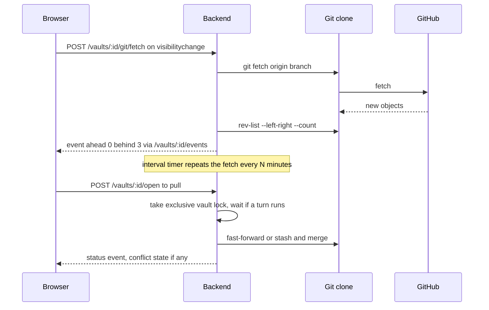
```mermaid
sequenceDiagram
  participant B as Browser
  participant API as Backend
  participant G as Git clone
  participant GH as GitHub
  B->>API: POST /vaults/:id/git/fetch on visibilitychange
  API->>G: git fetch origin branch
  G->>GH: fetch
  GH-->>G: new objects
  API->>G: rev-list --left-right --count
  API-->>B: event ahead 0 behind 3 via /vaults/:id/events
  Note over API: interval timer repeats the fetch every N minutes
  B->>API: POST /vaults/:id/open to pull
  API->>API: take exclusive vault lock, wait if a turn runs
  API->>G: fast-forward or stash and merge
  API-->>B: status event, conflict state if any
```

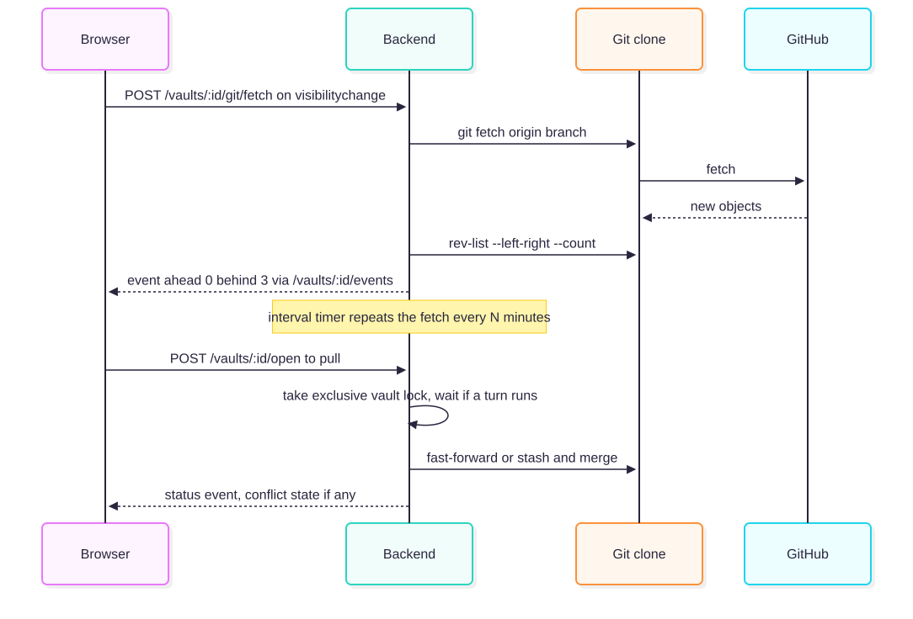

- New `POST /vaults/:id/git/fetch`: only `git fetch --end-of-options origin <branch>` (see `apps/backend/src/repo.ts`), never a merge. It is cheap, so it can run under the shared lock.
- The backend also runs a per-vault interval fetch while clients are subscribed to `GET /vaults/:id/events`. Ahead/behind counts go out as a new status field next to `changedCount` and `unpushedCount`.
- Frontend: a `visibilitychange` listener in `apps/web/src/store.tsx` triggers the fetch. `apps/web/src/components/GitPill.tsx` renders "↓ N behind" as a tappable segment.
- The pull reuses the existing vault-open pull (`POST /vaults/:id/open` / `pullUnlocked` in `vaults.ts`). The conflict path (`/conflicts/sides`, `/conflicts/resolve`) stays as it is.

### Why it's worth it

The vault is shared with Obsidian on the Mac and on the phone. An ingest on the Mac often rewrites a dozen entity pages, and the iPad copy is stale until the next turn pulls. Editing that stale copy is the main source of conflicts. A visible behind count and a one-tap pull remove most of them before they happen.

### Caveats & open questions

- Never auto-commit or auto-push (ADR 0001). The badge only reports; the pull is always the user's tap.
- Do not pull while an AI turn is running. The pull waits for the exclusive vault lock, and the button shows "waiting for AI".
- Fetch interval: fixed (e.g. 5 min) or per vault in the admin area? Should it pause when no client is connected?
- Offline or auth failure should reuse the existing `pullError` / "offline" pill state, not add a new error UI.

### Prior art

| Project | What they do |
|---|---|
| [Obsidian Git auto-pull](https://github.com/Vinzent03/obsidian-git/blob/master/README.md) | Pulls on startup and on an interval, with a status bar showing sync state. |
| [Working Copy auto-sync](https://workingcopyapp.com/users-guide) | Fetches in the background on iOS and marks repos that are behind the remote. |
| [GitJournal](https://github.com/GitJournal/GitJournal) | Mobile Markdown notes on git, with automatic sync when the app opens. |

---

## 12. Per-file history: git log, diff and restore an old version

> **Issue:** [#75](https://github.com/tillg/karpathy.app/issues/75) · **Effort:** S · **Seen in:** Obsidian Git, TriliumNext, HedgeDoc, Joplin

Each note gets a "History" view that lists every commit that touched it. Pick one to read that version and see a diff against the current file. "Restore" brings the old text back as an ordinary uncommitted change, so you can review it and commit it like any other edit.

### Screen drawing

```text
┌────────────────────────────────────────┐
│ ‹ andrej-karpathy.md   History  ①      │
├────────────────────────────────────────┤
│ ● 2026-09-24  ingest: software-2-0     │
│   Till · a3f9c21                   ②   │
│ ○ 2026-09-17  lint: fix related links  │
│   Till · 7be0d44                       │
│ ○ 2026-09-02  ingest: nanoGPT README   │
│   Till · 19c2e8a                       │
├────────────────────────────────────────┤
│ Version 2026-09-17 · read-only  ③      │
│ ────────────────────────────────────── │
│   updated: 2026-09-17                  │
│ - confidence: high                     │
│ + confidence: medium                   │
│   sources: [karpathy-blog.md]          │
│ - Director of AI at Tesla (2017–22).   │
│ + Director of AI at Tesla (2017–2022), │
│ +   led the Autopilot vision team.     │
│ ────────────────────────────────────── │
│   [ Close ]       [ Restore this ]  ④  │
├────────────────────────────────────────┤
│  Files    Search    Chat    Changes    │
└────────────────────────────────────────┘
```

1. ① History opens from the note header's menu, next to the Write/Read toggle.
2. ② The commit list comes from `git log --follow`, so it survives renames. Each row shows date, message, author and short hash.
3. ③ The selected version is read-only, shown as a diff against the current file (the same diff component as in Changes).
4. ④ Restore writes the old content into the working tree. It then shows up in Changes as uncommitted. Nothing is committed.

### How it works

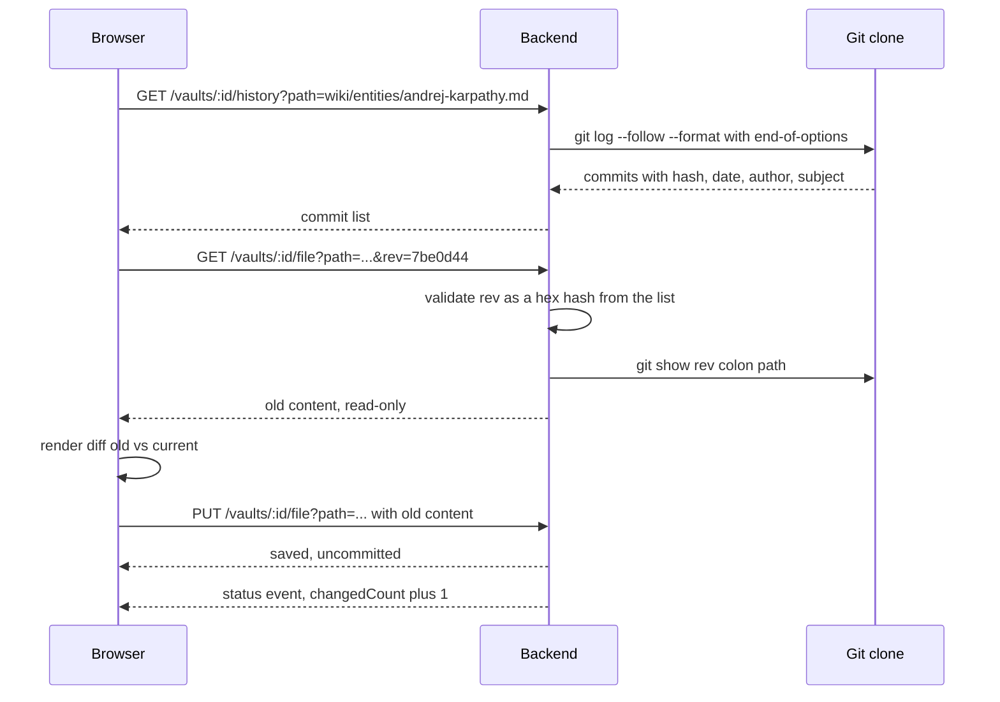
```mermaid
sequenceDiagram
  participant B as Browser
  participant API as Backend
  participant G as Git clone
  B->>API: GET /vaults/:id/history?path=wiki/entities/andrej-karpathy.md
  API->>G: git log --follow --format with end-of-options
  G-->>API: commits with hash, date, author, subject
  API-->>B: commit list
  B->>API: GET /vaults/:id/file?path=...&rev=7be0d44
  API->>API: validate rev as a hex hash from the list
  API->>G: git show rev colon path
  API-->>B: old content, read-only
  B->>B: render diff old vs current
  B->>API: PUT /vaults/:id/file?path=... with old content
  API-->>B: saved, uncommitted
  API-->>B: status event, changedCount plus 1
```

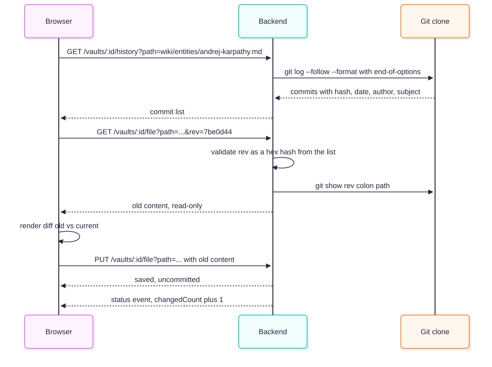

- New `GET /vaults/:id/history?path=`: runs `git log --follow` through the existing `git.ts` wrapper with `--end-of-options` and returns `{hash, date, author, subject}[]`.
- Extend `GET /vaults/:id/file` with `rev=`. Only full or short hex hashes are accepted (regex plus `git cat-file -e`), never refs or options (see #30, git argument injection).
- Restore is a normal `PUT /vaults/:id/file`, so the watcher, event stream and Changes badge all behave as they already do.
- Frontend: a History sheet opened from `apps/web/src/components/NotePane.tsx`. It reuses the diff rendering from `apps/web/src/components/ChangesPanel.tsx`.

### Why it's worth it

Git already stores the history, so this costs little. It is the safety net for AI edits that were committed and regretted later: "what did last week's ingest change on this page?" is one tap away. That makes it easier to let the agent run ingest and lint passes with confidence.

### Caveats & open questions

- Only committed states exist. Uncommitted edits the AI made and discarded are gone.
- Restore never commits. It shows up as an uncommitted change like any other edit.
- Validate `rev` strictly (cf. #30). Reject anything that isn't a hex hash from this file's history.
- Paging: a busy entity page may have hundreds of commits. Load 30 at a time?
- Should the list also offer "diff against previous commit" (what that commit changed) as well as "diff against now"?

### Prior art

| Project | What they do |
|---|---|
| [Obsidian Git history view](https://github.com/Vinzent03/obsidian-git/blob/master/README.md) | File history and diff views backed by git log. |
| [TriliumNext note revisions](https://docs.triliumnotes.org/user-guide/concepts/notes/note-revisions) | Automatic note revisions with preview and restore. |
| [HedgeDoc revisions](https://demo.hedgedoc.org/s/features) | Revision list with a diff and a revert action. |
| [Joplin note history](https://joplinapp.org/help/apps/note_history/) | Per-note history panel where you can restore an older version. |

---

## 13. Scheduled background agent jobs (nightly lint, inbox ingest, weekly digest)

> **Issue:** [#76](https://github.com/tillg/karpathy.app/issues/76) · **Effort:** M · **Seen in:** Claude Code routines, AnythingLLM, Khoj

Each vault gets a "Jobs" page where you schedule agent work: a nightly `/lint`, an inbox ingest every morning, a weekly digest. The server runs these while your phone sleeps. In the morning you get a report and a set of uncommitted edits to review. Nothing is committed for you.

### Screen drawing

```text
┌──────────────────────────────────────────────────────────────────────────┐
│ ☰  Frechen ▾                                        ● 4 uncommitted      │
├───────────────────────────────┬──────────────────────────────────────────┤
│ Jobs                  [ + ] ① │ Nightly lint · run 2026-09-26 03:00  ③   │
│ ───────────────────────────── │ ──────────────────────────────────────── │
│ ● Nightly lint                │ ✓ finished · 4m 12s · 38k tokens / 100k  │
│   /lint · 0 3 * * *           │                                          │
│   read-only · ✓ today 03:04 ② │ › Read wiki/index.md                     │
│ ● Inbox ingest                │ › Read wiki/entities/andrej-karpathy.md  │
│   /ingest · 0 7 * * *         │ › Read wiki/concepts/software-2-0.md     │
│   can edit · ⏸ skipped:       │ › Wrote wiki/lint/2026-09-26.md       ④  │
│     tree dirty                │                                          │
│ ○ Weekly digest               │ Found 2 dead links, 1 orphan page        │
│   /query "what's new" ·       │ (entities/micrograd.md), 1 claim marked  │
│   0 18 * * 5 · paused         │ confidence: low with a newer source.     │
│                               │                                          │
│ Chats                         │ [ Open report ]   [ Review changes ] ⑤   │
│  Ingest nanoGPT README        │                                          │
│  [job] Nightly lint 09-26     │                                          │
│  [job] Nightly lint 09-25     │                                          │
└───────────────────────────────┴──────────────────────────────────────────┘
```

1. ① Create a job: name, command or skill, cron schedule, agent (read-only by default) and token budget.
2. ② Each job shows its last run. When the tree has uncommitted edits, an editing job is skipped (or downgraded to report-only), so it doesn't mix into your own work.
3. ③ A job run is a normal opencode session, so the transcript looks like any chat.
4. ④ The default read-only lint writes one report file, which shows up in Changes as uncommitted.
5. ⑤ Review changes goes to the Changes panel. You commit (or discard) as usual.

### How it works

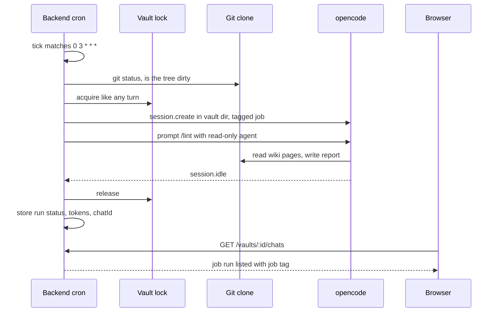
```mermaid
sequenceDiagram
  participant C as Backend cron
  participant L as Vault lock
  participant G as Git clone
  participant O as opencode
  participant B as Browser
  C->>C: tick matches 0 3 * * *
  C->>G: git status, is the tree dirty
  C->>L: acquire like any turn
  C->>O: session.create in vault dir, tagged job
  C->>O: prompt /lint with read-only agent
  O->>G: read wiki pages, write report
  O-->>C: session.idle
  C->>L: release
  C->>C: store run status, tokens, chatId
  B->>C: GET /vaults/:id/chats
  C-->>B: job run listed with job tag
```

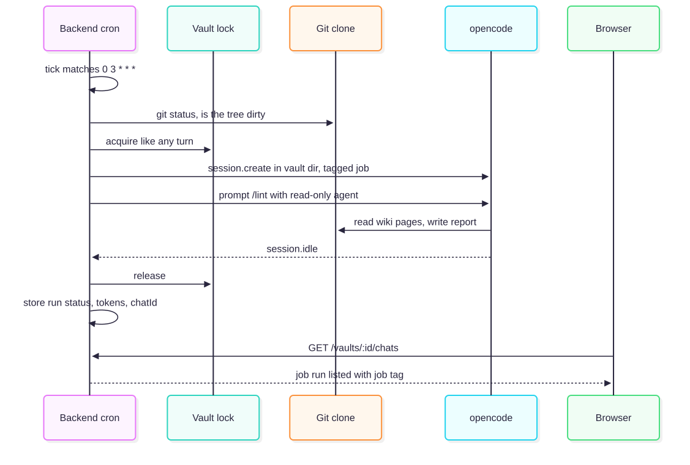

- Job definitions live on the backend-only config volume (next to the vault config in `apps/backend/src/config-store.ts`). CRUD via `GET/POST /vaults/:id/jobs`, `PATCH/DELETE /vaults/:id/jobs/:jobId`.
- A small in-process cron in the backend. Each run goes through the existing turn path in `apps/backend/src/chat.ts` (pull under the lock, then `session.create` + `prompt` via `harness/opencode.ts`), so it queues behind user turns.
- Run records (start, end, status, tokens, `chatId`) are kept per job. The chat list in `apps/web/src/components/ChatPane.tsx` marks those sessions with a "job" tag.
- A per-job token budget: the backend aborts the session (`/chats/:chatId/abort` path) when the budget is used up.

### Why it's worth it

Karpathy describes lint as a periodic operation, and a phone is a bad place to run a ten-minute agent pass. Moving ingest and lint to a schedule on the server turns the mobile loop into review only: open the app, read the report, look at the diffs, commit.

### Caveats & open questions

- Skip or report-only when the tree is dirty, so job edits don't pile into the user's own uncommitted work.
- A per-job token budget prevents runaway cost. What is the default, and does a hit budget count as a failure?
- Never auto-commit (ADR 0001). Job output stays uncommitted until you commit it.
- Timezone: cron in Europe/Berlin or UTC? Store it per vault.
- Missed runs while the container was down: run once on startup, or skip?

### Prior art

| Project | What they do |
|---|---|
| [Claude Code routines](https://code.claude.com/docs/en/routines) | Scheduled cloud agent runs from a prompt and a cron schedule. |
| [AnythingLLM scheduled jobs](https://docs.anythingllm.com/scheduled-jobs/overview) | Recurring agent tasks in a workspace, with run history. |
| [Khoj automations](https://github.com/khoj-ai/khoj) | Scheduled queries over your notes that deliver results on a schedule. |

---

## 14. Push notifications when a turn/job finishes or needs approval

> **Issue:** [#77](https://github.com/tillg/karpathy.app/issues/77) · **Effort:** M · **Seen in:** WebKit Web Push, Claude Code

Start an ingest, lock the phone, and get a notification when it's done, when the agent is waiting for your approval, or when a pull hits a conflict. The home-screen icon shows a badge with the number of changes waiting for review.

### Screen drawing

```text
┌────────────────────────────────────────┐
│               09:41                    │
│         Saturday, 26 September         │
│                                        │
│ ┌────────────────────────────────────┐ │
│ │ ◆ karpathy.app              now   ① │ │
│ │ Ingest finished · Frechen          │ │
│ │ 6 files changed: sources/software- │ │
│ │ 2-0.md, entities/andrej-karpathy…  │ │
│ └────────────────────────────────────┘ │
│ ┌────────────────────────────────────┐ │
│ │ ◆ karpathy.app             2m ago ② │ │
│ │ Approval needed · Frechen          │ │
│ │ Agent wants to run: rg "Tesla"     │ │
│ │ in raw/articles/                   │ │
│ └────────────────────────────────────┘ │
│                                        │
│  ┌──────┐   ┌──────┐   ┌──────┐        │
│  │  ◆  6│③  │ Mail │   │Obsid.│        │
│  └──────┘   └──────┘   └──────┘        │
│  karpathy    Mail      Obsidian        │
└────────────────────────────────────────┘

   Settings › Notifications             ④
   [x] Turn or job finished
   [x] Approval needed
   [x] Conflict after pull
```

1. ① Turn finished. Tapping it opens the right vault and chat (deep link with vault id and chat id).
2. ② A permission request is waiting. The agent stays paused until you answer in the chat.
3. ③ App-icon badge through the Badging API: the count of uncommitted changes and pending approvals.
4. ④ Opt-in in settings. The browser permission prompt appears only after this tap (it needs a user gesture).

### How it works

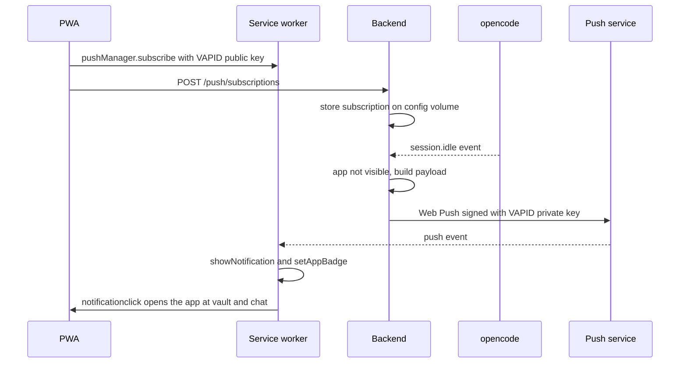
```mermaid
sequenceDiagram
  participant B as PWA
  participant SW as Service worker
  participant API as Backend
  participant O as opencode
  participant P as Push service
  B->>SW: pushManager.subscribe with VAPID public key
  B->>API: POST /push/subscriptions
  API->>API: store subscription on config volume
  O-->>API: session.idle event
  API->>API: app not visible, build payload
  API->>P: Web Push signed with VAPID private key
  P-->>SW: push event
  SW->>SW: showNotification and setAppBadge
  SW->>B: notificationclick opens the app at vault and chat
```

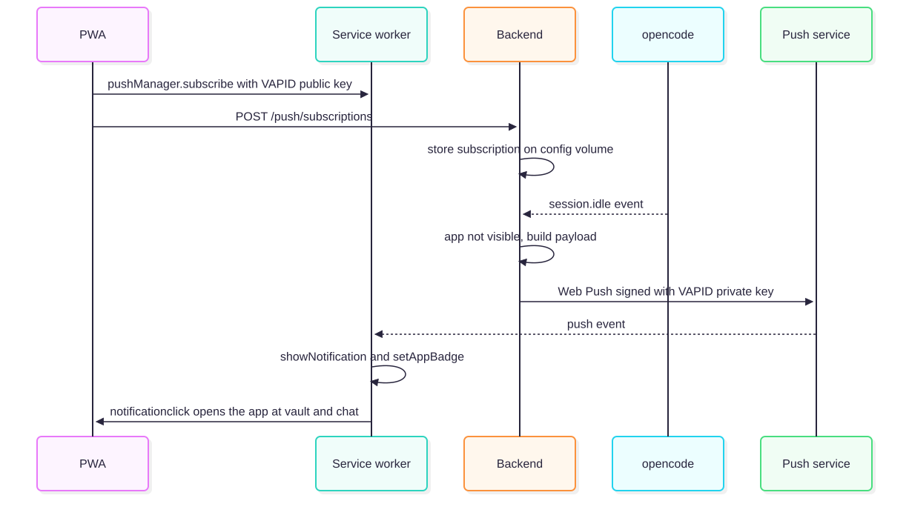

- VAPID keys are server secrets, like the provider keys. Subscriptions are stored on the backend-only config volume. Routes: `POST/DELETE /push/subscriptions`, guarded by the existing bearer token.
- Triggers come from the harness event loop in `apps/backend/src/chat.ts`: opencode `session.idle` (turn or job finished), permission-request events, and conflict state from the pull in `vaults.ts`.
- Skip the push when a client has the vault open and visible. The backend already knows the subscribers on `GET /vaults/:id/events`, and the client can report visibility.
- Service worker: `push` and `notificationclick` handlers. The badge comes from `navigator.setAppBadge(changedCount + pending)`, updated from the status event and from push payloads.

### Why it's worth it

On a phone you start an ingest and put the phone away. Without a notification you keep reopening the app to check. With scheduled jobs (#76) this is the only way to learn that last night's lint left something to review. Approval notifications keep a turn from sitting blocked for an hour on a permission prompt no one sees.

### Caveats & open questions

- iOS supports Web Push only for Home-Screen-installed apps (iOS 16.4+). Show a hint in Safari tabs.
- The permission prompt needs a user gesture, so the opt-in must be a button, not a prompt on load.
- Notification text: file names can be private. Show counts only on the lock screen?
- Subscriptions expire (410 Gone). Delete them on failure.

### Prior art

| Project | What they do |
|---|---|
| [WebKit: Web Push for web apps on iOS](https://webkit.org/blog/13878/web-push-for-web-apps-on-ios-and-ipados/) | Web Push and the Badging API for Home Screen web apps on iOS/iPadOS 16.4+. |
| [Claude Code push notifications request](https://github.com/anthropics/claude-code/issues/28765) | Users asking to be notified when a long agent turn finishes or waits for input. |

---

## 15. Quick capture and daily notes

> **Issue:** [#78](https://github.com/tillg/karpathy.app/issues/78) · **Effort:** S · **Seen in:** Drafts, Obsidian daily notes, Obsidian mobile, Memos

A "+" button opens a small text box. What you type is added, with a timestamp, to `Inbox.md` or to today's daily note, without opening the editor. "Today" opens today's `daily/YYYY-MM-DD.md` and creates it from a template if it doesn't exist yet.

### Screen drawing

```text
┌────────────────────────────────────────┐
│ ☰  Frechen ▾   [Today]① ● 1 uncommitted│
├────────────────────────────────────────┤
│ Files                                  │
│  ▸ daily                               │
│  ▸ raw                                 │
│  ▸ wiki                                │
│    Inbox.md                            │
│                                        │
│ ┌────────────────────────────────────┐ │
│ │ Quick capture                    ② │ │
│ │ ┌────────────────────────────────┐ │ │
│ │ │ Karpathy on "LLM OS" talk —    │ │ │
│ │ │ check raw/media/ for slides    │ │ │
│ │ └────────────────────────────────┘ │ │
│ │ To: (•) Inbox.md                   │ │
│ │     ( ) daily/2026-09-26.md    ③   │ │
│ │                     [ Append ] ④   │ │
│ └────────────────────────────────────┘ │
│                                  ( + ) │
├────────────────────────────────────────┤
│  Files    Search    Chat    Changes    │
└────────────────────────────────────────┘

 Inbox.md after append:
 - 2026-09-26 09:41 Karpathy on "LLM OS"
   talk — check raw/media/ for slides
```

1. ① "Today" opens or creates the daily note. Folder, date format and template come from `.obsidian/daily-notes.json` when present, otherwise from vault settings.
2. ② The "+" quick action opens a text box focused, keyboard up. Two taps: "+", then Append.
3. ③ Target: `Inbox.md` or today's daily note. The last choice is remembered.
4. ④ Append adds a timestamped line at the end of the file. It becomes an ordinary uncommitted change.

### How it works

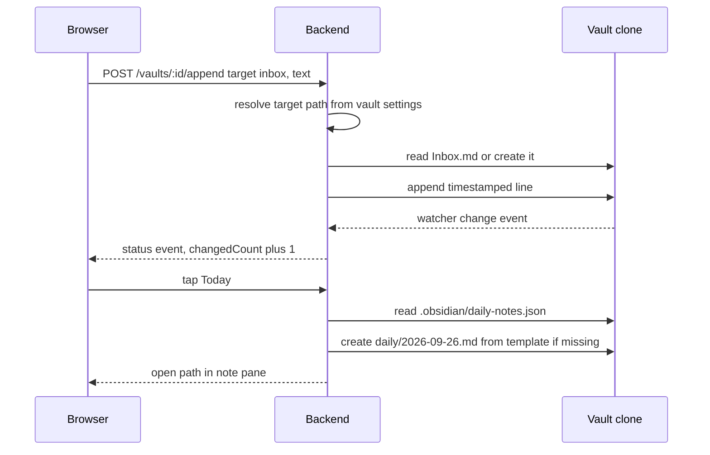
```mermaid
sequenceDiagram
  participant B as Browser
  participant API as Backend
  participant V as Vault clone
  B->>API: POST /vaults/:id/append target inbox, text
  API->>API: resolve target path from vault settings
  API->>V: read Inbox.md or create it
  API->>V: append timestamped line
  V-->>API: watcher change event
  API-->>B: status event, changedCount plus 1
  B->>API: tap Today
  API->>V: read .obsidian/daily-notes.json
  API->>V: create daily/2026-09-26.md from template if missing
  API-->>B: open path in note pane
```

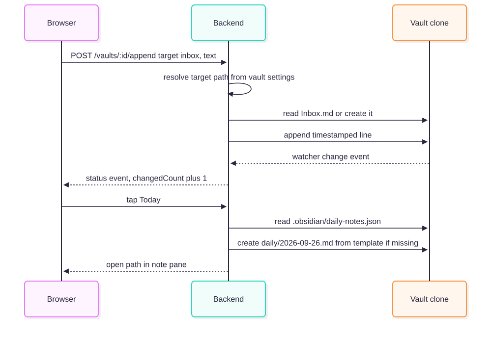

- New `POST /vaults/:id/append` `{target: "inbox" | "daily", text}`. The backend resolves the path, appends under the shared vault lock and returns the path. Appending on the server avoids a read-modify-write race with a running turn.
- Daily note path: `.obsidian/daily-notes.json` (`folder`, `format`, `template`) wins; otherwise a vault setting in the admin area (`apps/web/src/components/Admin.tsx`).
- New daily notes use the templates feature (#60) for the body.
- Frontend: a floating "+" in `apps/web/src/components/Shell.tsx` and a "Today" button in the header. After Append, show a toast; the editor stays closed.

### Why it's worth it

It is the fastest way to get a thought into the vault from a phone, faster than opening Obsidian. `Inbox.md` and the daily notes are also the natural input for ingest: the agent later turns these raw lines into `wiki/` pages. Capture on the phone and ingest on the server are two halves of the same loop.

### Caveats & open questions

- Overlaps #60 (templates) and the capture inbox (#65). All three should share one "target files" setting.
- Timestamp format and time zone: use the device's local time, and match Obsidian's list style (`- HH:mm text`)?
- Append to a file that is open in the editor with unsaved edits: reload, or merge into the buffer?

### Prior art

| Project | What they do |
|---|---|
| [Drafts](https://docs.getdrafts.com/gettingstarted/) | Opens to a blank draft; capture first, then decide where it goes. |
| [Obsidian daily notes](https://obsidian.md/help/plugins/daily-notes) | Opens or creates today's note with a configurable folder, format and template. |
| [Obsidian mobile quick action](https://obsidian.md/help/mobile) | Mobile quick action to create a note straight from the home screen. |
| [Memos](https://usememos.com/) | Timeline of short timestamped memos from a single input box. |

---

## 16. Outline / table of contents and note info (words, reading time)

> **Issue:** [#79](https://github.com/tillg/karpathy.app/issues/79) · **Effort:** S · **Seen in:** Obsidian, Bear, Typora

An outline of the current note's headings: a side panel on tablet, a bottom sheet on phone. Tap a heading to jump to it. A small info sheet shows words, characters and reading time. Frontmatter is not counted, and if text is selected, only the selection is.

### Screen drawing

```text
┌────────────────────────────────────────┐
│ ‹ Files  llm-wiki-pattern.md ☰① Wr│Rd  │
├────────────────────────────────────────┤
│ # LLM wiki pattern                     │
│ ## Three operations                    │
│ Ingest reads a source in raw/ and      │
│ updates 5–15 pages under wiki/ ...     │
│ ░░░░░░░░░░░░░░░░░░░░░░░░░░░░░░░░░░░░░░ │
│┌──────────────────────────────────────┐│
││           ───────                    ││
││ Outline                           ②  ││
││  LLM wiki pattern                    ││
││   ├ Three operations                 ││
││   │  ├ Ingest                        ││
││   │  ├ Query                ◀ here ③ ││
││   │  └ Lint                          ││
││   ├ Page schema                      ││
││   └ Contradictions vs. Karpathy      ││
││ ──────────────────────────────────── ││
││ 2,418 words · 14,902 chars        ④  ││
││ ~11 min read · frontmatter excluded  ││
│└──────────────────────────────────────┘│
├────────────────────────────────────────┤
│  Files    Search    Chat    Changes    │
└────────────────────────────────────────┘
```

1. ① The outline button in the note header, next to the Write/Read toggle.
2. ② Bottom sheet on phone; on tablet the same list sits in a side panel. Nesting follows heading levels.
3. ③ The current section is highlighted while you scroll. Tapping a heading scrolls there in both Write and Read mode.
4. ④ Note info: words, characters, reading time. Frontmatter is excluded. With a selection, the counts cover the selection only.

### How it works

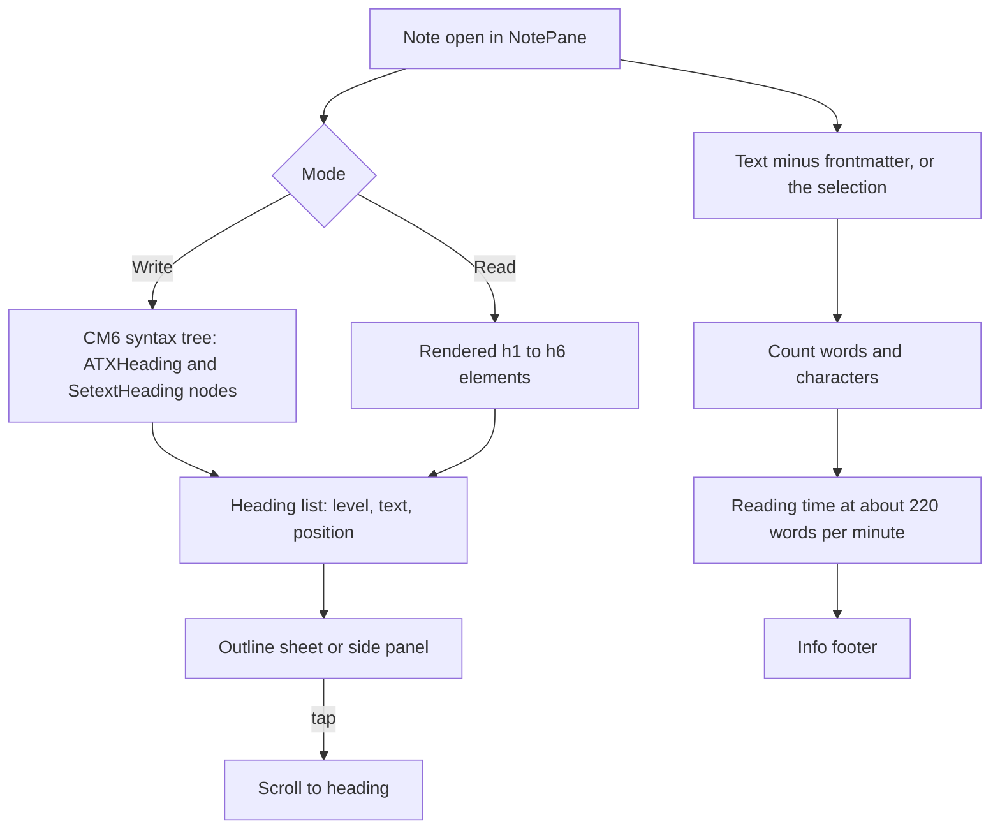
```mermaid
flowchart TD
  A["Note open in NotePane"] --> B{"Mode"}
  B -->|Write| C["CM6 syntax tree: ATXHeading and SetextHeading nodes"]
  B -->|Read| D["Rendered h1 to h6 elements"]
  C --> E["Heading list: level, text, position"]
  D --> E
  E --> F["Outline sheet or side panel"]
  F -->|tap| G["Scroll to heading"]
  A --> H["Text minus frontmatter, or the selection"]
  H --> I["Count words and characters"]
  I --> J["Reading time at about 220 words per minute"]
  J --> K["Info footer"]
```


- Frontend only; no new backend endpoint.
- Write mode: walk the CodeMirror 6 syntax tree (`syntaxTree(state)` in `apps/web/src/lib/cm.ts`) for heading nodes; jump with `EditorView.scrollIntoView` on the heading's position.
- Read mode: collect the rendered headings from the preview in `apps/web/src/components/NotePane.tsx` and use `scrollIntoView` on the element.
- Counting reuses the frontmatter split in `apps/web/src/lib/markdown.ts`, so the YAML block is never counted. Selection-aware through the editor's selection state.
- Sheet and panel follow the existing layout tiers (phone / tablet overlay / desktop) from `apps/web/src/components/Shell.tsx`.

### Why it's worth it

LLM-generated synthesis and source pages are long and heavily sectioned. On a phone, scrolling through them to find "Contradictions" is slow. The outline gives you a table of contents, and the word count tells you when an ingest has made a page bloated enough to split, which is a useful lint signal.

### Caveats & open questions

- Keep drag-to-reorder sections out of v1.
- Headings inside code fences must not show up (the syntax tree handles this; the Read-mode path must too).
- Reading time is a rough estimate. Is a fixed words-per-minute rate fine for German and French notes?

### Prior art

| Project | What they do |
|---|---|
| [Obsidian outline](https://obsidian.md/help/plugins/outline) | Heading tree side panel; click to jump, drag to reorder. |
| [Bear info panel](https://bear.app/faq/how-to-use-the-info-panel-table-of-contents-and-backlinks-in-bear/) | One panel with table of contents, word count, reading time and backlinks. |
| [Typora word count](https://support.typora.io/Word-Count/) | Words, characters and reading time in the status bar, selection-aware. |

---

## 17. Rename/move notes and update every wikilink

> **Issue:** [#80](https://github.com/tillg/karpathy.app/issues/80) · **Effort:** M · **Seen in:** Obsidian, Dendron, SilverBullet

Rename or move a note in the file tree, and before anything happens you see every file whose links will change: `[[old]]`, `[[old|alias]]`, `[[old#heading]]`, and frontmatter lists such as `sources:` and `related:`. Confirm, and the rename and all link fixes land as uncommitted changes you can review or discard together.

### Screen drawing

```text
┌──────────────────────────────────────────────────────────────────────────┐
│ ☰  Frechen ▾                                        ● All committed      │
├───────────────────────────┬──────────────────────────────────────────────┤
│ Files                     │ Rename note                               ①  │
│ ▾ wiki                    │ From  wiki/entities/karpathy.md              │
│   ▾ entities              │ To    wiki/entities/andrej-karpathy.md       │
│     karpathy.md   ✎       │ ──────────────────────────────────────────── │
│     openai.md             │ 7 links in 5 files will be updated        ②  │
│     tesla.md              │                                              │
│   ▾ concepts              │ wiki/concepts/software-2-0.md                │
│     software-2-0.md       │  12 - coined by [[karpathy]] in 2017         │
│     llm-os.md             │  12 + coined by [[andrej-karpathy]] in 2017  │
│   ▾ sources               │ wiki/concepts/llm-os.md                      │
│     nanogpt-readme.md     │   3 - related: ["[[karpathy]]", "[[openai]]"]│
│   index.md                │   3 + related: ["[[andrej-karpathy]]", ...]③ │
│                           │ wiki/index.md                                │
│                           │  18 - [[karpathy|Andrej Karpathy]] — ...     │
│                           │  18 + [[andrej-karpathy|Andrej Karpathy]] ④  │
│                           │ … 2 more files                               │
│                           │                                              │
│                           │        [ Cancel ]   [ Rename & update ] ⑤    │
└───────────────────────────┴──────────────────────────────────────────────┘
```

1. ① Rename (or move) from the tree's context menu opens the preview; nothing is written yet.
2. ② A dry run lists every affected file and line.
3. ③ Frontmatter link lists (`related:`, `sources:`) are updated too, keeping their quoting.
4. ④ Aliases and `#heading` suffixes are kept; only the target changes.
5. ⑤ Confirm applies the move and all link edits as uncommitted changes. Discard in Changes undoes them all.

### How it works

```mermaid
sequenceDiagram
  participant B as Browser
  participant API as Backend
  participant RG as ripgrep
  participant V as Vault clone
  B->>API: POST /vaults/:id/rename from, to, dryRun true
  API->>RG: search for wikilinks to karpathy
  RG-->>API: candidate lines
  API->>API: resolve with Obsidian rules, keep alias and heading
  API-->>B: preview, 5 files and 7 lines
  B->>API: POST /vaults/:id/rename dryRun false
  API->>API: take exclusive vault lock
  API->>V: move the file, git mv semantics
  API->>V: splice each link, touch nothing else
  API-->>B: status event, rename plus 5 edits
```

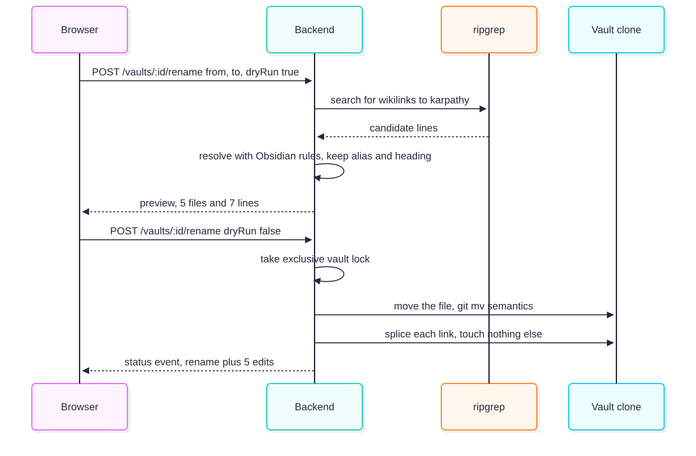

- New `POST /vaults/:id/rename` `{from, to, dryRun}`. The dry run returns `{path, line, before, after}[]`; the real run applies exactly that set.
- Finding links reuses the ripgrep search behind `GET /vaults/:id/search`. Matches are resolved with Obsidian's rules (shortest unique path, case-insensitive, with or without `.md`), then spliced as minimal byte-range edits so the round-trip stays lossless.
- The move uses `git mv` semantics, so the Changes view (`apps/web/src/components/ChangesPanel.tsx`) shows it as a rename, not delete plus add.
- Frontend: rename/move in `apps/web/src/components/FileTree.tsx` opens a preview dialog (`apps/web/src/components/Dialogs.tsx`).

### Why it's worth it

The wiki is a graph of `[[links]]` and frontmatter references. A single rename on the phone without this quietly breaks `index.md`, the `related:` lists and every page that cites the entity, and the next lint turns up a pile of dead links. With git, the preview and Discard give you a free, reviewable undo.

### Caveats & open questions

- Resolution rules must match Obsidian's, or links that Obsidian resolves will be rewritten wrongly (or missed).
- AI renames through opencode bypass this. Expose rename as an MCP tool for the agent, or document the limitation in `AGENTS.md`.
- Case-only renames on case-insensitive filesystems (#6).
- Embedded links (`![[old]]`) and Markdown links (`[text](old.md)`): in scope for v1?

### Prior art

| Project | What they do |
|---|---|
| [Obsidian links (auto-update)](https://obsidian.md/help/links) | "Automatically update internal links" rewrites links when a file is renamed. |
| [Dendron rename note](https://wiki.dendron.so/notes/g0iqmyiyxje6ndjmecshb8b/) | Rename command that updates all references across the workspace. |
| [SilverBullet](https://silverbullet.md/Manual) | Page rename that rewrites links in every page that references it. |

---

## 18. Semantic search and "Related notes" (embeddings, also exposed to the agent)

> **Issue:** [#81](https://github.com/tillg/karpathy.app/issues/81) · **Effort:** L · **Seen in:** Smart Connections, Khoj, Reor, qmd

A per-vault embedding index lets you search by meaning, not just by matching words. The same index fills a "Related notes" panel for the open note. The agent can use it too, through an MCP tool, so ingest and query skills can find pages by meaning.

### Screen drawing

```text
┌──────────────────────────────────────────────────────────────────────────┐
│ ☰  Frechen ▾                                        ● All committed      │
├───────────────────────────┬──────────────────────────────────────────────┤
│ Search                    │ andrej-karpathy.md                Write│Read │
│ ┌───────────────────────┐ │ ──────────────────────────────────────────── │
│ │ who trains neural nets│ │ # Andrej Karpathy                            │
│ │ from scratch in a     │ │ Former director of AI at Tesla, founding     │
│ │ tiny repo             │ │ member of OpenAI ...                         │
│ └───────────────────────┘ │ ──────────────────────────────────────────── │
│ [ Text | Meaning ]      ① │ Related notes                             ③  │
│                           │  0.84 sources/nanogpt-readme.md              │
│ ◆ sources/nanogpt-       │    "the simplest, fastest repository for      │
│   readme.md   text+mean ② │     training medium-sized GPTs"              │
│   ## Why · "smallest,     │  0.79 concepts/software-2-0.md               │
│   hackable GPT training"  │    "neural networks are not just another     │
│ ◇ entities/micrograd.md   │     classifier ..."                          │
│   meaning · "a tiny       │  0.71 entities/micrograd.md       no link ④  │
│   autograd engine"        │    "a tiny scalar-valued autograd engine"    │
│ ◇ concepts/zero-to-hero.md│                                              │
│   meaning                 │ Index: 412 pages · updated 2 min ago      ⑤  │
└───────────────────────────┴──────────────────────────────────────────────┘
```

1. ① Search mode toggle: Text (ripgrep, as today) or Meaning (embedding results merged with ripgrep hits).
2. ② Each hit is marked text, meaning, or both, and shows the heading chunk that matched.
3. ③ "Related notes" for the open note: top-k by similarity, with snippets.
4. ④ Related pages that aren't linked yet are marked, as link candidates.
5. ⑤ Index status. It lives on the config volume and updates from the vault event stream.

### How it works

```mermaid
sequenceDiagram
  participant B as Browser
  participant API as Backend
  participant IX as Embedding index
  participant EP as Embedding provider
  participant O as opencode
  API->>IX: file changed event, re-chunk by heading
  IX->>EP: embed changed chunks
  B->>API: GET /vaults/:id/search?q=...&mode=meaning
  API->>EP: embed query
  API->>IX: top-k nearest chunks
  API->>API: fuse with ripgrep hits
  API-->>B: ranked results with snippets
  B->>API: GET /vaults/:id/related?path=...
  API-->>B: top-k related notes
  O->>API: MCP tool vault_semantic_search
  API-->>O: matching pages for ingest or query
```

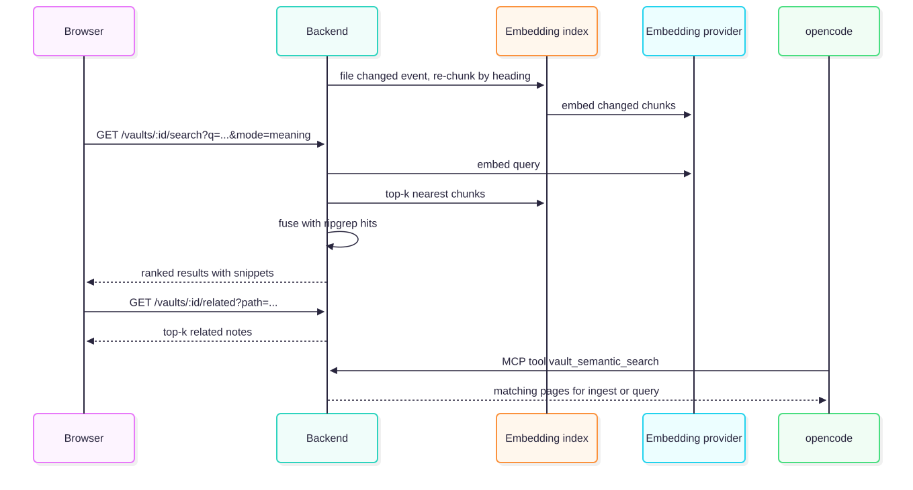

- Index lives on the config volume (never in the clone), per vault, chunked by heading, updated incrementally from the watcher (`apps/backend/src/watcher.ts`) that already feeds `GET /vaults/:id/events`.
- Embeddings go through a pluggable provider: local ONNX/transformers.js, Ollama, or any OpenAI-compatible `/embeddings`. As an alternative, run `qmd` as an MCP server and skip our own index.
- `GET /vaults/:id/search` gets `mode=meaning`, fused with ripgrep results (e.g. reciprocal rank fusion). New `GET /vaults/:id/related?path=`.
- An MCP server tool `vault_semantic_search`, registered in the opencode config and scoped to the session's vault, so the ingest/query skills can call it.
- Frontend: a mode toggle in `apps/web/src/components/SearchPanel.tsx`; a Related panel below the note in `apps/web/src/components/NotePane.tsx`.

### Why it's worth it

Queries phrased differently from the page text fail with grep: "who trains nets from scratch" never matches "nanoGPT". Related notes surface link candidates for lint. For ingest, meaning search helps the agent update the existing `andrej-karpathy.md` instead of creating a duplicate `karpathy.md`.

### Caveats & open questions

- Provider-agnostic, never hard-wired (like the chat model).
- Local models are heavy under amd64 emulation on the arm64 host. Prefer native arm64 images or a remote endpoint.
- Worth it past a few hundred pages; below that, ripgrep plus `index.md` is enough.
- Build our own index or adopt `qmd`? One index shared between the UI and the agent either way.
- Initial indexing cost and time for a large vault; show progress.

### Prior art

| Project | What they do |
|---|---|
| [Smart Connections](https://github.com/brianpetro/obsidian-smart-connections) | Obsidian plugin with local embeddings, a "connections" panel and semantic search. |
| [Khoj](https://docs.khoj.dev/clients/obsidian/) | Semantic search and chat over Obsidian notes. |
| [Reor](https://github.com/reorproject/reor) | Local AI notes app that shows related notes in a sidebar while you write. |
| [qmd](https://github.com/tobi/qmd) | Local hybrid search (BM25 + vectors) over Markdown, with an MCP server. |
| [Mem Heads Up](https://get.mem.ai/features/heads-up) | Surfaces related notes automatically while you view a note. |

---

## 19. Properties (frontmatter) editor with wiki-schema validation

> **Issue:** [#82](https://github.com/tillg/karpathy.app/issues/82) · **Effort:** M · **Seen in:** Obsidian properties, Foam, Notion AI

A collapsible form above the editor shows the YAML frontmatter as typed fields: text, list chips, dates and link lists. A toggle switches back to raw YAML. The form checks the fields against the wiki schema (`type`, `tags`, `updated`, `sources`, `related`, `confidence`) and flags anything that doesn't fit, so you can fix a page's metadata without typing YAML on a phone keyboard.

### Screen drawing

```text
┌────────────────────────────────────────┐
│ ‹ Files  andrej-karpathy.md Write│Read │
├────────────────────────────────────────┤
│ ▾ Properties               [ YAML ] ①  │
│ ┌────────────────────────────────────┐ │
│ │ type        [ entity         ▾ ] ② │ │
│ │ tags        (person)(ai-research)  │ │
│ │             (+ add)                │ │
│ │ updated     [ 2026-09-26 ▾ ]       │ │
│ │ sources     [[karpathy-blog]] ✕    │ │
│ │             [[nanogpt-readme]] ✕ ③ │ │
│ │             (+ link)               │ │
│ │ related     [[openai]] ✕           │ │
│ │             [[tesla]] ✕            │ │
│ │ confidence  [ very-high      ▾ ]   │ │
│ │  ⚠ must be high, medium or low  ④  │ │
│ └────────────────────────────────────┘ │
│ # Andrej Karpathy                      │
│ Former director of AI at Tesla ...     │
├────────────────────────────────────────┤
│  Files    Search    Chat    Changes    │
└────────────────────────────────────────┘

 diff after changing only "updated":   ⑤
 - updated: 2026-09-24
 + updated: 2026-09-26
```

1. ① The Properties panel collapses to one line. The YAML toggle shows the raw frontmatter in the editor.
2. ② Enum fields from the schema (`type`, `confidence`) become pickers.
3. ③ Link lists render as wikilink chips, with autocomplete from the vault's file list when adding.
4. ④ Schema violations are flagged inline, never silently corrected.
5. ⑤ Edits change only the touched YAML line, so key order, quoting and comments stay as they were.

### How it works

```mermaid
flowchart TD
  A["GET /vaults/:id/file"] --> B["Split frontmatter and body"]
  B --> C["yaml parseDocument keeps CST"]
  S["Schema: .karpathy/schema.json or default LLM-wiki schema"] --> D
  C --> D["Typed form fields and validation"]
  D -->|user edits one field| E["doc.setIn on that node only"]
  E --> F["doc.toString, splice changed range"]
  F --> G["Single CM6 transaction"]
  G --> H["Autosave via PUT /vaults/:id/file"]
  D -->|YAML toggle| I["Raw YAML in the editor"]
  I --> C
```


- Edit through a CST-preserving YAML library (the `yaml` package's Document API): keep comments, key order and quoting, and splice only the changed node back into the text.
- The form writes through the editor as one CodeMirror transaction (`apps/web/src/components/Editor.tsx`, `apps/web/src/lib/cm.ts`), so undo works and saving goes through the existing `PUT /vaults/:id/file` path.
- Schema comes from an optional vault file (e.g. `.karpathy/schema.json`), defaulting to the LLM-wiki schema: `type` enum, `tags` list, `updated` date, `sources`/`related` link lists, `confidence` enum.
- Frontmatter parsing sits next to the existing split in `apps/web/src/lib/markdown.ts`. Read mode keeps the frontmatter display from #58.

### Why it's worth it

The LLM wiki depends on consistent frontmatter: Dataview queries, the index, and lint all read `type`, `sources` and `confidence`. On a phone keyboard, one wrong indent or an unquoted `[[link]]` in a list breaks that. The form makes the common edits (bump `updated`, add a source, lower `confidence` after a contradiction) safe and quick, and validation catches what the AI got wrong.

### Caveats & open questions

- This is the riskiest item for lossless round-trips. Property-based round-trip tests (parse, edit one field, diff) are required before shipping.
- Wikilinks in YAML lists must be quoted (`"[[openai]]"`); keep existing quoting and quote new entries.
- Unknown keys: show them as plain text fields, never drop them.
- Should `updated` bump automatically on save, or stay manual?

### Prior art

| Project | What they do |
|---|---|
| [Obsidian properties](https://obsidian.md/help/properties) | Typed property editor above the note, with a source-mode toggle. |
| [Foam note properties](https://docs.foam.md/features/note-properties) | Frontmatter properties used for note metadata and templates. |
| [Notion AI autofill](https://www.notion.com/help/autofill) | Typed database properties that AI can fill in automatically. |

---

## 20. Inline AI edit on a selection (Cmd-K style) with accept/reject

> **Issue:** [#83](https://github.com/tillg/karpathy.app/issues/83) · **Effort:** M · **Seen in:** Cursor, ChatGPT Canvas, Obsidian Copilot

Select some text, tap the floating ✦ button (or press Cmd-K), and tell the AI what to do: "tighten", "translate", "make a table", or anything else. The result shows up in place as a proposed diff with Accept and Reject. In "ask" mode you get an answer about the selection instead.

### Screen drawing

```text
┌────────────────────────────────────────┐
│ ‹ Files  software-2-0.md    Write│Read │
├────────────────────────────────────────┤
│ # Software 2.0                         │
│ ## Summary                             │
│ ┌─ proposed ─────────────────────── ③ ┐│
│ │- Karpathy argues that neural nets   ││
│ │- are not just another tool but are  ││
│ │- in a way a whole new kind of way   ││
│ │- to write software, basically.      ││
│ │+ Karpathy argues neural networks    ││
│ │+ are a new way to write software:   ││
│ │+ weights replace hand-written code. ││
│ │        [ Reject ]   [ Accept ✓ ] ④  ││
│ └─────────────────────────────────────┘│
│ ## Key claims                          │
│                                        │
│ ┌────────────────────────────────────┐ │
│ │ ✦ tighten                     ①    │ │
│ │ (tighten)(translate)(table)(ask) ② │ │
│ └────────────────────────────────────┘ │
├────────────────────────────────────────┤
│  Files    Search    Chat    Changes    │
└────────────────────────────────────────┘
```

1. ① The prompt box opens from the ✦ button next to the selection (touch) or Cmd-K (keyboard).
2. ② Preset chips for the usual edits; "ask" answers a question about the selection without editing.
3. ③ The replacement is shown inline as a proposed diff over the selected range. The file isn't changed yet.
4. ④ Accept applies it as one editor transaction (Cmd-Z undoes it). Reject leaves the text as it was.

### How it works

```mermaid
sequenceDiagram
  participant E as Editor
  participant API as Backend
  participant O as opencode
  E->>E: select range, open prompt
  E->>API: POST /vaults/:id/inline-edit selection, context, instruction
  API->>O: session.create throwaway, all tools denied
  API->>O: prompt, return replacement text only
  O-->>API: replacement text
  API->>O: session.delete
  API-->>E: replacement
  E->>E: check selection unchanged, else mark stale
  E->>E: show proposed diff decoration
  E->>E: Accept dispatches one CM6 transaction
  E->>API: autosave PUT /vaults/:id/file
```

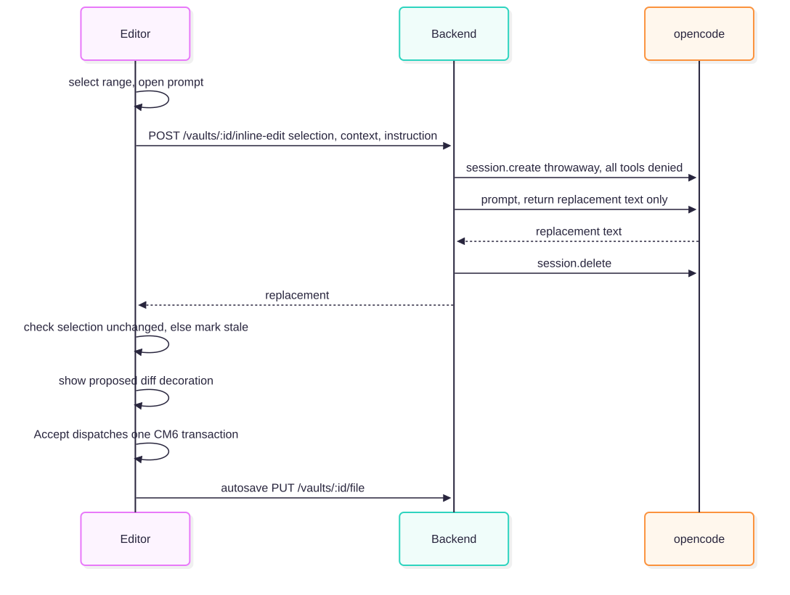

- A throwaway opencode session with all tools denied, the same pattern as the commit-message agent in `apps/backend/src/commit-message.ts` (`promptSync` + timeout + delete via `harness/opencode.ts`). It returns replacement text only, so no file is touched on the server.
- New `POST /vaults/:id/inline-edit` `{path, selection, before, after, instruction, mode: "edit" | "ask"}`, with a little surrounding text for context.
- Frontend: a selection tooltip and Cmd-K keymap in `apps/web/src/lib/cm.ts`; the proposed diff is a CM6 decoration widget in `apps/web/src/components/Editor.tsx`.
- Accept is a single CM6 transaction replacing exactly the selected range, so undo works and the rest of the file round-trips byte for byte.

### Why it's worth it

Small edits are the common case on a phone: tighten a summary the ingest wrote, translate a quote, turn a list into a table. A full agent turn is heavy for that. It takes the vault lock, pulls first, and may touch files you didn't expect. Inline edit keeps the change to the selected text, and you see the diff before anything is applied.

### Caveats & open questions

- Must go through opencode, because provider keys live only there. Never call a model API from the backend directly.
- Stale selection: if the file changes meanwhile (AI turn, pull), re-check the range before Accept and refuse if it moved.
- Which model? The chat model by default; a cheaper small model may be enough (cf. model switcher, #84).
- Should "ask" answers be savable into the note (cf. save answer, #67)?

### Prior art

| Project | What they do |
|---|---|
| [Cursor inline edit](https://cursor.com/docs/inline-edit/overview) | Cmd-K on a selection, with an inline diff to accept or reject. |
| [ChatGPT Canvas](https://openai.com/index/introducing-canvas/) | Select a passage and ask for a targeted edit within a document. |
| [Obsidian Copilot](https://docs.obsidiancopilot.com/custom-commands/) | Custom commands that run a prompt on the selected text in a note. |

---

## 21. Model and agent switcher per chat

> **Issue:** [#84](https://github.com/tillg/karpathy.app/issues/84) · **Effort:** S · **Seen in:** Agent Client, Cline, opencode SDK

A dropdown in the chat header picks the provider and model, and optionally the agent (normal
`vault`, `plan`, or a custom "librarian"), for the next turn. The choice is remembered per chat, so a
cheap local model can run the weekly lint while a strong model writes the synthesis pages.

### Screen drawing

```text
┌──────────────────────────────────────┐
│ ‹ Chats    qwen3:14b · librarian ▾ ① │
├──────────────────────────────────────┤
│ ┌──────────────────────────────────┐ │
│ │ MODEL                          ② │ │
│ │ ● ollama / qwen3:14b      local  │ │
│ │ ○ anthropic / claude-sonnet      │ │
│ │ ○ openai / gpt-5-mini            │ │
│ │ AGENT                          ③ │ │
│ │ ○ vault   ○ plan   ● librarian   │ │
│ │ Applies to the next turn         │ │
│ └──────────────────────────────────┘ │
│                                      │
│         Lint wiki/entities/ and flag │
│         pages with confidence: low   │
│                                      │
│ karpathy.app · qwen3:14b            ④ │
│ ✓ read wiki/entities/andrej-karpat…  │
│ 3 pages are marked confidence: low:  │
│ tinygrad.md, eureka-labs.md, …       │
├──────────────────────────────────────┤
│ [ Ask about this vault…         ] (↑)│
├──────────────────────────────────────┤
│   Files    Search    Chat   Changes  │
└──────────────────────────────────────┘
```

1. ① The chat header's model label (today a static `.model` span in `ChatPane.tsx`) becomes a
   button showing the current model and agent.
2. ② Only providers that have a server-side key (or a local endpoint such as Ollama) are listed.
3. ③ Agent choice; `vault-readonly` is never offered, the backend still forces it during Conflict.
4. ④ Each assistant turn already names the model that produced it (`t.model`), so a mid-chat
   switch stays visible in the history.

### How it works

```mermaid
sequenceDiagram
  actor U as User
  participant W as ChatPane
  participant B as Backend
  participant O as opencode
  W->>B: GET /vaults/:id/models
  B->>O: GET /config/providers
  O-->>B: providers and their models
  B-->>W: only providers with server-side keys
  U->>W: pick ollama/qwen3 and agent librarian
  W->>W: remember choice for this chatId
  U->>W: send lint the entities folder
  W->>B: POST /vaults/:id/chats/:chatId/prompt with model and agent
  B->>O: prompt with model providerID modelID and agent
  O-->>B: assistant message tagged with modelID
  B-->>W: stream, model name shown on the turn
```
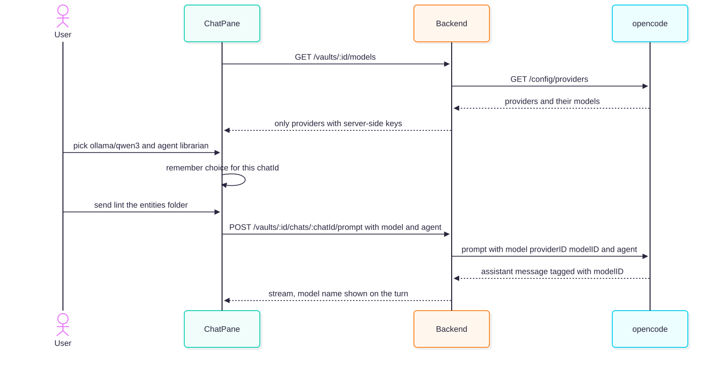

- New backend route (e.g. `GET /vaults/:id/models`) wraps opencode `GET /config/providers` and
  filters out providers without credentials, so the browser never learns about keys.
- `POST /vaults/:id/chats/:chatId/prompt` accepts an optional `model: {providerID, modelID}` and
  `agent`; the backend passes them to the opencode `prompt` call. Without them it uses the
  server-wide default from settings, as today.
- Per-chat memory: read the model/agent of the last user message from the opencode session (no
  extra backend store, in line with "chats are listed via opencode's session API"), with a
  `localStorage` hint for instant display.
- UI: a small popover component opened from the header in `apps/web/src/components/ChatPane.tsx`;
  store state in `apps/web/src/store.tsx` keyed by `chatId`.
- The backend keeps choosing `vault-readonly` whenever the vault is in Conflict, regardless of the
  requested agent.

### Why it's worth it

The loop has very different jobs: lint and index upkeep are mechanical and frequent, while a
synthesis page across ten sources needs the best model available. Switching per chat lets the user
keep routine work on a cheap or local model and spend money only where quality matters. It also
makes the project's provider-agnostic design visible instead of hidden in a settings file.

### Caveats & open questions

- Only list providers with server-side keys; a model that fails at prompt time should produce a
  clear error in the turn, not a silent fallback.
- The server-wide default stays in settings; the switcher only overrides it per chat.
- Custom agents such as "librarian" must be defined in the opencode config; should the app ship one?
- Weak local models may misuse file tools; consider a warning when a small model is used with the
  editing agent.

### Prior art

| Project | What they do |
|---|---|
| [Agent Client](https://github.com/RAIT-09/obsidian-agent-client) | Obsidian plugin with a model/mode picker in the chat view for ACP agents. |
| [Cline plan/act models](https://cline.ghost.io/plan-act-model-usage-patterns-in-cline/) | Separate models for planning and acting, chosen per mode to balance cost and quality. |
| [opencode SDK](https://opencode.ai/docs/sdk/) | `config.providers` lists models; `session.prompt` takes a per-message `model` and `agent`. |

---

## 22. Token, cost and context meter

> **Issue:** [#85](https://github.com/tillg/karpathy.app/issues/85) · **Effort:** S · **Seen in:** opencode TokenScope, Agent Client

Every assistant turn shows its input, output and cache tokens plus an estimated cost, and the chat
keeps a running total. A context-fill bar warns before the model runs out of room and offers
"Compact"; the admin area shows a monthly total per vault.

### Screen drawing

```text
┌──────────────────────────────────────┐
│ ‹ Chats        claude-sonnet       ✎ │
├──────────────────────────────────────┤
│ Context ▓▓▓▓▓▓▓▓▓▓▓▓▓▓░░░ 84% ①      │
│ This chat: 212k tok · ~$0.61   ②     │
│                         [ Compact ]  │
├──────────────────────────────────────┤
│       Ingest raw/articles/karpathy-  │
│       llm-wiki-gist.md into the wiki │
│                                      │
│ karpathy.app · claude-sonnet          │
│ ✓ read raw/articles/karpathy-llm-…   │
│ ✎ changed wiki/sources/llm-wiki.md   │
│ ✎ changed wiki/concepts/llm-wiki.md  │
│ Created the source page and linked…  │
│ in 41k · out 3.2k · cache 38k        │
│ ~$0.18 (estimate)                  ③ │
├──────────────────────────────────────┤
│ [ Ask about this vault…         ] (↑)│
├──────────────────────────────────────┤
│   Files    Search    Chat   Changes  │
└──────────────────────────────────────┘

 Admin › Vaults › frechen-wiki        ④
 September 2026   2.4M tok   ~$7.90
```

1. ① Context-fill bar: the last turn's input tokens against the model's context window.
2. ② Running total for this chat; tapping it could show a per-turn breakdown.
3. ③ Per-turn usage line under each assistant message, always labelled as an estimate.
4. ④ Monthly total per vault in the admin area, which also covers scheduled jobs.

### How it works

```mermaid
sequenceDiagram
  participant W as ChatPane
  participant A as Admin
  participant B as Backend
  participant O as opencode
  W->>B: GET /vaults/:id/chats/:chatId/stream
  O-->>B: message.updated with tokens and cost
  B-->>W: turn usage input output cache cost
  W->>W: add to chat total, update context bar
  Note over W: context above 80 percent shows Compact
  W->>B: POST /vaults/:id/chats/:chatId/compact
  B->>O: POST /session/:id/summarize
  O-->>B: summary message
  B-->>W: context bar drops
  A->>B: GET /vaults/:id/usage?month=2026-09
  B->>O: list sessions, sum assistant cost
  B-->>A: monthly total per vault
```
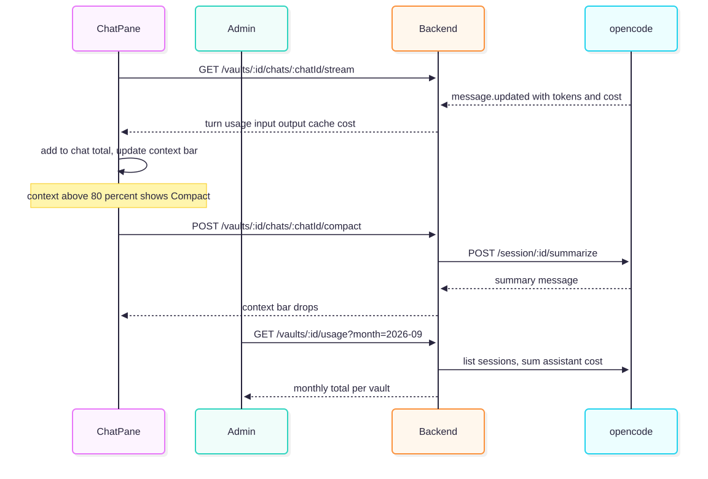

- opencode assistant messages already carry `tokens` (input, output, reasoning, cache read/write)
  and `cost`; the backend maps them into the NDJSON events of
  `GET /vaults/:id/chats/:chatId/stream` and into `GET /vaults/:id/chats/:chatId`.
- The context window size comes from the model metadata in opencode `GET /config/providers`.
- "Compact" calls a new backend route that forwards to opencode `POST /session/:id/summarize`;
  it takes the vault lock like any other turn.
- Monthly totals: a backend route (e.g. `GET /vaults/:id/usage?month=`) sums `cost` over the
  vault's sessions; show it in `apps/web/src/components/Admin.tsx`.
- UI: usage line in the assistant-turn renderer and a meter strip at the top of the message list
  in `apps/web/src/components/ChatPane.tsx`.

### Why it's worth it

This is a single-user app where the user pays their own API bill, and ingest turns that read long
PDFs or research runs can be expensive. Seeing the cost of one ingest right under it builds a feel
for what the loop costs, and the context bar explains why a long query chat suddenly gets worse.
With scheduled lint and ingest jobs, the monthly total is the only place spend becomes visible.

### Caveats & open questions

- opencode's cost ignores cache-read pricing (anomalyco/opencode #28494), so always label cost
  as an estimate.
- Local models report tokens but zero cost; show tokens only.
- Where does the 80 % warning threshold live: fixed, or per model?
- Should compaction be offered automatically when the bar is full, or stay a manual action?

### Prior art

| Project | What they do |
|---|---|
| [opencode TokenScope](https://github.com/ramtinJ95/opencode-tokenscope) | opencode plugin that breaks down token usage and cost per session. |
| [Agent Client usage indicators](https://github.com/RAIT-09/obsidian-agent-client) | Shows usage and context indicators in an Obsidian agent chat. |

---

## 23. Deep research into the wiki (`/research <topic>`)

> **Issue:** [#86](https://github.com/tillg/karpathy.app/issues/86) · **Effort:** M · **Seen in:** nashsu/llm_wiki, GPT Researcher MCP

Typing `/research <topic>` makes the agent propose a handful of sub-questions, which the user
confirms or edits before any money is spent. It then searches the web, saves useful sources to
`raw/` with their URLs, and ingests them into wiki pages that cite those sources. It can also start
from gaps that lint flagged.

### Screen drawing

```text
┌──────────────────────────────────────┐
│ ‹ Chats        claude-sonnet       ✎ │
├──────────────────────────────────────┤
│   /research nanoGPT vs. llm.c        │
│                                      │
│ karpathy.app · claude-sonnet          │
│ Research plan                      ① │
│ ☑ How do nanoGPT and llm.c differ    │
│   in goals and codebase size?        │
│ ☑ Which training results did llm.c   │
│   reproduce (GPT-2 124M)?            │
│ ☐ Community forks and benchmarks     │
│ [ + add question ]                   │
│ Cap: $0.50 · max 8 sources         ② │
│ [ Edit ]              [ Start ▸ ]    │
│ ──────────────────────────────────── │
│ ◐ websearch "llm.c GPT-2 reproduce"  │
│ ✓ saved raw/articles/llm-c-gpt2.md ③ │
│ ✓ saved raw/articles/nanogpt-readme… │
│ ✎ changed wiki/entities/llm-c.md   ④ │
├──────────────────────────────────────┤
│ [ Ask about this vault…         ] (↑)│
├──────────────────────────────────────┤
│   Files    Search    Chat   Changes  │
└──────────────────────────────────────┘
```

1. ① The agent's proposed sub-questions; the user ticks, edits or adds before anything runs.
2. ② Cost cap and source limit for this run, shown before the user confirms.
3. ③ Each useful hit is saved to `raw/articles/` with its URL in frontmatter.
4. ④ The normal ingest then writes wiki pages; they show up as tool chips and in Changes.

### How it works

```mermaid
flowchart TD
  A["/research topic, or a gap from lint"] --> B["Agent proposes sub-questions"]
  B --> C{"User confirms or edits"}
  C -- cancel --> Z["Nothing spent"]
  C -- "confirm with cost cap" --> D["websearch per sub-question"]
  D --> E["webfetch useful hits"]
  E --> F["Save raw/articles/slug.md with source URL"]
  F --> G{"Cap reached or all answered?"}
  G -- no --> D
  G -- yes --> H["Ingest new raw sources into wiki pages"]
  H --> I["Pages cite raw/ sources"]
  I --> J["Uncommitted edits in Changes panel"]
```


- Runs as a regular turn on `POST /vaults/:id/chats/:chatId/prompt` with a research agent or
  skill (`SKILL.md` in the vault), or as a background job for long runs.
- Web access via opencode's `websearch`/`webfetch` tools (enabled by permission for this agent
  only), or GPT Researcher (`gptr-mcp`) registered as an MCP server in the opencode config.
- The confirmation step is the agent stopping after the plan; the "Start" button sends the
  edited plan back as the next prompt. UI in `apps/web/src/components/ChatPane.tsx`.
- Sources land as `raw/articles/<slug>.md` with `url:` and `fetched:` frontmatter; resulting wiki
  pages list them in `sources:`, matching the vault's ingest conventions.
- A lint report can offer "Research this gap" on a missing-concept finding, pre-filling the topic.

### Why it's worth it

Karpathy's LLM-wiki pattern gets better with every good source, and gaps found by lint are
otherwise left for later. Research turns a throwaway chat answer into durable, cited pages in
`raw/` and `wiki/` that Obsidian and future queries can reuse. From a phone it is an ideal
"start it on the train, review it at home" task, reviewed in Changes before committing.

### Caveats & open questions

- Search API keys stay server-side, like provider keys.
- Enforce a cost cap per run; stop cleanly and report when it is reached.
- Pairs with scheduled jobs and push notifications, since runs can take minutes.
- Copyright and size: store full text or only excerpts plus URL? Paywalled pages?
- Deduplicate against sources already in `raw/`.

### Prior art

| Project | What they do |
|---|---|
| [nashsu/llm_wiki deep research](https://github.com/nashsu/llm_wiki) | LLM-wiki app with a deep-research mode that fills the wiki from web sources. |
| [GPT Researcher MCP](https://github.com/assafelovic/gptr-mcp) | MCP server that plans sub-questions, searches and returns sourced reports. |

---

## 24. Attach photos and PDFs (camera → raw/, chat attachments)

> **Issue:** [#87](https://github.com/tillg/karpathy.app/issues/87) · **Effort:** M · **Seen in:** Agent Client, opencode attachments, caniuse HTML media capture

An "Attach" button in the editor and in the chat composer takes a photo or picks a file. In the
editor the file goes to the attachment folder and `![[file]]` is inserted at the cursor. In the
chat, a photo of a whiteboard or a book page plus "ingest this" goes straight to the AI, and PDFs
are saved to `raw/` and ingested.

### Screen drawing

```text
┌──────────────────────────────────────┐
│ ‹ Chats        claude-sonnet       ✎ │
├──────────────────────────────────────┤
│  ┌────────────┐                      │
│  │ ▒▒▒▒▒▒▒▒▒▒ │  Ingest this page    │
│  │ ▒ photo  ▒ │  from "Deep Learning"│
│  └────────────┘  into the wiki     ① │
│                                      │
│ karpathy.app · claude-sonnet          │
│ ✓ saved raw/media/2026-09-26-book.jpg│
│ ✎ changed wiki/concepts/backprop.md  │
│ ✎ changed wiki/sources/deep-learnin… │
│ Added the chain-rule example and …   │
├──────────────────────────────────────┤
│ ┌────────┐ ┌───────────────────┐     │
│ │ IMG ✕  │ │ paper.pdf 2.1MB ✕ │   ② │
│ └────────┘ └───────────────────┘     │
│ (+) [ Ask about this vault…     ] (↑)│
│  ③                                   │
│ ┌──────────────────────────────────┐ │
│ │ Take Photo                       │ │
│ │ Photo Library                    │ │
│ │ Choose File…                     │ │
│ └──────────────────────────────────┘ │
└──────────────────────────────────────┘
```

1. ① The sent turn shows a thumbnail of the photo next to the prompt.
2. ② Pending attachments as removable chips above the composer; large files show their size.
3. ③ The "+" button opens the iOS picker from `<input type="file" capture>`: camera, library,
   or Files.

### How it works

```mermaid
sequenceDiagram
  actor U as User
  participant W as PWA
  participant B as Backend
  participant O as opencode
  U->>W: Attach, take photo or pick PDF
  W->>B: POST /vaults/:id/attachments multipart
  B->>B: HEIC to JPEG, resize, size warning
  B-->>W: path attachments/2026-09-26-whiteboard.jpg
  alt from the editor
    W->>W: insert embed at cursor
  else from the chat composer
    W->>B: POST /vaults/:id/chats/:chatId/prompt text plus file part
    B->>O: prompt with base64 file part
    O->>O: vision model reads it, writes raw and wiki
    O-->>B: tool events
    B-->>W: changed-file chips
  end
```
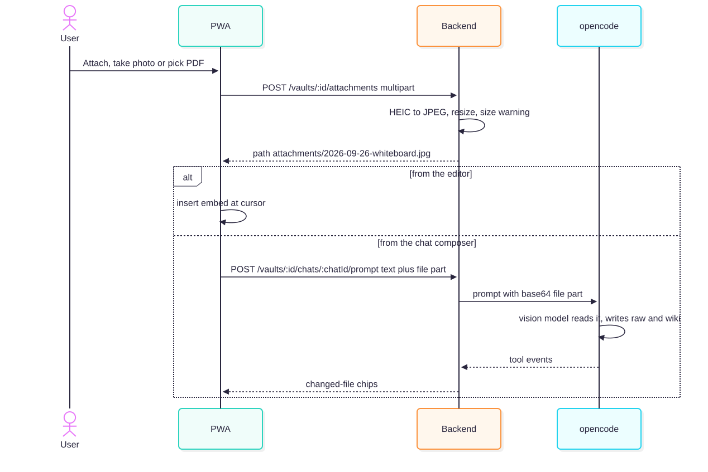

- Picker: `<input type="file" accept="image/*,application/pdf" capture>`, supported in iOS Safari
  and installed PWAs.
- Upload route (proposed `POST /vaults/:id/attachments`): resizes images, converts HEIC → JPEG on
  the server, writes into the attachment folder read from `.obsidian/app.json`
  (`attachmentFolderPath`), and warns above a size limit.
- Editor: `apps/web/src/components/Editor.tsx` inserts `![[file]]` at the cursor after upload;
  Read mode shows it via the image-embed work (#59).
- Chat: `POST /vaults/:id/chats/:chatId/prompt` carries file parts; the backend forwards them to
  opencode as base64 file parts. PDFs are also written to `raw/` so the ingest has a durable source.
- UI: attach button and chips in the composer (`.comp`) of `apps/web/src/components/ChatPane.tsx`.

### Why it's worth it

It turns the phone camera into a capture device for the wiki: a whiteboard after a meeting, a page
of a book, a slide at a talk, each ingested where it was seen. It is also the write side of image
embeds (#59), so notes made on the phone look the same in Obsidian. PDFs downloaded on the phone
finally have a path into `raw/` without a laptop.

### Caveats & open questions

- Binaries grow the git repo forever; warn above a size limit and consider keeping originals out.
- Needs a vision-capable model; greyed out or warned when the chat's model can't read images.
- Follow Obsidian's attachment folder setting instead of inventing a new one.
- Should chat photos be stored in the vault at all, or only sent to the model?

### Prior art

| Project | What they do |
|---|---|
| [Agent Client (image paste)](https://github.com/RAIT-09/obsidian-agent-client) | Paste images into an Obsidian agent chat as prompt context. |
| [opencode attachments](https://opencode.ai/v2/docs/attachments/) | Files and images passed to a session as prompt parts. |
| [caniuse HTML media capture](https://caniuse.com/html-media-capture) | Browser support for the `capture` attribute, including iOS Safari. |

---

## 25. Voice memos → transcript in raw/ (optional auto-ingest)

> **Issue:** [#88](https://github.com/tillg/karpathy.app/issues/88) · **Effort:** M · **Seen in:** Mem, Tana, Open WebUI, What PWA can do

A mic button records a voice memo. The server transcribes it with a configurable speech-to-text
backend and saves `raw/voice/<date>.md`, optionally keeping the audio. The user can pick a preset
such as "meeting debrief → action items" or "ingest into wiki", which then runs as a normal chat
turn.

### Screen drawing

```text
┌──────────────────────────────────────┐
│ Files                        ⚙       │
├──────────────────────────────────────┤
│ ▾ frechen-wiki                       │
│ ▸ raw                                │
│   ▾ voice                            │
│       2026-09-26-0815.md   new     ① │
│ ▸ wiki                               │
│                                      │
│ ┌──────────────────────────────────┐ │
│ │        ● REC  01:42            ② │ │
│ │  ▁▃▅▇▅▃▂▁▂▄▆▇▆▄▂▁▃▅▇▅▃▁          │ │
│ │                                  │ │
│ │ After transcribing:            ③ │ │
│ │ ○ Just save to raw/voice/        │ │
│ │ ● Meeting debrief → action items │ │
│ │ ○ Ingest into wiki               │ │
│ │ ☐ Keep audio (not in git)        │ │
│ │ [ Cancel ]         [ ■ Stop ]    │ │
│ └──────────────────────────────────┘ │
│                               (mic) ④│
├──────────────────────────────────────┤
│   Files    Search    Chat   Changes  │
└──────────────────────────────────────┘
```

1. ① The transcript lands as a normal note in `raw/voice/`, visible in the tree and in Changes.
2. ② Recording sheet with timer and level meter (or the iOS audio capture sheet as fallback).
3. ③ Optional preset that runs as a chat turn on the new transcript.
4. ④ Floating mic button, reachable from Files and Chat.

### How it works

```mermaid
sequenceDiagram
  actor U as User
  participant W as PWA
  participant B as Backend
  participant S as STT backend
  participant O as opencode
  U->>W: tap mic, record memo
  W->>B: POST /vaults/:id/voice audio file
  B->>S: POST /audio/transcriptions
  S-->>B: transcript text
  B->>B: write raw/voice/2026-09-26-0815.md
  B-->>W: transcript path
  opt preset chosen
    W->>B: POST /vaults/:id/chats/:chatId/prompt preset plus path
    B->>O: prompt meeting debrief or ingest into wiki
    O-->>B: wiki edits and action items
    B-->>W: turn with changed files
  end
```
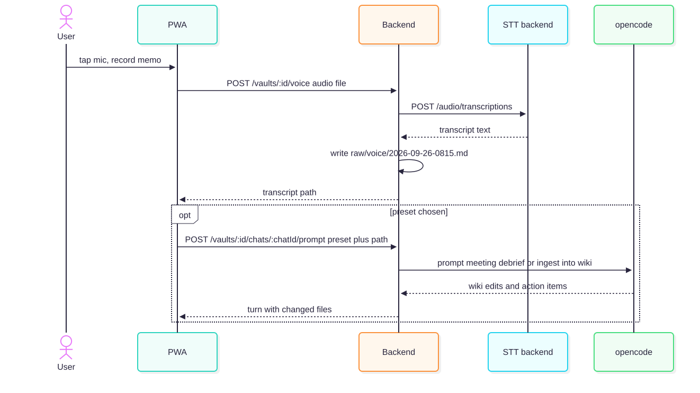

- Recording: `<input type="file" accept="audio/*" capture>` (robust on iOS) with MediaRecorder as
  the richer option where it works.
- Upload route (proposed `POST /vaults/:id/voice`) sends the audio to a configurable STT backend:
  self-hosted Whisper as an extra compose service, or any OpenAI-compatible
  `/audio/transcriptions` endpoint. Its key stays server-side, like provider keys.
- The backend writes `raw/voice/2026-09-26-0815.md` with frontmatter (`recorded:`, `duration:`,
  `audio:` when kept); the event stream updates the tree.
- A preset is just a prompt template: the client creates or reuses a chat
  (`POST /vaults/:id/chats`) and sends `POST /vaults/:id/chats/:chatId/prompt`.
- UI: mic button and sheet as a new component, wired from `apps/web/src/components/Shell.tsx`.

### Why it's worth it

Voice is the most natural input on a phone, especially walking out of a meeting or a talk. A
transcript in `raw/` is exactly the kind of immutable source the ingest step expects, so voice
feeds the raw → wiki pipeline with no extra concepts. The preset turns "record, then later
remember to process it" into one action.

### Caveats & open questions

- Web Speech API does not work in installed iOS PWAs, and MediaRecorder is flaky there; prefer the
  file-input capture path.
- Keep audio out of git by default (size, privacy); store it outside the vault or gitignore it.
- iOS keyboard dictation into the chat is a zero-effort baseline; is server STT worth it for
  short memos?
- Which STT backend is the default in the compose stack, if any?

### Prior art

| Project | What they do |
|---|---|
| [Mem voice mode](https://get.mem.ai/features/heads-up) | Record voice notes that Mem transcribes and organises. |
| [Tana voice memos](https://outliner.tana.inc/docs/mobile-voice-memos) | Mobile voice memos transcribed and processed with AI into nodes. |
| [Open WebUI audio](https://docs.openwebui.com/features/chat-conversations/audio/) | Configurable STT backends (Whisper, OpenAI-compatible) for chat input. |
| [What PWA can do: speech](https://whatpwacando.today/speech-recognition/) | Shows which speech APIs work in PWAs, including iOS limits. |

---

## 26. Hover / long-press wikilink preview

> **Issue:** [#89](https://github.com/tillg/karpathy.app/issues/89) · **Effort:** S · **Seen in:** Obsidian, Quartz

Hovering a `[[wikilink]]` on desktop, or long-pressing it on touch in Read mode, opens a
scrollable popover with the target note rendered. "Open" navigates there; a missing page offers
"Create". You can check an entity page without losing your place.

### Screen drawing

```text
┌──────────────────────────────────────┐
│ ‹ Files              Write│Read   ✦  │
├──────────────────────────────────────┤
│ llm-wiki                             │
│ type  concept   confidence  high     │
│                                      │
│ The pattern was described by         │
│ [[andrej-karpathy]] in a gist.  ①    │
│  ┌───────────────────────────────┐   │
│  │ andrej-karpathy        ②      │   │
│  │ type entity · confidence high │   │
│  │ AI researcher, founded Eureka │   │
│  │ Labs; previously Tesla AI and │   │
│  │ OpenAI. Author of nanoGPT and │   │
│  │ [[llm-c]] …               ▒   │   │
│  │ ───────────────────────────── │   │
│  │ wiki/entities/…   [ Open ▸ ]③ │   │
│  └───────────────────────────────┘   │
│ Raw sources go into [[raw-layer]] ④  │
│ and are never edited.                │
├──────────────────────────────────────┤
│   Files    Search    Chat   Changes  │
└──────────────────────────────────────┘

 ④ long-press on a missing link:
  ┌───────────────────────────────┐
  │ raw-layer — no such note      │
  │              [ Create note ]  │
  └───────────────────────────────┘
```

1. ① The link that was long-pressed (Read mode) or hovered (desktop).
2. ② Popover with the target rendered by the Read-mode renderer, frontmatter included; it scrolls.
3. ③ "Open" navigates like a normal tap; Escape or tapping outside closes it.
4. ④ A missing target (styled `wl miss`) shows "Create" instead of a preview.

### How it works

```mermaid
sequenceDiagram
  actor U as User
  participant R as Read view
  participant C as File cache
  participant B as Backend
  U->>R: hover or long-press a wikilink
  R->>C: look up target path
  alt cached
    C-->>R: note text
  else not cached
    R->>B: GET /vaults/:id/file?path=wiki/entities/andrej-karpathy.md
    B-->>R: content and version
  end
  R->>R: renderMarkdown into popover
  Note over R: missing target shows Create instead
  U->>R: tap Open
  R->>R: followLink navigates
```
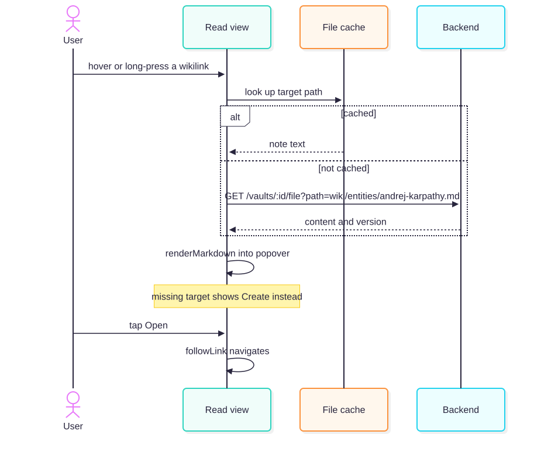

- Reuses `renderMarkdown` and `ReadView` from `apps/web/src/components/NotePane.tsx`; the
  existing `a.wl` click handler in `Markdown` gets `pointerenter`/long-press handlers.
- Content comes from the client file cache, falling back to `GET /vaults/:id/file?path=`; link
  resolution reuses `parseWikilink` and `exists` from the store.
- Links inside the popover are live, but nested popovers are capped at one level.
- Keyboard: focusing a link and pressing Enter opens the preview, a second Enter opens the note;
  the popover gets `role="dialog"` and returns focus on close.
- No backend change.

### Why it's worth it

Queries and lint results link to many entity and concept pages; on a phone, every tap-and-back
loses the scroll position and costs seconds. A preview lets the user check "is this the right
Karpathy page, and what confidence does it have?" in place, which is most of what reviewing an AI
ingest is about.

### Caveats & open questions

- On touch, only in Read mode, because long-press in the CodeMirror editor selects text.
- Should the chat's rendered answers (which also contain wikilinks) get previews too?
- Section links (`[[page#heading]]`) should scroll the popover to the heading.
- Hover delay and touch timing need tuning to avoid accidental popovers while scrolling.

### Prior art

| Project | What they do |
|---|---|
| [Obsidian page preview](https://obsidian.md/help/plugins/page-preview) | Core plugin: hover a link (with modifier) to see the linked note. |
| [Quartz popover previews](https://quartz.jzhao.xyz/features/popover-previews) | Published digital gardens show a popover of the linked page on hover. |

---

## 27. Tag browser (inline and frontmatter tags)

> **Issue:** [#90](https://github.com/tillg/karpathy.app/issues/90) · **Effort:** S · **Seen in:** Obsidian, Foam

A panel lists every tag in the vault, both inline `#tag` and frontmatter `tags:`, with counts.
Tags can be shown nested (`#topic/sub`) or flat and sorted by name or frequency; tapping a tag
lists its notes.

### Screen drawing

```text
┌──────────────────────────────────────┐
│ Tags                   Name│Count  ⚙ │
├──────────────────────────────────────┤
│ ▾ frechen-wiki                       │
│ [ Filter tags…                     ] │
│ Nested ● ○ Flat                    ① │
│ ▾ #topic                         42  │
│     #topic/llm                   27  │
│     #topic/education              9  │
│     #topic/robotics               6  │
│ ▸ #person                        18  │
│   #ai                            31 ②│
│   #AI                             4 ②│
│   #ingest-todo                    7  │
│ ──────────────────────────────────── │
│ #topic/llm · 27 notes              ③ │
│ ▪ wiki/entities/andrej-karpathy.md   │
│ ▪ wiki/concepts/llm-wiki.md          │
│ ▪ wiki/sources/intro-to-llms.md      │
│ ▪ raw/articles/karpathy-llm-wiki…    │
├──────────────────────────────────────┤
│  Files  Search  Tags  Chat  Changes  │
└──────────────────────────────────────┘
```

1. ① Nested/flat toggle and sort (name or count); nested parents collapse.
2. ② Near-duplicates such as `#ai` and `#AI` become obvious, a hint for lint to merge them.
3. ③ Tapping a tag lists its notes; tapping a note opens it in the note pane.

### How it works

```mermaid
flowchart LR
  subgraph Backend
    R["ripgrep inline #tags"] --> I["Tag index cache"]
    F["Parse frontmatter tags"] --> I
    X["File change on event stream"] -- invalidate --> I
    I --> T["GET /vaults/:id/tags"]
    I --> N["GET /vaults/:id/tags/notes?tag=topic/llm"]
  end
  T --> P["Tags panel, counts, nested or flat"]
  P -- "tap tag" --> N
  N --> L["Note list"]
  L -- tap --> O["NotePane opens the note"]
```


- Backend scan: ripgrep for inline `#tag` (excluding code blocks, URLs and headings) plus a
  frontmatter parse for `tags:`; the result is cached per vault.
- The cache is invalidated by the same file-change signals that feed `GET /vaults/:id/events`.
- New routes (proposed): `GET /vaults/:id/tags` → `[{tag, count}]` and
  `GET /vaults/:id/tags/notes?tag=` → paths.
- UI: a new `TagPanel` as another section in `apps/web/src/components/Sidebar.tsx` (next to
  Files, Search, Changes) and a tab or entry on the phone in `apps/web/src/components/Shell.tsx`.
- Frontmatter parsing can share code with `frontmatterFields` in `apps/web/src/lib/markdown.ts`,
  ported to the backend.

### Why it's worth it

The LLM writes most of the wiki, so the user rarely knows which tags exist. A tag list is a cheap
way to browse by theme on a phone, and it exposes tag drift (`#ai` vs `#AI`, `#llm` vs
`#topic/llm`) that the lint step should fix. It also gives queries a quick scope: "summarise
everything tagged `#topic/robotics`".

### Caveats & open questions

- Vault-wide tag rename is a bulk edit and needs a diff preview; later.
- A fifth phone tab is crowded; maybe put Tags inside Search instead.
- Case sensitivity: Obsidian treats tags case-insensitively; follow that for counts.

### Prior art

| Project | What they do |
|---|---|
| [Obsidian tags view](https://obsidian.md/help/plugins/tags) | Core plugin listing all tags with counts, nested or flat. |
| [Foam tags](https://docs.foam.md/features/tags) | Tag explorer in VS Code for inline and frontmatter tags. |

---

## 28. Wiki dashboards: Bases-compatible query tables

> **Issue:** [#91](https://github.com/tillg/karpathy.app/issues/91) · **Effort:** L · **Seen in:** Obsidian Bases, Dataview, SilverBullet

A fenced ` ```base ` block renders a live, read-only table over notes filtered by folder, tag and
frontmatter, for example "entities with `confidence: low` sorted by `updated`" or "sources
ingested this month". The raw block stays untouched in the file, so the same note renders in
Obsidian too.

### Screen drawing

```text
┌──────────────────┬───────────────────────────────────────────────────────┐
│ Files│Search│Chg ⚙│ ☰  wiki › dashboards › maintenance   Write│Read  ✦   │
├──────────────────┼───────────────────────────────────────────────────────┤
│ ▾ frechen-wiki   │ maintenance                                           │
│ ▸ raw            │                                                       │
│ ▾ wiki           │ ## Low-confidence entities                         ①  │
│   ▾ dashboards   │ ┌──────────────────────────┬────────────┬───────────┐ │
│     maintenance  │ │ file                     │ confidence │ updated ▲ │ │
│   ▸ entities     │ ├──────────────────────────┼────────────┼───────────┤ │
│   ▸ concepts     │ │ eureka-labs              │ low        │ 2026-06-02│ │
│   ▸ sources      │ │ tinygrad                 │ low        │ 2026-07-19│ │
│   index.md       │ │ micrograd                │ low        │ 2026-09-01│ │
│   log.md         │ └──────────────────────────┴────────────┴───────────┘ │
│                  │ 3 rows · live                                      ②  │
│                  │                                                       │
│                  │ ## Sources ingested this month                        │
│                  │ ┌──────────────────────────┬────────────────────────┐ │
│                  │ │ file                     │ updated                │ │
│                  │ ├──────────────────────────┼────────────────────────┤ │
│                  │ │ llm-wiki-gist            │ 2026-09-24             │ │
│                  │ │ intro-to-llms            │ 2026-09-12             │ │
│                  │ └──────────────────────────┴────────────────────────┘ │
│ ──────────────── │                                                       │
│ ⎇ main · 2 ↑  ③  │  Write mode: ```base … ``` source stays as text    ④  │
└──────────────────┴───────────────────────────────────────────────────────┘
```

1. ① A ` ```base ` block with filters `file.inFolder("wiki/entities")` and
   `confidence == "low"`, sorted by `updated`.
2. ② The table is read-only and re-runs when a matching note changes.
3. ③ Sidebar with vault tree and git pill as today (iPad landscape, three-pane layout).
4. ④ In Write mode the CodeMirror live preview shows the table as a widget when the cursor is
   outside the block; the stored text never changes.

### How it works

```mermaid
sequenceDiagram
  participant E as Editor or Read view
  participant B as Backend
  participant X as Frontmatter index
  E->>E: find fenced base block
  E->>B: POST /vaults/:id/base with block source
  B->>B: parse Bases subset, filters, sort, table view
  B->>X: query by folder, tag, frontmatter
  X-->>B: matching notes and fields
  B-->>E: rows and columns
  E->>E: render read-only table widget
  Note over E: raw block text stays unchanged in the file
  B-->>E: event stream reports a changed note
  E->>B: re-run the query
```
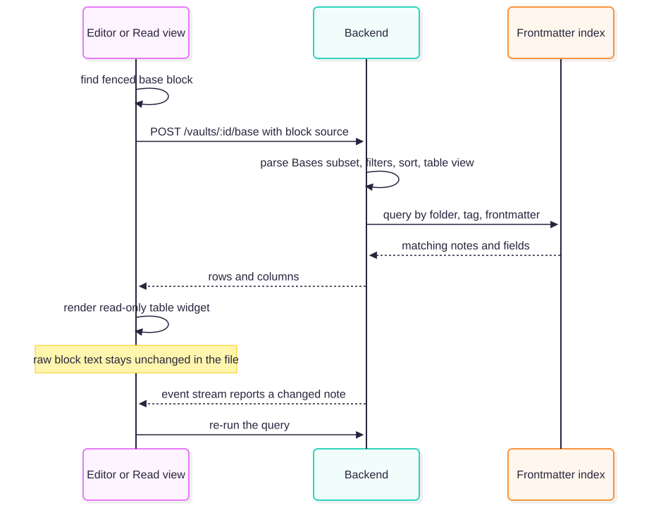

- v1 supports a subset of Obsidian Bases syntax: filters on folder, tag and frontmatter equality,
  sort, and the table view. Anything else renders as "unsupported in karpathy.app" with the raw
  block shown.
- The backend keeps a frontmatter index per vault (shared with tags, backlinks, graph) and
  evaluates the query; proposed route `POST /vaults/:id/base` with the block source.
- Read mode: `renderMarkdown` in `apps/web/src/lib/markdown.ts` leaves a placeholder for
  `base` fences, filled by a table component in `apps/web/src/components/NotePane.tsx`.
- Write mode: a block widget decoration in `apps/web/src/lib/cm.ts`, the same technique as
  live preview.
- Re-query on relevant events from `GET /vaults/:id/events`.

### Why it's worth it

`index.md` is a catalog, but it can't answer "which pages are stale, low-confidence or orphaned?".
Dashboards make the lint loop visible every day: open one note on the phone and see what needs
attention, then ask the chat to fix it. Because the syntax is Bases, the same dashboard works in
Obsidian on the Mac.

### Caveats & open questions

- Choose Bases syntax, not Dataview, for forward compatibility with Obsidian.
- Keep v1 read-only; editing cells inherits the frontmatter round-trip risk.
- Bases also has `.base` files and formulas; which subset is enough for v1?
- Large vaults: the index must stay incremental, not rescan on every query.

### Prior art

| Project | What they do |
|---|---|
| [Obsidian Bases](https://obsidian.md/help/bases) | Core plugin: database-like views over notes and their properties. |
| [Dataview](https://blacksmithgu.github.io/obsidian-dataview/) | Query language over note metadata, rendered as tables and lists. |
| [SilverBullet queries](https://silverbullet.md/Space%20Lua/Integrated%20Query) | Integrated queries over page metadata inside Markdown pages. |

---

## 29. Local graph view of the open note

> **Issue:** [#92](https://github.com/tillg/karpathy.app/issues/92) · **Effort:** M · **Seen in:** Obsidian, Quartz, Foam

A small force-directed graph shows the notes within depth 1–2 of the open note, both outgoing links
and backlinks, coloured by folder or `type` (entity, concept, source, synthesis). Tapping a node
opens that note.

### Screen drawing

```text
┌──────────────────────────────────────┐
│ ‹ Files       Write│Read│Graph ① ✦   │
├──────────────────────────────────────┤
│ andrej-karpathy        Depth 1 │[2]② │
│                                      │
│    (nanoGPT)──────(llm-c)            │
│        │         ╱                   │
│        │        ╱                    │
│  (tesla-ai)──[ANDREJ-KARPATHY]       │
│               ╱   │    ╲             │
│              ╱    │     ╲            │
│   (eureka-labs) (llm-wiki) {intro-   │
│        │           │      to-llms}   │
│   (micrograd)  <llm-wiki-            │
│                  vs-rag>       ③     │
│                                      │
│ ( ) entity  ( ) concept          ④   │
│ { } source  < > synthesis            │
│ Tap a node to open it                │
├──────────────────────────────────────┤
│   Files    Search    Chat   Changes  │
└──────────────────────────────────────┘
```

1. ① "Graph" as a third view next to Write and Read in the note header.
2. ② Depth 1 or 2; depth 2 adds neighbours of neighbours (here `micrograd`, `llm-wiki-vs-rag`).
3. ③ Nodes are coloured by `type` (shapes stand in for colours here); the open note is highlighted.
4. ④ Colour legend; tapping a node opens it and re-centres the graph.

### How it works

```mermaid
flowchart TD
  A["Open note wiki/entities/andrej-karpathy.md"] --> B["GET /vaults/:id/graph?path=...,depth=2"]
  B --> C["Link and backlink index"]
  C --> D["Nodes and edges within depth 1 or 2"]
  D --> E["d3-force layout on canvas"]
  E --> F["Colour by type: entity, concept, source, synthesis"]
  F --> G{"User taps a node"}
  G --> H["openNote of the target"]
  H --> A
```


- Reuses the backlink/link index from the backlinks feature; a proposed route
  `GET /vaults/:id/graph?path=&depth=` returns nodes (path, title, `type`, folder) and edges.
- Rendering with a lightweight force layout (e.g. `d3-force`) on a `<canvas>`, with pinch-zoom and
  pan; keep it lazy-loaded so the main bundle stays small.
- Colour by frontmatter `type`, falling back to top-level folder (`raw/`, `wiki/entities/`, …).
- UI: a new `GraphView` component switched from the mode toggle in
  `apps/web/src/components/NotePane.tsx`; node tap calls the store's `openNote`.
- Updates when the event stream reports changed links in the visible neighbourhood.

### Why it's worth it

A local graph is readable on a phone and shows at a glance whether a freshly ingested page is well
connected or an orphan, which is exactly what lint checks. It helps pick the next query ("what
links Karpathy's education work to the LLM-wiki concept?"). It is also the "cool" feature Obsidian
users expect; graph view was deferred past the MVP.

### Caveats & open questions

- The global graph is low value on small screens; skip it in v1.
- Depth 2 on hub pages (e.g. `index.md`) can explode; cap node count and exclude index/log pages.
- Accessibility: provide a list fallback of the same nodes for screen readers.
- Colours must work in dark mode and for colour-blind users (shapes or labels as backup).

### Prior art

| Project | What they do |
|---|---|
| [Obsidian graph view](https://obsidian.md/help/plugins/graph) | Global and local graph with depth, filters and colour groups. |
| [Quartz graph view](https://quartz.jzhao.xyz/features/graph-view) | Local graph per page in published sites, built on d3. |
| [Foam graph](https://docs.foam.md/features/graph-view) | Graph visualisation of notes and links in VS Code. |

---

## 30. Fork a chat from any message

> **Issue:** [#93](https://github.com/tillg/karpathy.app/issues/93) · **Effort:** S · **Seen in:** LibreChat, AnythingLLM mobile

"Fork from here" on any message opens a new chat that contains the history up to that point. The
user can try another direction, for example a different synthesis angle, without losing the
original conversation.

### Screen drawing

```text
┌──────────────────────────────────────┐
│ ‹ Chats        claude-sonnet       ✎ │
├──────────────────────────────────────┤
│        Compare the LLM-wiki pattern  │
│        with classic RAG              │
│                                      │
│ karpathy.app · claude-sonnet          │
│ ✓ read wiki/concepts/llm-wiki.md     │
│ ✓ read wiki/concepts/rag.md          │
│ The wiki compiles knowledge once;    │
│ RAG retrieves raw chunks per query…  │
│   ┌──────────────────────────────┐   │
│   │ Copy                         │   │
│   │ Fork from here             ① │   │
│   └──────────────────────────────┘   │
│        Write it as a synthesis page  │
│        in wiki/synthesis/        ②   │
├──────────────────────────────────────┤
│ [ Ask about this vault…         ] (↑)│
├──────────────────────────────────────┤
│   Files    Search    Chat   Changes  │
└──────────────────────────────────────┘

┌──────────────────────────────────────┐
│ ‹ Chats   Fork of "Compare LLM-wiki" │
├──────────────────────────────────────┤
│ ⓘ Forked chat. Both chats edit the   │
│   same files, not a copy.          ③ │
│ … 2 earlier messages                 │
│ The wiki compiles knowledge once; …  │
│ [ Try: a table instead of prose… ]   │
└──────────────────────────────────────┘
```

1. ① Long-press (touch) or the message menu (desktop) offers "Fork from here".
2. ② Later messages in the original chat stay untouched.
3. ③ The fork opens with the history up to the chosen message and a hint that files are shared.

### How it works

```mermaid
sequenceDiagram
  actor U as User
  participant W as ChatPane
  participant B as Backend
  participant O as opencode
  U->>W: long-press message, Fork from here
  W->>B: POST /vaults/:id/chats/:chatId/fork with messageID
  B->>O: POST /session/:id/fork with messageID
  O-->>B: new session id
  B-->>W: new chatId
  W->>B: GET /vaults/:id/chats/:newChatId
  B-->>W: history up to that message
  W->>W: open fork, show shared working tree hint
```
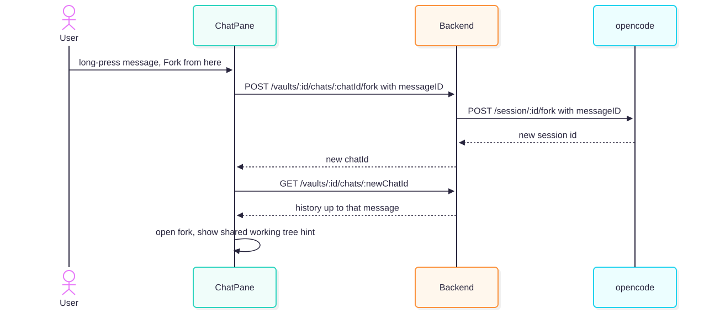

- opencode already supports it: `POST /session/:id/fork` with `messageID` copies the session up
  to that message.
- New backend route (proposed `POST /vaults/:id/chats/:chatId/fork` `{messageID}`) passes the
  vault root as `directory` and returns the new `chatId`; the fork then appears in
  `GET /vaults/:id/chats` like any other chat.
- Title: "Fork of <original title>", editable later.
- UI: message menu on user and assistant messages in `apps/web/src/components/ChatPane.tsx`,
  then `setChatId(newId)`; the hint banner reuses the existing `.banner` style.
- No git involvement: forking never touches the working tree.

### Why it's worth it

Queries are exploratory: the same set of sources can be synthesised as a comparison table, a
timeline or an essay, and it is often only clear after the answer which angle works. Forking keeps
the good context (which pages were read, what was clarified) without re-asking, which is cheap on
tokens and fast on a phone.

### Caveats & open questions

- A fork copies the conversation, not the files: both chats share one working tree, and the UI
  must say so clearly.
- The vault lock still allows one running turn per vault, so parallel forks queue.
- Should forks be grouped under their parent in the chat list?

### Prior art

| Project | What they do |
|---|---|
| [LibreChat fork](https://www.librechat.ai/docs/features/fork) | Fork a conversation from any message, with options for which branches to keep. |
| [AnythingLLM mobile](https://github.com/Mintplex-Labs/anythingllm-mobile) | Mobile chat client for AnythingLLM workspaces and threads. |

---

## Appendix A: Researched but not filed

| Idea | Seen in | Why not now |
|---|---|---|
| Focus / typewriter mode | [iA Writer](https://ia.net/writer/support/editor/focus-mode), [Typora](https://support.typora.io/Focus-and-Typewriter-Mode/) | Nice for long-form writing, but the wiki is mostly written by the LLM. Cheap to add later. |
| iPad hardware-keyboard shortcut sheet | [Working Copy](https://workingcopyapp.com/users-guide) | Partly covered by the quick switcher (6). Which key combinations reach an installed PWA still needs checking on a device. |
| Offline editing queue | [GitJournal](https://github.com/gitjournal/gitjournal) | The MVP decided offline = read-only. iOS has no Background Sync, which makes divergence risky. |
| Commit to branch + open PR | [GitHub Mobile](https://github.blog/news-insights/product-news/file-editing-on-github-mobile-keeps-leveling-up/) | Adds a dependency on the GitHub API and branch state. Per-turn review (3) and plan mode (8) address the same trust need. |
| Publish the wiki as a static site | [Quartz](https://quartz.jzhao.xyz/), [Flowershow](https://flowershow.app/) | Works today with no app change (a CI job on push). Only a scaffolding helper would be new. |
| Audio overviews, flashcards, quizzes | [NotebookLM](https://support.google.com/notebooklm/answer/16212820?hl=en), [Recall](https://www.recall.it/active-recall-and-spaced-repetition) | The text versions can already be done with a skill plus slash commands (1). TTS needs a new provider and a player. |
| Memory blocks | [Letta](https://docs.letta.com/guides/core-concepts/memory/memory-blocks) | The wiki plus `AGENTS.md` already plays this role. |

## Appendix B: Platform facts that constrain the design

| Capability | iOS Safari / installed PWA | Source |
|---|---|---|
| Web Share Target | ❌ (WebKit bug open since 2019) | [WebKit 194593](https://bugs.webkit.org/show_bug.cgi?id=194593), [MDN](https://developer.mozilla.org/en-US/docs/Web/Progressive_web_apps/Manifest/Reference/share_target) |
| Web Speech recognition | ❌ in installed PWAs (Safari tab only) | [whatpwacando.today](https://whatpwacando.today/speech-recognition/) |
| `<input capture>` camera/mic | ✅ | [caniuse](https://caniuse.com/html-media-capture) |
| Background Sync | ❌ | [caniuse](https://caniuse.com/background-sync) |
| Web Push + Badging | ✅ iOS 16.4+, Home-Screen apps only | [WebKit blog](https://webkit.org/blog/13878/web-push-for-web-apps-on-ios-and-ipados/) |
| VirtualKeyboard API | ❌ (Chrome Android only); use `visualViewport` | [MDN](https://developer.mozilla.org/en-US/docs/Web/API/VirtualKeyboard) |

## Appendix C: opencode endpoints that make many features cheap

`GET /command`, `POST /session/:id/command` (1) · `GET /session/:id/diff?messageID=`, `POST /session/:id/revert` / `unrevert` (3) · `plan` agent + `POST /session/:id/permissions/:permissionID` (8) · `GET /find/file` (10) · `GET /config/providers` + per-message `model` (21) · message `tokens`/`cost`, `POST /session/:id/summarize` (22) · `POST /session/:id/fork` (30). Source: [opencode server docs](https://opencode.ai/docs/server/), [SDK](https://opencode.ai/docs/sdk/).
