:::tldr
**Status: done.** This design was built as the [**md2html** plugin](https://github.com/tillg/till-claude-code-marketplace/tree/main/plugins/md2html) in [`tillg/till-claude-code-marketplace`](https://github.com/tillg/till-claude-code-marketplace) (spec: [`specs/changes/add-md2html-plugin/`](https://github.com/tillg/till-claude-code-marketplace/tree/main/specs/changes/add-md2html-plugin)). This repo uses it through the plugin's skills only (`/md2html:write`, `/md2html:build`): the reports under `specs/` are Markdown, configured in `reports.json`, themed by `specs/reports-theme.css`. Open: the interactive feature report still uses its own builder.

**Short answer: write reports in Markdown and add a small build step that turns each `.md` into today's HTML layout. The build is a pure function: the same inputs always produce the same bytes. Each project brings its own CSS file and nothing else.**

1. **Today every report is hand-written HTML**, with the layout rules from `CLAUDE.md` retyped each time. Three of the four reports are HTML only. The one generated report (`feature-report`) uses a single-use 29 KB script. Markdown is shorter to write, much cheaper for the AI to edit, and easier to review in a diff.
2. **Most of the layout can be derived.** The title, header block, section numbers, table of contents, table frames and figures all follow from plain Markdown plus frontmatter. Only the TL;DR card, cards and verdict pills need new syntax, and three small directives cover them.
3. **"Different projects, different CSS" is enough**, and it is the simplest design: one fixed HTML template with stable class names, plus a per-project `theme.css` that sets tokens and may restyle components. No templating language and no plugin API.
4. **Determinism is manageable** if the build never reads the clock, the network or file modification times, and if Mermaid SVGs are treated as committed inputs rather than being re-rendered on every build.
5. **W12 has already solved most of the format questions**, for a much larger product: content uses directives only (no raw HTML), there is one registry of directives, unknown directives fall back to literal text, the written form is canonical, and 91 golden round-trip fixtures test it. We copy those rules, not its editor. [§6](#w12)
6. **Writing it correctly** is handled in three layers, all generated from that registry: a skeleton command, a cheat sheet and a `write-report` skill *prevent* errors; a linter with `file:line` messages, run by a hook after every AI edit, *detects* them; `fmt` *fixes* fence colons and attribute order automatically. [§7](#guide)

**Recommendation:** build [a \~300-line Node tool on unified/remark](#reco) as its own small package. Then prove it by converting `browser-only-report` and checking that the rebuilt page looks the same. Keep interactive reports such as `feature-report` on an escape hatch (a report-local script) rather than growing the core.
:::

## What we want to do {#want}

- **Markdown is the source of truth.** Humans and the AI write and edit `report.md`. The `report.html` next to it is generated and never edited by hand.
- **Same layout for free.** The generated page follows the house layout (menu bar, title with icon, header block, subtitle, TL;DR, TOC, numbered sections, appendix) without anyone retyping it.
- **Deterministic.** Same `.md`, same diagrams, same CSS and same tool version give byte-identical HTML. Rebuilding with no changes leaves the git diff empty, so CI can fail when a committed HTML file is stale.
- **Stylable per project.** karpathy.app reports look like karpathy.app. Another repo using the same tool gets its own look from its own CSS.
- **Readable without the build.** The `.md` should still read well on GitHub, in Obsidian and in this app's own editor.

**Non-goals:** a static-site generator (no routing, no dev server, no blog features), WYSIWYG editing, and interactive widgets in the core.

## Where we are today {#today}

| Report | Source | How the HTML is made |
| --- | --- | --- |
| Features (#02) | `feature-report.md` (182 KB) | :verdict[generated]{tone="partial"} by a report-specific `marked` script with inline CSS and JS (filters, stars, scatter chart); 265 KB of HTML |
| Browser-only (#03) | none | :verdict[hand-written]{tone="no"} HTML; research notes in `.md` |
| V1 plan (#04) | none | :verdict[hand-written]{tone="no"} HTML |
| Prod environment (#05) | none | :verdict[hand-written]{tone="no"} HTML; notes in `notes-*.md` |

Each hand-written report copies the same \~55 lines of CSS. The shared parts that already exist (the menu bar and header-block styles) are injected at runtime by `reports-nav.js`. Every change to the house layout means editing N files. For the AI, editing a report means reading and rewriting HTML, which costs about 1.5× the tokens of the same content in Markdown. The feature report shows this: 182 KB of Markdown against 265 KB of HTML.

## The source format {#source}

A report is plain GitHub-flavored Markdown plus a frontmatter block and three directives. The build derives everything else.

```
---
title: "Browser-only karpathy.app: can we drop the server?"
created: 2026-09-27
edited: 2026-09-28          # written by hand (or by the AI), never taken from the clock
status: research            # research | ongoing | implemented
subtitle: Architecture report for [spec #03](browser_only.md). Research only …
---

:::tldr
**Short answer: yes, technically, but it costs more than it saves.** …

**Recommendation:** keep the server architecture for V1.
:::

## Today: who calls whom {#today}


| Concern | Today | Browser-only |
|---|---|---|
| Sync | `git` CLI | `isomorphic-git` :verdict[works]{tone=go} |

::::cards
:::card{title=Pros}
Truly no server to run.
:::
:::card{title=Cons}
No git history on the device.
:::
::::
```

| Layout element | Comes from | New syntax? |
| --- | --- | --- |
| Reports menu bar | the list of reports in `reports.json` | :verdict[none]{tone="go"} |
| Title + app icon | `title` frontmatter, icon from project config | :verdict[none]{tone="go"} |
| Header block (Created / Last edited / Status) | frontmatter | :verdict[none]{tone="go"} |
| Subtitle | `subtitle` frontmatter (inline Markdown) | :verdict[none]{tone="go"} |
| Numbered `<h2>` sections | `##` headings, numbered by the build | :verdict[none]{tone="go"} |
| Table of contents | the `##` headings, added once the report has 4 or more of them | :verdict[none]{tone="go"} |
| Stable anchors | `{#id}` after a heading; slug as fallback | :verdict[attribute]{tone="partial"} |
| Scrolling table frame | every GFM table | :verdict[none]{tone="go"} |
| Figure + caption + `.mmd` source link | an image on its own line; alt text = caption; `.mmd` looked up next to the `.svg` | :verdict[none]{tone="go"} |
| TL;DR card | `:::tldr` container | :verdict[directive]{tone="partial"} |
| Cards | `::::cards` / `:::card` | :verdict[directive]{tone="partial"} |
| Verdict pills | `:verdict[text]{tone=go\|partial\|no}` | :verdict[directive]{tone="partial"} |

The directives follow the [generic directives proposal](https://talk.commonmark.org/t/generic-directives-plugins-syntax/444) (`remark-directive`). On GitHub and in Obsidian they show up as literal `:::tldr` lines, which is ugly but readable. That is the price of any extension syntax. Keeping the set to three directives keeps it small. Every directive has a closed set of attributes and values, following W12: an unknown name or value is a build error in `--check` and literal text in the output, never silently dropped ([§6](#w12)).

## How the build works {#how}



1. **Parse** Markdown into an AST (mdast) with GFM tables, frontmatter, directives and heading attributes.
2. **Transform** the AST, one small function per rule: number the `##` headings and give them ids, collect the TOC, wrap tables, turn image-only paragraphs into `<figure>`, map directives to `<div class="tldr">`, `.cards`/`.card` and `<span class="v go">`, and rewrite links to other reports from `.md` to `.html`.
3. **Render** into one fixed template: head, menu bar, header, TL;DR, TOC, body, appendix. The CSS is inlined, so each report is a single file that works over `file://`, on GitHub Pages, as an email attachment, or published as an artifact.
4. **Write** the file only if its bytes changed. `just reports` builds everything, `just reports --check` fails when any HTML file is stale (for CI and a pre-commit hook), and `--watch` rebuilds on save.

The menu bar should be rendered at build time instead of by `reports-nav.js` at runtime. That way it works without JavaScript and no longer flashes in after load. The catch is that adding a report changes every page, but they are all regenerated anyway.

## Tool options {#tools}

| Option | Fit | Why |
| --- | --- | --- |
| **unified** (remark → rehype) in Node | :verdict[recommended]{tone="go"} | A real AST, so every layout rule is a small, testable transform. Maintained plugins exist for GFM, frontmatter, directives and slugs. Same language and toolchain as the repo (npm workspace, TS). Output is deterministic when versions are pinned. |
| **markdown-it** + plugins | :verdict[fine]{tone="go"} | Fast and simple, with a `container` plugin for directives. The token stream is less convenient than an AST for moving whole sections (TOC, TL;DR). |
| **marked** (today's generator) | :verdict[partial]{tone="partial"} | Already in the repo, but the renderer hooks work one node at a time. The feature report shows the result: section logic done with regexes over raw Markdown. |
| **Pandoc** + Lua filters + HTML template | :verdict[partial]{tone="partial"} | Very capable, with fenced divs (`::: tldr`) and attributes built in, and deterministic. But it is an external Haskell binary to install on every machine and in CI, and the filters are in Lua. |
| **Quarto**, **Astro**, **11ty**, **MkDocs** | :verdict[no]{tone="no"} | Site generators with their own layout model, theming system and runtime. Much more than we need, and bending them to the house layout costs more than writing the transforms. |

## Borrowed from W12 {#w12}

W12 is a self-hosted Jira and Confluence replacement. Its wiki stores every page as **canonical Markdown plus `remark-directive`**, with no JSON shadow copy (ADR-012). It is edited in Milkdown and round-tripped through a CLI and a Confluence importer. Our report format is a very small subset of that problem. W12 has already hit most of the pitfalls, so we take its rules and leave its editor.

### What we adopt

| W12 rule | How it works there | For our reports |
| --- | --- | --- |
| **Directives only, no HTML islands** (ADR-056) | Everything beyond GFM is a directive. Stray HTML is shown as escaped text, never rendered. | :verdict[adopt]{tone="go"} No raw HTML in reports. Every layout element goes through a directive and the theme. |
| **One registry keyed by (type, name)** | `extensionRegistry.ts`: each extension declares its directive type, an attribute schema (string / boolean / enum) and allowed children, and has its own folder with a required round-trip test. | :verdict[adopt]{tone="go"} One small entry per directive: `{type, attrs, render, text}`. The build, the `--check` linter and (later) the app's editor preview all read the same table. |
| **Unknown means literal text** | `directiveFallback.ts`: an unregistered or invalid directive is written back as its exact source bytes, sliced by AST position. This fixed a 21.6% blank-page rate caused by prose like `16:00` or `:443` being parsed as directives. | :verdict[adopt]{tone="go"} This matters for us too: reports are full of ports, times and ratios. Never drop content; warn in `--check`. |
| **Closed values, defaults omitted** | `:status[In Progress]{colour="green"}`, where `grey` is the default and is never written. Colours come from a closed `hue-step` grammar resolved in one function to `var(--palette-…)`. Attributes are written in a fixed order. | :verdict[adopt]{tone="go"} `:verdict[works]{tone=go}` uses a closed tone set that maps in one place to CSS classes. A `fmt` step could rewrite a report's Markdown into canonical form. |
| **Nesting: accept anything, restrict when authoring** (ADR-044) | The parser never rejects. Only "only X inside Y" constraints are in the schema (`columns` holds `column+`). | :verdict[adopt]{tone="go"} `::::cards` holds `:::card+`. Anything else renders but warns. |
| **Closed frontmatter** | Six required keys and a closed set of optional ones. Unknown keys are rejected. Export writes keys in a fixed order. | :verdict[adopt]{tone="go"} `title, created, edited, status, subtitle` plus optional `script`. A typo like `stauts:` fails the build instead of being ignored. |
| **Byte-stable round trip** | After the first save, `stringify(parse(x)) === x`. There are 91 golden fixtures in `fixtures/cycle-2/`, plus a per-extension test. | :verdict[adopt]{tone="go"} The same idea, applied to `.md → .html`: one golden fixture per directive and edge case. |
| **Same outer fence with more colons** | `::::columns` / `:::column`, and `:::tabs` / `:::tab{title="…"}`. | :verdict[adopt]{tone="go"} Already used for `::::cards`. |
| WYSIWYG editor as the renderer | The read view is Milkdown in read-only mode, not a remark→rehype pipeline. | :verdict[skip]{tone="no"} We need static, JS-free HTML, and karpathy.app deliberately edits raw Markdown in CodeMirror. |
| Palette JSON → CSS variables | ADR-020: theme files are data, and one function writes a fixed set of `--token` names in OKLCH at fixed precision. | :verdict[partly]{tone="partial"} We keep plain CSS but take the closed token list ([§8](#theme)). |

### Syntax taken over, where we need the same thing

```
:::tldr                         ← container, body is Markdown
::::cards                       ← outer fence gets one more colon
:::card{title=Pros}
:::
::::
:verdict[works]{tone=go}        ← inline: label + closed tone (W12's :status pattern)
:::collapse{title="Raw data"}   ← W12's collapse, if a report needs one
:::
```

### Pitfalls W12 documented (`specs/learnings/`)

- **Don't regex over Markdown.** Attribute order differs between writers (the CLI and the editor), so substring matches break. Hand-scanning for code spans and fences is also wrong; use the remark AST and its `position` offsets. Our `build-report-html.mjs` uses regexes over the raw Markdown today, so this lesson applies directly.
- **Colons in prose get parsed as directives.** Escape digit-colons when writing, and fall back to literal text when reading.
- **A container's closing fence after a list** can come out indented. It needs its own fixture.
- **Only serializer options that actually get used count.** Milkdown bypassed the package's `remark-stringify` options. For us: pin one pipeline and test the real CLI output, not a helper.
- **Patch dependencies only with version pins that fail loudly.** W12 patches `micromark-extension-gfm-table` because large tables parsed in quadratic time, and the patch script fails on a version mismatch. That matters if reports get big tables.

**Not documented in W12:** how the directive format looks on GitHub or in Obsidian. Their other non-editor renderer (email, in Java) turns block directives into labelled code boxes. That is a fair model for what "readable fallback" means, and we still have to check it ourselves.

## Helping humans and the AI write it correctly {#guide}

The `:::` syntax has three traps:

- A fence that is never closed swallows the rest of the file.
- Nested fences need one more colon on the outer fence.
- A misspelled name (`:::tdlr`) is not an error to any Markdown parser.

The answer is the same for people and for the AI: **prevent** mistakes where the text is typed, **detect** them with precise messages, and **fix** the mechanical ones automatically. All three layers are generated from the single directive registry ([§6](#w12)), so the docs, the autocomplete and the checks can't drift apart.

| Layer | For the human | For the AI |
| --- | --- | --- |
| **Start right** | `just report new <slug>` writes a skeleton: frontmatter with today's date and `status: research`, a `:::tldr`, and the standard section headings. | The same command. The skill says to always start there rather than write the frontmatter from memory. |
| **Know the syntax** | A one-page cheat sheet, `reports syntax`, generated from the registry. It lists each directive, its attributes and allowed values, and a copy-paste example. A **kitchen-sink report** uses every directive once and doubles as a golden fixture. | A `write-report` skill (`.claude/skills/write-report/SKILL.md`). Claude Code *and* opencode both load `.claude/skills`. It embeds the cheat sheet and the workflow *write → check → fix*. `CLAUDE.md` gets a one-line pointer to it instead of today's layout paragraph. |
| **While typing** | In karpathy.app's CodeMirror editor, the registry drives: autocomplete after `:::` and `{` (names, then attributes, then allowed values), a snippet that inserts the matching closing fence, fence highlighting and folding, and in-place previews of TL;DR, cards and pills. In VS Code: a snippets file plus a JSON Schema for the frontmatter. | No editor involved. The AI gets the equivalent through the skill's examples and the check below. |
| **Catch mistakes** | `just reports --check` reports errors with `file:line:col` and a suggestion. Inline squiggles in the editor come from the same linter. | A **Claude Code `PostToolUse` hook** runs the check on every edited `specs/**/*.md` and returns the messages, so the AI fixes its own errors in the same turn. On opencode, the skill tells it to run the check. |
| **Fix automatically** | `just reports fmt` rewrites the file into canonical form: colon counts per nesting depth, attribute order, defaults removed, frontmatter key order. | The same. The skill says to run `fmt` before `check`, so the AI never has to count colons. |
| **Backstop** | A pre-commit hook and CI run `fmt --check` and `reports --check`. A stale HTML file or an invalid directive cannot land on `main`. | |

### A `/` menu in the editor (as in W12) {#slash}

W12's editor opens a local menu on `/` that lists the available blocks. The registry entries carry the menu data for it: `keywords`, `displayOrder`, `surfaces`, `insertCommand`. **Yes, karpathy.app should have this.** It is the most direct answer to "how does a human know which `:::` constructs exist?" It is also cheap:

- The editor is CodeMirror 6 (`apps/web/src/lib/cm.ts`).
- A slash menu there is one completion source for `@codemirror/autocomplete`, a new but first-party dependency.
- Its `snippet()` templates insert text with tab stops.
- It fits the chat's slash commands (feature [F01](../02_features/feature-report.html#01-slash-commands-and-one-tap-skill-chips-in-the-chat)), so `/` means "insert something" everywhere in the app.

```
## Options
Sync works through the API /│
          ┌───────────────────────────────┐
          │  Cards        ::::cards       │  ← blocks allowed here; typing "/ca" filters by label + keywords
          │  Card         :::card         │
          │  Verdict      :verdict[...]   │
          │  Table        | a | b |       │
          └──────────── ↑↓ Enter · Esc ───┘
→ Enter inserts:
::::cards
:::card{title=Pros}                  ← first tab stop; Tab jumps into the body
│
:::
::::
```

| Design point | Proposal |
| --- | --- |
| What it inserts | Raw Markdown text, never a hidden widget. It is the same text a human or the AI would type, already in canonical form (colon count right for the current nesting depth), so `fmt` has nothing to do. |
| Where the entries come from | The same registry: each entry gets `menu: {label, icon, keywords, snippet}`. The menu, the cheat sheet, the lint rules and the AI skill can't disagree. |
| Which entries show | Per file and per vault. For a **report** (a repo with a `.remarkrc` / reports preset, or report frontmatter): the directives plus generic blocks (table, Mermaid figure, image). For an ordinary **vault note**: no directives, because Obsidian doesn't render them. Offer Obsidian-native items instead: callout `> [!note]`, `[[link]]`, table, task, frontmatter property. |
| When `/` triggers | Only at the start of a line or after whitespace, and never inside code, fences or links. `and/or`, `specs/06` and URLs stay untouched. `Esc`, or `/` followed by a space, types a literal slash. |
| Selected text | If text is selected, containers **wrap** it (`:::tldr` around the selection) and inline items use it as the label (`:verdict[selection]{tone=go}`). |
| Nesting | Inside `::::cards`, `:::card` is listed first. Items the lint would reject there are hidden, using ADR-044's "restrict while authoring" rule. |
| iPad / phone | Typing `/` needs a keyboard layer switch on iOS, so the Markdown toolbar ([F07](../02_features/feature-report.html#07-markdown-toolbar-above-the-on-screen-keyboard)) gets a **+** button that opens the same menu. |
| Afterwards | In-place previews render the inserted block, and lint squiggles show if an attribute value is wrong. |

**Effort:** small. It needs one completion source, the registry export in a form the frontend can import, and an entry per directive. The per-vault switch (report vs. note) is the only real design decision. :verdict[recommended]{tone="go"} as the first editor-side piece of this work, and it is useful even before the HTML build exists, because vault notes get the Obsidian-native entries.

### Treat it like ESLint + Prettier: `lint` and `fmt` as standard processes {#lintfmt}

Code already works this way: ESLint finds problems, Prettier rewrites layout, and both run in the editor, in hooks and in CI. Reports should get the same pair. The unified ecosystem already provides both halves. **`remark-cli`** lints (`remark-lint` rules) *and* formats (`remark-stringify` with `-o`). It reads the same plugin chain as our build, so the tool is mostly a **remark preset** rather than a program:

```
// .remarkrc.mjs: one per project (like the theme.css)
import reports from '@karpathy/reports/preset'      // gfm + frontmatter + directive + registry
export default {
  plugins: [
    reports,                                          // parse + canonical stringify settings
    ['reports/lint-directives', 'error'],            // unknown name / attr / value, unclosed fence, bad nesting
    ['reports/lint-frontmatter', 'error'],           // closed key set, ISO dates, status enum
    ['reports/lint-links', 'error'],                 // #fragments and relative files resolve
    ['remark-lint-no-undefined-references', 'warn'], // a stock rule, severity chosen per project
  ],
}
```

| Process | Writes files? | Command | Runs where |
| --- | --- | --- | --- |
| **fmt** (the "Prettier") | yes | `just reports fmt` = `remark specs -o` | Format on save (`vscode-remark` language server; later CodeMirror in the app), the AI hook, pre-commit |
| **lint** (the "ESLint") | no | `just reports lint` = `remark specs --frail` | Squiggles in the editor, the AI hook, pre-commit, CI |
| **build** | yes (HTML) | `just reports build` | On demand, `--watch` while writing |
| **check** (CI) | no | `fmt --check && lint && build --check` | CI and `just check`, next to `npm run lint` |

**Order:** always `fmt → lint → build`. Formatting first means lint never complains about things a machine can fix, the same split as `eslint-config-prettier`. The AI hook runs `fmt` and `lint` on the edited file and returns only the lint messages that are left.

**Rules for the formatter** (it rewrites human text, so it must be conservative):

- **Lossless and idempotent:** `fmt(fmt(x)) === fmt(x)`, and the rendered HTML is identical before and after `fmt`. Both are golden tests.
- **Never re-wrap prose** (no line-length reflow). It normalizes only fence colons, attribute order and quoting, defaults, frontmatter key order, list markers, and blank lines around blocks.
- **Scoped to reports** (`specs/**`), never to vault content the app edits. Vault notes belong to Obsidian and the user (see `CLAUDE.md` → Language).
- **One-time noise:** the first run will change bullets and escaping in existing `.md` files. Do that in its own commit, as with introducing Prettier.

**Alternatives:**

- `@eslint/markdown` would put Markdown into the existing `npm run lint`. It is not verified whether it can be taught directives.
- `markdownlint` and **Prettier** don't know directives. Prettier's Markdown formatter could rewrite `:::` blocks, so it must not touch reports (`.prettierignore`) if it is ever added. `remark-cli` is the only one that shares the parser with the build, so lint, format and render can't disagree.

### What a good error message looks like

Both audiences fix things fastest when the message names the place, the rule and the fix. For the AI, the message *is* the documentation it sees at the moment it matters.

```
specs/06_md_to_html/md-to-html-report.md:14:1  unknown directive ":::tdlr". Did you mean ":::tldr"?
specs/06_md_to_html/md-to-html-report.md:41:1  ":::card" opened here is never closed (file ends at line 212)
specs/06_md_to_html/md-to-html-report.md:57:22 ":verdict" tone="yes" is not allowed. Use go | partial | no
specs/06_md_to_html/md-to-html-report.md:3:1   frontmatter: unknown key "stauts". Did you mean "status"?
specs/06_md_to_html/md-to-html-report.md:88:1  ":::card" must be inside "::::cards" (renders, but check fails)
```

Checks that go beyond syntax:

- A `#fragment` that doesn't resolve.
- A figure without alt text.
- A `.svg` without its `.mmd` next to it.
- `edited` older than `created`.
- A `:::tldr` missing from a report with more than one section.

### A lighter syntax where it already exists

For single blocks there is a native alternative: Obsidian's callout syntax. `> [!tldr]` renders as a styled box in Obsidian, and on GitHub it falls back to a plain blockquote. `:::tldr` degrades worse: GitHub shows it as literal text. The catch: callouts don't nest well, so cards would still need `:::`, and two block syntaxes are harder to learn than one. :verdict[recommendation]{tone="partial"} Use `:::` only. When the linter sees `> [!tldr]`, it suggests `:::tldr` and `fmt` converts it.

## Per-project design: just CSS {#theme}

The template and class names are fixed and shared by every project. A project changes the design only through its CSS. That gives three levels, and each project goes only as far as it needs:

::::cards
:::card{title="1. Tokens (most projects)"}
Override custom properties on `:root`, plus the dark-mode block: `--bg`, `--fg`, `--accent`, `--font`, `--radius`, the `--go/--partial/--no` pill colors, and so on. Ten lines give a different look.
:::

:::card{title="2. Component CSS"}
Restyle the stable classes (`.tldr`, `.card`, `.v`, `figure`, `nav.toc`, `h2`) to change shapes, spacing or type. For example, a TL;DR bar in the accent color instead of a card.
:::

:::card{title="3. Config, not templates"}
The few things CSS can't do go in `reports.json` as data: the icon path, the brand name in the menu bar, and the language. Projects get no template overrides, so the class contract stays the whole API.
:::
::::

```
/* other-project/reports/theme.css: a complete theme */
:root { --accent: #0a7d6f; --font: "Iowan Old Style", Georgia, serif; --radius: 4px; }
@media (prefers-color-scheme: dark) { :root:not([data-theme="light"]) { --accent: #5fd3c2; } }
:root[data-theme="dark"] { --accent: #5fd3c2; }
.tldr { border-left: 4px solid var(--accent); border-radius: 0; }
```

The build emits `base.css` (shipped with the tool: layout, tokens with the current Apple-like defaults, both color schemes, phone width), then the project's `theme.css`, in `@layer base, theme`. The project always wins without specificity fights. A project with no `theme.css` gets today's design.

**What this means:** the class names and token names become a public contract. Renaming one breaks other projects' themes, so the contract needs a version and a short list in the tool's README. A project that truly needs a different structure (say, a sidebar TOC) is a signal to add an option to the shared template, not to fork it.

**From W12's palette pipeline (ADR-020):** W12 keeps its theme as data (`light.json` / `dark.json` with 15 semantic tokens), and one function writes the CSS variables. It fails on a missing token and never invents variable names. We keep plain CSS as the theme format because it is simpler and allows level 2, but borrow the **closed token list**: the build warns when a `theme.css` sets a custom property that isn't in the contract (usually a typo). Pills stay "label + colour, never colour alone", as in W12's DESIGN.md.

## Determinism {#determinism}

| Source of drift | Rule |
| --- | --- |
| Clock (`new Date()`, "generated at") | Never read it. *Created* and *Last edited* come from frontmatter only. The AI updates `edited` when it edits the content, as it does today. |
| File modification times, git log | Not used. They differ between clones and for uncommitted work. |
| Absolute paths, machine names | All paths in the output are relative to the report. |
| Locale, time zone | Dates stay ISO strings as written. No `toLocaleString`. |
| Iteration order | Sort directory listings and the report list explicitly. |
| Dependency versions | Exact versions and a lockfile. The tool version is printed in a `<meta name="generator">`, so a version bump shows up as a diff. |
| Line endings, Unicode | Normalize input to LF and NFC. Output uses LF with a final newline. |
| **Mermaid** | Rendering runs headless Chromium, and font metrics differ between machines, so SVG bytes are not stable. Treat the `.svg` as a committed input: re-render only when the `.mmd` changed (by content hash), and never inside the HTML build. |
| Network (CDN fonts, runtime Mermaid) | None at build time. At view time, only the optional local fonts in the theme. |

**Test:** golden files (fixture `.md` → expected `.html`) for each transform, plus a CI job that builds all reports twice in a clean checkout and compares hashes, then runs `--check` against the committed files.

## Challenges {#hard}

### Expressiveness vs. plain Markdown

The reports use rich elements: TL;DRs with numbered reasons, cards, pills inside tables, and anchors to sub-options. Every element we add costs new syntax that renders badly everywhere else. The rule has to be **derive first, directive second, never raw HTML**. W12 went the same way (ADR-056, "no HTML islands"): raw HTML in the source is shown as escaped text, so every element goes through the theme and there is no injection path. If something can't be expressed, it earns a new directive in the registry.

### Interactive reports

`feature-report` has filters, a shortlist in `localStorage`, a sortable table and a scatter chart. A static converter will never cover that, and it shouldn't. Escape hatch: a report can declare `script: feature-report.js` in its frontmatter, and the build inlines that script after the generated DOM. The script then enhances the stable markup. Data comes from the Markdown itself (tables, a fenced `json` block), not from regexes over the source.

### Migrating the existing reports

Three reports exist only as HTML. Options: convert them once (turndown gets most of the way, then clean up the cards and pills by hand), or freeze them as legacy HTML and only write new reports in Markdown. Converting all three is maybe an hour each and buys a single editing workflow, so it is worth it. `browser-only-report` is the natural pilot because it is the layout reference.

### Tool location and reuse across projects

For other projects to use the tool, it can't live in `specs/`. Options: its own repo published as an npm package (`npx`-able), a git submodule, or copy-paste. An npm package with a pinned version fits best. Each project then has only `reports.json`, an optional `theme.css` and its `.md` files.

### Links and anchors

Links from one report to another must point to `.html` in the output while staying `.md` in the source, so they also work on GitHub. Links to research notes stay `.md`. Heading slugs change when a title is edited and silently break deep links. Explicit `{#id}` on sections that others link to avoids that, and the build can check that every `#fragment` resolves.

### The generated HTML stays in git

Committed output means double diffs and possible drift. Not committing it means GitHub, `file://` and phone viewing need a build first. Commit it, and let the `--check` step in CI (and optionally a pre-commit hook) catch stale files.

### The AI has to follow the new workflow

The `CLAUDE.md` rules change from "write HTML with this layout" to "write `report.md` with this frontmatter, run `just reports`". That is shorter and harder to get wrong, but the old rule must be removed or the AI will keep hand-writing HTML.

## Recommendation and next steps {#reco}

1. **Build the core**: a Node CLI on unified with `remark-gfm`, `remark-frontmatter`, `remark-directive` and `rehype-stringify`, plus a W12-style registry with one entry per directive (attributes, render, text fallback). Target size: about 300 lines, one fixed template, and `base.css` taken from today's reports.
2. **Pilot**: convert `browser-only-report` to Markdown, rebuild it, and compare the old and new pages in screenshots (light, dark, phone width).
3. **Lock in determinism**: golden `.md → .html` fixtures per directive (W12 has 91 for its format), a test that feeds prose colons (`16:00`, `:443`) through the build, the build-twice hash check, and `just reports --check` in CI.
4. **Prove theming**: a second `theme.css` (e.g. for another repo) with only token overrides, to validate the class contract.
5. **Migrate** `v1-plan` and `prod-env-report`, then move `feature-report` onto the core plus its report-local script, and retire `build-report-html.mjs` and the runtime `reports-nav.js`.
6. **Authoring support**: ship the tool as a remark preset so `fmt` and `lint` run through `remark-cli` ([§7](#lintfmt)), plus `just report new`, the `write-report` skill and the `PostToolUse` check hook ([§7](#guide)). In the karpathy.app editor, a `/` menu comes from the same registry ([§7](#slash)). For vault notes it can ship first, with Obsidian-native entries.
7. **Update `CLAUDE.md`** "Reports and docs" to the Markdown workflow. Then extract the tool into its own package once a second project uses it.

## Sources {#appendix}

- House layout rules: `CLAUDE.md` → "Reports and docs"; reference page [`browser-only-report.html`](../03_browser_only/browser-only-report.md)
- Existing generator: [`specs/02_features/build-report-html.mjs`](../02_features/build-report-html.mjs) (marked, report-specific)
- Shared runtime nav and header styles: [`specs/reports-nav.js`](../reports-nav.js)
- unified / remark / rehype: [unifiedjs.com](https://unifiedjs.com); directives: [remark-directive](https://github.com/remarkjs/remark-directive)
- Pandoc fenced divs and templates: [pandoc.org/MANUAL.html](https://pandoc.org/MANUAL.html)
- W12 (`../w12-free`): ADR-012 content storage, ADR-044 nesting, ADR-056 directive-only, ADR-020 palette pipeline (`specs/architecture/`); directive spec `specs/modules/editor.md`; registry `src/editor-schema/src/extensionRegistry.ts`, fallback `directiveFallback.ts`; golden fixtures `src/frontend/src/components/editor/__tests__/fixtures/cycle-2/`; lessons in `specs/learnings/`
- Diagram: `docs/diagrams/md-to-html-pipeline.{mmd,svg}`

Sizes measured in this repo on 2026-09-30. The tool comparison is desk knowledge, not spiked. The first build step should confirm the plugin choice.
