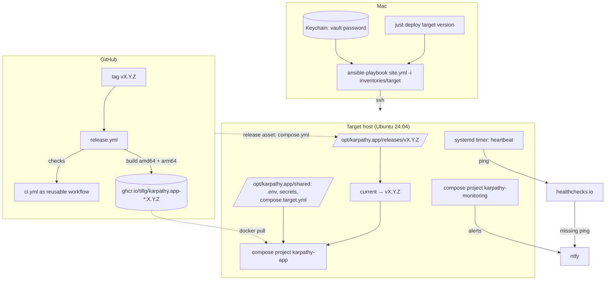
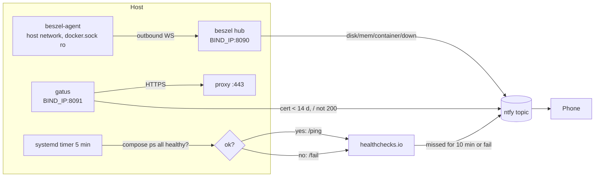
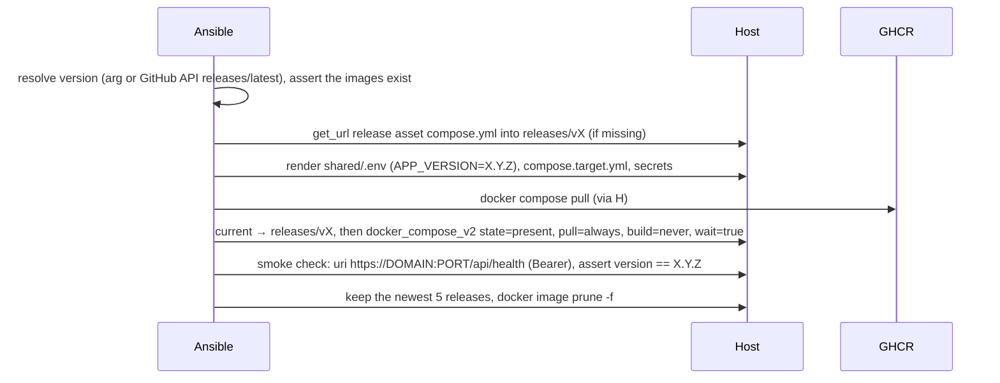

# Architecture: tag → GHCR → Ansible → target

## 1. Overview



Three parts, each with one job:

1. **Release workflow** (GitHub Actions) turns a tag into immutable images plus the matching
   `compose.yml`, attached to the GitHub release.
2. **Ansible playbook** (run from the Mac) brings a host to the desired state and switches it to a
   release.
3. **Monitoring** (on the host, plus a heartbeat to an outside service) tells the operator when it
   breaks.

## 2. Release workflow

`.github/workflows/release.yml`, on `push: tags: ['v*.*.*']`:

| Job | Runs on | Does |
|---|---|---|
| `check` | — | `uses: ./.github/workflows/ci.yml` (ci.yml gets `on: workflow_call`), plus, for final tags only, a guard that the tagged commit is on `main` (`git merge-base --is-ancestor $GITHUB_SHA origin/main`); `-rc.N` tags may be on any commit. No images without green checks. |
| `build` | matrix `image × arch`: `ubuntu-24.04` (amd64), `ubuntu-24.04-arm` (arm64) | `docker buildx build --push` by digest, with build arg `APP_VERSION=X.Y.Z`. Native runners on both arches, so no QEMU (free for public repos). |
| `manifest` | ubuntu-24.04 | `docker buildx imagetools create` → `:X.Y.Z` and `:latest` multi-arch manifests for each image. || `release` | ubuntu-24.04 | `gh release create vX.Y.Z --generate-notes deploy/compose.yml`: the release asset. Tags with `-rc.N` get `--prerelease`, so GitHub never marks them "Latest". |

- Images: `ghcr.io/tillg/karpathy.app-proxy`, `-backend`, `-opencode`. The packages are **public**
  (the repo is public), so hosts pull without credentials.
- **Pre-releases:** `vX.Y.Z-rc.N` tags are for testing the pipeline and the playbook, and may be cut
  from any commit, so a change can be tested on `local` before it's merged. They don't move the `:latest`
  image tag and are created as GitHub pre-releases, so `just deploy <target>` without a version (which
  asks for GitHub's "Latest") never picks one. They can still be deployed by name.
- **Permissions:** the workflow sets `permissions: { contents: write, packages: write }` (release +
  GHCR push with the built-in `GITHUB_TOKEN`). Every image gets the label
  `org.opencontainers.image.source=https://github.com/tillg/karpathy.app`, which links the GHCR
  package to the repo. The first push still creates the package as private; making it public is a
  one-time manual step (plan Phase 3).
- **One version string, no `v`:** the git tag is `vX.Y.Z`, but the image tag, `APP_VERSION` and the
  version the backend reports are all `X.Y.Z`. The workflow strips the `v` once
  (`${GITHUB_REF_NAME#v}`), so `image: …:${APP_VERSION}` in compose resolves to an image that exists.
- **Why the compose file is a release asset:** the images don't say how the stack fits together
  (services, volumes, secrets, networks, healthchecks), and a release can change that. Everything
  else a target needs is already baked into the images (the `Caddyfile` and the PWA in the proxy,
  `opencode.json` in opencode) or comes from the target settings. Attaching the file to the
  release keeps images and compose file together, and the host needs no git and no copy of the
  source. A raw `raw.githubusercontent.com/…/vX.Y.Z/deploy/compose.yml` URL would work too, but a tag
  can be moved later; the asset is what was published.
- The proxy image keeps `DNS_PROVIDER=cloudflare` baked in (§8.1 of the prod-env report). Another
  provider would need a separate image tag; not needed now.
- The backend reads `APP_VERSION` (baked in as `ENV`) and returns it from `GET /api/health`:
  `{ backend, opencode, version }`. Dev and prodtest images report `dev`. That's how the smoke check knows
  which release runs.
- arm64 is only needed for the `local` VM on Apple silicon; Hetzner CX23 is amd64.

## 3. Compose changes

`deploy/compose.yml` stays the one stack definition for dev, prodtest and every target. It gets:

```yaml
services:
  proxy:
    image: ghcr.io/tillg/karpathy.app-proxy:${APP_VERSION:-dev}
    build: { ... }                      # unchanged; dev and prodtest still build
    ports: ["${BIND_IP:-0.0.0.0}:${HTTPS_PORT:-443}:443"]   # no 80:80 (DNS-01)
    cap_drop: [ALL]
    cap_add: [NET_BIND_SERVICE]
    security_opt: [no-new-privileges:true]
    logging: *logs                      # json-file, 10m × 3
  backend:  { image: ...-backend:${APP_VERSION:-dev},  cap_drop: [ALL], security_opt: [...], logging: *logs }
  opencode: { image: ...-opencode:${APP_VERSION:-dev}, cap_drop: [ALL], security_opt: [...], logging: *logs }
```

`deploy/compose.dev.yml` gives `backend` and `opencode` their own local image names
(`karpathy-app-dev/backend`, `karpathy-app-dev/opencode`; the dev proxy already uses
`caddy:2.10-alpine`). Without that, the dev build (`target: dev`) and the prodtest build (prod target)
would both be tagged `ghcr.io/…:dev` in the same Docker daemon, and whichever built last would replace
the other's image.

On a target, Ansible starts it with `pull: always` and no build, so only the GHCR images are used.
Whatever is target-specific goes in a rendered `compose.target.yml`, which replaces the hand-written
`compose.hetzner.yml` from the runbook. Today that's only the `vaults` volume as a bind mount of
`/srv/vaults`.

`cap_drop: [ALL]` has to be checked against the dev and prodtest overrides and the containers'
needs. git and ripgrep need no capabilities, and the backend and opencode already run as uid 1000. If a
container needs one, it gets a `cap_add` with a comment.

## 4. Monitoring {#monitoring}

### 4.1 Requirements

Single user, 4 GB box with 1–1.5 GB already in use, no inbound ports, alerts to the phone via ntfy.
It must catch: disk full, memory pressure, a container down or restarting, the certificate not
renewed, and the **whole box gone**. Nothing on the box can report that last one, and nothing outside can
reach a Tailscale-only box, so it needs a **push heartbeat** to an outside dead-man's switch whatever
else is chosen.

### 4.2 The stack: Beszel + Gatus + healthchecks.io

Decided 2026-10-01. Versions and facts were checked that day against the projects' GitHub releases
and docs. The RAM figures are estimates.

| Part | Covers | RAM on box | Notes |
|---|---|---|---|
| **Beszel** hub + agent (MIT, v0.20) | host and container metrics, disk, memory, container health, system down | ~50–90 MB | Built-in alerts with native ntfy. The agent only connects outward to the hub. Very active project. |
| **Gatus** (Apache-2.0) | HTTPS reachability and certificate expiry | ~20–40 MB | Configured in one YAML file, which Ansible renders. Alerts on `[CERTIFICATE_EXPIRATION]`, native ntfy. |
| **healthchecks.io** (free plan, 20 checks) | the whole box gone, Docker hung, app down | ~0 (a curl from a timer) | Dead-man's switch outside the box, with ntfy built in. |

Together they use about 100 MB and every part is a container plus a template, so no third-party
Ansible roles are needed. What they don't give: log search (Dozzle can be added later) and long,
fine-grained metric history.

### 4.3 Setup



- A separate compose project, `karpathy-monitoring`, so that an app deployment never restarts the
  monitoring and vice versa.
- The hub and Gatus UIs listen on `BIND_IP` (the tailnet IP on Hetzner, or forwarded on the VM). They use plain HTTP inside
  WireGuard. A Caddy route with its own certificate would need a second DNS record, which isn't
  worth it for an operator-only page.
- **Disk: both filesystems are watched.** `/` (OS, Docker, images, logs) and `/srv/vaults` (the
  loop-mounted vaults filesystem, the one most likely to fill). The agent reports the second because
  `/srv/vaults` is mounted read-only at `/extra-filesystems/vaults` in the agent container. Beszel has
  **one** disk alert, which fires when the **fullest** of the two passes 80 %. Its message doesn't say which
  filesystem it is; the hub UI or `df` does.
- Beszel alerts: disk over 80 %, memory over 85 % for 10 minutes, a container `unhealthy`, the system
  down. A **stopped** container, or one without a healthcheck (the proxy), doesn't trigger
  ContainerHealth. The heartbeat's `/fail` catches those, and Gatus watches the proxy. Beszel's own cert
  alerting is unverified, so Gatus covers certificates.
- **Provisioning, all from Ansible (verified in the [Beszel spike](spikes/beszel/RESULTS.md)):**

  ```mermaid
  sequenceDiagram
    participant A as Ansible
    participant H as Beszel hub
    participant G as Beszel agent
    A->>H: start with USER_EMAIL/PASSWORD and the vault's id_ed25519 in /beszel_data
    A->>H: superuser login, PATCH user role = admin
    A->>H: universal-token enable=1, permanent=1, token = vault value
    A->>H: POST then PATCH user_settings: webhooks = ntfy URL (before any alert rule)
    A->>G: start with KEY (vault public key), TOKEN, SYSTEM_NAME
    G->>H: outbound WebSocket, registers itself
    A->>H: wait for system up, POST user-alerts (Disk, Memory, Status, ContainerHealth)
    A->>H: test-notification → ntfy
  ```

  The webhook must be set **before** the alert rules: a rule that's already over its threshold fires at the
  next agent update, and without a webhook that alert is lost. The hub fills in defaults for
  `user_settings` on create, so the role PATCHes it afterwards and checks the result. Gotchas: spike
  §"Gotchas for the Ansible role".
- Gatus checks `https://${DOMAIN}/` (expects 200) and the certificate expiry (alert when it's under 14 days). Caddy renews at
  30 days, so an alert means renewal failed. Gatus is off on `local`, which uses the internal CA.
- **Heartbeat:** a systemd timer checks every container of **both** compose projects, `karpathy-app` and
  `karpathy-monitoring`, and pings `hc-ping.com/<uuid>`, or `/fail` as soon as one isn't `running` and
  (if it has a healthcheck) `healthy`. This catches "Docker hung", "app down", a stopped container and a dead
  Beszel hub or Gatus. It's configured with a 5-minute period and a 5-minute grace.
- **Every app service has a healthcheck:** the proxy gets one in `compose.yml` (a plain-HTTP health
  endpoint Caddy answers inside the container), so Beszel's ContainerHealth alert covers it too.
- **ntfy topic:** ntfy.sh with a random 32-character topic name from the vault, no account. Anyone who
  knew the name could read and post to it; accepted, because alerts carry only system names and numbers,
  never note content (decision A10).
- **Risk accepted: the Beszel agent has the Docker socket.** Mounting `docker.sock` read-only
  doesn't limit the Docker API, so the agent (and anyone who takes it over) is effectively root on
  the host. Accepted for a single-user box, where the agent is an official image from a very active
  project and its only network connection goes out to the hub on the same host. If that changes, put a
  `docker-socket-proxy` with GET-only endpoints in front.
- Optional: Dozzle for reading container logs in the browser (MIT, about tens of MB). Not in the plan.


## 5. Ansible layout

```
deploy/ansible/
  ansible.cfg                  # inventory=inventories/local, pipelining, vault id script
  requirements.yml             # community.docker (≥5.3, docker_compose_v2), ansible.posix (mount)
  vault-pass-client.sh         # reads the target's vault password from the macOS Keychain (-client: Ansible passes --vault-id)
  deploy.sh                    # behind `just deploy` / `just deploy-check`: args → ansible-playbook, log to tmp/
  site.yml                     # all roles, in order
  inventories/
    local/hosts.yml            # karpathy-vm via Lima's ssh config
    local/group_vars/all/{main.yml,vault.yml}
    hetzner/hosts.yml          # karpathy (MagicDNS name)
    hetzner/group_vars/all/{main.yml,vault.yml}
  roles/
    base/        # deploy user (uid 1000), sshd hardening, unattended-upgrades, timezone
    tailscale/   # apt repo, tailscale up --authkey (tag:server, no expiry); skipped when tailscale_enabled=false
    docker/      # docker-ce + compose plugin from Docker's apt repo; drop-in "after tailscaled"
    vaults_fs/   # 20 GB loop-mounted ext4 at /srv/vaults (fstab via ansible.posix.mount)
    app/         # release compose.yml, shared files, compose up, smoke check, prune old releases
    monitoring/  # beszel hub+agent, gatus, heartbeat timer
```

### 5.1 Target settings

| Variable | `local` | `hetzner` |
|---|---|---|
| `tailscale_enabled` | false | true |
| `bind_ip` | `0.0.0.0` (Lima forwards to the Mac) | tailnet IP (`ansible_facts` of `tailscale0`) |
| `https_port` | 443, forwarded to `localhost:9444` | 443 |
| `domain` / `tls_mode` | `localhost` / `internal` | `app.karpathy.app` / `dns` |
| `vaults_fs_size` | 5G | 20G |
| `heartbeat_url` | optional: a separate healthchecks.io test check (heartbeat skipped when unset) | the real check |
| `gatus_enabled` | false (internal CA) | true |
| Ansible user | the Lima guest user (passwordless sudo) | `deploy` |
| `git_remote_base` | `file:///remotes/` (Mac's `tmp/dev/remotes`, mounted into the VM) | unset (GitHub) |
| `ntfy_topic` | a separate random test topic | the real random topic |
| vault secrets | **test values only**, still in an encrypted vault so both targets work the same way: generated bearer token, dummy GitHub and DNS tokens (local repos and the internal CA need none), Beszel secrets, optional LLM key | real tokens |

### 5.2 Release layout on the host and the app role

```
/opt/karpathy.app/
  releases/v0.3.0/compose.yml   # the release asset, downloaded with get_url
  releases/v0.2.0/compose.yml
  current -> releases/v0.3.0
  shared/
    .env                    # APP_VERSION, DOMAIN, TLS_MODE, BIND_IP, HTTPS_PORT, APP_UID/GID, git identity, model
    opencode.env            # provider key(s), 0600
    secrets/{bearer_token,github_token,dns_api_token}   # 0600
    compose.target.yml
```

Compose resolves `./secrets/…`, `./opencode.env` and `.env` relative to the project directory. The
role runs compose with `project_src: /opt/karpathy.app/shared` and the files
`current/compose.yml` + `shared/compose.target.yml` (`--project-directory shared -f …`), so those paths
point into `shared/` and nothing needs linking into a release directory. The project name is always `karpathy-app`, so the
named volumes (`config`, `opencode-data`, `caddy-data`) survive switching releases.

Order in the `app` role:



- `wait: true` blocks until every service is healthy; the compose healthchecks are already there.
- If the smoke check fails, the playbook fails and leaves `current` on the new release. It doesn't roll back
  automatically: you decide, and a rollback is just `just deploy <target> <previous>`.
- Data migrations: there are none (the config store is JSON). Once a release changes the volume
  format, rollback needs a note in that release.
- **The playbook is not part of the release.** Only `compose.yml` comes from the release. The
  playbook, its templates (`.env`, `compose.target.yml`, monitoring config) and the inventories always
  come from the Mac's current checkout. Deploying an older release, rollback included, means today's
  playbook against that release's `compose.yml`. The rule: **the playbook supports every release from
  the first one that ships with it.** A change that would break that (e.g. a template that sets
  variables an older `compose.yml` doesn't read, or misses ones it needs) has to stay backward compatible or carry a
  `when: app_version is version(…)` switch. The rollback check in plan Phase 5 deploys across a release
  pair whose `compose.yml` differs, so this is tested at least once.

### 5.3 Secrets

| Secret | Used by | On the host |
|---|---|---|
| Bearer token (app login) | backend | `shared/secrets/bearer_token` → compose secret |
| GitHub fine-grained token (vault repos) | backend | `shared/secrets/github_token` → compose secret |
| Cloudflare DNS token (`hetzner` only) | proxy, DNS-01 | `shared/secrets/dns_api_token` → compose secret |
| LLM provider key | opencode | `shared/opencode.env` (env var; opencode reads keys from env) |
| Tailscale auth key (`hetzner` only, first run) | `tailscale up` | not stored; used once |
| healthchecks.io ping URL, ntfy topic | heartbeat, Beszel, Gatus | monitoring config files, 0600 |
| Beszel user password, hub private key (`id_ed25519`), universal token | monitoring | monitoring `.env` and hub data dir, 0600; the agent gets the public key and the token |

None of them is needed in GitHub: the release workflow pushes to GHCR with the built-in
`GITHUB_TOKEN`, and the public images need no pull credentials.

- One Ansible Vault file per inventory (`group_vars/all/vault.yml`, encrypted, committed). Its
  variables are named `vault_*` and mapped to plain names in `main.yml`, so `grep` still finds them.
- The vault password is in the macOS Keychain. `vault-pass-client.sh --vault-id <target>` runs
  `security find-generic-password -s karpathy-ansible-<target> -w`. A different password per target keeps a
  leaked local password from opening prod.
- On the host, secrets are written with `0600` and `no_log: true`.

### 5.4 The `hetzner` target: finalized once the server exists

The `hetzner` target is designed in outline only. It gets finished once the server is booked (user,
2026-10-01). What's fixed now: the same roles as `local`, plus `tailscale`; access only over the
tailnet; the settings in §5.1.

Settled against the real server later:

- **Bootstrap:** how the first run gets from `root@<public-ip>` (with the temporary `setup-ssh`
  firewall) to `deploy@karpathy` over Tailscale. Root login is turned off by `base`, the Ansible
  connection changes mid-run, and the tailnet IP only exists after `tailscale up`. That probably
  means two plays and gathering facts again.
- **Tailscale auth key:** tagged (`tag:server`), pre-approved, single-use, plus the `tagOwners` entry
  in the tailnet policy.
- **An existing hand-built server:** whether there is one, and if so, moving the `vaults` named volume
  to the `/srv/vaults` bind mount.

## 6. The `local` target: a Lima VM

- `deploy/lima/karpathy-vm.yaml`: Ubuntu 24.04 template, `vmType: vz`, 2 CPU, 4 GiB, 40 GiB like a
  CX23, port forward guest 443 → host 9444. Ports 8443 (dev) and 9443 (prodtest) are taken.
- **The VM is kept between runs:** `just vm up` creates it the first time and starts it after that,
  `just vm down` only stops it, `just vm reset` deletes and recreates it, `just vm ssh` logs in. Normal
  playbook work redeploys onto the existing VM (the update path). The from-scratch check (fresh VM, 15-min
  target) runs with `just vm reset` in Phase 5 and before the first Hetzner deploy. Ansible connects through
  the ssh config Lima writes (`limactl show-ssh` / `~/.lima/karpathy-vm/ssh.config`).
- **Users:** Ansible logs in as the Lima guest user, which has passwordless sudo, and `base` creates
  `deploy` as on Hetzner. Lima derives the guest user's uid from the Mac user, so uid 1000 is free,
  but cloud-init gives that user's group gid 1000, and Lima can't set a gid. A `system` provision
  script in `karpathy-vm.yaml` moves the group to 1999 on boot (Phase 4 finding). `base` asserts
  that uid **and** gid 1000 are free or already `deploy`, and fails with a clear message rather than
  picking other ids, because the images and `/srv/vaults` assume 1000:1000.
- **Ports:** only the ones listed in `karpathy-vm.yaml` are forwarded to the Mac: 443 → 9444,
  8090 → 9090 (Beszel), 8091 → 9091 (Gatus). Lima's automatic forwarding is turned off, so nothing
  collides with ports the Mac already uses.
- It's arm64 on Apple silicon, hence the arm64 images. Rancher Desktop also uses Lima internally; a
  separate `brew install lima` (2.2) doesn't interfere with it (verified in plan Phase 0).
- **e2e:** the e2e suite builds its test vaults as bare repos in the Mac's `tmp/dev/remotes` and
  expects the backend to clone them from `/remotes` (as the dev and prodtest stacks do). The VM gets the
  same: `karpathy-vm.yaml` mounts `tmp/dev/remotes` writable, and the `local` target's
  `compose.target.yml` mounts it into the backend with `GIT_REMOTE_BASE=file:///remotes/`. The share
  is owned by the Mac's uid, which git rejects as "dubious ownership", so the same file sets
  `safe.directory=/remotes/*` for the backend through `GIT_CONFIG_*` env vars. So the
  whole suite runs against `https://localhost:9444` unchanged, except the specs that need a model.
  Those get the `@llm` tag and are left out (`--grep-invert @llm`), because the VM has no Ollama. If
  `vault_llm_key` is set for `local`, they can run too.

## 7. `just` interface

```
just deploy <target> [version]        # version defaults to the newest GitHub release
just deploy hetzner --bootstrap       # first run against a fresh server (finalized with the server, §5.4)
just deploy <target> [version] --only app         # just the app role (+ smoke check)
just deploy <target> --only monitoring             # just the monitoring role
just deploy-check <target> [version]  # --check --diff, changes nothing
just deploy-e2e local                 # Playwright suite (minus @llm) against the VM
just vm up|down|reset|ssh             # local VM: start (create once), stop, recreate, shell
just release <X.Y.Z>                  # tag + push; prints the release workflow URL
```

`--only` maps to Ansible tags (`--tags app` / `--tags monitoring`); the host roles are skipped in
those runs, so they assume an earlier full deploy. A plain `just deploy` runs everything; the app and
monitoring stay separate compose projects either way (§4.3).

`deploy` tees the Ansible output into `tmp/deploy-<target>-<timestamp>.log` (global convention for
long runs).

## 8. Key decisions and tradeoffs

| # | Decision | Alternatives considered | Why |
|---|---|---|---|
| A1 | Ansible, run from the Mac | Kamal, plain ssh scripts, cloud-init only | Requested. It also covers host setup (users, Tailscale, filesystem), which Kamal doesn't. Idempotent, with check mode. |
| A2 | Images from GHCR, never built on a target | Build on the server (today's runbook) | No image builds on a 4 GB box (they need more RAM and disk than running the app), gives identical bits on every target and a real version to roll back to. Work item 3 of the prod-env report. |
| A3 | Push-button deploy, not CD | Deploy on tag from Actions | CD would need a Tailscale auth key and SSH key in GitHub (prod-env D13). Single operator. |
| A4 | Native arm64 runners instead of QEMU | QEMU cross-build, amd64-only + Rosetta in the VM | Free for public repos and much faster. Rosetta in a Lima VM would hide arch bugs. |
| A5 | `compose.yml` as a release asset, downloaded per release onto the host | `git clone --branch <tag>` on the host; a raw URL at the tag; copying from the Mac's working tree | The images and the stack definition always come from the release, even when the Mac's checkout is dirty. No git or source on the host, and no symlinks: the images already contain everything else. The playbook itself is *not* versioned with the release (§5.2). |
| A6 | Monitoring as its own compose project | Inside the app's compose file | App deployments don't touch the monitoring; it can watch the app go down. |
| A7 | Monitoring: Beszel + Gatus + healthchecks.io (user, 2026-10-01) | Prometheus/VictoriaMetrics + Grafana, Netdata, Grafana Cloud, Uptime Kuma | The lowest RAM that covers every required alert, and everything is a container plus template. |
| A8 | Secrets encrypted in git with Ansible Vault (user, 2026-10-01) | 1Password CLI at deploy time | One tool fewer on every deploy. The only thing to protect is the vault password in the Keychain; keep a copy in the password manager. |
| A9 | `-rc.N` tags from any commit, final tags only from `main` (user, 2026-10-01) | everything only from `main` | RCs never become "Latest", so they're harmless, and they let a playbook change be tested on `local` before merging. |
| A10 | ntfy.sh with a random topic, no account (user, 2026-10-01) | reserved topic with token (paid); self-hosted ntfy | Free and simple; alerts carry no note content; a self-hosted ntfy would die with the server it should report on. |
| A11 | Heartbeat watches both compose projects; the proxy gets a healthcheck (user, 2026-10-01) | heartbeat on `karpathy-app` only | Beszel ignores stopped containers and containers without a healthcheck, and nothing else would notice the monitoring itself dying. |
| A12 | Keep the `local` VM; `just vm reset` for a fresh one (user, 2026-10-01) | a fresh VM on every run | Redeploys in minutes instead of ~10 min; the fresh-server path is still tested, just not on every run. |
| A13 | `local` secrets are test values in an encrypted vault (user, 2026-10-01) | plain test values in git | Same mechanism on both targets, which is what `local` is for. |
| A14 | A deploy just restarts the stack, even mid-turn (user, 2026-10-01) | refuse while a turn runs; maintenance banner | Single user who triggers deploys deliberately; uncommitted changes survive in the volume. |
| A15 | No gate: `hetzner` accepts any release, tested on `local` or not (user, 2026-10-01) | refuse untested versions (with `--force`); also require e2e | The operator decides. A Hetzner test environment may come later and would be the better gate. |
| A16 | Every release is built from its own tag, also a final on an RC's commit (user, 2026-10-01) | promote the tested RC's images by retagging them | The version is baked into the images (backend `APP_VERSION`, PWA build), so a retagged RC would report itself as the RC and fail the smoke check. A runtime version with only the commit baked in was considered and declined. Accepted: a final release isn't byte-identical to the RC tested on `local` (base images may have moved). |
| A17 | The settings dialog shows the server's and the PWA's version (user, 2026-10-01) | only `/api/health` | After a deploy you can see whether the new version is running and whether the service worker has picked it up. |
| A18 | Keep every image in GHCR (user, 2026-10-01) | delete RCs after N days; keep the last N releases | Public packages are free; every version stays available for rollback. |

## 9. Testing

- `ansible-lint` and `ansible-playbook --syntax-check` in CI (a new job in `ci.yml`).
- Against the VM: deploy, then deploy again (must report `changed=0`), then deploy the older tag
  (rollback), then the Playwright e2e run against `https://localhost:9444` (all specs except `@llm`, §6).
- The release workflow is tested with a pre-release tag (`v0.0.1-rc.1`) before the first real tag.
- Monitoring: make a container unhealthy → Beszel alert; stop a container → heartbeat `/fail` alert;
  fill `/srv/vaults` past 80 % with `fallocate` → disk alert; stop the heartbeat timer → healthchecks.io
  alert after the grace period.

## 10. Open questions

None for `local`. Beszel provisioning was settled by the [spike](spikes/beszel/RESULTS.md) (2026-10-01).
The `hetzner` points wait for the server (§5.4).
