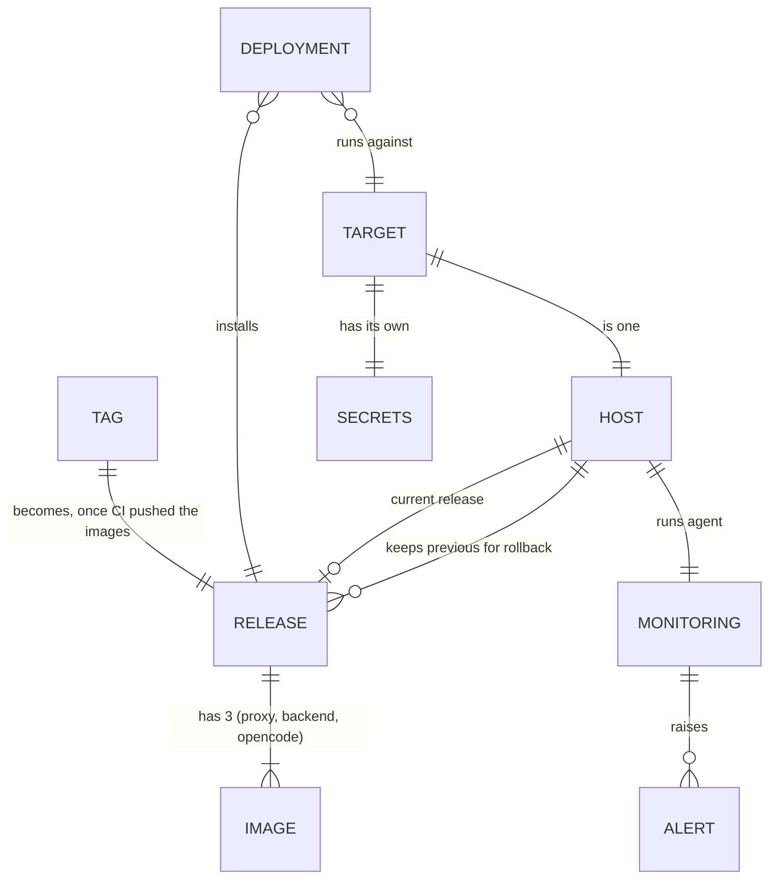
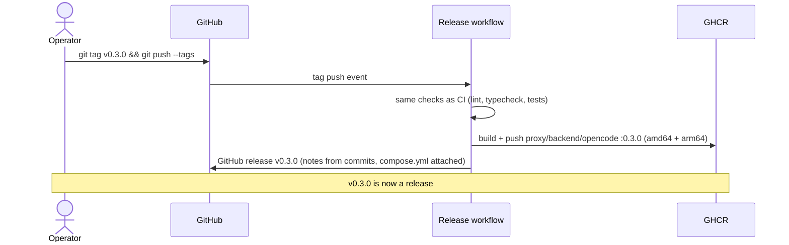
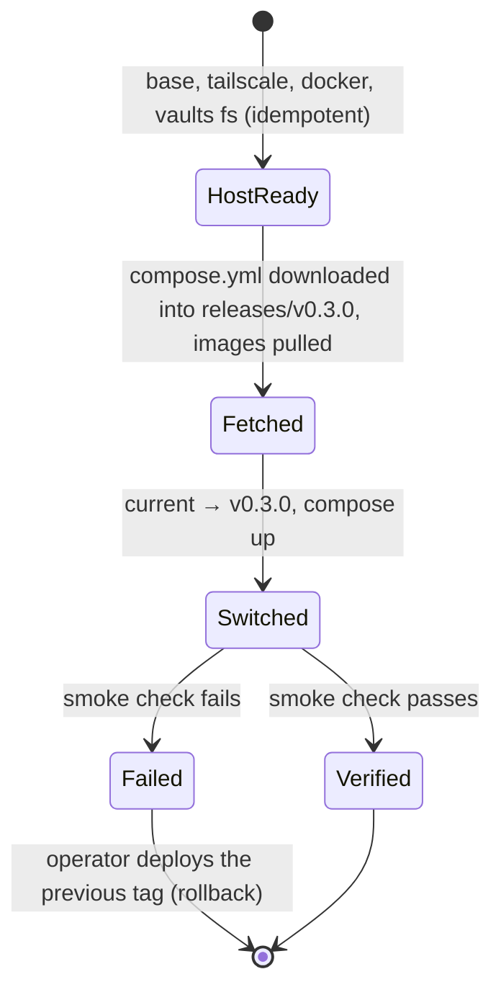

# Domain: releases, targets and deployments

Until now the domain had only the app's own concepts (vault, chat, commit; see `CONTEXT.md`). This
change adds the operator's side: what gets shipped, where it goes and how you know it's running.
These terms are for running the app, not for using it, so they go in a new "Operations" section of
`CONTEXT.md`.

## New terms

**Release**:
A git tag `vX.Y.Z` on `main` together with the three images CI built from it
(`ghcr.io/tillg/karpathy.app-{proxy,backend,opencode}:X.Y.Z`, no `v`) and the `compose.yml` attached to
the GitHub release as a **release asset**. The images are the app; the compose file says how they run
together. A release never changes once it's published. A tag whose images failed to build isn't a
release. Every release, a final one on the commit of a tested pre-release too, has its own freshly
built images, because the version is baked into them.
_Avoid_: Build, version (for the whole thing), deployment

**Pre-release**:
A release from a `vX.Y.Z-rc.N` tag, used to test the pipeline and the playbook. Unlike a release it may
come from any commit, not only `main`. It can be deployed by name, but it never becomes GitHub's
"Latest" or the `:latest` image, so a deployment without a version never picks it.

**Version**:
The `X.Y.Z` of a release, as the app reports it (`GET /api/health` → `version`). It's the git tag
without the `v`, and it's also the image tag. Dev and prodtest stacks report `dev`.

**Target**:
A named place a release can be deployed to: `local` (the Lima VM on the Mac) or `hetzner`. Each target is
one host in its own Ansible inventory, with its own settings and secrets.
_Avoid_: Environment, stage, server (a target is the name, the server is the machine)

**Deployment**:
One run of `just deploy <target> [version]`. It brings the target's host to the desired state, starts
the given release (the newest if none is given) and ends with the smoke check. A deployment that fails
the smoke check counts as failed even when every Ansible task succeeded.
_Avoid_: Rollout, push, ship

**Current release**:
The release a target is running now, which the `current` symlink on the host points to. The previous
releases stay on the host for rollback.

**Rollback**:
A deployment of an older release. It isn't a separate mechanism. It runs with today's playbook,
not the playbook of that release; only the images and `compose.yml` come from the older release.

**Smoke check**:
The last step of every deployment: all containers healthy, `/api/health` reachable through the proxy
with the target's bearer token, and the version it reports is the one requested.

**Secrets (of a target)**:
Values that must never be in git as plain text: bearer token, GitHub token, DNS token, LLM provider
key, the Tailscale auth key and the monitoring credentials. They're kept per target in an encrypted
Ansible Vault file.
_Avoid_: Credentials (for the whole set), config

**Alert**:
A push message to the operator's phone (ntfy) when something needs a person: disk or memory above
the threshold, a container down or restarting, the certificate expiring soon, or the heartbeat missing.

**Heartbeat**:
A ping the server sends to an outside service every few minutes. If the pings stop, the outside service sends the
alert. It's the only way to notice that the whole box is gone, since nothing on the box can report that
and nothing outside can reach a Tailscale-only server.
_Avoid_: Uptime check (that's a pull from outside, which can't reach this server)

## Parties

| Party | Role in a deployment |
|---|---|
| **Operator** (the user, on the Mac) | Tags releases, runs `just deploy`, holds the Ansible Vault password, gets the alerts. In this single-user app the operator is the same person as the app user. |
| **GitHub** | Hosts the source and the tags, runs the release workflow, stores the images (GHCR, public). |
| **Target host** | Ubuntu 24.04 with SSH. It downloads the release's `compose.yml`, pulls the images, runs the stack and the monitoring agent, and sends heartbeats. |
| **Tailscale** | The only way into the Hetzner host, for SSH (Ansible) and HTTPS (the app). |
| **GoDaddy** | DNS record and DNS-01 certificate for `app.karpathy.app` (Hetzner only). |
| **ntfy / heartbeat service** | Outside the server: deliver alerts and notice missing heartbeats. |

## Processes

### Cutting a release

### Deploying

## Changed concepts

- **Prod environment** (prod-env report): becomes the `hetzner` target. The runbook steps 8.3–8.10
  become Ansible roles. The server-only `compose.hetzner.yml` becomes a template rendered from the
  target's settings instead of a hand-edited file.
- **Prodtest** (`just prodtest`): stays the quick check of the prod images on the Mac's Docker. It
  checks images built from the working tree; the `local` target checks a release.
- **Disk alert**: the cron + ntfy line from the runbook is replaced by an alert in the monitoring
  stack.

## Open questions

- Should a release only be cut from a green `main` (CI passed on that commit), or should the release
  workflow run the checks itself? The plan assumes it runs them again; that's slower but has no gap.
- Versioning scheme: plain semver chosen by hand on tagging. No automatic bumping.
