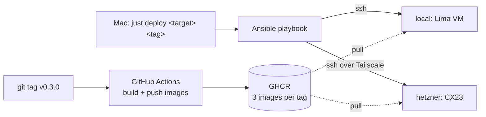

# Proposal: one command deploys a released version anywhere

## What

A deployment mechanism for karpathy.app, built in **Ansible** and run through **`just`**:

```
just deploy local            # newest release into a throwaway Ubuntu VM on the Mac
just deploy hetzner 0.3.0    # a given release (version without the tag's v) onto the Hetzner server, over Tailscale
```

- **Deploys GitHub versions.** A release is a git tag `vX.Y.Z`. CI builds the three images (proxy
  with the PWA, backend, opencode) for that tag and pushes them to GHCR. The release also carries
  `compose.yml` as a release asset. A deploy downloads that file and pulls the images. Nothing is
  built on a target, and the target holds no copy of the source.
- **Same playbook for every target.** `local` is an Ubuntu 24.04 VM (Lima) on the Mac and gets the same
  roles as Hetzner: base hardening, Docker, the vaults filesystem, the app and monitoring. Only the
  network differs: no Tailscale and Caddy's internal CA locally, Tailscale and DNS-01 on Hetzner.
- **Monitoring is deployed with the app:** Beszel for host and container metrics, Gatus for HTTPS and
  certificate checks, and a heartbeat to healthchecks.io that fires when the server itself is gone.
  All alerts go to the phone through ntfy ([architecture.md §4](architecture.md#monitoring)).
- **Rollback = deploy the older tag.** Each release's `compose.yml` is kept in its own directory next to
  the previous ones.



## Why

- Today the only path to prod is the hand-written runbook in
  [prod-env-report §8](../05_prod_env/prod-env-report.md#guide): about 40 shell steps, an uncommitted
  `compose.hetzner.yml` on the server, and `git pull && docker compose up --build` to update. That
  can't be repeated, can't be tested, and builds images on a 4 GB box.
- No version is pinned. You can't tell which commit runs on the server or go back to the last good
  one.
- Nothing tells you when the server is full, a container keeps restarting, the certificate didn't
  renew, or the box is down. The only alert today is the 80 % disk cron job from the runbook.
- Work item 3 of the prod-env report (images built in CI, pulled on the server) and work items 1, 2
  and 6 (compose hardening, server runbook, disk alert) are the same piece of work. This change
  delivers them together.

## Scope

**In**

- Release workflow: tag → multi-arch images (amd64 for Hetzner, arm64 for the local VM on Apple
  silicon) → GHCR. Every tag is built on its own, a final release too (it isn't byte-identical to the
  RC tested before it).
- The version in the app: `/api/health` reports it, and the "Vaults & settings" dialog shows the
  server's and the loaded PWA's version.
- Ansible: inventories `local` and `hetzner`, roles for base hardening, Tailscale, Docker, the vaults
  filesystem, the app and monitoring; secrets in Ansible Vault.
- `just` recipes: `deploy`, `deploy-check` (dry run with diff), `vm up|down|ssh`.
- Compose changes the runbook needed by hand: proxy bound to `${BIND_IP}`, no port 80, log rotation,
  `no-new-privileges`, `cap_drop`.
- A smoke check at the end of every deploy: containers healthy, `/api/health` through the proxy, and
  the running version is the requested one.
- Monitoring stack and alerts (disk, memory, container down/restarting, certificate expiry,
  server unreachable).
- README and the prod-env runbook point to `just deploy` instead of the manual steps.

**Out**

- Booking the Hetzner server and creating the Tailscale, Cloudflare and GitHub accounts and tokens. That stays manual
  ([prod-env-report §8.1–8.2](../05_prod_env/prod-env-report.md#guide)); the playbook starts from
  a fresh Ubuntu server with SSH access.
- restic off-site backups (work item 6, second half). Hetzner's daily images stay the backup.
- Continuous deployment (deploying on every tag automatically). That would need a Tailscale key in
  GitHub; the prod-env report decided against that (D13).
- Blue/green or zero-downtime deploys. A deploy restarts the stack; a few seconds of downtime are fine
  for a single user. A chat turn running during a deploy is cut off (uncommitted changes survive), and the
  playbook doesn't check for one.
- More than one server per target, and staging on Oracle. A test environment on Hetzner may come later;
  until then nothing stops an untested release from going to `hetzner`.
- Cleaning up old images in GHCR: every version is kept.

## Expected outcome

- From a fresh Ubuntu server to a running app with one command, in under 15 minutes, with no manual
  steps after SSH access works.
- Running the same deploy again changes nothing (idempotent; `deploy-check` shows an empty diff).
- `just deploy local` covers the whole playbook on the Mac before it touches Hetzner, followed by
  the Playwright e2e suite against the VM (every test except those that need a model).
- Stopping the server raises an alert on the phone within 15 minutes (heartbeat period + grace +
  delivery).
- An older tag can be deployed back in under 2 minutes.

## Decisions taken while writing

| # | Decision | Why |
|---|---|---|
| P1 | The artifacts live in `specs/07_deployments/` next to the original request ([`deployments.md`](deployments.md)), not under `specs/changes/`. | Repo convention: one numbered folder per spec. |
| P2 | No `specs/system/` yet (user, 2026-10-01). | `CONTEXT.md` and `specs/01_mvp/mvp.md` describe the system for now. |
| P3 | `local` = a throwaway Ubuntu VM via Lima, not the Mac's Docker (user, 2026-10-01). | Only a VM runs the host roles (apt, systemd, the loop filesystem), so it tests the whole playbook. |
| P4 | Monitoring = Beszel + Gatus + healthchecks.io (user, 2026-10-01). | About 100 MB for every required alert ([architecture.md §4](architecture.md#monitoring)). |
| P5 | Secrets encrypted in git with Ansible Vault (user, 2026-10-01). | No extra tool per deploy; the vault password lives in the Keychain. |
| P6 | The `hetzner` target is finalized once the server exists (user, 2026-10-01). | Bootstrap and Tailscale details depend on the real server; everything else is built and tested on `local` first. |
