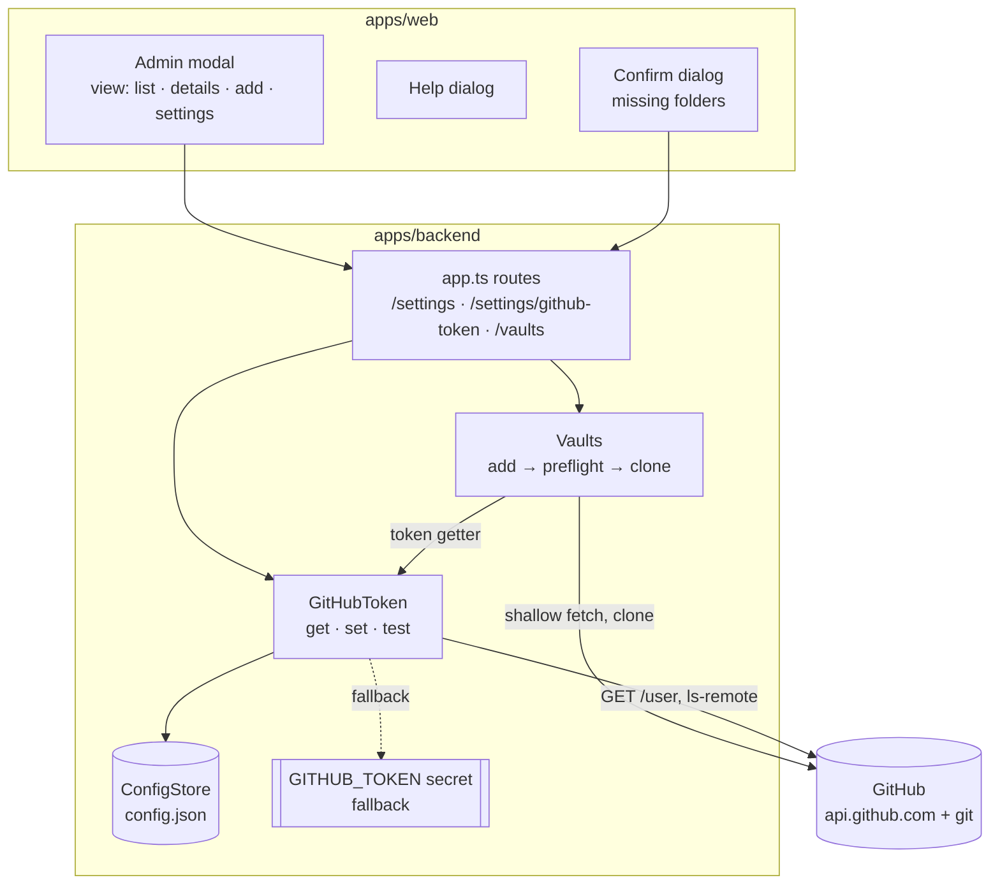
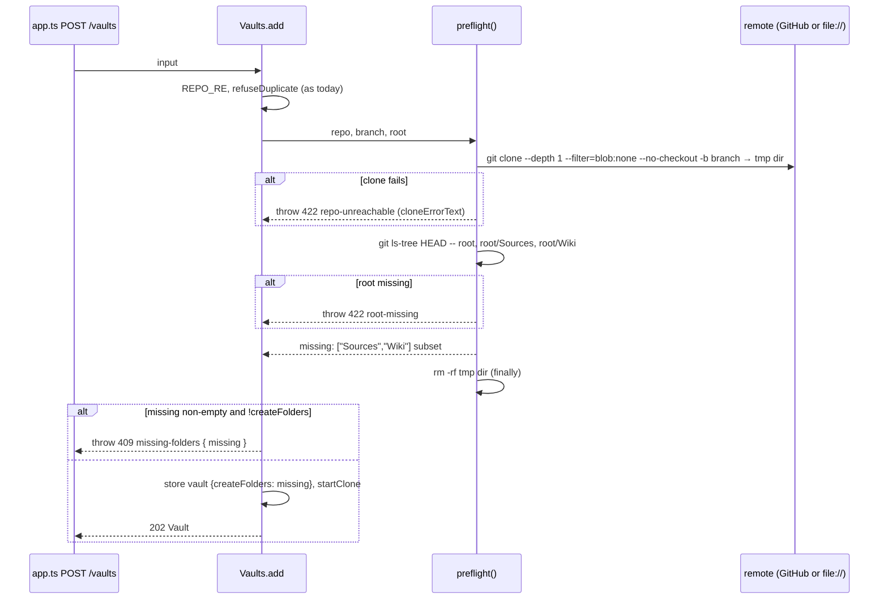

# Architecture: modal views, token in the config store, attach preflight

## 1. Overview

Three independent pieces. Each can ship on its own.

| Piece | Backend | Frontend |
|---|---|---|
| A. Modal views | none | `Admin.tsx` split into list / details / add / settings views + help dialog |
| B. GitHub token | token in the config store, live getter, `PUT`/`DELETE`/`test` routes | token field + Test token in the settings view |
| C. Attach preflight | `Vaults.add` checks before persisting; `409 missing-folders`; `createFolders` | confirm dialog in the add view |



## 2. A. Modal views

- `Admin()` keeps the single `Modal`. A local `view` state `{ kind: 'list' } | { kind: 'details', id } |
  { kind: 'add' } | { kind: 'settings' }` picks the content. Every view except the list has a **Back** button
  in the header. There is no router: `adminOpen` stays a boolean in `store.tsx`. When the modal closes, the view
  goes back to `list`.
- **List**: `VaultRow` is reduced to a button showing name, `repo · branch · /root` and the state badge. The whole
  row is clickable and opens details. Below the list are **Add vault** and **Settings**. Next to the "Vaults"
  heading is a `(?)` button labelled "What is a vault?", which opens the help dialog.
- **Details**: today's inline edit content (`VaultFields`, Retry, Remove, the dirty/unpushed refusal messages),
  moved unchanged into its own view. Remove returns to the list.
- **Add**: today's add form plus the missing-folders flow (§4).
- **Settings**: `SettingsForm` (threshold, model), the GitHub token block (§3) and `Versions()`.
- **Entry points**: "Edit vault" in `NotePane.tsx:134` and `ChangesPanel.tsx:162` should open that vault's
  details directly. `setAdminOpen` gets an optional initial view
  (`openAdmin({ kind: 'details', id })`). The sidebar gear and the vault switcher open the list.
- **Help dialog**: a static, nested `Modal` with three short paragraphs (Sources, Wiki, Schema optional), a
  folder sketch, and the note that the app offers to create missing folders. No backend.

## 3. B. GitHub token

### Storage and precedence

- `ConfigData` gets `githubToken?: string`. It is a **separate top-level key, not a field of `Settings`**:
  `GET /settings` returns `settings` verbatim, so the token must stay out of that object.
- `GitHubToken` (new, `apps/backend/src/github-token.ts`) owns it:
  - `current(): string | undefined` returns the stored token if set, else the startup secret
    (`secret('GITHUB_TOKEN')`).
  - `source(): 'settings' | 'secret' | 'none'`.
  - `set(token)` / `clear()` write the config store. `clear()` falls back to the secret.
  - `redact(msg)` replaces **every token value seen since startup** (old and current, stored and secret) with
    `***`.
- `Vaults` gets the getter in place of the startup string: `env.githubToken: () => string | undefined`. Every
  current use (`vaults.ts:385, 561, 585, 601`) calls it per operation, so a changed token takes effect on the
  next clone, pull or push without a restart. `redact()` in `vaults.ts` delegates to `GitHubToken.redact`.
- The secret stays the fallback. Existing deployments, the dev stack and the `07_deployments` Ansible roles keep
  working with no change. Once a token is saved in the app, it wins.

### API

| Route | Body | Reply |
|---|---|---|
| `GET /settings` | | adds `githubToken: { source, last4 \| null }`, never the plaintext |
| `PUT /settings/github-token` | `{ token }` (trimmed, 20–255 chars, no whitespace) | `204` |
| `DELETE /settings/github-token` | | `204`; falls back to the secret |
| `POST /settings/github-token/test` | `{ token? }`; without it, tests `current()` | `200 TokenTest` |

```ts
interface TokenTest {
  ok: boolean;                         // GitHub accepted the token
  login?: string;                      // GET /user → login
  scopes?: string[];                   // X-OAuth-Scopes (classic tokens; absent for fine-grained)
  expiresAt?: string;                  // github-authentication-token-expiration, ISO
  error?: string;                      // "GitHub rejected the token (401)" / "GitHub not reachable"
  vaults: { id: string; repo: string; ok: boolean; error?: string }[]; // git ls-remote per vault
}
```

- **Identity check**: `fetch('https://api.github.com/user', { Authorization: 'Bearer …' })`, 10 s timeout. The
  API base comes from `GITHUB_API_BASE` (default `https://api.github.com`), the same idea as `GIT_REMOTE_BASE`.
- **Repo check**: `git ls-remote --heads <remoteBase><repo>.git <branch>` per configured vault, with the tested
  token in the extraheader (existing `git()` helper). This proves the token can reach each vault's repo. That
  matters for fine-grained tokens, which `/user` accepts even without repo access.
- The token test never stores anything. The token only travels browser → backend (HTTPS, bearer-guarded) →
  GitHub.

### UI

A password field (placeholder `•••• last4`, or "Using the server's token" / "No token set"), **Save**,
**Remove**, and **Test token**. Test token sends the typed value if the field is non-empty, otherwise nothing,
so the stored token is tested. The result is a line ("✓ Works — signed in as `tillg`, expires 2027-01-31") plus
one line per vault ("✓ tillg/frechen_wiki" / "✗ tillg/x: no access").

## 4. C. Attach preflight

### Backend

`Vaults.add(input & { createFolders?: boolean })`:



- **Preflight** runs in a temp dir under `vaultsDir/.preflight/<random>` (same volume, so no extra mount) and
  is always removed. A blobless, depth-1, no-checkout clone transfers only commits and trees, not file contents:
  small even for media-heavy vaults. It works with `GIT_REMOTE_BASE=file://…` in tests.
- **Folder check**: `git ls-tree -d HEAD -- <root>/Sources <root>/Wiki` (tree entries). Exact, case-sensitive
  names. A *file* named `Sources` counts as missing, and creating the folder then fails with a clear error.
- **Persisting**: only after the preflight passes. The stored vault carries `pendingFolders?: string[]`. When
  `startClone` succeeds, it writes `<root>/<folder>/.gitkeep` (empty) for each entry, then clears the field.
  If the backend restarts mid-clone, the re-clone on startup still sees `pendingFolders` and creates them.
  Writes go through the normal file path, so the watcher reports them and they appear as uncommitted changes
  (ADR 0001). The AI-touched set is not involved.
- **Error codes** (new `code` values in the existing `HttpError` JSON): `repo-unreachable` (422),
  `root-missing` (422), `missing-folders` (409, body adds `missing: string[]`). Messages reuse
  `cloneErrorText()`, so the wording matches today's clone-failed texts.
- **Race**: between preflight and clone, someone could push a commit that adds the folders.
  `.gitkeep` creation skips folders that exist after the clone. Folders deleted in the meantime are not
  re-checked: the vault is attached and simply lacks them, the same as an existing vault today.
- `clone-failed` stays for failures *after* preflight (network drop, disk full). Retry and Edit as today.

### Frontend

The add view calls `POST /vaults`. On `409 missing-folders` it shows a confirm dialog: *"tillg/x has no
`Sources/` and `Wiki/` folder. Create them? They'll appear as uncommitted changes until you commit."*
**Create folders** / **Don't attach**. "Create" re-posts with `createFolders: true` and goes to the list.
"Don't attach" closes the dialog, keeps the form filled, and nothing is stored. A 422 shows inline under the
repo field.

### Shared types and validation

- `packages/shared`: `Settings` unchanged. New `SettingsView = Settings & { githubToken: { source; last4 } }`,
  `TokenTest`, and the `missing-folders` error body type.
- `app.ts`: `addVault` gains `createFolders: z.boolean().optional()`. New `githubTokenBody` schema.

## 5. Security

- **At rest**: the token moves from a secret file (mode 0400, read once) into `config.json` on the
  backend-only config volume, which also holds vault config. The volume is not mounted into opencode or the
  proxy, so the exposure is the same as the secret file's: whoever has root on the host can read it.
  `security.md` gets a line on this at archive time.
- **In transit**: the plaintext is accepted by `PUT` and `test` only, never returned. `GET /settings` gives
  `last4`. Request bodies of these routes are not logged.
- **Unchanged invariants**: the token is never written to `.git/config`, is injected per git command via
  `GIT_CONFIG_*`, is redacted from every error and log line (now all values seen since startup), and never
  reaches opencode.
- **Test token** is bearer-guarded like every route. It cannot be used to probe arbitrary hosts: the API base
  and remote base come from server env, not from the request.

## 6. Tradeoffs considered

| Option | Chosen? | Why |
|---|---|---|
| Separate `POST /vaults/check` + `POST /vaults` | no | Two round trips and a check that can go stale between them. One endpoint with `409` + retry is simpler, and `add` must check anyway. |
| Persist vault, ask after clone (state `needs-folders`) | no | Contradicts "No → not attached": the vault would briefly exist, show in the switcher, and need cleanup. |
| GitHub contents API for the folder check | no | Doesn't work with `file://` test remotes, and needs a second auth path. git covers GitHub and tests alike. |
| Token test via `ls-remote` only | no | Says nothing about identity or expiry. `/user` alone misses fine-grained repo scoping. Both are cheap. |
| Commit the created folders | no | ADR 0001: only the user commits. |
| Token in `Settings` | no | `GET /settings` returns settings verbatim and the client caches them. A separate key keeps the plaintext out by construction. |
| Visible placeholder (`README.md`) instead of `.gitkeep` | no | A Markdown file in `Sources/` would look like a source to ingest skills. The tree hides dot-files, but the folder itself still shows (verified in the plan). |

## 7. Testing

- **Backend, default vitest project** (local bare repos via `makeRemote`, real git, no mocks):
  - preflight: unreachable repo, missing branch, missing root, both/one/no folders missing.
  - `409` without `createFolders`, and nothing written to config.
  - `.gitkeep` created and shown as an uncommitted change.
  - token: storage, precedence, masking in `GET /settings`, redaction of an old token after a change.
  - `ls-remote` vault checks against `file://` remotes.
- **Backend, `test:github` project** (real GitHub, existing token): `/user` with a valid token gives a login.
  A garbage token gives `ok:false` and a 401 message. Preflight against a real repo.
- **e2e (Playwright)**: list → details → back. Add with missing folders → decline → not in list. Add → accept →
  folders in the changes list. Settings token save/mask/test (against the dev stack's token). Help dialog opens.
  The axe check passes for every new view and dialog.
