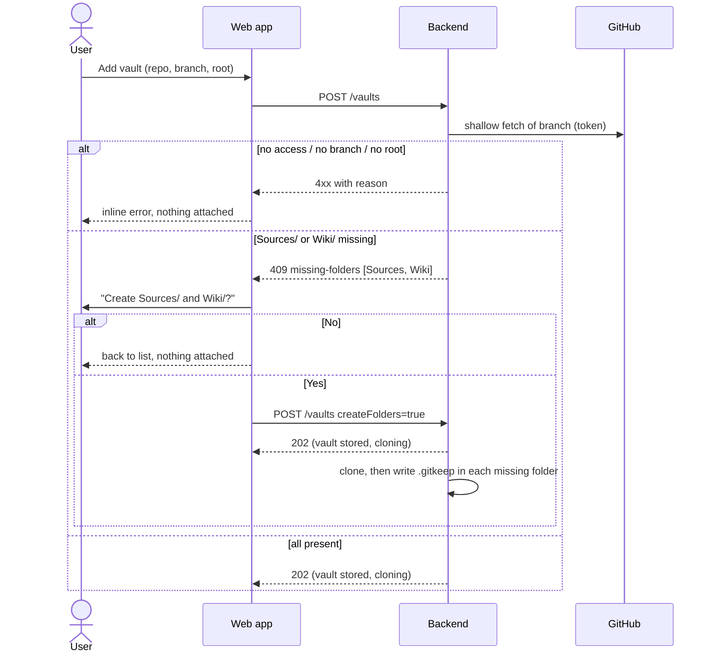
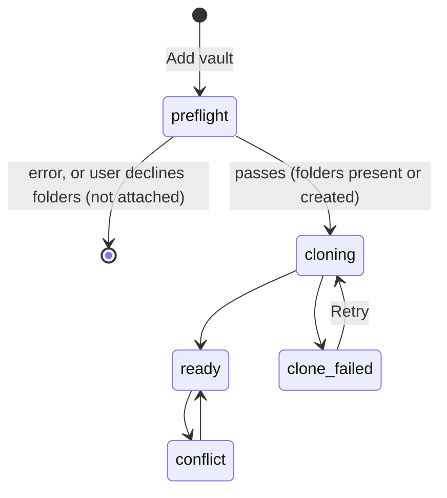
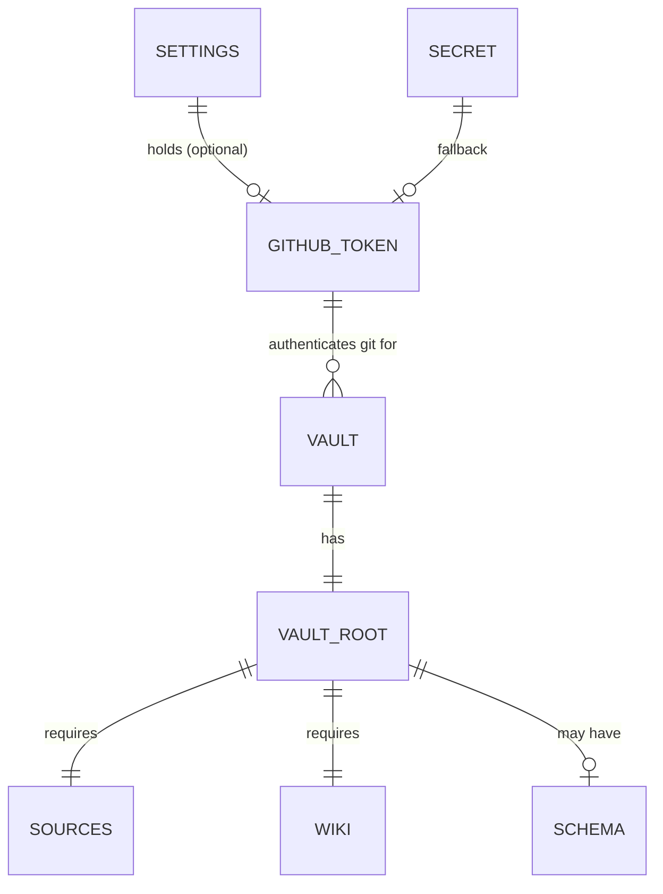

# Domain: vault structure, GitHub token, attach preflight

Builds on the terms in `CONTEXT.md` and [specs/system/domain.md](../system/domain.md) (Vault, Vault root,
Vault state, Uncommitted change, Commit). New and changed terms:

## New terms

| Term | Meaning |
|---|---|
| **Vault structure** | The folders a vault is expected to have under its **vault root**: `Sources/` and `Wiki/` (required) and `Schema/` (optional). The app checks the required ones only when a vault is attached. |
| **Sources** | `Sources/`: immutable source documents (articles, mails, PDFs, clips). Humans or ingest skills add them. They are not rewritten afterwards. |
| **Wiki** | `Wiki/`: the knowledge base the AI maintains from the sources (entities, concepts, topics, syntheses, index, log). |
| **Schema** | `Schema/`: optional instructions for the AI (e.g. `Schema/CLAUDE.md`, methodology). Mentioned in the help only. |
| **Missing folders** | The required folders that are absent from the vault root of a repo being attached. |
| **Attach preflight** | The check that runs when a vault is added, before anything is stored: repo reachable with the GitHub token, branch exists, vault root exists, missing folders listed. |
| **Folder placeholder** | An empty `.gitkeep` file that makes a created folder exist in git (git does not track empty folders). It is an uncommitted change like any other. |
| **GitHub token** | The single, server-wide credential the backend uses for every git operation against GitHub (clone, pull, push). It is now part of the settings. It is never sent to the client in full, never given to the AI, and never written into a repo. |
| **Token source** | Where the active token comes from: `settings` (set in the app) or `secret` (the deployment's `GITHUB_TOKEN` secret, used when no token is set in the app). |
| **Token test** | A check of a token, either the stored one or one typed but not saved yet, against GitHub: is it accepted, whose is it, its scopes and expiry, and can it reach each vault's repo. |

## Changed terms

- **Vault**: adding a vault no longer means "stored, then cloned". A vault exists in the config only after
  the attach preflight passes and, if folders were missing, the user agrees to create them.
- **Settings**: before, the reminder threshold and the model. Now also the GitHub token.

## Attach process

## Vault state (extended)

The preflight comes before the vault exists, so it is not a vault state. The states after it are unchanged.

## Entities

## Parties

- **User**: sets and tests the token, attaches vaults, decides whether missing folders are created.
- **GitHub**: checks the token (`/user`) and serves the repos. The only external party.
- **AI (opencode)**: not involved. It never sees the token and has no part in attaching vaults.
