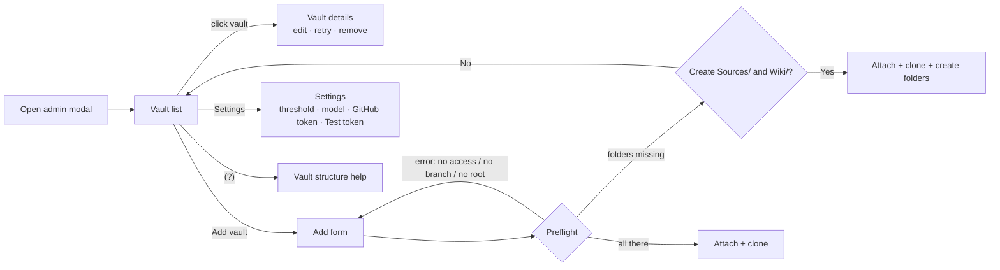

# Proposal: vault list, GitHub token in settings, checked attach

## What

Rework the admin modal ("Vaults & settings", `apps/web/src/components/Admin.tsx`) and the attach flow behind it:

1. **Vault list first.** Opening the modal shows the list of vaults (name, `repo · branch`, state badge), an
   **Add vault** button and a **Settings** entry. Today it is one long scroll with all four sections.
2. **Vault details.** Clicking a vault opens its details: the edit fields, Retry and Remove that today expand
   inline in the row, plus **Back**.
3. **GitHub token in settings.** The settings view gets a GitHub token field. The token can be set and replaced
   at runtime. Today it is a server secret file (`deploy/secrets/github_token`) that is read once at startup.
   The UI never shows the stored token, only that one is set and its last 4 characters.
4. **Test token.** A button next to the field asks the backend whether the token works: GitHub accepts it, which
   account it belongs to, its scopes and expiry, and whether it can reach each configured vault's repo. It also
   tests a token that was typed but not saved yet.
5. **(?) help.** A `(?)` link next to the "Vaults" heading opens a short explanation of a vault's structure:
   `Sources/` (immutable source documents), `Wiki/` (the AI-maintained knowledge base) and, optionally,
   `Schema/` (instructions for the AI).
6. **Checked attach.** Adding a vault first checks the repo: is it reachable with the token, does the branch
   exist, does the root exist, and are `Sources/` and `Wiki/` there? If folders are missing, the app asks
   *"Create Sources/ and Wiki/?"*. **Yes** attaches the vault and creates the folders as uncommitted changes.
   **No** attaches nothing: no config entry is written and nothing is cloned.

## Why

- The modal has grown into one scroll: vault rows, add form, settings and versions. With more than two vaults,
  finding a vault and editing it is awkward on a phone. A list → details flow is the usual pattern.
- Changing the GitHub token (expired, rotated, new repo outside its scope) today means SSHing to the server,
  editing a secret file and restarting the backend. Nothing tells you the token has expired until a clone or
  push fails.
- The app's purpose is the LLM wiki workflow (`Sources/` → `Wiki/`, the user's `frechen_wiki` and `mylife_wiki`
  vaults). Nothing in the app says so, and a freshly attached empty repo gives the AI no structure to work in.
- Today `POST /vaults` writes the vault to the config **before** cloning (`vaults.ts:97`). A typo in the repo
  name or a missing token scope leaves a `clone-failed` vault that has to be removed by hand.

## Scope

**In**

- Admin modal as four views in one modal: list, details, add, settings. The `(?)` help is a small dialog.
- GitHub token stored in the backend config store, editable from settings, masked in every response. The
  existing `GITHUB_TOKEN` secret stays as the fallback, so current deployments (and the in-flight
  `07_deployments` Ansible roles) keep working unchanged.
- `POST /settings/github-token/test`: tests a given or the stored token against GitHub's API and the
  configured vault repos.
- Preflight in `POST /vaults` before anything is persisted. A `409 missing-folders` reply and a
  `createFolders: true` retry.
- README update for the token setting and vault structure.

**Out**

- Preflight on `PATCH` (changing repo, branch or root of an existing vault). It keeps today's checks. This is a
  follow-up if needed.
- Checking or repairing the structure of vaults that are already attached. They stay as they are.
- Creating `Schema/` or any content (index, log, `CLAUDE.md`) inside the new folders. Only placeholders.
- Per-vault tokens, GitHub OAuth / GitHub App login, creating repos on GitHub.
- A router: the views are modal-internal state, as the modal is today.

## Assumptions

- **Required structure = `Sources/` and `Wiki/`, relative to the vault root**, capitalized as in the user's
  vaults and the llm-wiki skills. `Schema/` is mentioned in the help but not required.
- **Folders are created as uncommitted changes** (an empty `.gitkeep` in each), not committed. ADR 0001 says
  only the user commits. They show in the changes list until the next Commit & Push.
- **No mocks for GitHub.** Real token behavior is tested in the existing `test:github` vitest project against
  real GitHub. Default-project tests cover validation, masking and storage. Preflight is tested against local
  bare repos (`GIT_REMOTE_BASE=file://…`), as clone is today.
- **Changed e2e test.** `e2e/admin.spec.ts` › "a repo that cannot be cloned shows clone-failed" no longer
  matches: an unreachable repo now fails in preflight and is never attached. Rewriting that test needs the
  user's OK at apply time ([plan](plan.md)).

## Expected outcome

- The modal opens on a short list, and every vault is one tap from its details.
- The token is changed and checked from the phone, with no SSH and no restart.
- A wrong repo name or a missing token scope is reported before anything is attached.
- Every newly attached vault has `Sources/` and `Wiki/`, or was not attached at all.
