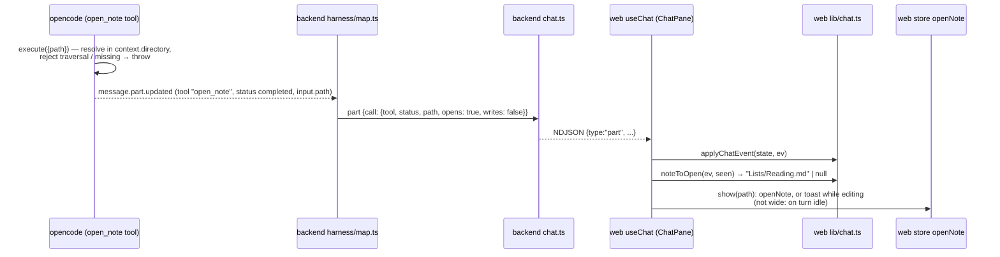

# Architecture: the AI can open notes in the UI

## Approach in one picture

opencode runs a check-only tool. The backend turns the tool call into a harness-neutral flag. The web app
reacts to the flag on live events. There is no new route, no new stream and no new event type.



## Components

### 1. The tool (opencode side)

- **File:** `deploy/opencode/tools/open_note.ts`. It lives in the repo and is baked into the opencode
  image. It is **never** loaded from a vault: `HARNESS_CONFIG` keeps disabling chat for vaults that
  contain `.opencode/` or `opencode.json`. The trust model in `security.md` ("Confining the AI")
  doesn't change: harness code comes only from the image.
- **Behavior:** `args: { path: string }` (vault-relative, like the read/edit tools).
  1. Resolve `path` against `context.directory` (the session directory, i.e. the vault root).
  2. Throw `outside the vault` if the result leaves the directory (`..`, absolute paths elsewhere).
  3. Throw `no such note: <path>` if the file doesn't exist, is a directory, or has a path segment
     starting with `.` (dot-files, `.git`), the same rule as the file list. Any other file type is fine;
     a binary file opens in the binary view.
  4. Return `opened <path>`. It never reads file content.

  A throw becomes a tool `error` part, so the model sees why and can try again, and the UI doesn't move.
- **Description for the model:** "Open a note (page) in the user's editor so they can see it. Use it
  only when the user asks to see, show or open a note. Path is relative to the vault root, as for read.
  Do not call it for files you read or write unless the user asked to see them."
- **How opencode loads it is the one open question.** It is settled by plan step 1, not on paper. The
  docs list `.opencode/tools/` (project, which we forbid in vaults) and `~/.config/opencode/tools/`
  (global; `HOME` is an empty tmpfs here). The spike tries these in order and keeps the first that
  works on **1.18.25**:
  1. `XDG_CONFIG_HOME=/opt/opencode-config` with the tool at
     `/opt/opencode-config/opencode/tools/open_note.ts`, root-owned and read-only.
  2. `OPENCODE_CONFIG_DIR=/opt/opencode-config` with `tools/open_note.ts` (the docs mention agents,
     commands and plugins for this dir, but not tools).
  3. **If no file route works, stop and re-propose.** A backend MCP server (`POST /mcp`) would be the
     next option, but every backend route sits behind the bearer token, and opencode doesn't have it.
     Exempting `/mcp` or handing opencode the token widens the security surface (`security.md`).
     That needs its own proposal and grilling, not a silent pivot inside this change.

  The spike also checks two things: whether the tool needs `@opencode-ai/plugin` / zod installed at
  runtime (if it does, bake `node_modules` into the image; opencode must not install anything at
  startup), and whether opencode tries to write into the config dir.

  **Spike result (plan step 1, 2026-10-02):** route 1 won. `XDG_CONFIG_HOME=/opt/opencode-config`,
  tool at `/opt/opencode-config/opencode/tools/open_note.ts`. Findings:
  - opencode writes `.gitignore`, `package.json`, `package-lock.json` and `opencode.jsonc` into
    **every** config dir and installs `@opencode-ai/plugin` (≈ 61 MB with zod and effect) there on
    startup. That happens unconditionally, even for an empty dir or a tool without imports. A read-only
    dir that isn't populated fails every request with `EROFS`. Route 2 (`OPENCODE_CONFIG_DIR`) does the
    same.
  - So the Dockerfile **pre-bakes** the dir: one throwaway `opencode serve` at build time populates it,
    then it is made root-owned and read-only. At runtime it loads offline and writes nothing. The
    managed `/etc/opencode/opencode.json` still wins over the baked empty `opencode.jsonc`.
  - Helpers can't live in `tools/`: opencode registers every export of a file there as a tool. The path
    check lives in `deploy/opencode/lib/resolve-note.ts`.
  - opencode **does** load a vault's `.opencode/tools/` (and installs deps into it). The guard is the
    backend's `HARNESS_CONFIG`, which disables chat for such vaults; nothing on opencode's side stops it.
  - Tests no longer run the stock image with mounts: `startOpencode` builds the image from
    `deploy/opencode/Dockerfile` (layer-cached, ~10 s cold) and runs it, so tests and production load
    the same files. `deploy/opencode/Dockerfile.dockerignore` keeps the build context to
    `deploy/opencode/`.
- **Permissions:** custom tools are allowed by default. The managed `opencode.json` adds
  `"open_note": "allow"` explicitly to `vault` and `vault-readonly`, so a later blanket deny can't hide
  it by accident. `commit-message` keeps `"*": deny`, which hides it there.

### 2. Backend mapping (`apps/backend/src/harness/map.ts`)

- `OPEN_TOOLS = new Set(['open_note'])`. Only the harness knows tool names (ADR 0002).
- `mapToolPart` sets `opens: OPEN_TOOLS.has(tool)`. The path already comes from `input.path`, made
  vault-relative by `toVaultPath`.
- `writtenPaths` is unchanged: `open_note` isn't in `WRITE_TOOLS`, so opening never marks a page
  AI-touched.
- No change to `chat.ts`. The part flows through `onEvent` → `emit` like every tool part, and replays
  from `harness.messages()` carry the same flag.

### 3. Shared type (`packages/shared/src/index.ts`)

```ts
export interface ToolCall {
  // …
  /** True when the tool asks the UI to show `path` (open_note). */
  opens?: boolean;
}
```

The field is optional, so stored chats and existing captures stay valid. It sits next to `writes`
because it is the same kind of fact: what the call means to the user, not which tool made it.

### 4. Web (`apps/web`)

- **`lib/chat.ts` — `noteToOpen(ev: ChatEvent, seen: Set<string>): string | null`.** A pure function. It
  acts when the event is a `part` with a tool call where `opens`, `status === 'completed'` and a path
  are set, and the call id is not in `seen`. Then it adds the id to `seen` and returns the path.
  Anything else gives `null`.
- **"Editing"** is decided in the store, not in `lib/chat.ts`. It is true when the CodeMirror view has
  focus or the open note has unsaved text. A store helper `isEditing()` reads both when it is called, so
  a stale render can't decide it. As built, focus is `document.activeElement` inside `.cm-editor` (what
  `view.hasFocus` checks), and unsaved means `draft !== saved` on the note ref. That way the editor's view
  doesn't have to be exposed.
- **Open tracker (`lib/chat.ts`, pure):** `Opens { seen, later, loaded }`, one per chat view (a
  `useRef` in `useChat`). `defer` is true outside the wide layout (`!wide`: phone and tablet overlay).
  - `opensFromLoad(o, messages, turn, defer)` runs on every `api.chat` load. The first load only adds
    the ids of **completed** open calls to `seen`, so history never opens a note. A call still running
    then opens when its live `completed` part arrives. Later loads (a reattach after a dropped stream,
    `visibilitychange`, after `send`) treat completed calls not in `seen` as live, so an open that
    completed in the gap isn't lost.
  - `opensFromEvent(o, ev, defer)` runs on each live stream event. `noteToOpen` gives a path → without
    `defer`, show it now; with `defer`, `later = path` (a later open in the same turn overwrites it,
    so the last one wins).
  - A `turn` event with state `idle`, or a load whose turn is `idle`, returns `later` and clears it.
    This happens however the turn ended (done, error, stopped).

  Both return the note to show now, or null. `useChat` passes that to `show(path)`, which checks
  `isEditing()` at that moment: not editing → `openNote(path)`; editing →
  `toast("AI opened <path>")`. The existing toast is text only; the chip is the link.

  A `later` open is lost on a page reload, or when the user leaves the chat view before the turn ends
  (known gap, accepted for now); the chip still leads there. When `openNote` is refused because
  `leave()` fails (stale or deleted), nothing retries.
- **Stale vault guard:** `show` does nothing unless the chat's vault is still the active vault.
- **`ToolChip`:** a completed `opens` call renders like a completed write chip: a button "opened
  `<path>`" → `openNote(path)`. Pending, running and error chips render as today.
- **Phone and tablet:** `openNote` already leaves the chat tab (phone) or closes the chat overlay
  (tablet). We keep that. The only new part is the wait until the turn ends (above).

## Decisions and tradeoffs

| Decision | Chosen | Rejected, and why |
|---|---|---|
| Where the tool runs | Server-side tool in opencode that only validates | Client-side function as a tool: opencode's loop is server-side, so the browser can't execute tools. ACP client tools aren't part of our boundary. |
| How the UI learns about it | Existing tool part + `ToolCall.opens` | A new `ChatEvent` type `open`: it duplicates the tool part, needs separate replay rules, and widens the boundary. The vault events stream: an open belongs to a turn, and turns already stream. |
| Tool delivery | Custom tool file baked into the image (route picked by spike) | MCP server in the backend: it adds an HTTP endpoint that needs either an auth exemption or the bearer token inside opencode. If the spike finds no file route, the change stops and is re-proposed; it doesn't silently switch to MCP. A tool in the vault's `.opencode/`: forbidden, because harness config in vaults disables chat. |
| Tool name | `open_note`, matching the domain term *note* | `open_page`: a second word for the same thing, which tends to drift. The model still finds the tool, because its description says "note (page)". |
| Which files | Any file the file tree lists; binaries open in the binary view; dot-paths and `.git` refused | Only `.md`: the glossary's *note* includes every file, and the file tree opens binaries too. Dot-files allowed: the AI would surface files the app itself hides. |
| Phone wait after error / stop | Still opens on `idle` | Drop on stop: the request had already succeeded, and the user asked to see the note. |
| When the AI opens | Only when the user asks to see a note | Also after it writes a note: that would fire on almost every write turn, and the "changed" chips already lead there. |
| Timing outside the wide layout | Wait until the turn ends, then open the last request (phone and tablet overlay) | Open right away: it leaves the chat tab or closes the chat overlay mid-answer. Wait on every device: needless in the wide layout, where chat and editor sit side by side. |
| Several opens in one turn | Each opens in order, so the last one wins | Only the first one opens: that needs extra state and has no clear benefit. |
| Validation | In the tool: inside the vault root, file exists | Validating in the UI only: the model would never learn its path was wrong. |
| While the user is editing | Notice + chip, no switch | Always switching: the user loses cursor and focus mid-sentence, and on a phone the tab changes. An "Open" button in the notice: the toast is text only, and the chip already does that job. |
| Auto-open on history | Never | Reopening pages on every reload would be surprising, and it fights the user's own navigation. |
| Scope | Path only | Heading or line: `openNote` supports them, but nobody asked yet. Easy to add as optional args later. |

## Integration points and risks

- **opencode upgrades:** custom tool loading is part of what each upgrade has to re-check (ADR 0002).
  The step-1 test (`tool ids` lists `open_note`) catches a break.
- **Tests run the image built from `deploy/opencode/Dockerfile`** (`test/opencode-container.ts`), not
  the stock image with mounts (spike result, §1), so tests and production load the same file.
- **Confinement:** the tool reads only file metadata, and only inside `context.directory`. Without git
  in the image, `context.worktree` isn't meaningful, so the check uses `directory`.
- **Model behavior:** small models may call `open_note` too often or not at all. The `@llm` tests assert
  only the tool event and the UI result, never answer text (architecture.md, Testing).
