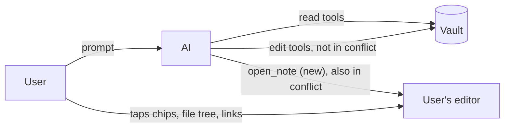
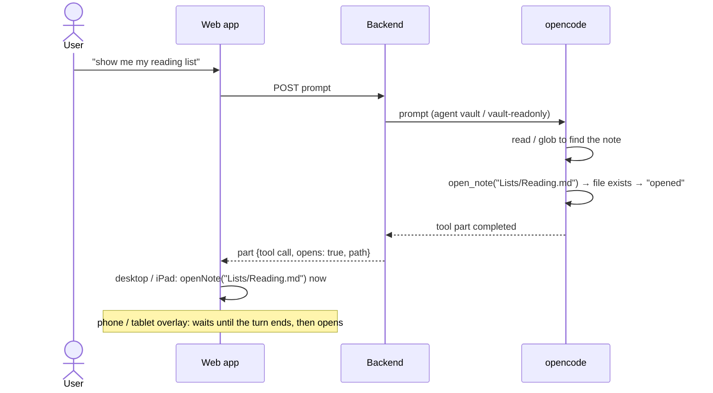

# Domain: the AI can open notes in the UI

## New and changed terms

This change uses the system term **note** (`specs/system/domain.md`: a file in the vault, usually `.md`)
and adds no synonym for it. "Page" is not a domain term. The feature name `ai-open-page` stays as it is.

| Term | Meaning | In code |
|---|---|---|
| **Opened note** *(new)* | A note the AI asked the app to show during a turn. It is shown as an "opened" chip next to the consulted and changed files. An opened note is neither consulted nor changed: the AI read nothing and wrote nothing by opening it. | `ToolCall.opens` |
| **Open request** *(new)* | One call of the AI's `open_note` tool. It succeeds only for a file that exists inside the chat's reach (the vault root). Otherwise it fails as a tool error that the AI sees, and nothing opens. | `open_note` tool |
| **Live event vs. history** *(sharpened)* | Live events come in on the chat stream while a turn runs. History is the stored chat that the app loads on reload or when it opens a chat. Only a live open request moves the UI. History shows the chip and moves nothing. | `ChatEvent` vs. `api.chat` |
| **Consulted file / changed file** *(changed)* | Now one of three tool-chip kinds: consulted (read), changed (written), opened. | `ToolCall.writes`, `ToolCall.opens` |

## Actors and capabilities

The AI's capabilities grow by one: besides reading and changing notes in its vault, it can **direct the
user's view** to one note, **when the user asks to see it**. It still can't reach UI state beyond that. It
can't switch vaults, open dialogs, commit, or change the editor mode.

## Process: AI turn (changed)

Step 3 of the AI turn gains one sub-step.

## Rules

- **The AI opens a note only when the user asks to see it** ("show", "open", "where is …"). It doesn't
  open notes on its own after it writes them. The "changed" chips already lead there.
- **Any note the file tree lists can be opened**, not only `.md`. A binary file opens in the binary
  view, as from the file tree. Dot-files and `.git` are never listed, so they can't be opened either.
- **Open requests are scoped like everything else in a chat.** The path is vault-relative and must
  resolve inside the vault root. It can never point to another vault or outside the root.
- **Opening is not a change.** An opened note doesn't join the AI-touched set and never makes the vault
  dirty.
- **Opening works in conflict.** Showing a note writes nothing, so `vault-readonly` may open notes.
- **One live open moves the UI once.** A stream that reattaches and replays the same call doesn't open
  the note a second time. An open request that completed while the stream was down (a dropped
  connection, the phone locked) still counts as live and opens when the chat reloads. Unsaved edits of
  the note being left are flushed first, exactly as for any other `openNote`.
- **Several open requests in one turn open in order, so the last one wins.** Where the open waits until
  the turn ends (next rule), only the last one opens.
- **Outside the wide layout the open waits until the turn ends.** On a phone, opening leaves the chat
  tab. In the tablet layout (narrower than 1024 px, e.g. a smaller iPad in portrait or Split View), the
  chat is an overlay that opening closes. Either way the user would miss the rest of the answer
  mid-turn. So the app keeps the latest open request of the turn and opens it when the turn ends. That
  holds however the turn ends (done, error or stopped by the user) and wherever the user is by then:
  the request had already succeeded. Only the editing rule (next) holds it back. The chip in the chat
  leads back. In the wide layout (1024 px and up, e.g. desktop or a large iPad), chat and editor are side
  by side, so the note opens right away.
- **The AI never pulls the note out from under the user.** While the user is editing, a live open
  request doesn't switch the note. Editing means the editor has focus or the open note has an unsaved
  change, and it is checked when the open would happen (on a phone: at turn end). Instead, a notice
  says "AI opened `<path>`", and the "opened" chip in the chat leads there. When the user isn't editing
  (for example while they type a prompt in the chat and wait), the note opens.
- **A blocked switch is not retried.** If leaving the current note fails, the request is dropped, and
  the chip stays the way to the note. Leaving fails when the save is stale because the AI changed that
  note, or when the note was deleted. The stale dialog shows as for any `openNote`.
