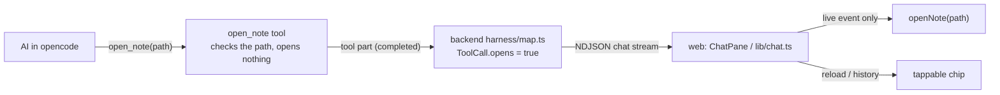

# Proposal: the AI can open notes in the UI

## What

The AI gets one new tool, `open_note(path)`. When the AI calls it during a chat turn, the app opens that
note in the editor, exactly as if the user had tapped it in the file tree.

- "Show me my reading list" → the AI finds `Lists/Reading.md` and opens it.
- "Ingest this article and then show me the summary" → after writing, the AI opens the new source note.
- The call shows up in the chat as a tool chip ("opened `Lists/Reading.md`") that can be tapped again
  later to reopen the note.

**A note** is any file the file tree lists, usually a `.md` file (`domain.md`); "page" is not a domain term, only
the feature name `ai-open-page` keeps it. Opening a note at a
heading or line, and opening other views (search, changes, admin), are out of scope.

## Why

Today the AI can read and change notes, but it can't *show* the user anything. The user has to find the
note the AI talks about by hand: in the file tree, through a `[[wikilink]]` in the answer, or through the
"changed" chips, which only exist for notes the AI wrote. On a phone that is several taps away from the
chat. Letting the AI navigate closes the loop "ask → see the result".

## How it differs from "pass a function to the chat component"

The idea was to hand the chat a client-side function as a tool. That can't work here: the agent loop runs
in **opencode on the server** ([ADR 0002](../../../docs/adr/0002-opencode-as-agent-harness.md)), so the
browser can't execute a tool. The equivalent is a server-side tool that only **checks** the path and
answers "opened". The browser sees the finished call in the chat stream it already reads and runs
`openNote(path)`. From the AI's side it is an ordinary tool, and from the UI's side it is a function
called with the tool's argument.

## Scope

In scope:

- The tool itself. It lives in the opencode image and is never read from a vault. It is allowed for the
  agents `vault` and `vault-readonly`.
- Mapping the tool call to a harness-neutral `ToolCall` flag in `packages/shared`.
- Opening the note in the web app on the live event, plus a tappable "opened" chip.
- README: what the AI can do now.

Out of scope:

- Headings, lines, other views, and opening several notes at once.
- Opening notes outside a chat turn.
- Citations ("tapping a citation opens the note", v1 plan #72). That is a separate feature, but it should
  reuse the same chip and `openNote` path so the two stay consistent.

## Expected outcome

- In a chat, "open my reading list" opens the note in the editor: in the wide layout (desktop, large iPad)
  while the turn is still running; on a phone or in the tablet overlay when it ends (opening covers the
  chat).
- While the user is editing a note, the AI doesn't switch away from it. A notice and the chip show
  what it opened instead.
- Reloading the chat later doesn't open anything again. The chip still reopens the note.
- In conflict (read-only) mode the AI can still open notes.
- A wrong path ("no such note") goes back to the AI as a tool error, so it can correct itself. The UI
  doesn't jump.
