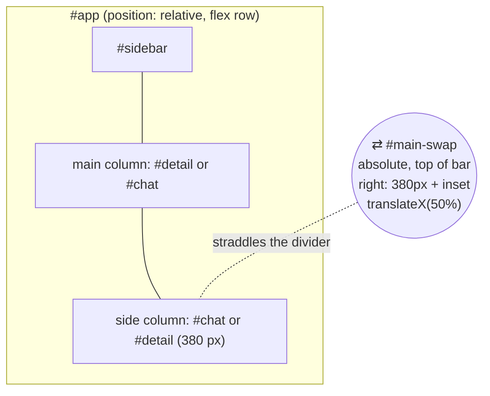
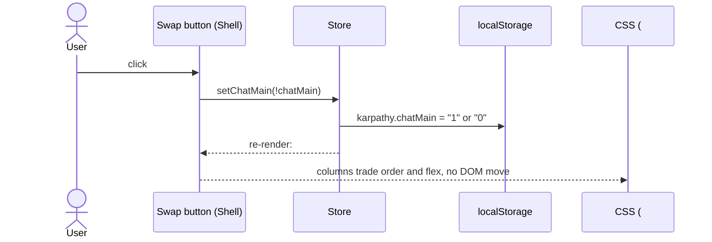

# Architecture: swap note and chat columns

## Key decisions

| Decision | Alternatives considered | Why |
|---|---|---|
| The term is **main pane** (chat in main / note in main) | "focus", "note-first / chat-first layout" | "Focus" collides with keyboard focus, which `Shell` manages for overlays (#43, #50) and which this change talks about too (Tab order). "Main pane" builds on the main / side column terms. |
| Swap the columns with CSS `order` and `flex`, no DOM moves | Keyed reorder of the panes in JSX; portals into two slots | A keyed reorder keeps component state but moves DOM nodes (`insertBefore`). That can reset scroll positions and drops keyboard focus from the moved node. CSS keeps every node where it is. Cost: the Tab order doesn't follow the visual order (§1). |
| Free the bar ends next to the divider with extra padding | Button below the bar, over the content; a normal `.ib` in the chat bar | Keeps the button on the divider at the very top, as designed, without covering the neighbouring bar buttons. |
| Accept a main column narrower than the side column at 1024–1279 px with the sidebar open | Hide the button when main < 380 px; `min-width` on the main column | A rare edge case; the user can close the sidebar. The alternatives add logic for little gain. |
| Icon-only button; tooltip and `aria-label` say what a click does | Text labels; one fixed label "Swap note and chat" | The icon explains itself visually. A screen reader user hears the target state ("Move chat to main column"), and `aria-pressed` carries the current state. |
| No keyboard shortcut, no swap animation | ⌘⇧\\ shortcut; animated flex change | Not asked for. An animated flex change makes CodeMirror re-measure on every frame. |

## 1. Approach: CSS only, no DOM moves

`Shell` (`apps/web/src/components/Shell.tsx`) always renders `<Sidebar/> <NotePane/> <ChatPane/>` as
siblings in `#app`, which is a flex row. The wide layout (`apps/web/src/styles.css`, `#app.wide …`) gives
`#sidebar` 280 px, `#detail` `flex: 1` and `#chat` 380 px.

Chat in main is a class `chatmain` on `#app`. CSS scoped to `#app.wide.insp.chatmain` swaps the two
columns with `order` and swaps their `flex` values:

```css
#app.wide.insp.chatmain #chat   { order: 1; flex: 1 1 0; border-left: none; }
#app.wide.insp.chatmain #detail { order: 2; flex: 0 0 380px; border-left: .5px solid var(--sep); }
```

The React tree is unchanged and no DOM node moves, so:

- `ChatPane` → `Conversation` keeps its `AbortController`, streaming loop and input text, and the
  composer keeps keyboard focus.
- `Editor` keeps its CodeMirror `EditorView`, with undo history, selection and scroll position. Its
  `key` is the note path, not the layout.

Rejected alternatives:

| Option | Why not |
|---|---|
| Render the panes in a different order in JSX (keyed) | React keeps the component state, but it moves DOM nodes with `insertBefore`. A moved node loses keyboard focus, and scroll positions inside it can reset. Both would have to be restored by hand. |
| Portals into two column slots | More code for the same visual result, and remount risks when the slots change. |
| A resizable splitter library | Not asked for; adds a dependency and drag handling. |

**Tradeoff:** `order` changes the visual order but not the DOM or tab order. With the chat in main, Tab
still reaches the note before the chat. That is acceptable: the swap button says which pane is in main
(`aria-pressed`, label), and the landmarks (`main` / `aside`) keep their meaning. The tab order is not
changed.

## 2. The swap button

The side column is always the rightmost one and always 380 px wide. So the divider is at the same x
whichever pane is in main, `right: 380px` from the right edge of `#app`'s content box. The button is
therefore one absolutely positioned element in `#app`. It doesn't need to belong to either pane:



- Rendered by `Shell` only when `wide && s.chatOpen`, after `<ChatPane/>`.
- `<button id="main-swap" data-testid="main-swap" aria-pressed={chatMain}>`. It shows only the icon.
  The `title` and `aria-label` say what a click does: "Move chat to main column" while the note is in
  main, "Move note to main column" while the chat is in main.
- **Tap area 44 × 44 px**, Apple's minimum touch target. Large iPads (iPad Pro 13", 1032 px in portrait,
  1376 px in landscape) get the wide layout, so the button must work with a finger, not only a mouse.
  The `<button>` itself is 44 × 44 px with a transparent background, and the visible 28 px circle is its
  `::before`. The button does not depend on hover.
- Icon `<Icon n="arrow_right_arrow_left" size={16}/>` (a ← above a →), drawn on an opaque round 28 px circle
  (`--paper`), with a hairline ring (`--sep`) and `--shadow`. It is opaque so the divider hairline
  doesn't show through: WebKit ignores a backdrop blur on the `::before`, and the translucent bar
  material let the line cross the icon. It sits vertically centred in
  the 52 px top bar (`top: 4px` for the 44 px box). Its `z-index` is above `.bar` (6) and below the
  scrim (35).
- CSS: `right: calc(380px + env(safe-area-inset-right)); transform: translateX(50%)`.

### Keeping the bar buttons free

The 44 px tap box reaches 22 px into each bar. Without a change it would cover the note bar's last
button and the chat bar's first one (`.ib` is 40 px, the bar padding is 8 px). That is `chat-toggle`
and the "Chats" title / `chat-back` with the note in main, and the chat's close ✕ and `sidebar-toggle`
with the chat in main. So while the button is shown, the two bar ends next to the divider get 32 px of
padding instead of 8 px, and the padding swaps with the columns:

```css
#app.wide.insp #detail > .bar { padding-right: 32px; }
#app.wide.insp #chat > .bar   { padding-left: 32px; }
#app.wide.insp.chatmain #detail > .bar { padding-right: 8px; padding-left: 32px; }
#app.wide.insp.chatmain #chat > .bar   { padding-left: 8px; padding-right: 32px; }
```

## 3. State

The store (`apps/web/src/store.tsx`) gets `chatMain: boolean` and `setChatMain`. They follow the
existing `karpathy.activeVault` pattern: the value is read in the `useState` initializer and written in
a `useEffect`, and both accesses are wrapped in try/catch because storage can throw.

- The key is `karpathy.chatMain`, with the value `"1"` (chat in main) or `"0"` (note in main). A missing
  or unreadable value means note in main.
- `Shell` adds `chatmain` to the `#app` class list when `chatMain` is true. The CSS selector also needs
  `.wide.insp`, so the class has no effect on tablet or phone, or while the chat is closed.



## 4. Integration points

| File | Change |
|---|---|
| `apps/web/src/store.tsx` | `chatMain` state + persistence, exposed on the store value |
| `apps/web/src/components/Shell.tsx` | `chatmain` class on `#app`; render the swap button |
| `apps/web/src/styles.css` | swap rules and bar-end padding in the wide section; `#main-swap` styles |
| `e2e/chat-main.spec.ts` | new Playwright spec (desktop, iPad, iPhone projects) |
| `README.md` | one sentence on the feature |

No backend, API or service-worker change. The CSP is unaffected because no inline styles or new assets
are added. The icon comes from the framework7 font that is already loaded.

## 5. Testing

The behavior is visual and lives in CSS, and there are no component tests. So the tests are Playwright
e2e against the dev stack (`just dev`, `just e2e`):

- **Geometry:** the boxes of `#detail` and `#chat` (widths, left-to-right order), and the button's centre
  relative to the divider x.
- **Bar buttons stay free:** `document.elementFromPoint` at the centre of each bar button next to the
  divider returns that button, not `main-swap`, whichever pane is in main.
- **No DOM move:** the test marks the DOM nodes of `.cm-editor` and the chat composer with a JS property
  before the swap and checks that the same nodes still carry it after the swap. That alone does not
  catch a keyed JSX reorder, which keeps the nodes. So the test also scrolls the editor and the chat
  message list, focuses the composer, and checks after the swap that both `scrollTop` values are
  unchanged and that `document.activeElement` is still the composer. It also checks that the typed text
  survives.
- **Persistence:** reload, and the arrangement is still swapped.
- **Scope:** on desktop the button disappears when the chat is closed. On the 820 px iPad and the
  iPhone projects there is no button at all.
- **Large iPad:** an `@ipad` test overrides the viewport with `test.use` to 1376 × 1032 (landscape) and
  1032 × 1376 (portrait) of an iPad Pro 13". It runs in the touch projects `ipad` / `webkit-ipad` and
  checks the wide layout, a 44 px tap box, and a swap by `tap()`.

The desktop run also covers WebKit through the existing WebKit project variants (the default browser is
Safari). The final check is a 1× screenshot of the divider area, read by eye. The button must sit on
the hairline whichever pane is in main.
