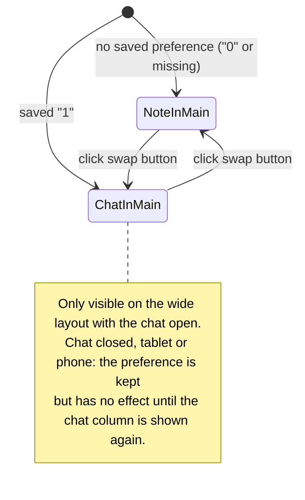

# Domain: swap note and chat columns

## New terms

| Term | Meaning | In code |
|---|---|---|
| **Main column / side column** | On the wide layout, the main column is the flexible one in the middle and the side column is the fixed 380 px one on the right. | CSS `#app.wide` |
| **Main pane** | Which of note and chat is in the main column: **note in main** (default) or **chat in main**. The other one is in the side column. A per-browser preference, not part of a vault or a chat. *Avoid:* focus (taken by keyboard focus), mode (taken by write/read mode), swap state, layout. | web store `chatMain`; localStorage `karpathy.chatMain` (`"1"` / `"0"`); class `chatmain` on `#app` |
| **Swap button** | The round, icon-only ⇄ button on the divider between main and side column, at the top. It toggles the main pane. Its tooltip and accessible name say what a click does: "Move chat to main column" or "Move note to main column". | `#main-swap`, `data-testid="main-swap"` |

## Unchanged terms

- The **sidebar** (file tree, search, changes) stays the 280 px column on the left whichever pane is in
  main.
- **Chat** and **turn** don't change. A swap only moves the chat pane; it doesn't start, stop or
  reattach a turn.
- **Focus** keeps its usual meaning, keyboard focus. A swap doesn't move it.

## Main pane over time

Closing the chat while the chat is in main doesn't reset the preference. The note fills the screen as
usual, and reopening the chat puts the chat back in main.
