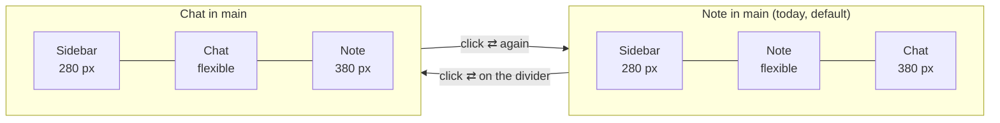

# Proposal: swap note and chat columns

## What

On the wide layout (≥ 1024 px) the note sits in the large middle column (the **main column**) and the
chat in a fixed 380 px column on the right (the **side column**). A new **swap button** sits on the
divider between the two, at the very top. It shows only an icon, a left arrow above a right arrow
(framework7 `arrow_right_arrow_left`). One click swaps the two columns: the chat takes the main column
and the note moves into the 380 px side column. A second click swaps them back.

## Why

The layout is built around the note. When a user mainly talks with the AI (long answers, ingest runs,
questions about the wiki), the chat is squeezed into 380 px while the note takes the rest of the screen.
Users need to put the chat in front without closing the note.

## Scope

In scope:

- The swap button, on the wide layout only, shown while the chat column is open.
- Swapping the columns without remounting anything: a running turn keeps streaming, the chat input
  keeps its text and focus, and the editor keeps its text, cursor, scroll position and undo history.
- Remembering the choice in the browser across reloads.

Out of scope:

- Tablet (700–1023 px) and phone (≤ 699 px). There the chat is an overlay or a tab, not a column, so
  there is nothing to swap. The saved choice is kept and applies again once the window is wide.
- Draggable or resizable dividers, and any column widths other than the two that exist (280 / 380 px).
- Changing the chat's content layout (for example a maximum line length in the wide column).
  This is a possible follow-up if long lines read badly.
- A keyboard shortcut for the swap.
- An animated swap. The columns change places instantly (an animated flex change can make CodeMirror
  stutter).

## Expected outcome

- On the wide layout with the chat open, a round ⇄ button straddles the note/chat divider at the top.
  It doesn't cover the bar buttons next to it.
- Clicking it puts the chat in the main column and the note in the 380 px side column. Clicking again
  restores the default.
- Nothing is lost on a swap: streaming continues, typed text, focus and scroll positions stay.
- After a reload the app opens with the same arrangement.
- On a large iPad (iPad Pro 13", wide layout in both orientations) the button works by touch. Its tap
  area is 44 px.
- `README.md` mentions the feature.

## Known limitation

At window widths of 1024–1279 px with the sidebar open, the main column is 1024 − 280 − 380 = 364 px,
narrower than the 380 px side column. Then "chat in main" makes the chat slightly smaller, not larger.
This is accepted: the user can close the sidebar. (The chat starts closed below 1280 px anyway.)

## Assumptions

- "Exchange content" means the two columns trade places and widths. It does not mean a new layout.
- Persisting the choice is what users expect from a layout toggle, so it is in scope. It is a per-browser
  convenience (localStorage), like the expanded folders in the file tree.
