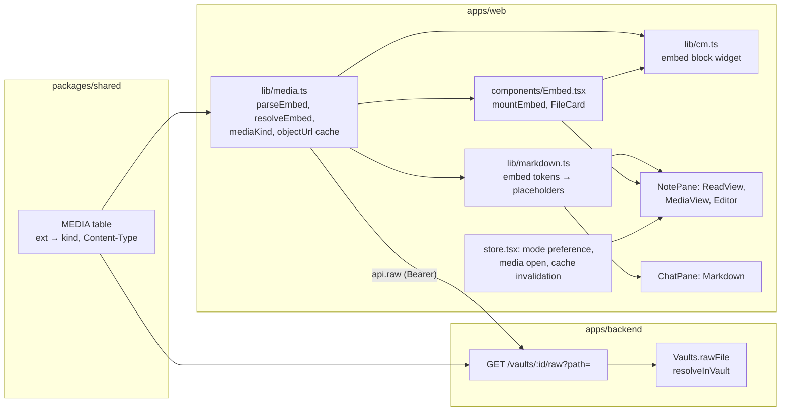
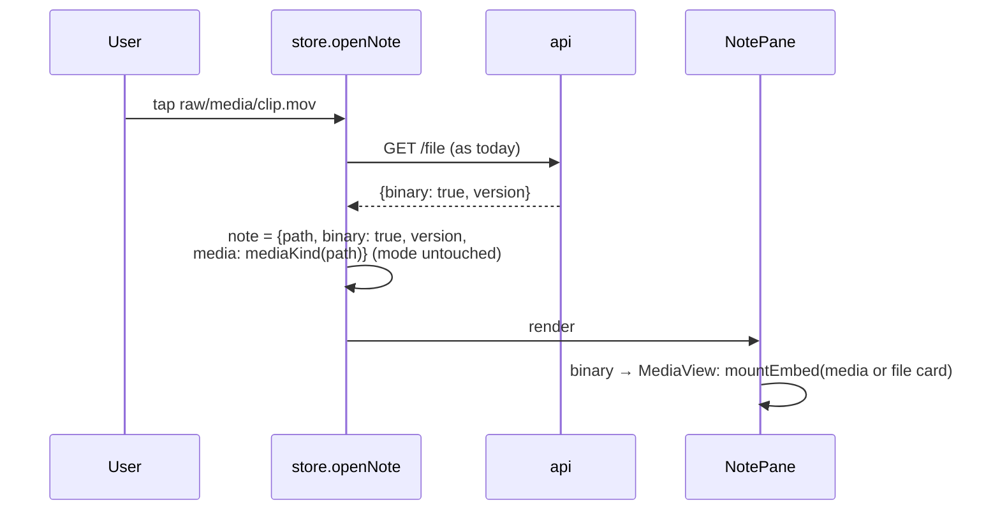
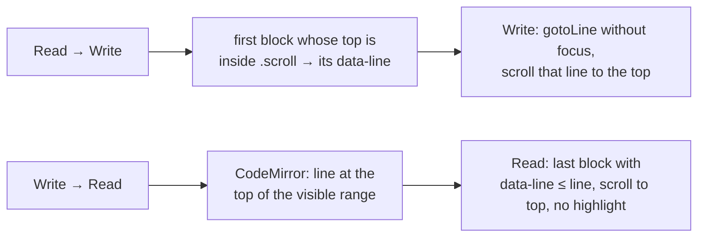

# Architecture: media embeds and a sticky Write/Read mode

## Overview



Three surfaces show embeds: **Read mode**, **Write mode** and **chat**. A fourth, the **media
viewer**, shows a media file opened on its own. All four end in one function, `mountEmbed`, so an
embed looks and behaves the same everywhere.

## Backend: raw file route

`GET /vaults/:id/raw?path=<rel>` behind the existing bearer auth.

- `Vaults.rawFile(id, path)`: `requireReady`, `resolveInVault` (no `..`, no `.git`, no symlinks), then
  `stat`. Missing → 404, directory → 400, same messages as `readFile`.
- Response via `res.sendFile(abs)` (streams, answers `HEAD`, supports `Range`). Headers set first:
  - `Content-Type` from the shared `MEDIA` table by extension; `application/pdf` for `.pdf`;
    otherwise `application/octet-stream`.
  - `Content-Disposition: attachment` for everything that isn't a media kind. PDF and unknown
    types are never rendered by the browser.
  - `X-Content-Type-Options: nosniff`, `Cache-Control: no-store` (the client cache is the object-URL
    cache; the SW doesn't cache `/raw`, its pattern only matches `files|file`).
- No ETag, no hashing: hashing a 200 MB video per request is the waste we avoid. Freshness comes from
  `files-changed` events (below).
- `GET /vaults/:id/file` is unchanged. Opening a media file from the tree still calls it once: it
  returns `binary: true` and the **version** that Delete needs (`DELETE /file` requires it). Embeds
  never call it.

## Shared: the media table

`packages/shared/src/media.ts`, exported from the package index:

```ts
export type MediaKind = 'image' | 'video' | 'audio';
export const MEDIA: Record<string, { kind: MediaKind; type: string }> = {
  png: { kind: 'image', type: 'image/png' }, /* jpg jpeg gif webp avif bmp svg */
  mp4: { kind: 'video', type: 'video/mp4' }, /* webm mov m4v ogv */
  mp3: { kind: 'audio', type: 'audio/mpeg' }, /* m4a wav ogg flac opus */
};
export function mediaKind(path: string): MediaKind | null;  // by extension, case-insensitive
```

`webm` is a video. An audio-only `.webm` still plays in `<video>`.

## Web: embed parsing and resolution (`lib/media.ts`)

```ts
interface Embed { form: 'wiki' | 'md'; target: string; width?: number; alt?: string }
type Resolved =
  | { state: 'media'; path: string; kind: MediaKind; width?: number; alt?: string }
  | { state: 'file'; path: string }        // pdf, other binary → file card
  | { state: 'note'; inner: string }       // ![[Other note]] → plain wikilink
  | { state: 'missing'; target: string }
  | { state: 'remote'; href: string };     //  → plain link

function parseEmbed(raw: string): Embed | null;
function resolveEmbed(e: Embed, notePath: string | null, paths: readonly string[]): Resolved;
```

- **Wiki form:** `![[target|300]]`: the part after `|` is a width when it is `\d+` or `\d+x\d+`
  (the height is ignored), else an alias, which becomes the `alt`. The width applies to every
  media kind, as `max-width` on the `img`, `video` or `audio` element. Obsidian applies it to
  images only. `#heading` on a note target is
  kept for the link. Resolution reuses `resolveWikilink`, which tries the exact path, then a path
  suffix, then the basename anywhere. A target with an extension resolves the same way.
- **Duplicate names (changes `resolveWikilink` for links too):** it gains an optional `from` (the
  note's path). Among several suffix or basename matches it picks, in order: one in `from`'s folder,
  then the shortest path (fewest segments), then A–Z. Today it takes the first match in file-list
  order. `followLink`, `exists` and the CodeMirror link marks pass the open note's path.
- **Markdown form:** `http:`, `https:`, `//` or `data:` → `remote`. Else URL-decode, strip a leading
  `/` (vault root), else join with the note's folder, then normalize with `posix.normalize`. A result
  that starts with `..` → `missing`. Then check against `paths`.
- **Chat:** `notePath` is `null`; relative paths resolve from the vault root.

## Web: rendering

### Read mode and chat (`lib/markdown.ts`)

`renderMarkdown(md, ctx)` gets a context `{ exists, resolveEmbed }` instead of `exists` alone.

- A new inline marked extension `embed` for `![[…]]`, registered **before** `wikilink` (its `start`
  looks for ``.
- Both emit a placeholder, never an ``:
  `<span class="embed" data-path="…" data-kind="image" data-width="300" data-alt="…"></span>`.
  `note` → today's wikilink `<a class="wl">`, `remote` → `<a href rel="noopener noreferrer"
  target="_blank">alt or URL</a>`, `missing` → `<span class="embed miss" data-target>`.
- DOMPurify keeps `data-*` attributes, so the placeholders survive sanitizing unchanged. Sanitizing
  still forbids what it forbids today.

The `Markdown` component (`NotePane.tsx`) runs `mountEmbed` on each `.embed` placeholder in a
`useLayoutEffect` keyed on the HTML. The HTML is re-set only when the text changes, so mounted
players survive unrelated re-renders.

### `mountEmbed(el, resolved, vault)` (`components/Embed.tsx`)

Plain DOM, not React, so the CodeMirror widget can use it too. It creates the element with
`document.createElement` and sets `src` to an object URL. No HTML strings, so nothing reaches the
DOM unsanitized.

| Resolved | Element |
|---|---|
| image | `` |
| video | `<video controls playsinline preload="metadata">` |
| audio | `<audio controls preload="metadata">` |
| file (`.pdf`) | file card: name, size from `HEAD`, **Open**, **Download** |
| media over the preview limit | file card: name, size, **Load anyway (N MB)**, **Download** |
| file (other), fetch failed, offline | file card: name, size from `HEAD`, **Download** |
| missing | file card marked missing, no buttons |

While the bytes load, a fixed-height skeleton holds the space (no layout jump while reading). Download
fetches through the cache and clicks a temporary `<a download="name" href="blob:…">`. SVG is never
opened as a page.

**Load anyway:** calls `objectUrl(vault, path, { force: true })`, which skips the size check, then
replaces the card with the player. A forced entry counts toward the cache budget like any other.
If it alone exceeds the budget, every other entry is evicted, and it stays until it is evicted
in turn or invalidated.

**Tap on an image:** `mountEmbed` takes an `onOpen(path)` callback. An `` gets a click
handler and `cursor: zoom-in`, and calls `store.openNote(path)`. That pushes a history entry, as
any open does, so Back returns to the note (see "Place" below). Video and audio get no handler.
Their controls take the taps.

**Open (PDF only):**

- The click handler calls `window.open('', '_blank')` **synchronously**. A `window.open` after an
  `await` is blocked as a popup in Safari. Then it fetches through the cache and sets the new tab's
  `location` to the object URL. If the fetch fails, it closes the tab and shows a toast.
- The blob is re-wrapped as `new Blob([bytes], { type: 'application/pdf' })`. Its type comes from
  the app, not the response, so the tab can only open the browser's PDF viewer.
- The 50 MB preview cap doesn't apply. Open is an explicit request, like Download.
- No CSP change: a top-level navigation to `blob:` isn't governed by `frame-src` or `object-src`.
- The object URL stays in the cache, so the open tab keeps working. Eviction may revoke it later.
  A reload of that tab then fails, which is acceptable for a viewer tab.
- **Unverified:** the installed iOS home-screen app (standalone PWA). `window.open` there may open
  an in-app browser sheet or Safari. The visual check step tries it on a real device.

### Write mode (`lib/cm.ts`)

A `StateField` (CodeMirror requires block decorations to come from state, not a view plugin) scans
the document for embeds with `parseEmbed` per line. For each line that has one or more, it adds
`Decoration.widget({ block: true, side: 1, widget: new EmbedWidget(resolved[]) })` at the line's
end. The raw text stays as it is, so the round-trip stays lossless.

- `EmbedWidget.eq` compares the resolved paths and widths. Typing elsewhere doesn't recreate players.
- `toDOM` calls `mountEmbed`. `ignoreEvent` returns `true` for clicks inside the widget, so the
  editor doesn't move the cursor, and a tap on an image opens it (the same `onOpen` as Read mode).
- Not inside fenced code or frontmatter: the same syntax-tree check the wikilink marks use.
- The field recomputes on `docChanged` and on the existing `refreshLinks` effect. A new file list can
  turn a missing embed into a found one, like missing-link marks (#55).
- `liveMarkdown(exists, onWikilink)` gains a third argument `resolveEmbed` (closes over the note path
  and the latest file list via the `latest` ref in `Editor.tsx`).

### Media viewer (opening a file from the tree)



`OpenNote` / `note` state gains `media?: MediaKind | null`. The pane hides the mode toggle and
find-in-note for binary files, as today. Delete stays available and uses the version from `/file`.
`/file` reads the whole file once to hash it. That's acceptable for one open, and the reason embeds
use `/raw` only.

## Web: object-URL cache (`lib/media.ts`)

```ts
function objectUrl(vault: string, path: string, opts?: { force?: boolean }): Promise<
  { url: string; size: number } | { tooLarge: true; size: number }>;
function invalidate(vault: string, paths?: string[]): void;  // all paths when omitted
```

- Key `vault\0path`. The value is the pending promise, so two embeds of one file fetch once.
- `api.raw(vault, path, signal)` does an authed `fetch`. If `Content-Length` > `MAX_PREVIEW_BYTES`
  (50 MB) and `force` isn't set, it aborts and resolves `tooLarge`. A `tooLarge` result isn't
  cached, so a later `force` call fetches. Otherwise it reads `blob()` → `URL.createObjectURL`.
- Total budget 200 MB. The least recently used entries are revoked (`URL.revokeObjectURL`) and
  dropped when the budget is exceeded.
- `store.tsx`: a `files-changed` event calls `invalidate(vault, changedPaths)`. Switching vault or
  logging out calls `invalidate(vault)`. A mounted player keeps its old URL until it re-mounts. A
  revoked URL only matters for a new mount, which fetches again.
- 401 goes through the existing `onUnauthorized` path in `api.ts`.

## Sticky mode (`store.tsx`)

```ts
const [mode, setModeState] = useState<'write' | 'read'>(() => readPref('karpathy.mode') === 'read' ? 'read' : 'write');
const setMode = (m) => { setModeState(m); writePref('karpathy.mode', m); };
```

- Remove `if (!keepMode) setMode('write')` and the `keepMode` parameter of `openNote`. Its four
  `true` call sites drop the argument. `NotePane`'s toggle already calls `setMode`.
- `readPref` / `writePref` wrap `localStorage` in `try/catch` (private mode). Use the helper chat-main
  added for `karpathy.chatMain` if it exists by then, else add it next to that code.
## Hit position in Read mode

Today `note.goto` (a line, set by search hits and by `[[note#heading]]` via `headingLine`) only
runs in Write mode (`gotoLine`). With a sticky mode, Read mode needs it too.

- **Source lines on blocks:** `toHtml` walks marked's top-level tokens (`marked.lexer`), adds up
  the newlines of each token's `raw` to get its start line (plus the frontmatter's line count,
  since the body is rendered without it), and renders each top-level block wrapped with
  `data-line="N"` on its first element. A `walkTokens`/renderer hook sets the attribute on the
  block's own tag. No wrapper elements are added, so the styling stays as it is. DOMPurify keeps
  `data-*`.
- **Granularity:** top-level blocks. A hit inside a list or a table lands on the whole list or
  table. Good enough for a long note. Per-item lines are a refinement if needed.
- **Scrolling:** `ReadView` runs an effect on `note.goto`. It picks the last element with
  `data-line <= line`, calls `scrollIntoView({ block: 'center' })` and adds class `hit` for 1.5 s (a
  background fade; with `prefers-reduced-motion`, no fade, only the tint).
## Place: Back and mode switches

**Back restores the scroll position.** Before `openNote` leaves a note, the store saves the pane's
place for `vault\0path` in an in-memory map: `.scroll`'s `scrollTop` and the mode. When a note is
shown through history navigation (the existing `popstate` → `openNote` path in `store.tsx`) and has
a saved place in the same mode, the pane restores `scrollTop` once the layout is stable: after
CodeMirror measured itself, and after the embeds above the saved position have loaded or failed
(at most 1 s). To keep that short and jump-free, the object-URL cache also stores each image's and
video's natural size after its first load. A skeleton for a known file uses that aspect ratio, so
on Back the embeds have their final height before the bytes are decoded. A new open
(tree, search, link) doesn't restore. It lands at the top or at its hit position. The map lives as
long as the page, and nothing is persisted.

**Switching mode keeps the place**, using the `data-line` blocks:



- `setMode` stays a plain setter. `NotePane` reads the place from the outgoing view in the toggle's
  click handler and passes it as a one-shot `pendingLine` to the incoming view.
- `EditorHandle` gains `topLine()` and `gotoLine(line, { focus: false, align: 'start' })`. Read →
  Write must not open the keyboard on a phone.
- Precision is per top-level block: switching inside a long list lands on the list.

## Proxy: CSP

`deploy/proxy/Caddyfile`: add `media-src 'self' blob:` to the Content-Security-Policy. `img-src`
already allows `blob:`. Nothing else changes: `frame-src` and `object-src` stay closed (no inline PDF),
and `connect-src 'self'` covers `/api/.../raw`. `Caddyfile.dev` sets no CSP, so only the prodtest
stack can prove this. The e2e media spec runs there too.

## Decisions and tradeoffs

| Decision | Chosen | Rejected because |
|---|---|---|
| Getting bytes past bearer auth | Authed `fetch` → `blob:` object URL | Token in the query string: a long-lived secret in proxy logs and history. Cookie auth: a second auth scheme plus CSRF surface. Service worker injecting the header: it could stream and seek, but the token lives in page `localStorage`, not reachable from the SW without new plumbing. Deferred. |
| Large files | 50 MB preview limit, file card with **Load anyway** above it | No cap: a 500 MB clip would sit in iPad memory unasked. 200 MB cap: same risk for most phone videos. Streaming through a service worker: no cap and seeking, but the token has to reach the worker. Follow-up if big videos are common. |
| Duplicate file names | Note's folder → shortest path → A–Z, for embeds and links | First match in list order: depends on tree order, and differs from Obsidian, whose vaults these are. Embeds only: links and embeds would disagree on the same name. |
| Read-mode hit position | `data-line` on top-level blocks, scroll and highlight | Accept landing at the top: a search hit in a long note looks broken. Switch to Write for search hits: undoes the sticky mode. |
| Tap on an image | Opens the media file in the note pane, Back returns | Nothing: diagrams and screenshots are unreadable at column width on a phone. Lightbox with pinch-zoom: a new component; the media view already exists. |
| Back | Restores the scroll position of any note seen in this session (in-memory map) | Only after tapping an image: the same code, and an inconsistent Back. Persisted positions: no need stated. |
| Mode switch | Keeps the place via `data-line` (Read ↔ Write) | Land at the top (today): undermines "read, then fix a typo", which a sticky mode makes common. |
| Width suffix | Applies to every media kind | Images only (Obsidian): a smaller video next to text is useful on a phone, and no content depends on the other reading. |
| Offline media | Not cached; the file card says offline | Cache small images in the SW: bloats the iOS storage quota for a rare, read-only mode. |
| Vocabulary | **Vault file** as the umbrella term; **Note** = text only | Keep "Note" for everything: "Delete note" on a video reads wrong. Rename the code identifiers too: churn without user value. |
| Kind detection | Extension only, shared table | Content sniffing: different answers on client and server, and `nosniff` is the point. |
| Freshness | `files-changed` events invalidate the cache | ETag on `/raw`: hashes the whole file per request. |
| Write-mode display | Block widget below the line, text kept | Replacing the embed text with the image (Obsidian's live preview): hides editable text and needs cursor-in/out handling, which is awkward on touch. Possible later. No embeds in Write mode: Write is the default, so most users would never see them. |
| Remote images | Blocked, shown as a link | Allowing `img-src https:`: tracking pixels from git-sourced notes. |
| PDF | File card + Open (new tab, browser viewer) + Download | Inline with the built-in viewer: needs `frame-src blob:`, and is poor on iOS (first page only) and Android (no embedded viewer). pdf.js: works everywhere but adds ~1 MB, needs its own page, zoom and scroll UI and security updates (CVE-2024-4367). A follow-up if inline is missed. |
| Note transclusion | Out of scope, renders as link | Recursive rendering, cycles, editing semantics. Its own change. |
| Mode storage | Per browser, `localStorage` | Per vault or per note: more state for no stated need. Server-side: the mode is a device habit (read on phone, write on Mac). |

## Risks

- **Memory on iOS.** Object URLs hold the whole file. The 200 MB budget and the 50 MB cap bound it.
  Tune them after use.
- **Codec support.** `.mov` (HEVC) doesn't play in Chromium, `.mkv` nowhere reliable. The player shows
  its error, and Download stays on the file card below the player.
- **Parallel changes.** `chat-main` and `ai-open-page` are `applying` and already modify
  `store.tsx` and `NotePane`'s neighbours. Apply this change after them, or rebase onto their final
  state. `ai-open-page` opens notes through `openNote`. With the `keepMode` parameter gone, an
  AI-opened note keeps the mode preference too, which is the intended behavior.
- **Performance of the Write-mode field.** It scans every line on each change. Embeds are rare and
  `parseEmbed` exits fast on lines without `![`. Measure on the `Long.md` e2e fixture.
