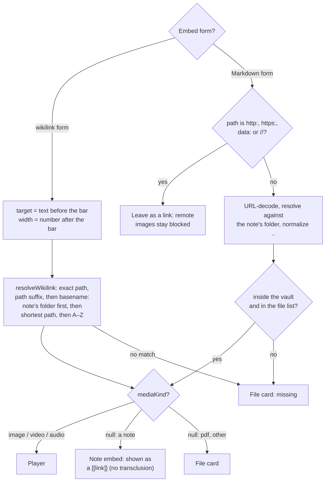
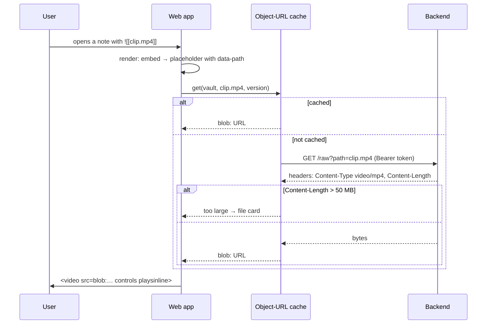
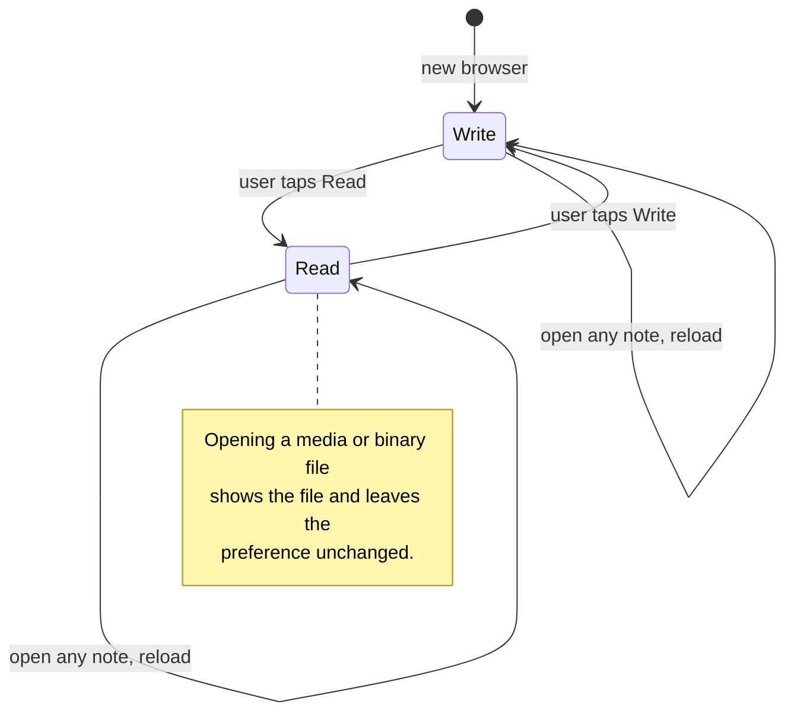

# Domain: embeds, media files and the mode preference

## New and changed terms

| Term | Meaning | Code |
|---|---|---|
| **Embed** | Markdown that asks for a file to be shown inside a note: `![[target]]`, `![[target\|300]]` (width in px) or ``. It is text in the note; showing it never changes the note. *Avoid:* attachment (that's the file), inline image, transclusion (reserved for embedding a note's text, which we don't do). | web `lib/media.ts` `parseEmbed` |
| **Media file** | A file in the vault whose extension is in the media table: an image, video or audio file. Shown, never edited. Every media file is binary, but not every binary file is a media file. *Avoid:* attachment, asset, resource. | `mediaKind(path)` → `image` · `video` · `audio` · `null` |
| **Media kind** | `image`, `video` or `audio`, from the file extension alone (case-insensitive), never from content sniffing. Decides the HTML element and the Content-Type the backend sends. | `MEDIA` table, shared by web and backend |
| **File card** | What shows instead of a player: the file name, its size and a **Download** button, plus **Open** for a PDF (the browser's PDF viewer in a new tab), plus **Load anyway** for a media file over the preview limit. Used for PDFs, binary files, media over the limit, and embeds whose file is missing (then marked as missing, no buttons). *Avoid:* placeholder (taken by the empty note pane). | web `FileCard` |
| **Preview limit** | 50 MB. A media file up to this size loads by itself when an embed or the media view shows it. A bigger one shows a file card with **Load anyway (N MB)** and loads only on that tap. | `MAX_PREVIEW_BYTES` |
| **Raw file** | The bytes of a vault file as stored, with a Content-Type from the media table. Read-only, the same path rules as a note. *Avoid:* download (the user action), blob (the browser object). | `GET /vaults/:id/raw?path=` |
| **Mode preference** | The Write/Read mode the user last chose. It applies to every note opened afterwards and survives a reload. One per browser, not per vault or note. *Avoid:* default mode (Write is the default only until the user chooses). | web store `mode`; localStorage `karpathy.mode` (`"write"` / `"read"`) |
| **Vault file** *(new umbrella term)* | Any file in the vault: a note, a media file or a binary file. The file tree, Delete, the Changes list and commits work on vault files. *Avoid:* note (for anything that isn't text), document, item. | `FileEntry`; web store `note` state (identifier kept, see below) |
| **Note** *(changes system term)* | A vault file that is UTF-8 text, usually `.md`. Only notes can be edited and have a Write/Read mode. The system definition ("a file in the vault … binary files are shown but can't be edited") becomes the definition of *vault file*. | `FileContent.binary === false` |
| **Binary file** | A vault file that isn't text and isn't a media file (`.pdf`, `.zip`, …). Shown as a file card. | `FileContent.binary && !mediaKind(path)` |
| **Write mode / Read mode** *(changed)* | Write mode is the default for a new browser. Once the user switches, the mode preference holds for every note opened afterwards. Media files and binary files have no mode. | web `NotePane`, store `mode` |
| **Hit position** | Where an opened note should land: a line (search hit) or a heading (`[[note#heading]]`). Write mode puts the cursor on the line. Read mode scrolls to the rendered block that contains the line and briefly highlights it. | store `note.goto`; Read-mode blocks carry `data-line` |

Code identifiers (`note`, `openNote`, `NotePane`) stay as they are. Only the glossary and UI text
change. For a media file or binary file, the delete button says "Delete file" and the confirm dialog
says "Delete `path`?".

## How an embed finds its file

Same rules Obsidian uses. The wikilink form resolves like a `[[link]]`, but the target keeps its
extension. The Markdown form is a path relative to the note.

## Showing a media file

## The mode preference

Before this change, opening from the tree, search, the Changes list or a chat chip set the mode back
to Write. Only link and history navigation kept Read mode (issue #17). After this change no
navigation changes the mode. Only the Write/Read toggle does.

## Rules

- An embed never changes the note text. Write mode shows the embed block **below** the line and
  keeps the raw `![[…]]` text editable.
- Media kind comes from the extension only. A `.png` that holds text is still sent as `image/png`,
  with `nosniff`. A file with an extension outside the table is sent as
  `application/octet-stream` with `Content-Disposition: attachment`. The browser never renders it.
- SVG is only ever shown inside ``, where its scripts don't run. The file card for an SVG
  downloads it and never opens it as a page.
- **Open** exists only for `.pdf`. The tab gets a blob the app built with type `application/pdf`,
  so the browser can only show it with its PDF viewer, never as a web page on the app's origin.
- Tapping an embedded image, in Read or Write mode, opens that media file in the note pane like
  opening it from the tree. Videos and audio keep their own controls, so tapping them doesn't
  navigate.
- **Place:** Back to a note seen in this session returns to where the user left it. Switching
  between Write and Read on the same note keeps the place (the same source line, as close as the
  rendered blocks allow).
- The width after the bar (`|300`, `|300x200`) applies to images, videos and audio players alike.
  Any other text after the bar is the caption (`alt`).
- Offline, media isn't available: embeds show a file card marked offline. Media is never in the
  offline cache.
- When two vault files share a name, a basename match prefers the note's own folder, then the
  shortest path, then A–Z. Embeds and `[[links]]` resolve the same way.
- Media is read-only for the AI and the user alike in this change. Creating media files (upload,
  paste) is out of scope.
