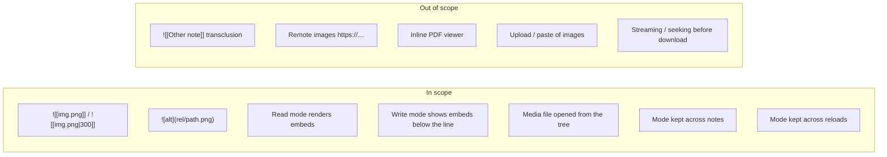
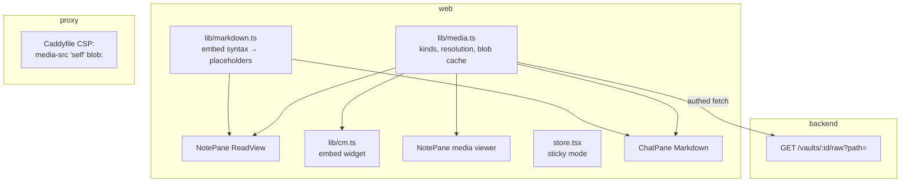

# Proposal: media embeds and a sticky Write/Read mode

## What

Two editor improvements:

1. **Media embeds.** Notes show the images, videos and audio files they embed, the way Obsidian
   does, instead of the raw `![[photo.jpg]]` text. Opening a media file from the file tree shows
   the file instead of "Binary file — can't be edited here."
2. **Sticky mode.** When the user switches between **Write mode** and **Read mode**, the app keeps
   that mode for every note opened afterwards (tree, search, chat chips, links) and after a reload.
   Today every open from the tree, search or chat resets to Write mode.

## Why

- The vaults are Obsidian vaults. Web-clipped sources, screenshots and photos sit next to the notes
  (`raw/media/`, attachments folders) and are embedded with `![[…]]`. On the phone and iPad they
  are the reason the note exists, and today the app only shows the embed text.
- A user who reads on the phone switches to Read mode and then browses. Being dropped back into
  Write mode on every tap is the most frequent annoyance in that flow. Link navigation already keeps
  Read mode (issue #17); the tree, search and chat don't.

## Scope

### Formats

Modeled on Obsidian's accepted file formats, limited to what browsers can play (no `mkv`, `3gp`):

| Kind | Extensions | Shown as |
|---|---|---|
| Image | `png` `jpg` `jpeg` `gif` `webp` `avif` `bmp` `svg` | `` |
| Video | `mp4` `webm` `mov` `m4v` `ogv` | `<video controls playsinline>` |
| Audio | `mp3` `m4a` `wav` `ogg` `flac` `opus` | `<audio controls>` |
| PDF | `pdf` | A file card with name, size, **Open** (the browser's PDF viewer in a new tab) and **Download** |
| Anything else | all other non-text files | A file card with name, size and a **Download** button |

`mkv` and some `mov` codecs don't play in every browser. The player then shows its own error and
the file card's Download still works. We don't transcode.

### Decisions visible to the user

- **Remote images stay blocked.** `` keeps showing as a link. Notes come from git,
  web clips and AI ingests; loading remote images would let any note phone home (tracking pixels).
  The prod CSP already forbids it.
- **PDFs open in a new tab, not inline.** A PDF embed and an opened PDF show the file card. **Open**
  shows the PDF in the browser's own viewer in a new tab, and Download saves it. Inline was
  rejected: the browser's built-in viewer inside a note needs a `frame-src blob:` CSP relaxation,
  and iOS and Android show embedded PDFs poorly (first page only, or nothing). Rendering with pdf.js
  works everywhere but is the largest piece of work. It's a possible follow-up change.
- **Large files load on request.** Media is fetched whole before it shows (the bearer token can't
  ride on ``). Up to **50 MB** it loads by itself. Above that the file card offers
  **Load anyway (N MB)** and Download. Once loaded, the user can seek freely. Streaming through a
  service worker is a possible follow-up.
- **Tapping an image opens it** in the note pane, like opening the file from the tree. Video and
  audio keep their own controls.
- **Back returns to the same place**, after any navigation (image, link, search hit, tree), for
  notes seen in this session. Today Back lands at the top.
- **Switching Write ↔ Read keeps the place.** Read → Write puts the cursor on the first visible
  block's line, and Write → Read scrolls to the block of the topmost visible line. Today both land
  at the top.
- **The size suffix works on every media kind:** `![[clip.mp4|300]]` makes the video 300 px wide.
  Obsidian applies it only to images; it ignores it on video, so vaults stay compatible.
- **Offline, media isn't available.** Embeds show a file card saying the file isn't available
  offline. Notes stay cached as today.
- **Duplicate file names resolve like Obsidian.** If `image.png` exists in several folders, the
  one in the note's folder wins, then the shortest path, then A–Z. This also changes which file a
  `[[link]]` opens when names repeat. Today it takes the first match in the file list.
- **Vault file vs. note.** Images, videos and PDFs are *vault files*, not *notes*. Notes are the
  text files. The delete button on a media file says "Delete file".
- **Note transclusion** (`![[Other note]]`, `![[Other note#Heading]]`) is out of scope. It renders
  as a normal wikilink to that note, as today.
- **Chat messages** use the same renderer. Embeds in AI answers render too, resolved in the
  active vault.
- **Write mode** shows an embed as a block below its line. The raw `![[…]]` text stays
  visible and editable. The document is never rewritten (lossless round-trip).
- **Sticky mode, one per browser.** The mode is a per-browser preference stored like the main-pane
  choice (`karpathy.chatMain`). Default for a new browser stays **Write mode**. Binary files have no
  mode toggle, and opening one doesn't change the stored mode.
- **Search hit in Read mode.** Today a search hit forces Write mode, so it can jump to the matching
  line. With a sticky mode, a search hit in Read mode opens in Read mode, scrolls to the rendered
  block that contains the line and highlights it briefly. `[[note#heading]]` in Read mode gets the
  same, so it lands on the heading instead of the top.

## Impact

- **Backend:** one new read-only route that streams file bytes with a Content-Type from an
  allowlist.
- **Web:** embed parsing in the renderer, a media module (format table, path resolution, cached
  object URLs), a CodeMirror widget, a media viewer in `NotePane`, sticky mode in the store.
- **Proxy:** CSP gains `media-src 'self' blob:`. Without it, video and audio work in dev and fail in
  prod.
- **No change** to the data model, git flow, opencode or the AI's tools.

## Expected outcome

- A note with `![[photo.jpg]]` shows the photo in Read mode, in Write mode below the line, and in
  chat answers. A `.mp4` embed plays inline on iPhone without going fullscreen.
- Tapping `raw/media/clip.mov` in the tree plays it. Tapping `paper.pdf` shows a card with Open and Download. Open shows it in a new tab.
- The user switches to Read mode once. Every note opened from the tree, search, chat chips or links
  opens in Read mode, also after a reload, until they switch back. A search hit lands on the
  matching block in Read mode too.
- Tapping a screenshot in a note shows it alone in the pane; Back returns to the note.
