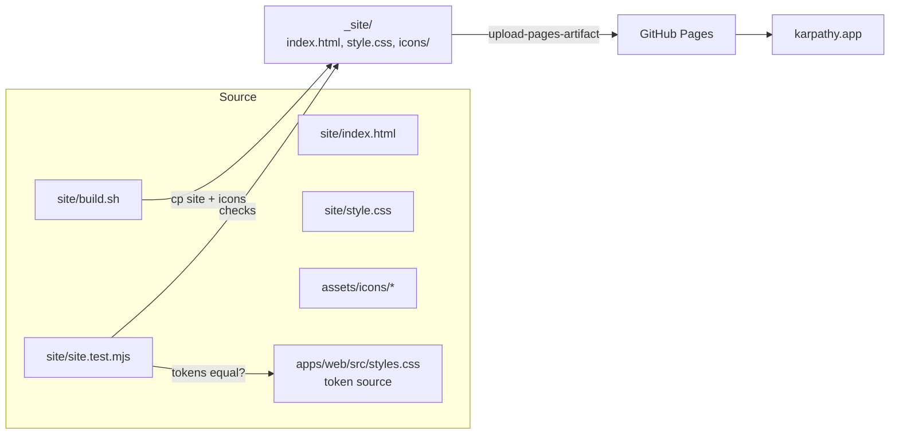

# Architecture: static site on GitHub Pages

## Overview

Hand-written static files in `site/`, assembled into `_site/` together with the shared icons by one small
shell script, tested by a Node test, deployed by a dedicated GitHub Actions workflow with GitHub's official
Pages actions. No framework, no npm dependencies, nothing new in the app's build.



## Layout

```
site/
  index.html        start page (hero, features, how it works, CTA, footer)
  style.css         site styles; the :root token blocks copied from the app
  build.sh          assembles _site/ (site files + assets/icons → _site/icons/)
  site.test.mjs     node:test — structure, links, tokens
  package.json      workspace @karpathy/site; "test": "node site.test.mjs"
```

`_site/` is a build output and goes into `.gitignore`.

## Key decisions

| Decision | Chosen | Alternatives considered | Why |
|---|---|---|---|
| Location | `site/` at the repo root, its own tiny npm workspace (`@karpathy/site`, no dependencies) | `apps/site`; a root `test` script chaining `&& node --test …` | The website isn't part of the app. As a workspace its test runs in the root `npm test` like every other package; a chained root script would receive `just test <args>` arguments meant for the workspace runners. |
| Generator | None: plain HTML + CSS | Vite, Astro, md2html | One page with invented content; a generator adds dependencies and build time for nothing yet. Revisit when there are more than ~3 pages or shared header/footer markup gets copied around. |
| Styling | Copy the two `:root` token blocks (light + dark) from `apps/web/src/styles.css` into `site/style.css`; a test asserts the values stay equal | Extract tokens into a shared file imported by both | The copy leaves the app untouched (no risk to the PWA build); the test turns silent drift into a CI failure, so the duplication is safe. |
| Logo | `assets/icons/icon-512.png` (hero), `icon-192.png`, favicons, apple-touch icon, copied to `_site/icons/` at build | The 800 KB master `karpathy_app_logo.png` | Already-optimised derivatives of the same logo; one source (`assets/make-icons.sh`). |
| Hosting | GitHub Pages, source "GitHub Actions" | `gh-pages` branch; Netlify / Cloudflare Pages | Asked for; artifact-based deploy keeps generated files out of git history. |
| Custom domain | Set via the Pages API/settings (`cname=karpathy.app`) | `CNAME` file in the artifact | With source "GitHub Actions" GitHub ignores a `CNAME` file; the setting is what counts. |
| Trigger | push to `main` with path filter + `workflow_dispatch` | every push; release tags | Deploys exactly when the site changes; the site isn't versioned with the app. |
| Test runner | `node:test` (built into Node 22); the workspace's `test` script runs the file directly (`node site.test.mjs`), so extra CLI arguments are ignored | vitest, Playwright | No dependency; runs in CI's existing `npm test` step and in `pages.yml` without `npm ci`. |

## The build script

`site/build.sh` is the only place that knows how the output is assembled; CI, the deploy workflow and the
local preview call it.

```bash
#!/usr/bin/env bash
# Assemble the website into _site/: site files plus the shared icons.
set -euo pipefail
cd "$(dirname "$0")/.."
rm -rf _site && mkdir -p _site/icons
find site -maxdepth 1 -type f ! -name '*.sh' ! -name '*.mjs' ! -name '*.json' -exec cp {} _site/ \;
cp assets/icons/* _site/icons/
```

## The test (`site/site.test.mjs`)

Runs `build.sh`, then asserts against `_site/`:

1. `index.html` exists, has `<title>` containing "karpathy.app", a viewport meta, `lang`, and a link to
   `https://github.com/tillg/karpathy.app`.
2. Every local `href`/`src` in `index.html` resolves to a file in `_site/` (catches broken logo/favicon
   paths).
3. Every custom property the site defines in its light and dark `:root` blocks exists in the app's
   matching block in `apps/web/src/styles.css` with the same value.
4. No absolute-root paths (`/…`) — the page must also work under `https://tillg.github.io/karpathy.app/`
   before DNS moves.

## Workflow (`.github/workflows/pages.yml`)

```yaml
name: Pages
on:
  push:
    branches: [main]
    paths: ['site/**', 'assets/icons/**', 'apps/web/src/styles.css', '.github/workflows/pages.yml']
  workflow_dispatch:
permissions: { contents: read }
concurrency: { group: pages, cancel-in-progress: false }
jobs:
  build:
    runs-on: ubuntu-latest
    steps:
      - uses: actions/checkout@v4
      - uses: actions/setup-node@v4
        with: { node-version: 22 }
      - run: node site/site.test.mjs
      - uses: actions/configure-pages@v5
      - uses: actions/upload-pages-artifact@v3
        with: { path: _site }
  deploy:
    needs: build
    runs-on: ubuntu-latest
    permissions: { pages: write, id-token: write }
    environment: { name: github-pages, url: '${{ steps.deployment.outputs.page_url }}' }
    steps:
      - id: deployment
        uses: actions/deploy-pages@v4
```

`apps/web/src/styles.css` is in the path filter because the token test depends on it: a token change in the
app re-runs the site test (and fails until the site's copy is updated).

The artifact is `_site/`, never the repo root: the root `index.html` is md2html's generated spec index.

## Integration points

- **`package.json`** — `site` joins `workspaces`; the root `test` script is unchanged and picks up the
  site's `test`, so `ci.yml`'s existing `npm test` step covers the site ("when building").
- **`justfile`** — `just site` runs `build.sh` and serves `_site/` on localhost for a preview.
- **`.gitignore`** — adds `_site/`.
- **GitHub repo settings** (one-time, via `gh api`) — Pages enabled with `build_type=workflow`, `cname`
  `karpathy.app`, later `https_enforced=true`.
- **GoDaddy DNS** (one-time, manual) — apex: delete the two GoDaddy A records, add `185.199.108.153`,
  `185.199.109.153`, `185.199.110.153`, `185.199.111.153`; `www`: CNAME `tillg.github.io`; unpublish the
  Website Builder site. `app.karpathy.app` stays as it is.
- **Domain verification** (recommended) — verify `karpathy.app` in the GitHub account's Pages settings
  (a TXT record) so no other GitHub account can claim the domain.
- **README** — link at the top, plus a short "Website" section on where the source lives and how it deploys.

## Risks

| Risk | Mitigation |
|---|---|
| `.app` is HSTS-preloaded: between the DNS change and certificate issuance the site shows a TLS error | Expected, usually minutes to an hour; do the cutover when that's acceptable. Enforce HTTPS once the cert exists. |
| Domain takeover if Pages is disabled while DNS still points to GitHub | Verify the domain in GitHub (TXT record). |
| Token drift between app and website | The token test fails CI. |
| Pages not enabled before the first workflow run → `deploy-pages` fails | Plan enables Pages before the workflow lands on `main`. |
