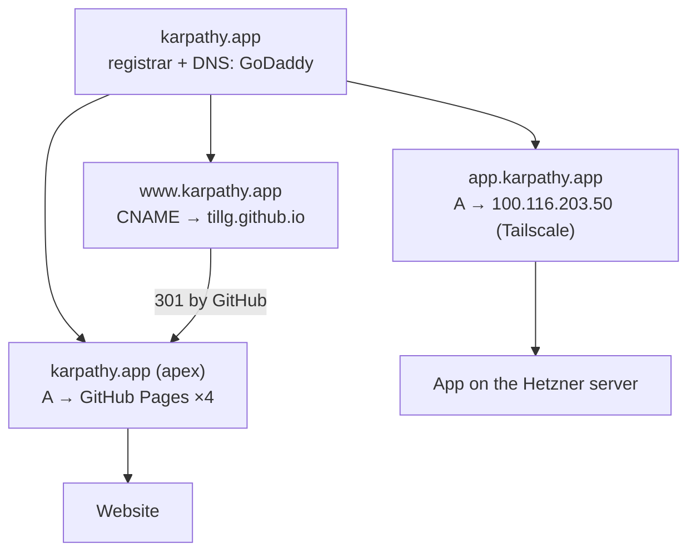
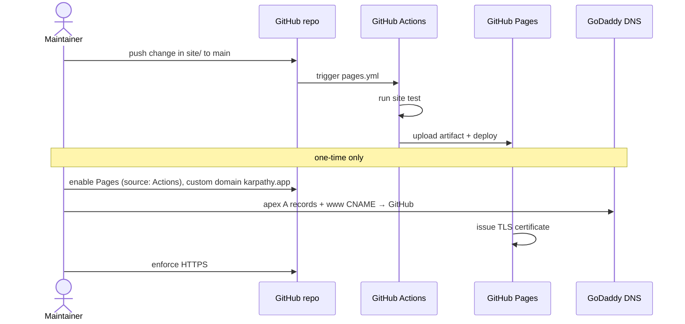

# Domain: website, app and the karpathy.app domain

The project gains a second, public-facing thing next to the app. These terms keep them apart.

## New terms (for `CONTEXT.md`)

**Website**:
The public product page at `https://karpathy.app` that describes the app. Static, holds no user data, has no
login. Its source is `site/` in this repo.
_Avoid_: Homepage, landing page, site (alone, ambiguous with "vault"), web app

**App**:
The PWA plus its backend at `app.karpathy.app` (or any other deployment target) — everything the existing
specs describe. Not public on the prod target (Tailscale only).
_Avoid_: Website

**Website deploy**:
Publishing the current `site/` from `main` to GitHub Pages. Happens on its own, independent of an app
release; the website has no version number.
_Avoid_: Release (reserved for app releases, `vX.Y.Z`)

## The domain `karpathy.app`

One domain, registered at GoDaddy, DNS hosted by GoDaddy (`ns77/ns78.domaincontrol.com`). After this change
its names serve two unrelated hosts:

- `.app` is on the browsers' HSTS preload list: every name under it is HTTPS-only. The website is reachable
  only once GitHub Pages has issued a certificate for `karpathy.app`, which happens after DNS points to
  GitHub.
- Changing the DNS is an **outward-facing, user-performed** step in GoDaddy's UI. The repo can't do it.

## Who does what

Parties: the **maintainer** (the single user, who owns the repo and the GoDaddy account), **GitHub** (Actions,
Pages, TLS for the website) and **GoDaddy** (registrar and DNS). Visitors of the website are anonymous.
