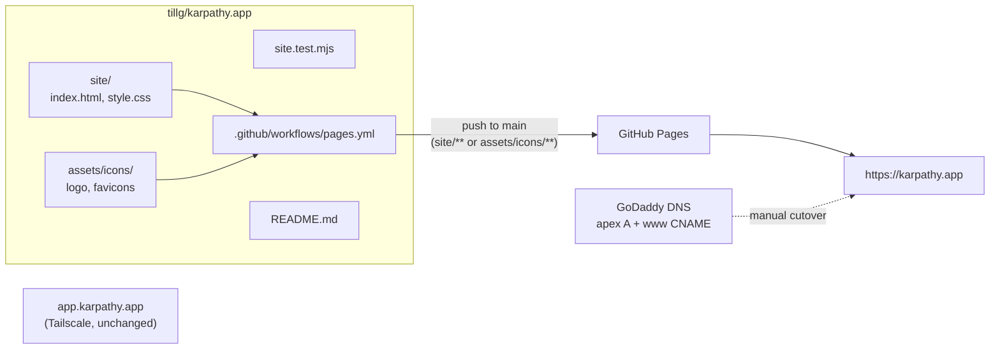

# Proposal: product website at karpathy.app

## What

A public product website at **https://karpathy.app**: a single start page that says what karpathy.app is,
shows the logo, and points to the GitHub repo. The page content is invented for now (hero, three to four
feature blocks, "how it works", call to action) and will be reworked later.

- **Source in this repo**, in a new top-level folder `site/` (plain HTML + CSS, no framework).
- **Looks like the app:** same design tokens (colours, font stack, light + dark), same logo and favicons
  from `assets/icons/`.
- **Hosted on GitHub Pages** of `tillg/karpathy.app`, deployed by a GitHub Actions workflow.
- **Re-deployed automatically** whenever the site changes on `main`; CI checks the site on every build.
- **README** links to the website.

## Why

Today `karpathy.app` serves GoDaddy's Website Builder "Launching soon" placeholder (checked 2026-10-02:
apex and `www` resolve to GoDaddy's `76.223.105.230` / `13.248.243.5`). The app itself lives at
`app.karpathy.app`, reachable only over Tailscale, so there is no public face for the project at all.
A static page on GitHub Pages costs nothing, needs no server and lives next to the code.

## Scope

In scope:

- `site/` with one start page, its stylesheet, and copies of the icons it needs at build time.
- A test that keeps the site consistent: local links resolve, design tokens match the app's.
- `.github/workflows/pages.yml` (test → upload artifact → deploy to Pages).
- One-time setup: enable Pages with source "GitHub Actions", set the custom domain `karpathy.app`.
- DNS cutover at GoDaddy (manual, done by the user — see plan).
- README link and a short "Website" section.

Out of scope:

- Final copy, screenshots, blog, docs pages, analytics, cookie banner, i18n.
- A static-site generator. If the site grows beyond a few pages, revisit (architecture lists the trigger).
- Any change to `app.karpathy.app`, the PWA, or the release pipeline.

## Interpretation of "when building"

"When building and when the website has changed, it should be re-generated and re-deployed" is read as:

- **Every CI build** (`ci.yml`, all pushes and PRs) runs the site test, so a broken site fails CI.
- **Every push to `main` that touches the site** (`site/**`, `assets/icons/**`, the workflow itself) deploys
  it. A manual "Run workflow" button (`workflow_dispatch`) covers everything else.
- Release tags do **not** deploy the site; the website is not versioned with the app.

## Expected outcome

- `https://karpathy.app` and `https://www.karpathy.app` show the karpathy.app start page over HTTPS.
- Editing `site/index.html` and pushing to `main` updates the live site within a few minutes, without any
  manual step.
- `README.md` links to the website.
