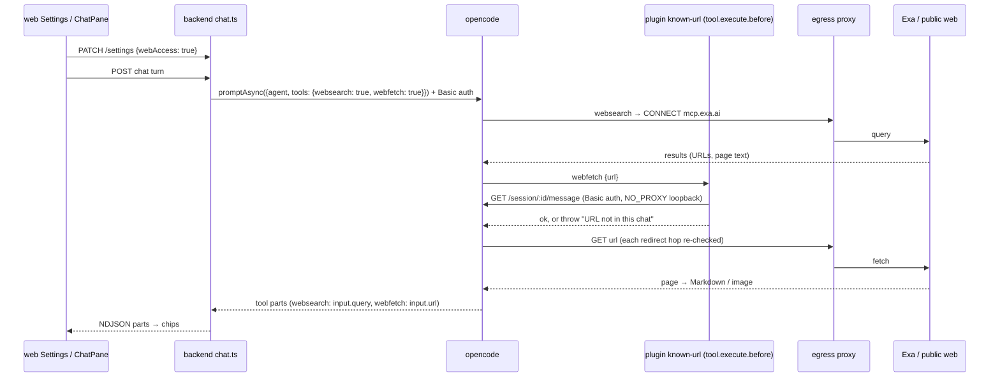
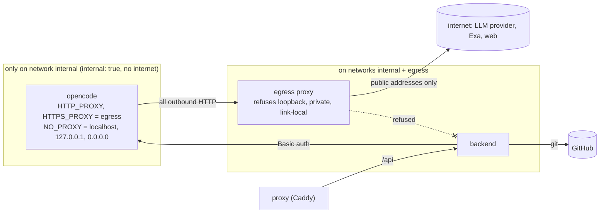

# Architecture: the AI can search and read the web

## Approach in one picture

- **The tools are opencode's own.** We switch on `websearch` (pinned to Exa) and `webfetch`.
- **The backend decides per turn.** One global setting turns both on for each turn.
- **We add three guards:**
  - a provenance plugin, so fetches go only to known URLs;
  - an egress proxy, so nothing internal can be reached;
  - a server password, so the loopback API is closed.
- **The web app shows a chip** for each call.

## Facts this design rests on (verified at opencode v1.18.25)

The facts come from the source at the tag and from containers run on the pinned image and binary. The
research is in [`notes-web-search.md`](../../research/web-search/notes-web-search.md).

| # | Fact | Evidence |
|---|---|---|
| F1 | `websearch` is offered only when the provider is `opencode`/`opencode-go`, or when `OPENCODE_ENABLE_EXA` or `OPENCODE_ENABLE_PARALLEL` is set. `OPENCODE_WEBSEARCH_PROVIDER=exa` pins the backend; otherwise sessions split 50/50 between Exa and Parallel. Exa defaults: `numResults` 8, `livecrawl: fallback`, about 10 000 characters of context, a 25 s timeout. | `tool/registry.ts` `webSearchEnabled`; `tool/websearch.ts` `selectWebSearchProvider`; `effect/runtime-flags.ts` |
| F2 | The per-prompt `tools: {id: bool}` map is stored as **session permission**, one rule `allow`/`deny` with pattern `*` per entry. It replaces the session's earlier rules and is merged **after** the agent's rules, and the last match wins. So `true` overrides a config `deny`, and a blanket `deny` hides the tool from the model. The rule persists on the session. | `session/prompt.ts` (`setPermission`), `session/llm/request.ts` `resolveTools` |
| F3 | `webfetch` accepts any `http(s)` URL, with the URL as permission pattern. It uses Effect's `FetchHttpClient`, i.e. global `fetch` with no `redirect` option, so it **follows redirects**. The cap is 5 MB and the maximum timeout 120 s. Images come back as attachments, and HTML is converted with turndown. | `tool/webfetch.ts`; `core/src/effect/app-node-platform.ts:10`; effect `FetchHttpClient.ts:55-65` |
| F4 | Plugins load from `{plugin,plugins}/*.{ts,js}` in each config dir, the same mechanism as `tools/`. A throwing `tool.execute.before` hook makes the tool call fail with `state.status: "error"` and the message, and the turn goes on. (The exception is the `task` path, which is denied for us.) | `config/plugin.ts:21`; `session/tools.ts:105-110`; `session/processor.ts:186-194,416-417` |
| F5 | Tool output over 2000 lines or 50 KB is stored as a preview plus a hint, with the full text in a file outside the vault. `client.session.messages()` and the model see the same preview. | `tool/truncate.ts:14-15`, `tool/tool.ts:131-143` |
| F6 | `OPENCODE_SERVER_PASSWORD` (user `opencode`, settable with `OPENCODE_SERVER_USERNAME`) turns on HTTP Basic auth for **every** route, `/global/health` included. Only 3 manifest/icon files are exempt. `?auth_token=<base64>` works too. The SDK's `createOpencodeClient({headers})` sends the header, and the plugin `client` adds it on its own from the env. | `server/auth.ts:18-19,36-47`; `httpapi/middleware/authorization.ts:78-81,110`; container test: 401/200/401 |
| F7 | The plugin `client` makes real HTTP calls to `Server.url` = `http://0.0.0.0:4096` once the server listens. | `plugin/index.ts:146-151`, `server.ts:89,148-152` |
| F8 | The binary embeds Bun 1.3.14, whose `fetch` honours `HTTP_PROXY`/`HTTPS_PROXY`/`NO_PROXY` (either case). It does **not** bypass loopback by default: with a proxy set, `127.0.0.1`, `localhost` and the public web all go through the proxy. `NO_PROXY=localhost,127.0.0.1` sends loopback direct. With `HTTPS_PROXY` alone, plain `http` goes direct. | container test against a logging proxy |

**Consequences:**

- **F7 + F8.** The plugin client must reach `0.0.0.0:4096` directly, so `NO_PROXY` must name loopback.
  That means `webfetch` can reach loopback too, so the server password is **required**, not optional.
  The AI can't learn the password: `bash` and `external_directory` are denied, and the env isn't in the
  vault.
- **F3.** URL permission patterns can't stop SSRF, because redirects and DNS go around them. Only a
  network-level control can.
- **F5.** "Known" means "seen by the model". A link deep in a truncated page isn't known, which is the
  right behavior: the model can't have read it either.

## Components

### 1. opencode image (`deploy/opencode`)

- **`Dockerfile`:** `ENV OPENCODE_ENABLE_EXA=true OPENCODE_WEBSEARCH_PROVIDER=exa`, plus
  `COPY deploy/opencode/plugins/ …/opencode/plugins/` next to `tools/`. The bake step's readiness probe
  also waits until the plugin is installed. It runs without a password, so the probe keeps working.
- **`opencode.json` (managed): unchanged, which keeps it fail-closed.** Top level keeps
  `websearch: deny` and `webfetch: deny`; a turn gets them only through the per-turn map (F2).
  `commit-message` keeps `"*": "deny"`.
- **`lib/known-url.ts`:** pure and import-free, so the backend tests load it, like `resolve-note.ts`.
  - `extractUrls(text): string[]` finds `http(s)://` URLs. It strips Markdown and trailing punctuation:
    `)`, `]`, `>`, `.`, `,`, `;`, `:`, `!`, `?`, `'`, `"`. The punctuation rules are pinned by tests.
  - `isKnownUrl(url, texts): boolean` compares exactly after one normalization: WHATWG `URL` parse,
    lower-case scheme and host, default port dropped, fragment dropped. Path and query stay exact, so
    any added data makes the URL unknown.
- **`plugins/known-url.ts`:** a `tool.execute.before` hook. For `webfetch` only, it:
  1. loads the session's messages through the plugin `client`;
  2. collects the user text parts plus the completed tool outputs (`state.output`);
  3. throws ``URL not in this chat: paste it into the chat first`` unless `isKnownUrl`;
  4. applies the **web caps**. It counts the `webfetch` (or `websearch`) tool parts after the last user
     message, which is the current turn, and throws ``Fetch limit reached (N per turn)`` (or ``Search
     limit reached …``) once the cap is reached. The hook therefore runs for `websearch` as well; for
     websearch it checks only the cap, not provenance.

  - **Stateless.** Counting from the stored messages keeps the plugin stateless, so it survives an
    opencode restart.
  - **Configuration.** Per target, through env in `deploy/opencode.env`: `WEB_FETCH_CAP` and
    `WEB_SEARCH_CAP`. A value that is unset, empty, not an integer, or below 1 falls back to the
    default 20.
  - **When a change takes effect.** The plugin reads the values at start, so a change needs an opencode
    restart or a redeploy.
  - **Code.** The parsing is `capFromEnv(value)` in `lib/known-url.ts`.

  Every other tool passes untouched.

### 2. Egress proxy and network (`deploy/compose*.yml`)

- **New service `egress`** on `internal` and on a new `egress` network. It is the only container
  besides the backend that can reach the internet.
- **Chosen: Squid 6** in our own Alpine image (`deploy/egress/Dockerfile`, base pinned by digest; config in
  `deploy/egress/squid.conf`, one `dst` ACL then allow all), shipped as the fourth release image. Smokescreen
  was not picked: no published image, needs a Go build. Gotcha: `::ffff:0:0/96` and `0.0.0.0/8` in an ACL make
  Squid read `0.0.0.0/0`, so they stay out. Under load Docker's DNS can time out and Squid answers 503 (nothing
  is forwarded, so it fails safe); the test retries that. Logged in DECISIONS.md.
- **Requirements.** These are the spike's test criteria; the plan picks the implementation, with
  smokescreen and Squid as candidates:
  - it is an HTTP forward proxy with CONNECT;
  - it refuses destinations that resolve to loopback, RFC 1918, link-local (`169.254.0.0/16`, which
    covers metadata), CGNAT/tailnet (`100.64.0.0/10`), ULA and `::1`;
  - it checks after DNS resolution, on every request, so each redirect hop is checked again;
  - it allows all public destinations, the same policy as today ("no egress restriction");
  - it is pinned by digest and runs as non-root with `cap_drop: ALL`.
- **opencode moves to `internal` only, and that network becomes `internal: true`.** The backend needs
  GitHub, so it gets the `egress` network as well, the same reach it has today.
  - opencode env: `HTTP_PROXY` and `HTTPS_PROXY=http://egress:<port>`,
    `NO_PROXY=localhost,127.0.0.1,0.0.0.0`.
  - In **dev and test**, `NO_PROXY` also names the Ollama host, which sits at a private IP.
- **What goes through the proxy.** The LLM provider calls, Exa and `webfetch` all do. The backend↔
  opencode traffic doesn't: it is inbound to opencode.

### 3. Server password

- **The secret.** A new compose secret `opencode_password`, generated like `bearer_token` (ansible role
  `app`, `deploy/secrets/`).
  - opencode reads it through a two-line entrypoint wrapper (`export OPENCODE_SERVER_PASSWORD="$(cat
    /run/secrets/opencode_password)"; exec opencode "$@"`), because opencode reads only env.
  - The backend reads the secret file, as it does for the others.
- **Healthcheck:** busybox `wget -qO- --header "Authorization: Basic …"` with the password from the secret
  file against `http://127.0.0.1:4096/global/health` (F6: health isn't exempt).
- **Harness:** `new OpencodeHarness(baseUrl, password)` → `createOpencodeClient({ baseUrl, headers:
  { Authorization: 'Basic …' } })`. The test helper `startOpencode` sets a random password, returns it,
  and offers an authed `fetch` for the tests that call opencode directly (`opencode-tools.test.ts`).
  Requests without it get 401, and one test pins that.

### 4. Settings and per-turn switch

- **Shared type:** `Settings.webAccess: boolean`.
- **Backend:** `DEFAULT_SETTINGS.webAccess = true`. An old `config.json` reads as `true` through the
  defaults merge. `patchSettings` accepts `z.boolean().optional()`.
- **Web UI:** a switch "Web access" with the hint "Lets the AI search the web (via Exa) and read pages
  you or it found. Each search and page is shown in the chat." It sits where `commitReminderThreshold`
  is edited (`Admin.tsx`/`Dialogs.tsx`).
- **`PromptInput.tools?: Record<string, boolean>`:** `chat.ts` sends `{ websearch: s.webAccess,
  webfetch: s.webAccess }` with **every** turn, `false` included, because the rule persists on the
  session (F2). Both agents get it. `OpencodeHarness.prompt` passes it to `promptAsync`.
- **The map replaces all earlier session rules (F2).** Any later per-turn rule must go into the same map,
  or it gets wiped.
- **Timing assumption.** A tool's output is stored on the session before the next tool's
  `tool.execute.before` runs. Without that, provenance would refuse every search → fetch and read →
  fetch pair. The `@llm` "URL found in a note" case pins it.

### 5. Mapping and chips

- **`harness/map.ts`:** `mapToolPart` sets `query` (websearch `input.query`) and `url` (webfetch
  `input.url`). `writes` and `opens` stay false, and there is no `path`.
- **`packages/shared`:** `ToolCall.query?: string`, `ToolCall.url?: string`.
- **`lib/chat.ts`:** a new `toolLabel(call)` gives `searched the web: "<query>"` and `fetched
  <host><path>`. The path is shortened to 60 characters, and the full URL goes in the `title`
  attribute.
- **`ToolChip`:** a completed fetch chip is an `<a href={url} target="_blank" rel="noopener noreferrer">`,
  styled like the other chip buttons. Only `http(s)` URLs get a link; anything else stays plain text,
  which guards against `javascript:`. A search chip stays a label. A refused fetch keeps the generic error toggle and shows the guard's message. `ToolChip`
  uses `toolLabel`.

## What becomes false in system and repo docs

| Doc | Now | After | When |
|---|---|---|---|
| `specs/system/security.md`, "Confining the AI" | websearch and webfetch denied; the reason is the exfiltration risk | per turn by Web access; provenance, egress proxy, server password; the residual risks from the proposal; Exa as a third party | archive |
| `specs/system/architecture.md`, runtime and opencode sections | 3 services; opencode unauthenticated on `internal`; "no egress restriction" | 4 services; `internal: true`; egress proxy; Basic auth; plugin dir | archive |
| `specs/system/deployment.md` | services, networks, secrets | `egress` service, `egress` network, `opencode_password` secret | archive |
| `specs/system/functional.md` | no web access | the Web access setting, web chips, the "paste the URL" behavior | archive |
| `specs/system/domain.md` | the AI has no outbound channel | Search backend, Known URL, web content | archive |
| `CLAUDE.md`, Architecture: "Services: reverse proxy, backend, opencode" | 3 services | + egress proxy | **plan** (repo doc) |
| `README.md` | — | Web access, `EXA_API_KEY`, the new secret | **plan** |

## Decisions and tradeoffs

| Decision | Chosen | Alternatives | Why |
|---|---|---|---|
| Tools | opencode `websearch` + `webfetch` | custom tools (Brave and so on); provider server tools; OpenRouter `:online` | No reimplementation, works with any model; the guards go around the tools. |
| Search backend | Exa, pinned | 50/50 Exa/Parallel | One known recipient. |
| Switches | one, **Web access** | separate search and fetch switches | They are useful only together (the user's point). Fetch carries the larger risk, but it is guarded by provenance and the proxy. A second switch can be split off later. |
| Switch scope | global (one setting for all vaults) | global plus a per-vault override; per vault only | Single user, and the chips show every call. A per-vault override can come later without breaking anything, because the `tools` map is already computed for each turn. |
| Fetched chip | a link to the page (new tab) | a label only | The natural "show me the source"; it follows the opened-note chip pattern. |
| Exa key | optional; recommended for production | required | Requiring it would block dev and test. The privacy is the same either way: ZDR only on enterprise plans. |
| Fetched pages | only in the chat, never archived by this change | auto-save to `Sources/` | Archiving is the ingest skill's job (V1.3). |
| Ordered-fetch leak | fetch cap, 20 per turn | accept it; fetched pages' links not known | A cap slows the leak a lot for ~10 lines. Banning links on fetched pages would cripple research. |
| Query leak volume | search cap, 20 per turn, counted separately from fetches | no cap | Queries have no provenance check, so the cap is their only ceiling per turn. |
| Caps configurable | env per target, `WEB_FETCH_CAP` / `WEB_SEARCH_CAP` in `deploy/opencode.env`, default 20, applied on restart | constants; in-app Settings fields | A security knob that is rarely touched belongs with the other opencode env, such as `OPENCODE_MODEL` and the keys. The plugin can't reach backend settings: the proxy blocks it and it holds no token. In-app fields would need a shared volume and a file contract. |
| opencode API password | a separate generated secret `opencode_password` | reuse the bearer token; no password | The bearer token controls the whole app and must not enter the AI's container. Without a password, `webfetch` could read other vaults through loopback (F7, F8). |
| Backend → GitHub | direct, on the `egress` network | through the egress proxy | The proxy fences in the AI's container. The backend runs no AI-controlled code, and an extra hop on every git operation brings no gain. |
| Exfiltration via fetch | URL provenance plugin | domain allowlist; summarizer model (Claude Code); `ask` | An allowlist defeats reading arbitrary pages. A summarizer costs a model call per fetch and doesn't stop the URL leak. `ask` blocks the turn. |
| SSRF | egress proxy + `internal: true` | URL deny patterns; host firewall (DOCKER-USER) | Patterns fail on redirects and DNS (F3). A host firewall is prod-only, differs in dev (Rancher), and doesn't cover loopback. |
| Loopback | server password, required | `HTTPS_PROXY` only + no `NO_PROXY` | The plugin client needs direct loopback (F7), and plain-http fetches would skip the proxy. The password also hardens the internal network in general. |
| Setting default | **on** | off | The user's call: web access is the expected default for a wiki assistant. The switch and the chips remain the controls. The default doesn't weaken the guards (provenance, proxy, password), which apply either way. |
| Switch mechanism | config `deny` + per-turn `true` (fail-closed) | config `allow` + per-turn `false`; agent variants | Deny by default, as in the rest of `security.md` (F2). |

## Testing

- **Default suite (`just test`).** No live web traffic. It covers:
  - the managed config guard;
  - `known-url` unit tests;
  - Basic auth: 401 without the password, 200 with it;
  - the session permission set by the `tools` map (F2), with `DEAD_MODEL`;
  - settings round-trip;
  - mapping on captured fixtures;
  - `toolLabel`.
- **Network tests (`just test`, real containers).** `docker exec` into the opencode test container. Over
  the proxy, these must fail: `wget` to `http://127.0.0.1:4096/global/health` without the password,
  `http://backend:8787` (or the test network's backend stand-in), `http://169.254.169.254/` and a
  redirect to an internal URL. A public URL must succeed. That last check needs internet and is skipped
  offline with a clear message.
- **`@llm`.** These hit Exa, the public web and Ollama:
  - one search;
  - one fetch of a URL from the user message, which also captures the fixtures;
  - one fetch of a constructed URL, which must be refused;
  - commit messages still work.
- **e2e.** The switch on desktop, iPad and iPhone; chip labels with `@llm`.
