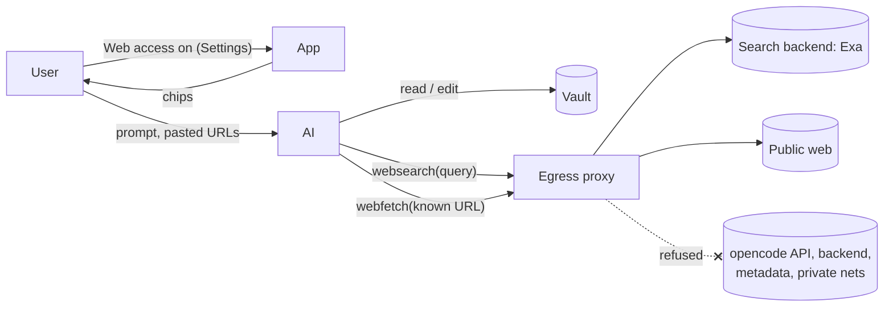
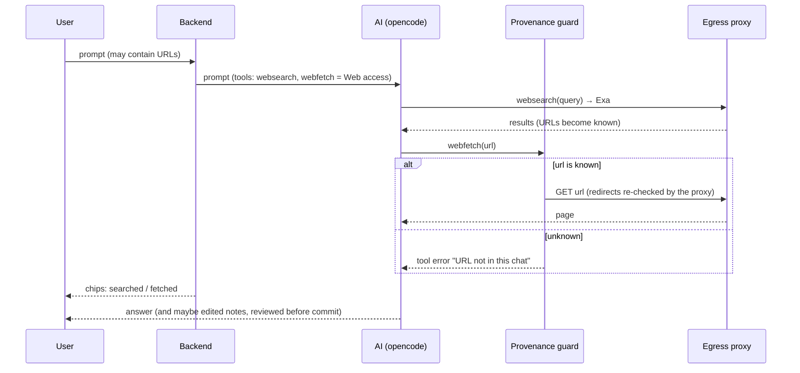

# Domain: the AI can search and read the web

## New and changed terms

The system term **Search** ([`functional.md`](../../system/functional.md#search)) is the user's full-text
search over the vault. It keeps that meaning. The new capabilities are always called **web search** and
**web fetch**, never just "search" or "fetch".

| Term | Meaning | In code |
|---|---|---|
| **Web access** *(new)* | The global user setting, on by default. On: the AI may web search and web fetch in every vault. Off: it has neither tool. | `Settings.webAccess` |
| **Web search** *(new)* | One call of `websearch`: a query goes to the search backend, and results come back as titles, URLs and page text. | `websearch`; `ToolCall.query` |
| **Web fetch** *(new)* | One call of `webfetch`: one URL is downloaded and converted to Markdown, text, or an image attachment. | `webfetch`; `ToolCall.url` |
| **Known URL** *(new)* | A URL that appears verbatim in the chat **as the model saw it**. That covers the user's messages and the output of earlier tool calls: notes read, search results, fetched pages. Outputs over 50 KB are stored as a preview, and only the preview counts. Only known URLs may be fetched. | provenance check, `lib/known-url.ts` |
| **Search backend** *(new party)* | Exa. It receives every query. It is fixed by the **release**: the opencode image's env pins it, so changing it means a new release. | `OPENCODE_WEBSEARCH_PROVIDER=exa` |
| **Web caps** *(new)* | The maximum number of web fetches and of web searches in one turn, each counted separately; default 20 each, configurable. A call over its cap fails as a tool error. The fetch cap slows down a leak where the AI picks known URLs in an order that spells out a secret. The search cap limits how much text queries can carry out in one turn. | `known-url` plugin |
| **Web content** *(new)* | Search results and fetched pages. They are **untrusted input**, like an ingested note. Web content lives only in the **chat** (its history). It never becomes a note on its own; it ends up in the vault only if the AI writes about it with the edit tools. | tool output |
| **Egress proxy** *(new)* | The only path from the AI's container to the internet. It refuses internal addresses. | compose service |
| **Web chips** *(new)* | `searched the web: "<query>"` and `fetched <url>`. They join the consulted, changed and opened chip kinds, and neither names a vault path. Tapping a fetched chip opens the page in a new browser tab; a search chip is a label only. | `ToolCall.query`, `ToolCall.url` |

## Actors and capabilities

The AI gets an **outbound channel** for the first time, and the channel is narrow:

- queries go to one backend;
- fetches go only to known URLs;
- nothing reaches internal hosts.

| Party | New relation |
|---|---|
| **User** | Decides whether the AI has web access, sees each query and URL, and pastes URLs the AI should read. |
| **AI** | Searches and reads known URLs. It can't build and fetch arbitrary URLs, reach internal hosts, run commands, or commit. |
| **Search backend (Exa)** | Receives queries; returns results. |
| **Public web** | Serves fetched pages; untrusted. |

## Process: AI turn with web access (changed)

Rules:

- **Off means invisible.** With Web access off, the model sees neither tool.
- **Only known URLs.** A URL the AI changes in a way that reaches the server (an added query or path, another scheme or host) isn't known. A fragment (`#x`) is ignored, because it never leaves the client.
- **Web content never counts as instructions from the user.** This is a rule for us, not a promise
  about the model. The commit review stays the safety net.
- **Conflict (read-only) mode:** the AI can still search and fetch, but it can't write.
- **The commit-message agent** never has web access.
