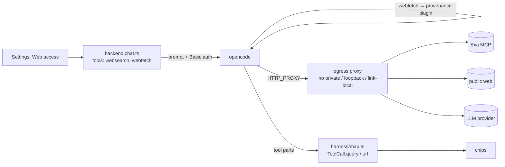

# Proposal: the AI can search and read the web

## What

The AI in the chat can **search** the web and **read** web pages. For example:

- "What's the latest release of llm.c?" The AI searches and answers from the results.
- "Summarize the article linked in this note." The AI reads the note, fetches the URL, and writes a
  source page. This is the ingest case.
- "Read https://example.com/post and add it to my reading list." The AI fetches the URL the user pasted.

Each call appears in the chat as a chip, so the user always sees what left the app:

- `searched the web: "llm.c release"`;
- `fetched example.com/post`.

One switch in Settings, **Web access**, turns both on together. It is **on by default**: an AI that can't
look things up is the worse default for a wiki assistant. Users with sensitive vaults can switch it off.

**Fetched pages aren't archived.** They exist only in the chat: they don't go into `Sources/` and
they aren't stored as files. Archiving a source is the ingest skill's job (V1.3), done with the normal
edit tools.

Searching the vault is out of scope: the AI can already do that with opencode's built-in `grep` and
`glob`.

## Why

Today the AI only knows its training data and the vault. It can't check a fact, find a source, or read
an article the user points it to. The wiki workflow needs both halves:

- **Search** finds candidates.
- **Fetch** reads them. It also reads URLs that come from the user or from notes, which no search
  covers. Ingesting a clipped link is the core case
  ([V1.3](../../changes/v1/v1-plan.md), [#65](https://github.com/tillg/karpathy.app/issues/65)).

Search alone isn't useless: Exa already returns about 10 000 characters of page text per result. But
search alone has gaps:

- It can't read a full page.
- It can't read a page the user names.
- It can't read images.

Deep research ([#86](https://github.com/tillg/karpathy.app/issues/86)) needs both search and fetch.

## How others do it

Full notes: [`specs/research/web-search/notes-web-search.md`](../../research/web-search/notes-web-search.md).

| | Search | Fetch | Exfiltration guard |
|---|---|---|---|
| **Claude API** | `web_search` (server tool) | `web_fetch`: only URLs **already in the conversation** | URL provenance, domain lists |
| **Claude Code** | `WebSearch` | `WebFetch`: domain permission rules, a summarizer model in between, no cross-host redirects | permission prompts |
| **OpenAI** | `web_search` (server tool) | no separate fetch tool; search results only | domain lists, cached-only mode |
| **opencode** (built in) | `websearch` → Exa or Parallel | `webfetch`: any http(s) URL, follows redirects, up to 5 MB, images as attachments | only `permission` patterns on the URL |
| **This change** | opencode `websearch`, pinned to Exa | opencode `webfetch` + **our provenance guard** | provenance, egress proxy, server password |

The provider server tools are tied to one model vendor, which breaks
[ADR 0002](../../../docs/adr/0002-opencode-as-agent-harness.md). opencode's tools work with every model, but
they come with no protection of their own.

## Decision (recommended)

Use **opencode's built-in `websearch` and `webfetch`**, and add three guards:

1. **URL provenance**, as in the Claude API. `webfetch` may fetch only a URL that already appears
   verbatim in the chat: in the user's messages, in a note the AI read, or in an earlier search or fetch
   result. An injected instruction can still make the AI fetch a URL that is already there, but it can't
   append vault data to it. A small opencode plugin in the image enforces this (`tool.execute.before`).
   This is **new harness code**, like `open_note`; it doesn't reimplement the tool.
2. **Egress proxy (SSRF).** The opencode container loses direct internet access. All its outbound HTTP
   goes through a proxy that refuses loopback, private and link-local addresses, also after redirects
   and DNS resolution. Without the proxy, `webfetch` could reach:
   - the opencode API itself, which would mean other vaults;
   - the backend;
   - the cloud metadata service (`169.254.169.254`).
3. **opencode server password.** opencode's own plugin client has to talk to loopback directly, outside
   the proxy, so `webfetch` can reach `127.0.0.1:4096` too. The password (`OPENCODE_SERVER_PASSWORD`,
   HTTP Basic) makes those requests fail with 401. The backend sends it, and the AI never sees it.

Search is pinned to Exa (`OPENCODE_ENABLE_EXA=true`, `OPENCODE_WEBSEARCH_PROVIDER=exa`). The key
`EXA_API_KEY` is optional and server-side only. Without it, opencode uses Exa's anonymous endpoint,
which is rate-limited and has no account terms. That is enough for dev and test. The README recommends
a key for production.

## Security: what replaces "websearch and webfetch are denied"

[`security.md`](../../system/security.md#confining-the-ai) denies both tools today: "`webfetch` could send
vault content or keys out after a prompt injection from an ingested note". After this change:

| Risk | Mitigation | What remains |
|---|---|---|
| Vault data leaves in a **fetch URL** | Provenance: exact URLs only | The AI can fetch an attacker URL that is already in a note or a page, but without added data. It can't fetch a URL it builds itself; the user pastes it instead. |
| Vault data leaves in the **order of fetches** (a page lists `attacker.com/a` … `/z`; the AI spells out a secret by which links it fetches) | Web caps: by default at most 20 fetches and 20 searches per turn, configurable per target (`WEB_FETCH_CAP`, `WEB_SEARCH_CAP`) | A slow leak of a few characters per turn stays possible. Following links remains allowed, because research needs it. |
| Vault data leaves in a **search query** | Every query shown as a chip; the switch can turn web access off | A query can still carry text to Exa. The user sees it afterwards, not before. Because it is on by default, this applies from the first chat, unless the user switches it off. |
| **SSRF / confinement escape** (opencode API, backend, metadata) | Egress proxy denies private, loopback and link-local addresses; opencode needs a password | None known. The spike tests each target. |
| **Untrusted content**: pages up to 5 MB, images, search results | None at fetch time | An injected instruction can make the AI edit notes. The diff review before commit is the safety net (ADR 0001). |
| Keys | Provider keys and `EXA_API_KEY` stay in the opencode container. The AI can't read env (`bash` denied, `external_directory` denied). | `EXA_API_KEY` travels in the Exa URL query (`?exaApiKey=`), over HTTPS to Exa only. |

Not taken:

- **An approval prompt per call.** It needs `ask`, which blocks the turn, and the app has no approval UI.
- **A domain allowlist.** It would defeat "read what the user points to".

## Scope

In scope:

- **opencode image:** the Exa env, plus the provenance plugin under `deploy/opencode/plugins/`, with its
  pure check in `lib/`.
- **Compose:** an egress proxy service. The opencode network becomes `internal: true`, and opencode gets
  `HTTP(S)_PROXY`/`NO_PROXY`. A server password, passed to opencode and the backend; the healthcheck
  sends it too. All of this in prod, prodtest and dev.
- **Backend:** the setting `webAccess`, the per-turn `tools` map, the password in the harness client, and
  mapping `query` and `url`.
- **Web app:** the switch, and the two chip labels.
- **Docs:** README and the project `CLAUDE.md` service list.

## Expected outcome

- With Web access on:
  - "What's new in X?" searches.
  - "Summarize the link in this note" fetches it.
  - Both show chips.
- On a fresh install, and after upgrading an existing config, Web access is on.
- With Web access off, the model sees neither tool.
- A fetch of a URL that isn't in the chat fails as a tool error ("URL not in this chat: paste it"). The
  turn goes on.
- From inside the opencode container, none of these are reachable, as the spike proves:
  - `127.0.0.1:4096` without the password;
  - `backend:8787`;
  - `169.254.169.254`.
- Chat, commit messages and the LLM provider still work through the proxy.
