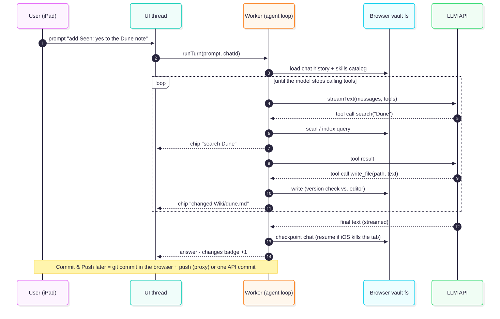

:::tldr
**Short answer: yes, technically, but it costs more than it saves.** Every piece works in a browser, including Safari. A vault can live in browser storage, the **git engine** (`isomorphic-git`) runs in the page and handles commit, status, merge and push, search over 3,300 notes takes milliseconds, and a tool-calling agent loop can run in the page. Four things stop a clean "no server at all":

1. **The browser can't reach github.com's git endpoint.** Git runs in the page, but github.com sends no CORS headers, so the browser blocks every clone, fetch and push. That's why the git spikes only worked through a proxy that adds the headers. The proxy can't run inside the browser, because the browser itself enforces CORS, including for Service Workers. It has to run elsewhere: a tiny edge function, or our own backend. The only proxy-free route is the GitHub REST API, which does send CORS headers but gives up local history and git merges.
2. **"Sign in with GitHub" needs a server**, because the OAuth token exchange requires a client secret and sends no CORS headers. Without a server, only a pasted personal access token (PAT) works.
3. **opencode cannot run in a browser**: it ships as native binaries only, and WebContainers can't run it. Going browser-only means writing our own agent loop, tools and skill loader, which is exactly what CLAUDE.md says not to do. Skills that run Python or bash scripts, and local (stdio) MCP servers, stop working.
4. **iOS stops JavaScript when the app goes to the background.** A long ingest turn dies when you switch apps or lock the iPad. Today the turn keeps running on the server.

**Recommendation:** keep the server architecture for V1. If we want less server later, the realistic step is [Option C, local-first hybrid](#opt-c): the vault is also cloned in the browser so offline reading, editing and search work, while opencode stays on the server for heavy turns. The spikes suggest the browser half is feasible. See [recommendation](#reco).
:::

## Today: who calls whom {#today}

The PWA is a thin client. Everything with a secret or a process lives on the home server: the bearer token, the GitHub token and provider API keys, the git clones, ripgrep, and opencode's long-running agent loop.

## Browser-only architecture overview {#arch}

Without a server the direction of calls inverts. The **browser becomes the host**. It keeps the vault clone in its own storage, runs git, the search index and the agent loop in a Web Worker, and talks **directly** to third parties: GitHub for sync and the LLM provider for chat. Secrets (PAT, provider key) now live on the device.

| Concern | Today (server) | Browser-only replacement |
| --- | --- | --- |
| Vault files | `/vaults/<id>` git clone on the host | IndexedDB (`lightning-fs`) or OPFS, inside the site's origin; invisible to Files.app and Obsidian |
| Sync | `git` CLI with a server-side token | `isomorphic-git` + CORS proxy, **or** GitHub Git Data API / GraphQL `createCommitOnBranch` |
| Auth | Single bearer token → backend | Fine-grained PAT pasted into the app (no OAuth without a server) |
| Search | ripgrep | In-memory regex scan + MiniSearch/FlexSearch index (or SQLite-WASM FTS5) |
| Agent loop | opencode (tools, skills, AGENTS.md, MCP) | Our own loop (Vercel AI SDK `streamText` + tools, or pi-agent-core), file tools over the browser fs, `activate_skill` tool |
| LLM keys | Server-side only | Bring-your-own-key (BYOK), stored on the device, sent straight to the provider |
| Change events | chokidar watcher → NDJSON stream | In-process events; BroadcastChannel + Web Locks across tabs |
| Long turns | Keep running server-side; UI re-attaches | Only while the app is in the foreground; checkpoint after every step, resume on return |

## Options {#options}

### Option A: pure browser via the GitHub API ("zero server") {#opt-a}

The vault lives in IndexedDB. Sync uses `api.github.com`, which allows any origin (:verdict[spike S4: works unauthenticated and with a token]{tone="go"}). The first load fetches the tree plus the blobs. Commit & Push becomes one commit for N files: blobs → tree → commit → PATCH ref (7 calls, 2.5 s in the spike), or GraphQL `createCommitOnBranch` with `expectedHeadOid` as an optimistic lock. Auth is a pasted fine-grained PAT. LLM calls use the user's own key (BYOK).

::::cards
:::card{title="Pros"}
Truly no server to run. Deploy as static files (GitHub Pages works). Nothing listens on the home network.
:::

:::card{title="Cons"}
No git history or merge on the device, so we write our own "changed since base" conflict detection using blob SHAs. It only works with GitHub. Rate limits apply: 5,000 req/h, 80 writes/min. The first sync of 5,600 files costs about 5,600 blob requests, roughly a full hour of budget, unless it reads through `raw.githubusercontent.com`. A pasted PAT is poor UX, and anything that can read the page can read the token.
:::
::::

### Option B: browser app + one tiny stateless edge function {#opt-b}

This is real git in the browser: `isomorphic-git` in a Worker on `lightning-fs`, going through a \~50-line CORS proxy (Cloudflare Worker, or self-hosted `@isomorphic-git/cors-proxy`). The same function holds the OAuth client secret for a proper "Sign in with GitHub". This is the pattern every GitHub-syncing browser editor uses: StackEdit, Prose/gatekeeper, and Logseq's cors-proxy fork. :verdict[Spikes S2b/S2c/S3: clone, status, commit, merge and push all work in both engines.]{tone="go"}

::::cards
:::card{title="Pros"}
Full git: history, 3-way merge, and offline commits that push later. Works with any git host that has a proxy. The edge function is cheap and stateless.
:::

:::card{title="Cons"}
It is still a server, and it sees the token in transit. The agent loop still has to be rewritten, as in A.
:::
::::

### Option C: local-first hybrid (keep opencode, add a browser clone) {#opt-c}

This keeps today's stack and adds a browser-side clone for offline reading, editing and search. Quick AI turns could optionally run in the page. Heavy turns go to opencode, including ingest skills with Python scripts and scrapers, and anything that must survive the iPad being locked. Both sides sync through the same GitHub remote, which is the "one sync system" rule we already have.

::::cards
:::card{title="Pros"}
Fixes the one real weakness of the server design (offline) without losing opencode. It can be built in steps. The skill caveats in `mvp.md` §4 don't get worse.
:::

:::card{title="Cons"}
Two clones of the same vault on the same account, so the device can conflict with the server. The server side keeps doing its conflict handling. There is more code in the frontend.
:::
::::

### Rejected paths

| Idea | Why not | Verdict |
| --- | --- | --- |
| Run opencode in the browser via WebContainers | opencode ships native binaries only (`opencode-ai` has no WASM build). WebContainers run Node, not Bun, need COEP `credentialless` (not in Safari), and require a commercial license for production. | :verdict[No-go]{tone="no"} |
| Edit the user's real Obsidian folder on iPad | `showDirectoryPicker` is Chromium-only (:verdict[S5: absent in WebKit]{tone="no"}). OPFS is invisible to Files.app. | :verdict[No-go on iPad]{tone="no"} (desktop Chrome extra only) |
| On-device LLM (WebLLM, Chrome Prompt API) | WebGPU is present in Safari 26, but WebLLM's tool calling is still a work in progress, the Prompt API is desktop Chrome only (22 GB free disk), and small models failed our agent task (:verdict[L3: qwen2.5:3b 1/70 clean]{tone="partial"}). | :verdict[No-go for the agent]{tone="no"}; OK for embeddings |
| OAuth device flow or PKCE without a secret | The device flow has no CORS (probed). GitHub's PKCE (2025-07) still requires `client_secret`. | :verdict[No-go]{tone="no"} |

## A chat turn without a server {#turn}

The loop that opencode runs for us today would run in a Worker. The spike built it twice, once with the Vercel AI SDK and once as a \~40-line hand-written `fetch` + SSE loop. Both ran with tools over OPFS and progressive-disclosure skills (:verdict[L3: plumbing works in Chromium and WebKit]{tone="go"}).

## Spike results {#spikes}

These are the theories we tested, each with a verdict. Raw numbers, scripts and re-run commands are in [`spikes/storage-git/RESULTS.md`](spikes/storage-git/RESULTS.md) and [`spikes/llm-agent/RESULTS.md`](spikes/llm-agent/RESULTS.md). Git servers were local, so clone times leave out network transfer.

| # | Theory | Verdict | Key evidence |
| --- | --- | --- | --- |
| S1 | OPFS can hold a realistic vault | :verdict[Partial]{tone="partial"} | Works, but writing 3,100 files one by one takes 6–24 s. IndexedDB takes 0.7–0.8 s. WebKit also has no OPFS in private mode, over-reports `estimate()`, and returns filenames in **NFD** Unicode. |
| S2a | isomorphic-git can clone github.com directly | :verdict[Rejected]{tone="no"} | CORS: Chromium `Failed to fetch`, WebKit `Load failed`. |
| S2b | … through a CORS proxy | :verdict[Confirmed]{tone="go"} | Public repo 0.6–0.7 s; private test vault with token 1.2 s. |
| S2c | 3,100-note vault in `lightning-fs`, status fast enough | :verdict[Confirmed]{tone="go"} | Clone 1.7 s, `statusMatrix` 62–83 ms, in both engines. |
| S2d | Git working tree on OPFS | :verdict[Partial]{tone="partial"} | Our own OPFS adapter is 3× (Chromium) to 18× (WebKit) slower than IndexedDB. It breaks on symlinks (the vault has one) and shows 21 false changes in WebKit from NFD filenames. `@componentor/fs` was unstable. |
| S2e | The **full real vault** (1.7 GB pack) in the browser | :verdict[Confirmed]{tone="go"} | No crash in either engine. Clone 28–45 s (localhost), 2.4–3.1 GB stored, status over 5,604 files 1–2 s. Media makes up most of the size. |
| S3 | Commit, push, pull and merge from the browser | :verdict[Confirmed]{tone="go"} | Commit 0.7–0.9 s, push 0.7–1.1 s, verified in the host's `git log`. A concurrent change produced a real 2-parent merge. A conflict raises `MergeConflictError` with the file paths; `abortOnConflict:false` writes conflict markers. |
| S4 | GitHub REST API needs no proxy | :verdict[Confirmed]{tone="go"} | CORS is fine with and without a token. Tree/blob 0.2–0.4 s. One commit via the Git Data API (7 calls, 2.5 s) landed in the test vault. |
| S5 | File System Access API on Safari | :verdict[Rejected]{tone="no"} | `showDirectoryPicker`, `FileSystemObserver`: Chromium only. |
| L1 | LLM providers can be called straight from the browser | :verdict[Partial]{tone="partial"} | Anthropic (only with the `anthropic-dangerous-direct-browser-access` header), OpenRouter, Gemini, Mistral and Groq work. OpenAI passes the preflight, but its 401 carries no `Access-Control-Allow-Origin` header, so the page sees a CORS error. Success responses are unverified (no key). |
| L2 | A local Ollama can serve the browser | :verdict[Partial]{tone="partial"} | The default `OLLAMA_ORIGINS` rejects a hosted PWA origin (403). **WebKit blocks HTTPS → `http://` (mixed content)**, so iPad needs Ollama behind TLS. |
| L3 | A full agent loop runs in the page (OPFS tools, skills) | :verdict[Plumbing confirmed]{tone="go"} | AI SDK bundle 110 kB gzip; streaming works. qwen2.5:3b completed the task cleanly 1 time in 70 runs, and every failure was the model's. Ollama silently drops calls to unknown tool names. An exact-replace `edit_file` beats a full overwrite. Output must be capped (one run produced over 20k tokens). |
| L4 | A running turn survives backgrounding | :verdict[No (per docs)]{tone="no"} | This can't be reproduced headless. iOS suspends background JS by design, and Ollama stops generating when the client disconnects. |
| L5 | Full-vault search is fast enough | :verdict[Confirmed]{tone="go"} | 3,337 files / 5.6 M chars: naive regex 1–10 ms per query; MiniSearch builds in 0.4–0.8 s, queries in 1–2 ms. The **bottleneck is getting the files out of storage** (OPFS read-all 3–11 s). |
| L6 | WebGPU for an in-browser model | :verdict[Partial]{tone="partial"} | WebKit headless has an Apple adapter; Chromium headless has none. No model was downloaded. |

### Storage and git, selected numbers

| Operation (3,100 .md, 5.5 MB) | Chromium | WebKit |
| --- | ---: | ---: |
| OPFS write, main thread (`createWritable`) | 6.0 s (32 s cold) | 23.5 s |
| OPFS write, Worker (`createSyncAccessHandle`) | 10.5 s | 2.6 s |
| IndexedDB write / read (`lightning-fs`) | 0.66 / 0.23 s | 0.78 / 0.47 s |
| git clone, IndexedDB / our OPFS adapter | 1.7 / 5.4 s | 1.7 / 31.3 s |
| `statusMatrix`, IndexedDB / our OPFS adapter | 0.08 / 1.0 s | 0.07 / 7.9 s |
| Real vault (5,604 files, 1.7 GB pack): clone depth 1 → stored | 39 s → 2.4 GB | 28 s → 2.4 GB |

### Search, full demo vault (3,337 .md)

| Measurement | Chromium | WebKit |
| --- | ---: | ---: |
| Naive `RegExp` over all texts in memory, per query | 1–10 ms | 0.8–2.6 ms |
| MiniSearch build / query / serialized | 0.8 s / 1–2 ms / 5.3 MB | 0.4 s / 0.2–1.2 ms / 5.3 MB |
| FlexSearch build / query / export | 1.1 s / <0.1 ms / 13.7 MB | 0.6 s / <0.1 ms / 13.7 MB |
| OPFS read of all files | 11.1 s | 3.4 s |

For comparison, the current server stack searches the same vault with ripgrep in about 0.16 s end to end (measured through the API).

## Hard areas and why {#hard}

| Area | Why it's hard | Best idea we have | Difficulty |
| --- | --- | --- | --- |
| **Replacing opencode** | We would own the loop, tool schemas, edit semantics, permission rules, skill discovery, AGENTS.md/CLAUDE.md loading, context compaction and provider quirks. The spike found one quirk right away: Ollama drops unknown tool names without an error. This contradicts the project's core "don't rebuild the harness" decision. | AI SDK `streamText` + `stopWhen`. Tools shaped like opencode's (`read`, exact-replace `edit`, `write`, `grep`, `skill`). Skills per the agentskills.io "no filesystem" pattern. | :verdict[High]{tone="no"} |
| **Skills with scripts** | The vault's ingest and import skills run Python and scrapers that need credentials. A browser has no processes or sockets and is subject to CORS. | Pyodide for pure-Python helpers. Scrapers stay on a server (Option C). | :verdict[High]{tone="no"} |
| **Git transport and auth** | github.com has no CORS, and OAuth needs a secret. | Option A (REST API + PAT) or Option B (edge proxy + OAuth). | :verdict[Medium]{tone="partial"} |
| **iOS lifecycle** | No background execution. A 5–15 page ingest turn is exactly the kind of long task that dies. There is no Background Sync to push before the tab closes. | Checkpoint every step; idempotent tools; resume on `visibilitychange`; Screen Wake Lock (iOS 18.4) during turns. | :verdict[Medium–High]{tone="partial"} |
| **Storage semantics** | OPFS is slow with many small files and has no symlinks. WebKit returns NFD filenames, which cause false changes in git status for German umlauts, and has no OPFS in private mode. Quota numbers are unreliable. Data survives only if the app is installed or `persist()` succeeds. | IndexedDB (`lightning-fs`) for the git tree; NFC-normalise paths; install to Home Screen + `persist()`; push often. | :verdict[Medium]{tone="partial"} |
| **Big vault size** | 2.4–3.1 GB per clone, mostly media (images, PDFs, reels). | Sparse or partial clone of Markdown only. Load media lazily via `raw.githubusercontent.com`. | :verdict[Medium]{tone="partial"} |
| **Secrets on the device** | The PAT and LLM key are readable by any XSS or compromised dependency. The SDKs call this "dangerous" for a reason. | Repo-scoped fine-grained PAT with an expiry, strict CSP `connect-src`, no third-party scripts. Acceptable for a single user. | :verdict[Medium]{tone="partial"} |
| **Local models from iPad** | Mixed content (HTTPS page → `http://` Ollama) is blocked in Safari, and `OLLAMA_ORIGINS` has to be set. | TLS in front of Ollama (Caddy or Tailscale serve), which brings a server back. | :verdict[Medium]{tone="partial"} |
| Search | — | Regex scan + MiniSearch; keep texts in memory or a persisted index for cold start. | :verdict[Low]{tone="go"} |
| LLM calls | OpenAI's error responses aren't readable cross-origin. | BYOK direct or via OpenRouter. | :verdict[Low]{tone="go"} |

## Tools and packages {#tools}

| Need | Package / API | Notes | Fit |
| --- | --- | --- | --- |
| Git | [`isomorphic-git`](https://github.com/isomorphic-git/isomorphic-git) 1.42 | Clone, merge, push all worked in the spikes. Maintained by volunteers. | :verdict[Go]{tone="go"} |
| Git fs | [`@isomorphic-git/lightning-fs`](https://github.com/isomorphic-git/lightning-fs) | IndexedDB; 5–30× faster than OPFS in our spikes | :verdict[Go]{tone="go"} |
| Git fs (OPFS) | `@zenfs/dom`, `@componentor/fs`, own shim | No official adapter; unstable or slow in the spikes | :verdict[Partial]{tone="partial"} |
| Git alt. | [wasm-git](https://github.com/petersalomonsen/wasm-git) (libgit2) | Same CORS issue; the fast build needs COOP/COEP | :verdict[Partial]{tone="partial"} |
| CORS proxy | [`@isomorphic-git/cors-proxy`](https://github.com/isomorphic-git/cors-proxy), a Cloudflare Worker | Required for github.com git; worked in the spikes | :verdict[Go]{tone="go"} (it's a server) |
| GitHub API | REST Git Data API, GraphQL `createCommitOnBranch` | CORS `*`; multi-file commits | :verdict[Go]{tone="go"} |
| Agent loop | [Vercel AI SDK](https://ai-sdk.dev) `ai` 7, `@earendil-works/pi-agent-core` | Both are browser-capable and provider-agnostic | :verdict[Go]{tone="go"} |
| Agent loop | LangChain.js `createAgent`, OpenAI Agents JS | `node:async_hooks` breaks LangChain in the browser; OpenAI Agents is OpenAI-centric | :verdict[Partial]{tone="partial"} |
| Search | MiniSearch, FlexSearch, Orama, `@sqlite.org/sqlite-wasm` (FTS5, `opfs-sahpool`) | All fast enough; `opfs-sahpool` avoids COOP/COEP | :verdict[Go]{tone="go"} |
| Embeddings | `@huggingface/transformers` (WebGPU in Safari 26) | For semantic search, not for the agent | :verdict[Go]{tone="go"} |
| Python skills | Pyodide | No threads or sockets; CORS; heavy download | :verdict[Partial]{tone="partial"} |
| Run opencode | WebContainers | Node only, no Safari, commercial license | :verdict[No-go]{tone="no"} |
| MCP | `@modelcontextprotocol/sdk` Streamable HTTP | Only remote servers that send CORS headers; no stdio | :verdict[Partial]{tone="partial"} |

## Recommendation and next steps {#reco}

1. **V1 stays on the server architecture.** None of the browser-only blockers are about features. They're about losing opencode, skills with scripts, and turns that survive backgrounding. Those are exactly what the [V1 plan](../../changes/v1/v1-plan.md) is built on (skills, ingest).
2. **If offline matters later, go Option C, step by step:**
   1. a read-only browser clone (`isomorphic-git` on `lightning-fs`, Markdown only, through the server as a same-origin git proxy, so no CORS proxy is needed) plus in-browser search;
   2. offline edits that commit locally and push on reconnect;
   3. optional in-page turns for quick questions.
3. **Take these findings into today's app regardless:**
   - NFC-normalise paths, since WebKit/macOS NFD filenames exist in the real vault.
   - Prefer an exact-replace edit tool.
   - Always cap model output tokens.
   - Expose skills through a tool whose name the model will actually call.
   - Treat media as the size driver of a vault.
4. **If "no server" is a hard requirement**, the minimum viable version is Option A: GitHub API + PAT + BYOK + AI SDK loop. Instruction-only skills are fine; ingest scripts would move to a Mac or CI workflow.

## Sources and re-running the spikes {#appendix}

- Desk research with a citation for every claim, plus the curl CORS probes: [`research-notes.md`](research-notes.md)
- Storage and git spikes: [`spikes/storage-git/`](spikes/storage-git/RESULTS.md) (`npm run setup && npm run spike`; `-- --no-write` skips the GitHub commit; `npm run spike:big` for the full vault)
- LLM, agent and search spikes: [`spikes/llm-agent/`](spikes/llm-agent/RESULTS.md)
- Diagrams (Mermaid source + SVG): `docs/diagrams/browser-only-*.{mmd,svg}`
- Decisions taken during this run: [`decisions.md`](decisions.md)

Machine: Apple M4 Max (arm64), macOS 27, Node 22.13, Playwright 1.63 (Chromium 153, WebKit 26.6). Headless engines approximate, but don't equal, iPad Safari; `persist()` and backgrounding can only be checked on a device. Fixtures made from the private demo vault are not committed.
