:::tldr
**Decided (2026-09-28): a Hetzner CX23 in Germany, about €8.40 a month with backups. Put it behind Tailscale so no port is open to the internet. Check disk space before each new vault is cloned.**

1. **No free tier really fits.** The only permanently free offer big enough is **Oracle Always Free** (ARM, 2 OCPU, 12 GB RAM, 200 GB disk). But Oracle reclaims free VMs that stay idle for 7 days, and a single-user app is idle almost all the time. Oracle is also a US company, so the CLOUD Act applies. Every free PaaS tier either sleeps or has no persistent disk, and we need both an always-on server and a disk.
2. **We need about 1 GB of RAM, so 2 GB is the floor and 4 GB is comfortable** ([§1](#need)). The prod stack uses about 350 MB idle and about 600 MB during a chat turn. On the dev stack, which ran 2 h with 14 vaults, opencode grew to 1 GB. The images take 0.7 GB of disk. The demo vault takes 2.9 GB as a full clone, but only 5 MB of that is Markdown.
3. **OVH is cheapest, Hetzner the most flexible, IONOS third** ([§3](#hetzner-ionos)). All three have EU data centres. OVH VPS-1 has 2 vCore / 4 GB / 40 GB for €5.34 incl. VAT on monthly terms, with no setup fee, plus €0.42 for the required daily backup (prices from OVH's own order catalog). Hetzner CX23 has the same size for €7.13 with IPv4, or €8.44 with backups, billed by the hour with a free firewall and full API. IONOS VPS S+ costs €5 but has only 2 GB, a €10 setup fee and a 12-month term. The old €1 IONOS VPS is gone. **You chose Hetzner**.
4. **Security is mostly about the network, not the app** ([§5](#security)). The app layer is already hardened: bearer token, strict CSP, and opencode reachable only inside compose. What changes is the MVP's assumption of a *home server behind a VPN*. With **Tailscale** (free) the VPS keeps that property: zero open ports, and the installed iPad app works unchanged. Tailscale is the "install something on each device" step the spec is willing to accept, and it works. Cloudflare Access is a poor fit: Cloudflare would see every note in plain text, and installed PWAs get stuck when the Access login expires. To get in, an attacker has to go around the server: through prompt injection in content you ingest, a stolen device, or your accounts ([§5.6](#threats)).
5. **Disk: check before adding a vault, and cap the clone itself** ([§6](#disk)). Two GitHub API calls predict the clone size within about 1 %. If the estimate exceeds free space minus a reserve, refuse the vault. Otherwise clone onto its own filesystem, with a file-size limit and a timeout as a hard stop. Switching to a partial clone (`--filter=blob:none`) cuts 21 % and breaks nothing. Sparse checkout would cut the demo vault from 2.9 GB to 324 MB, which makes it a good per-vault option.

**Decision:** **Hetzner CX23** (x86, 2 vCPU / 4 GB / 40 GB, Nuremberg or Falkenstein) with backups, `/vaults` on a 20 GB loop-mounted filesystem that the backups include, Tailscale with Tailnet Lock, a Let's Encrypt certificate for `app.karpathy.app` via GoDaddy DNS, and a fine-grained GitHub token: **about €8.44 a month incl. VAT**. [§8](#guide) is the step-by-step guide. The runner-ups: OVH VPS-1, about €2.70 a month cheaper with daily backup, and Oracle Always Free at €0 ([§4.1](#oracle)), which works if you accept that the account might vanish. [§7](#reco) lists the work items.
:::

## What we have to host (measured) {#need}

The stack is three always-on containers: Caddy, the Node backend (git, ripgrep, file watcher) and `opencode serve`. The backend and opencode share one volume that holds the vault clones. Chat turns stream NDJSON for minutes. The LLM is external, so no GPU is needed. Spike F1 ([`footprint.sh`](spikes/footprint.sh)) started the **prod images** (`compose.prodtest.yml`), cloned the real demo vault and ran one tool-using chat turn with `qwen2.5:3b`. For the backend and opencode, memory is the container's cgroup `anon` figure, the real process memory; Caddy is the plain `docker stats` figure. `docker stats` reported 1.9 GB for the backend, but that figure includes 4.6 GB of page cache that the kernel can drop, so it would mislead.

| Moment | Caddy | Backend | opencode | Total |
| --- | ---: | ---: | ---: | ---: |
| Cold start, no vault | 17 MB | 71 MB | 250 MB | ≈ 340 MB |
| Demo vault cloned (2.9 GB, 21 s from a local remote) | 19 MB | 96 MB | 314 MB | ≈ 430 MB |
| During / after one chat turn (30 s) | 19 MB | 100 MB | 480 MB | ≈ 600 MB |
| Dev stack after 2 h, 14 vaults, many e2e chat sessions | – | 179 MB | 1,023 MB | ≈ 1.2 GB |

- **RAM:** about 1 GB in use, and opencode grows with the number of vaults and sessions. On top come the OS, Docker and page cache for git and ripgrep over gigabytes of files. So **2 GB is the floor and 4 GB is the right size**. 1 GB machines (Google e2-micro, Oracle E2 micro, the Vultr free plan) are out.
- **Disk:** the prod images take 0.72 GB (proxy 139 MB, backend 295 MB, opencode 288 MB). opencode's data volume is under 20 MB. The vaults dominate: the demo vault is 2.9 GB as a full clone and 2.3 GB as a partial clone, and 89 % of it is `.mp4` video. **40 GB of local disk is enough** for several vaults of that size.
- **CPU:** idle apart from short bursts during clones, ripgrep and turns. Two shared vCPUs are plenty.
- **CPU type:** both x86 and ARM work. The stack already runs on arm64 on this Mac. The pinned opencode image `ghcr.io/anomalyco/opencode:1.18.25` is published for amd64 and arm64, and the releases ship `linux-arm64` and `linux-x64` binaries.
- **Network:** little traffic (Markdown plus LLM API calls). The server needs **outbound IPv4**, because github.com and api.github.com have no AAAA record (checked with `dig` on 2026-09-28), so an IPv6-only VPS can't clone.

## Hoster landscape {#landscape}

Two constraints decide most of the field. First, **anything that sleeps, scales to zero, loses its disk or caps request time is out**. Second, the **shared volume** between the backend and opencode means compose has to run as-is on a **VM**. On a PaaS like Fly, Render, Railway or Koyeb, a volume attaches to exactly one service. We would have to merge the backend and opencode into one image, and those platforms still cost 2–3× more than a VM.

| Option | Plan that fits | ≈ €/month | Free tier | Verdict |
| --- | --- | --- | --- | --- |
| **OVHcloud** (FR, DE DC) | VPS-1 2027: 2 vCore / 4 GB / 40 GB NVMe, 500 Mbit/s unlimited, no setup fee | 5.34 incl. VAT monthly, 4.53 with 12 months; + 0.42 required daily backup | €200 Public Cloud trial (not VPS) | :verdict[cheapest]{tone="go"} |
| **Hetzner** (DE/FI) | CX23 x86 or CAX11 ARM: 2 vCPU / 4 GB / 40 GB, 20 TB traffic | 7.13–7.72 incl. VAT (+20 % backups) | none | :verdict[chosen]{tone="go"} |
| **IONOS** VPS+ (DE) | S+ 1 vCPU / 2 GB / 60 GB, or M+ 2 / 4 GB / 120 GB | 5 or 12 incl. VAT + €10 setup | 30-day money-back only | :verdict[works, worse terms]{tone="partial"} |
| IONOS Cloud (DE) | Cube XS 1 vCPU / 2 GB / 60 GB | ≈ 5 | €200 credit for 30 days | :verdict[trial only]{tone="partial"} |
| netcup (DE) | VPS 500, x86 or ARM: 2 / 4 GB / 64 GB | 8.26 incl. VAT (12 months) | none | :verdict[fits]{tone="go"} |
| Contabo (DE) | Cloud VPS 4: 4 vCPU / 8 GB / 100 GB | 5.50 incl. VAT (12 months) | none | :verdict[cheap, fair-use traffic, paid backups]{tone="partial"} |
| Vultr / DigitalOcean / Linode (US, EU regions) | 2 GB VM, 50–55 GB | ≈ 9–11 ($10–12) | credits only | :verdict[fits, US jurisdiction, pricier]{tone="partial"} |
| **Oracle Cloud Always Free** | A1 ARM: 2 OCPU / 12 GB / 200 GB, 10 TB egress | **0** | yes, permanent | :verdict[only real free fit, with risks (§4)]{tone="partial"} |
| Home server (the MVP plan) | existing Ubuntu box / mini PC | ≈ 1.3–6.4 in power | n/a | :verdict[fallback; many German lines have no public IPv4]{tone="partial"} |
| Fly.io / Koyeb / Northflank / Railway / Render | 2 GB + 10–20 GB volume, merged container | ≈ 13–28 | trials, or sleeping free tiers without a disk | :verdict[no: one volume per service, cost]{tone="no"} |
| Google e2-micro | 0.25 vCPU / 1 GB / 30 GB, US only | 0 | yes | :verdict[too small]{tone="no"} |
| Cloudflare Workers / Containers | – | – | yes | :verdict[no subprocesses; container disk is wiped on sleep]{tone="no"} |
| Heroku, Vercel, Deno Deploy, Codespaces, GitHub Pages | – | – | – | :verdict[no: files lost on restart, time limits, static only]{tone="no"} |
| Scaleway, Exoscale, STACKIT, UpCloud, Infomaniak, STRATO, Hostinger, Alwyzon, Webdock | details in [EU notes](notes-hosters-eu.md) §3–5 | | trials: Infomaniak CHF 300 for 3 months, UpCloud 7 days | :verdict[pricier, B2B-only, too small or long terms]{tone="no"} |

AWS and Azure were excluded as the spec asked, because their free tiers are used up.

**GitHub for the static part?** GitHub Pages could host the app shell (the built PWA), with only the API on the VPS. It saves nothing, though. Caddy already serves the shell for free from the same server. A split puts the app and the API on two origins, which means CORS preflights on API calls and a looser CSP (`connect-src` to the API host). The server still needs its full size for git, ripgrep and opencode. Keep one origin.

## OVH vs Hetzner vs IONOS {#hetzner-ionos}

IONOS and Hetzner are the two hosters your friends named. OVH came out cheapest in the research.

::::cards
:::card{title="OVHcloud VPS-1"}
:verdict[cheapest]{tone="go"}

**VPS-1 2027:** 2 vCore / 4 GB / 40 GB NVMe, 500 Mbit/s with unlimited traffic, and a German data centre (the city isn't named). From OVH's public order catalog for Germany (2026-09-28), incl. VAT: **€5.34 a month with no commitment**, €5.07 on 6 months, €4.53 on 12 months. **No setup fee.** A daily backup is a required add-on at €0.42; 7 daily backups cost €1.31.

OVH has an API and a Terraform provider. It is a French company, so the CLOUD Act doesn't apply directly.

**Not checked:** the DPA and whether its network firewall is free. None of these matters much behind Tailscale: the proxy binds to the tailnet IP and nothing else is published.
:::

:::card{title="Hetzner Cloud"}
:verdict[chosen]{tone="go"}

**CX23** (x86) €5.49 or **CAX11** (ARM) €5.99 net, each 2 vCPU / 4 GB / 40 GB NVMe / 20 TB traffic. IPv4 costs €0.50 and backups add 20 % of the server price (7 slots). A 20 GB volume is about €1.14 (third-party price list).

Billed hourly with **no minimum term**. The Cloud Firewall is free, and there is a full API, the `hcloud` CLI and a Terraform provider. Data centres in Falkenstein, Nuremberg and Helsinki; ISO 27001 and BSI C5, and the DPA is signed in the console.

**Watch out:** Hetzner may ask for an ID copy or a card prepayment at signup. Prices went up in April 2026 (existing servers too) and again in June for new orders. Hetzner states that encryption at rest is the customer's job.
:::

:::card{title="IONOS VPS+"}
:verdict[third]{tone="partial"}

**S+** 1 vCPU / 2 GB / 60 GB is €5 incl. VAT (€2 for the first 3 months). **M+** 2 vCPU / 4 GB / 120 GB is €12. Both have a **€10 setup fee**, unlimited traffic at 1 Gbit/s and an AVV (German DPA) built into the contract. First-year cost of S+: €61.

ionos.com states a **1-year minimum term**. The "30 days free" is a money-back guarantee, not a free tier. VPS+ is x86 only and has no API or Terraform provider. The €1 VPS XS (1 GB) is no longer sold, and it would have been too small anyway.

The separate **IONOS Cloud** gives **€200 credit for 30 days**, a genuinely free way to try the stack for a month.
:::
::::

**Verdict:** with backups on monthly terms, OVH comes to €5.76 and Hetzner to €8.44, for the same 4 GB. OVH saves about €32 a year, or €42 with a 12-month commitment. Hetzner is worth the extra only if you value hourly billing (spin up, test, throw away), its free Cloud Firewall and its documented ISO 27001 / BSI C5 certificates and DPA. Against IONOS: for about €7 incl. VAT (with IPv4) Hetzner gives twice the RAM of IONOS S+ at €5, with no setup fee, no term and an API. IONOS M+ matches Hetzner's specs but costs about 70 % more (€12 vs €7.13 incl. VAT). IONOS only wins if you already have an account there or want the AVV in the base contract.

**Decision (2026-09-28): Hetzner.** It costs about €2.70 a month more than OVH, and buys hourly billing, the free Cloud Firewall and documented certificates.

## Free tiers: the honest picture {#free}

The spec asks for "a hoster with a significant free tier". **Only Oracle Cloud Always Free is both permanent and big enough.** Everything else is a trial (IONOS Cloud €200 for 30 days, OVH €200, Infomaniak CHF 300 for 3 months, DigitalOcean and Linode credits), too small (Google e2-micro, 1 GB) or a PaaS that sleeps.

| Oracle Always Free, as of 2026-09-28 | What it means for us |
| --- | --- |
| A1 ARM: **1,500 OCPU-h + 9,000 GB-h per month = 2 OCPU / 12 GB** (older posts say 4 / 24; Oracle has since cut it), 200 GB block storage, 10 TB egress | 3× what we need. arm64 is fine (§1). |
| **Idle reclamation:** a VM is reclaimed if CPU p95, network *and* memory all stay below 20 % over 7 days | :verdict[high risk]{tone="no"} We use about 1 GB of 12 GB and are idle most of the week. Workarounds: upgrade the account to pay-as-you-go (free resources stay free; the claim that this exempts the VM from reclamation is community lore, not in Oracle's docs) or a CPU-burning keep-alive job (against the spirit of the offer). |
| "Out of host capacity" when creating A1 VMs; an account idle for 30 days may be terminated; no SLA or support | Frankfurt capacity is often exhausted (anecdotal). Keep the setup reproducible: the vaults live on GitHub anyway. |
| US company | The CLOUD Act applies in every region (§5.4). |

**Use it for:** a free staging or experiment box, or prod if €10 a month really matters and you accept that a reclaimed VM means re-provisioning. [§4.1](#oracle) shows how to keep the VM out of the idle rule. The vaults are safe on GitHub, but uncommitted edits and chats would be lost without the backups from §5.

### 4.1 Oracle as a €0 prod: staying out of the idle rule {#oracle}

Oracle reclaims a VM only if CPU, network *and* memory are **all** below 20 % over 7 days. So the VM just has to keep **one** of them above 20 %, and the job that does this belongs on the VM itself. A GitHub Action would need a Tailscale key stored in GitHub to reach a server with no open port. GitHub also turns off scheduled workflows in public repos after 60 days without activity. And one request a week moves none of the three numbers anyway.

| Resource | How to keep it above 20 % | Verdict |
| --- | --- | --- |
| **Memory** | Size the VM at **4 GB** instead of 12 GB. The stack plus the OS uses about 1.2–1.5 GB (§1), so memory stays above 30 % with nothing extra running. | :verdict[primary]{tone="go"} |
| **CPU** (95th percentile) | More than 5 % of the measurement samples must be above 20 %. A low-priority load job running 1 h in every 6 h puts 17 % of the samples at about 30 %. That holds whether Oracle samples per minute or per hour; 15 minutes an hour would fail if the samples are hourly averages. | :verdict[safety net]{tone="go"} |
| Network | 20 % of the VM's bandwidth means hundreds of Mbit/s around the clock. | :verdict[no]{tone="no"} |

**Setup, beyond §5's baseline:**

1. **Home region in the EU** (Frankfurt or Amsterdam). You pick it at signup and can't change it. If creating the ARM VM fails with "out of host capacity", retry later or in another availability domain.
2. **Shape** `VM.Standard.A1.Flex`, 2 OCPU / 4 GB, Ubuntu 24.04 arm64. That leaves 8 GB of the free allowance for a second VM, e.g. staging. Boot volume 50 GB, plus a block volume for `/vaults`; 200 GB in total is free.
3. **Network:** Oracle's default security list lets SSH (22) in from anywhere. Delete that rule so nothing comes in, and reach the VM through Tailscale only, as in §5.
4. **CPU safety net**, as a systemd timer. `Nice=19` means real work always wins:
   ```
   # /etc/systemd/system/oci-keepalive.service
   [Unit]
   Description=Keep the Oracle Always Free VM above the idle threshold
   [Service]
   Type=oneshot
   Nice=19
   ExecStart=/usr/bin/stress-ng --cpu 2 --cpu-load 30 --timeout 60m --quiet

   # /etc/systemd/system/oci-keepalive.timer
   [Timer]
   OnCalendar=00/6:00
   RandomizedDelaySec=10m
   Persistent=true
   [Install]
   WantedBy=timers.target

   # apt install stress-ng && systemctl enable --now oci-keepalive.timer
   ```
5. **First week:** in the OCI console, open the instance's metrics and check that *CPU utilization* and *memory utilization* both show data and stay above 20 % at the 95th percentile. The memory graph comes from the Oracle Cloud Agent. If it shows no data, the memory route is unproven and only the CPU job protects the VM. Then set a free **alarm** (Monitoring + Notifications) that emails you if memory drops below 25 % for a day.
6. **Log into the Oracle console once a month**, as cheap insurance against the "account idle for 30 days" rule. Oracle doesn't say whether a running VM counts as activity.
7. **Backups are mandatory:** a nightly restic backup to a target *outside* Oracle, and a runbook to rebuild the server. If the VM or the account vanishes, committed vaults are safe on GitHub. Uncommitted edits and chats come back from the backup.

::::cards
:::card{title="What it gets you"}
€0 a month for the same size as the Hetzner plan (2 vCPU / 4 GB), with 8 GB of the allowance to spare, 200 GB of disk and 10 TB of traffic. The same compose, Tailscale and backups as on OVH or Hetzner, so moving between them later is cheap.
:::

:::card{title="What stays risky"}
This deliberately games Oracle's idle rule; whether that breaks Oracle's terms is not verified. Oracle can change the rule at any time, and it already halved the free ARM allowance. Beyond that: capacity shortages when creating the VM, reports of unexplained account terminations (not verified), no SLA and no support, and the US CLOUD Act.
:::
::::

## Security {#security}

The server holds three kinds of secrets: **clones of private life-wiki vaults**, a **GitHub token** that can push to them, and **LLM API keys** that cost money. The app layer is already in reasonable shape (`mvp.md` §3): a constant-time bearer check on every `/api` route, the token kept out of URLs, DOMPurify with a strict CSP, opencode on the internal network only, vault-borne harness config refused, and the GitHub token passed only as a header. The weak spot is the step from "home server behind the home VPN" to "rented VPS on the internet": taken as-is, the whole pre-auth surface (TLS, HTTP parser, static app) would face every scanner on the internet.

### 5.1 Network layer: who can even reach the server

New to Tailscale? [§9](#tailscale) explains how it differs from a classic VPN.

| Option | Protects against | Installed iPad app works? | Effort / cost | Verdict |
| --- | --- | --- | --- | --- |
| Public 443 + bearer token (today's compose as-is) | token guessing only | yes | none / 0 | :verdict[not enough]{tone="no"} |
| **Tailscale**, no Funnel, + Tailnet Lock | scanning, pre-auth exploits, a stolen token used from off the tailnet, DoS; Tailnet Lock also guards against a hostile Tailscale coordinator | **yes**: it's normal HTTPS to a normal hostname. iOS allows only one VPN app with On Demand, which clashes with a corporate VPN. | low / 0 (free Personal plan, up to 6 users) | :verdict[recommended]{tone="go"} |
| Self-managed WireGuard / Headscale | the same, without Tailscale Inc. | yes (unverified) | medium / 0 | :verdict[only if you distrust Tailscale]{tone="partial"} |
| Cloudflare Tunnel + Access | open ports, unauthenticated access | **partly**: when the session expires, the service worker never follows the login redirect (community reports) | medium / 0 (up to 50 users) | :verdict[Cloudflare sees all notes in plain text; US company]{tone="no"} |
| mTLS client certificate (the "install a cert on each device" idea) | unauthenticated access at the TLS level; 443 stays public | **unknown**: Safari supports it, but no source confirms it inside the installed app; needs a real-iPad spike | medium / 0 | :verdict[not needed once the VPN is in place]{tone="partial"} |
| Caddy `forward_auth` + Authelia passkeys | unauthenticated access, phishing | partly (same cookie and service-worker issues) | medium–high / 0 | :verdict[too much for one user]{tone="no"} |



**How it fits the existing build:** keep Caddy's Let's Encrypt **DNS-01** certificate, which needs no open port. Set the DNS record `app.karpathy.app` to the server's Tailscale IP (`100.x.y.z`). To Safari this is a normal public certificate, so no profile needs to be installed. The name is public, but the IP only answers inside your tailnet. Bind the proxy to that IP (`ports: ["100.x.y.z:443:443"]`) and **drop `80:80`**, since DNS-01 doesn't need port 80. Also set the Hetzner Cloud Firewall to **no inbound rules**, because ports that Docker publishes bypass `ufw`. Some home routers filter DNS answers that point to private or CGNAT addresses; MagicDNS or a split-DNS entry avoids that.

### 5.2 App auth and credentials

- **Keep the bearer token** as a second layer behind the VPN. Use 32 random bytes (`openssl rand -base64 32`). Rate limiting stays unnecessary while no port is public. Optional: one token per device, so a lost iPad can be revoked without re-keying everything.
- **GitHub:** a **fine-grained personal access token** limited to the vault repos, with *Contents: read & write* only and an expiry of a year or less. This needs no code change. Deploy keys or a GitHub App add little, because a compromised server exposes those keys just the same. A stolen token can force-push. Blocking that on private repos needs a paid GitHub plan (rulesets), and your Obsidian clones act as an implicit backup.
- **LLM keys:** today they reach opencode as environment variables (`opencode.env`). Moving them to compose secrets would be better, if opencode can read a key from a file (its config supports `{file:…}`; unverified). Use keys with a spending cap.

### 5.3 Data at rest {#rest}

**Decided (2026-09-29): no encryption at rest.** Budget VPS providers don't encrypt customer disks; Hetzner's own security documentation says this is the customer's job. We accept that. Disk encryption (LUKS) would only protect snapshots, reused disks and a seized powered-off server. It **can't protect against the host of a running VM**, because the key and the plain text sit in the VM's RAM. It would also leave the app down after every reboot until someone unlocks it by hand. The off-site restic backup is encrypted anyway, because restic always encrypts.

### 5.4 Where the data goes anyway

An EU host reduces US copies of the data; it doesn't eliminate them. The vaults already live on **GitHub** (US), and every chat turn sends vault excerpts to the **LLM provider**. That makes the provider choice part of the security design:

- **OpenRouter** with `zdr: true` is the only self-service way to get zero data retention.
- **Anthropic** and **OpenAI** directly keep data for up to 30 days and don't train on API data by default.

opencode keeps this a config choice. OVH, Hetzner and IONOS are not directly subject to the CLOUD Act. Oracle, Vultr, DigitalOcean and Linode are, whatever the region.

### 5.5 Setup tiers

::::cards
:::card{title="Baseline"}
:verdict[do this]{tone="go"}

1. EU VPS; provider firewall with no inbound rules.
2. Tailscale on the server, iPad, iPhone and Mac. VPN On Demand on iOS. ACL: your devices → server `tcp:443` (and `22`). Tailnet Lock on, Funnel off.
3. DNS record → Tailscale IP; Caddy DNS-01 with a DNS API key (ideally limited to one zone; GoDaddy's key can't be, see [§8.1](#guide)); no port 80.
4. Bearer token of 32 bytes; fine-grained GitHub token.
5. SSH only through the tailnet, keys only; unattended-upgrades; containers without root, with `no-new-privileges` and `cap_drop: ALL`.
6. Nightly encrypted **restic** backup of config, opencode data and the vault clones, which hold uncommitted edits (ADR 0001).

Resulting internet attack surface: **zero open ports**.
:::

:::card{title="Paranoid"}
:verdict[optional]{tone="partial"}

- Provider keys as file secrets; `read_only: true` containers.
- One bearer token per device.
- Paid GitHub plan with a ruleset against force-pushes and branch deletion.
- OpenRouter with zero data retention enforced.
- mTLS on top, only if an iPad spike shows it works in the installed app.
:::
::::

### 5.6 Threat model: what an attacker would have to do {#threats}

With zero open ports, a scan of the server finds nothing. An attacker has to go around it: through the content you feed the AI, your devices, your accounts, or the software you run. The routes below are ranked by how realistic they are. This is a desk review of the planned setup (and of `deploy/opencode/opencode.json` and the CSP in `deploy/proxy/Caddyfile`), not a pentest of a running server.

| # | Route | What the attacker needs | What stops it | Covered? |
| --- | --- | --- | --- | --- |
| 1 | **Prompt injection** through vault content | Get text into a source you ingest (web clip, email, PDF, Instagram caption) with hidden instructions, so the AI changes notes or leaks content. | Tailscale and the token don't help here. opencode can't run shell commands or fetch URLs (`bash`, `webfetch` and `websearch` are denied), and the CSP (`img-src 'self'`) stops a remote image in a note from sending data out in the app. **Left open:** the AI can still edit any note in the vault. Once pushed, Obsidian on the Mac or iPad loads remote images in notes, which our CSP doesn't cover. Your review of the changes before you commit is the only real check. | :verdict[partial]{tone="partial"} |
| 2 | **Stolen or infected device** | An unlocked iPad or iPhone, or malware on the Mac. The device is already in your Tailscale network and the installed app has the token saved. | Device passcode and FileVault. Afterwards, remove the device in the Tailscale admin console and rotate the token. One token per device (optional extra) makes rotating easier. | :verdict[partial]{tone="partial"} |
| 3 | **Account takeover** | Your Google/GitHub login, which Tailscale, GitHub and possibly Hetzner use, through phishing or a stolen session cookie. | **GitHub:** reaches the vault repos directly, without touching the server. **Hetzner:** the console, rescue mode and snapshots give the unencrypted disk ([§5.3](#rest)). **Tailscale:** Tailnet Lock blocks new devices unless a trusted device signs them. **GoDaddy:** changing this record gains nothing, because the IP only answers inside the tailnet; but the account holds all your domains, and its API key sits on the server ([§8.1](#guide)). **Passkeys or hardware keys on all four accounts** close most of this route. | :verdict[with passkeys]{tone="partial"} |
| 4 | **Supply chain** | A malicious update of an npm package, the opencode image, Caddy or Tailscale. It runs inside the stack. | Pinned versions, `autoupdate: false` in opencode, containers without root and with `cap_drop: ALL`. The compromised code can still read the vaults and the GitHub token. | :verdict[partial]{tone="partial"} |
| 5 | **Stolen tokens** | The GitHub PAT from the server or a backup; the LLM key from `opencode.env`. | The PAT reaches only the selected repos, with Contents access and an expiry date, but can force-push. Your Obsidian clones act as an informal backup. The LLM key has a spending cap. | :verdict[partial]{tone="partial"} |
| 6 | **Provider side** | A Hetzner insider, a court order, or the LLM provider, which sees every chat turn. | Nothing technical: you're trusting the provider and its contract. Zero data retention helps on the LLM side ([§5.4](#security)). | :verdict[accepted]{tone="no"} |
| 7 | **Bug in WireGuard or Tailscale that works before login** | A new zero-day vulnerability. | Automatic updates. Very unlikely against a single-user target. | :verdict[yes]{tone="go"} |

**Takeaway:** the weak points are **your accounts and devices, and what the AI reads**, not the server. Passkeys everywhere plus Tailnet Lock close most of routes 2, 3 and 5. Route 1 stays open as long as the AI may edit notes: review the changes before you commit. A possible extra: a "read-only chat" switch for untrusted sources. The `vault-readonly` agent already exists, but today the backend uses it only while a vault has a merge conflict.

## Disk space {#disk}

The spec's concern is that many vaults could fill the server, and it suggests checking before a vault is added. The spikes ([disk notes](notes-disk.md)) confirm that trigger and add a hard stop during the clone. **What we measured** on the demo vault (42 commits):

| Clone mode | Time | Size | vs today | Backend git operations |
| --- | ---: | ---: | ---: | --- |
| Full clone (today, `repo.ts`) | 15.8 s | 2,946 MB | 100 % | :verdict[all OK]{tone="go"} |
| `--filter=blob:none` (partial) | 11.7 s | 2,325 MB | 79 % | :verdict[all OK, no lazy fetches]{tone="go"} |
| `--depth 1` (shallow) | 11.5 s | 2,317 MB | 79 % | :verdict[OK, more edge cases]{tone="partial"} |
| partial + sparse cone on the root subfolder `Wiki/` | 1.1 s | 56 MB | 1.9 % | :verdict[commit fails for new files outside the cone; needs `git add --sparse`]{tone="partial"} |
| partial + sparse "all but video" | 3.2 s | 324 MB | 11 % | :verdict[all OK, but video is hidden from the tree and the AI]{tone="partial"} |
| partial + sparse `*.md` only | 1.4 s | 18 MB | 0.6 % | :verdict[`add -A` fails; drops skill scripts]{tone="no"} |

The demo vault is a **media vault**: its Markdown is 5.2 MB of 1,174 MB, and 89 % is video. That is why filters alone save little, since almost every byte is in HEAD. Sparse checkout is where the savings are.


- **Estimate before cloning:** `GET repos/:r` (`size` in KB) plus `GET git/trees/:branch?recursive=1` (exact bytes per path, so the root subfolder can be filtered). They predicted the clone within about 1 %: 1,745 MB vs 1,758 MB for `.git`, and 1,174 MB vs 1,188 MB for the checked-out files. For a partial clone the estimate is 2 × the tree bytes plus 1 MiB. The cost is two calls to the GitHub API the backend already uses. Caveats: `size` lags after pushes and excludes LFS, and the tree API truncates at 100k entries.
- **Reject** the vault if the estimate exceeds free space minus a reserve of max(2 GiB, 10 %), exceeds the 5 GiB per-vault cap, or pushes the total over budget. **Ask for confirmation** above 1 GiB and offer "skip large media".
- **Hard stop:** git has no size limit. `ulimit -f` (1.5 × the estimate) on the clone process limits *each file*, which catches the one big pack file a clone downloads: in the spike a 200 MB cap stopped a 1.7 GB clone after 4.2 s, and git removed the partial directory itself. It doesn't sum the checked-out files, so add a clone timeout, and optionally a `du` watchdog (it stopped the same clone at 241 MB). Both reuse the existing clone-failed and retry flow.
- **Limit the damage:** put `/vaults` on **its own filesystem** (a loop-mounted ext4 file on the server disk, which the Hetzner backups include, as the playbook sets up ([§8](#guide)); or a Hetzner Volume, which they don't). A full vault disk then can't take down Docker or the OS.
- **Monitor:** `fs.statfs` takes 0.02 ms and `du` of the 5.6k-file vault 18 ms, so the admin area can show free space, per-vault size and the quota next to "Add vault". A host cron job sends an **ntfy** alert at 80 % and 90 %, and it also catches Docker or OS growth. Hetzner's graphs don't show how full the filesystem is.
- **Other disk users:** Docker container logs aren't rotated today (no `logging:` section in compose), and neither is opencode's log. Set 10 MB × 3 per container. Build the images in CI and pull them, rather than building on the server; on this Mac the Docker build cache is 9.6 GB, shared by all projects.

## Recommendation and next steps {#reco}

**Target (decided):** Hetzner CX23 with backups, IPv4, a 20 GB loop-mounted filesystem for `/vaults` inside the backed-up disk, Tailscale and optionally restic: **€5.49 + €0.50 IPv4 + €1.10 backups ≈ €7.09 net ≈ €8.44 a month incl. VAT**. A separate Hetzner Volume, at about €1.14 for 20 GB, is only needed once vaults outgrow that; it isn't in the server backups, so restic then becomes mandatory. [§8](#guide) has the setup.

| # | Work item (for issue [#94](https://github.com/tillg/karpathy.app/issues/94)) | Size |
| --- | --- | --- |
| 1 | Compose: bind the proxy to `${BIND_IP}`, remove `80:80`, log rotation, `no-new-privileges` and `cap_drop` | S |
| 2 | Server runbook ([§8](#guide)): Hetzner CX23, firewall without inbound rules, proxy published only on the tailnet IP, Tailscale + ACL + Tailnet Lock, SSH through the tailnet, unattended-upgrades, `/vaults` volume, DNS record → Tailscale IP | S |
| 3 | Images built in CI and pushed to GHCR, pulled on the server (no builds on the server) | M |
| 4 | Backend: partial clone (`--filter=blob:none`); later a sparse cone when a root is set, which needs `git add --sparse` | S |
| 5 | Backend: disk check before adding a vault (estimate, reserve, caps, 507/413/409), `ulimit -f` on the clone, disk stats in the admin area | M |
| 6 | Host: restic backup of the volumes, cron disk alert → ntfy | S |
| 7 | Later / optional: per-vault "skip large media" (sparse + `git add --sparse`), per-device tokens, provider keys as secrets | M |

**Decisions for you:**

1. ~~OVH, Hetzner or Oracle?~~ **Decided: Hetzner CX23** (2026-09-28). OVH (about €2.70 a month cheaper) and Oracle Always Free (€0, [§4.1](#oracle)) stay documented as fallbacks.
2. **Tailscale required on every device?** This is the "clumsy install" the spec is willing to accept. The alternative is public 443 with a bearer token and rate limiting. My pick: Tailscale.
3. ~~**Paranoid extras:** OpenRouter with zero data retention instead of Anthropic direct?~~ **Decided: OpenRouter, GLM-5.3 on non-Chinese hosts with zero data retention** (2026-10-01, [§8.1](#guide)). (~~LUKS~~: decided against, 2026-09-29, [§5.3](#rest).)
4. **Media-heavy vaults:** keep full media on the server (2.3 GB for the demo vault), or make "skip large media" (324 MB) the default for new vaults?

## Guide: book, install and set up Hetzner {#guide}

How production is set up: a Hetzner server, reachable only through **Tailscale**, a Let's Encrypt certificate via **GoDaddy DNS** (DNS-01), `/vaults` on its own filesystem. Booking and the accounts are manual (8.1–8.2); everything on the server is done by the Ansible playbook (8.3), which replaced the hand-written runbook that used to be here. Running server since 2026-10-02: a CPX22 in Nuremberg, `app.karpathy.app`.

### 8.1 Have ready

- An **SSH key** on the Mac (`~/.ssh/id_ed25519.pub` or `id_rsa.pub`; `ssh-keygen -t ed25519` if you have none). Its public half goes into `deploy/ansible/keys/hetzner.pub`.
- A free **Tailscale** account (sign in with GitHub, Google, Apple, …), with `tag:server` in the policy's `tagOwners` and an **auth key**: tagged `tag:server`, single-use, 1 day expiry. The tag also turns off key expiry for the server.
- **DNS for karpathy.app at GoDaddy** (user decision 2026-10-01: same place as your other domains). Caddy writes a `_acme-challenge` TXT record through the GoDaddy API at every renewal (about every 60 days), so you need a **classic GoDaddy API key + secret** for *Production* (developer.godaddy.com → API Keys; not *OTE*, the test environment). The proxy image is built with the GoDaddy module. Know the trade-offs:
  - **The key controls the whole GoDaddy account**: every domain, its DNS, contacts and transfers. It can't be limited to one zone, and it sits on the server (`/opt/karpathy.app/shared/secrets/`, root only). Whoever takes over the server can take over all your domains. Turn on 2FA and domain lock in GoDaddy, and rotate the key if the server is ever compromised.
  - **Eligibility:** GoDaddy has limited the DNS API to some accounts (reported: 10 or more domains, or a Domain Pro plan). Test the key first, from the Mac: `curl -s -o /dev/null -w '%{http_code}\n' -H 'Authorization: sso-key <key>:<secret>' https://api.godaddy.com/v1/domains/karpathy.app/records/A` must print `200`. A `403` means the account can't use the API; then fall back to Cloudflare DNS (nameservers only, the domain stays registered at GoDaddy).
  - **End of life:** the Caddy module (`caddy-dns/godaddy` → `libdns/godaddy`) only speaks the classic `sso-key` auth on the v1 DNS endpoints. GoDaddy marks classic keys "deprecated for Domains (through 2026)" in favour of personal access tokens, which the module doesn't support. If GoDaddy switches them off, renewals fail and the certificate expires within 90 days. Caddy's log shows the failed renewals; the fallback is the same as above.
  - Tested for real (2026-10-02): the Let's Encrypt certificate for `app.karpathy.app` was issued through GoDaddy. GoDaddy's nameservers publish a new TXT record only after a while, so Caddy waits 90 s before the validation (`propagation_delay` in the Caddyfile); without it, Let's Encrypt saw the previous attempt's value.
- A **GitHub fine-grained personal access token**: Settings → Developer settings → Fine-grained tokens. Repository access: *only select repositories* (your vault repos). Permissions: *Contents: read and write*. Expiry: at most a year.
- An **OpenRouter API key** for the LLM (user decision 2026-10-01: a Chinese open-weight model, cheaper than Anthropic, but not served from China). The model is **GLM-5.3** (Zhipu, `openrouter/z-ai/glm-5.3`), strong at tool calls, at $1.40 in / $4.40 out per million tokens, against $2 / $10 for Claude Sonnet 5 (OpenRouter API, 2026-10-01).
  - Sign up at openrouter.ai, buy credits, and create a key under *Keys* with a **credit limit** (e.g. $20 a month).
  - *Settings → Privacy*: turn off **training on your data** and turn on **Zero Data Retention endpoints only** for the account. This is the safety net in case the app's own routing is ever missing.
  - The app pins the hosts itself in `deploy/opencode/opencode.json` (`provider.openrouter.models["z-ai/glm-5.3"].options.provider`): `only` Mistral (EU, `mistral/zdr` first), then Fireworks, Together, Parasail (US), with `zdr: true` and `data_collection: "deny"`. That keeps out the Chinese hosts (Z.AI, Alibaba, Baidu, SiliconFlow, StreamLake) and the unknown cheap ones. Mistral serves GLM-5.3 as `nvfp4`, a compressed copy; if tool calls go wrong, drop `mistral` from the list.
  - Cheaper alternative: `openrouter/deepseek/deepseek-v4-pro-0813` on DeepInfra, Together, CoreWeave or Parasail (all US, all zero data retention) at $1.30 in / $2.60–3.96 out. It needs its own `options.provider` entry.
  - Checked here (2026-10-01): opencode 1.18.25 lists `openrouter/z-ai/glm-5.3` and loads the routing block (`opencode debug config`); OpenRouter lists `mistral/zdr`, Fireworks, Together and Parasail as zero-data-retention endpoints for GLM-5.3. With a real key, a tool call was served by Mistral, and opencode forwards the block: a bogus host list makes `opencode run` fail with "No allowed providers".

### 8.2 Book the server

1. Sign up at **accounts.hetzner.com**. Hetzner may ask for an ID copy or a card prepayment before your first order. Don't sign up over a VPN.
2. In the **Cloud Console**, create a project `karpathy-app`. Under *Security → SSH keys*, add your public key.
3. Under *Firewalls*, create two firewalls:
   - `no-inbound`: delete all inbound rules. With no inbound rules, all inbound traffic is blocked; outbound stays allowed.
   - `setup-ssh`: one inbound rule, TCP 22 from your current public IP only. It's only for the first run and gets detached afterwards (8.3).
4. Under *Servers → Add server*:
   - Location: **Nuremberg** or **Falkenstein**.
   - Image: **Ubuntu 24.04**.
   - Type: shared vCPU, x86, **CX23** (2 vCPU / 4 GB / 40 GB). If Cost-Optimized is sold out (it was everywhere on 2026-10-02), take **CPX22** (same size, €28.43 with backups) and move later: `just hetzner-watch` reports when CX23 can be booked again ([`deploy/README.md`](../../../deploy/README.md), "Rebuilding the server").
   - Networking: public **IPv4 + IPv6**. IPv4 is required: github.com has no IPv6.
   - Your SSH key, both firewalls, and **Backups on**.
   - Name: `karpathy`. Cost: about €8.44 a month incl. VAT.

The same with the `hcloud` CLI (`brew install hcloud`, then `hcloud context create karpathy-app` with an API token from the project):

```
hcloud ssh-key create --name mac --public-key-from-file ~/.ssh/id_ed25519.pub
hcloud firewall create --name no-inbound
echo '[{"direction":"in","protocol":"tcp","port":"22","source_ips":["<your-ip>/32"]}]' \
  | hcloud firewall create --name setup-ssh --rules-file -
hcloud server create --name karpathy --type cx23 --image ubuntu-24.04 --location nbg1 \
  --ssh-key mac --firewall no-inbound --firewall setup-ssh --enable-backup
```

### 8.3 Set up with the playbook

Everything from the first login on is one command from the Mac; the full procedure, every `just` recipe and the troubleshooting notes are in [`deploy/README.md`](../../../deploy/README.md) ("A new server, start to finish"). In short:

1. `just secrets hetzner`: GoDaddy key, GitHub token, provider key, the Tailscale auth key, the healthchecks.io ping URL and the git author, with hidden input. It generates the access token, the Beszel secrets and the ntfy topic.
2. `just deploy hetzner <version> --bootstrap <public-ip>`: runs as `root` on the public IP once. It creates the users (`ops` to log in, with sudo; `deploy`, uid 1000, only for the app), hardens SSH (no root, no passwords), installs Tailscale, Docker and the 20 GB vaults filesystem, starts the release and the monitoring, and ends with the smoke check.
3. Point the A record `app` at the server's tailnet IP (GoDaddy, or its API with the same key) and **detach `setup-ssh`**. From then on nothing on the internet reaches the server; break-glass access is Hetzner's web console.
4. Every later deployment: `just deploy hetzner <version>`, as `ops@karpathy` over Tailscale.
5. Log a device in: `just token hetzner --qr`, then scan the code (in the home-screen app: "Scan QR code" on the token screen).

### 8.4 Verify

Checked on 2026-10-02:

- **iPad and iPhone** (Tailscale on) open `https://app.karpathy.app` with a valid certificate and log in with the QR code, also as a home-screen app.
- **From the internet:** the public IP answers on none of 22, 443 and 8090.
- **Reboot:** all six containers (app and monitoring) are back within about 40 s, with the vaults filesystem mounted.
- **Monitoring:** the Beszel hub shows the server with both filesystems, and the test alert arrives on the server's ntfy topic.

### 8.5 Backups, alerts, updates

- **Hetzner backups** take a daily image of the whole server disk, including the vaults filesystem. They keep 7 slots.
- **Off-site copy** (optional, not set up): a nightly `restic` backup of `/srv/vaults` and the `config` and `opencode-data` volumes to a Hetzner Storage Box or B2.
- **Alerts** come with every deploy: Beszel (disk, memory, containers), Gatus (HTTPS and certificate) and a heartbeat to healthchecks.io when its ping URL is set, all to the server's ntfy topic.
- **Update the app:** `just release <version>`, then `just deploy hetzner <version> --only app`. Rollback is the same with the previous version.
- **OS updates:** unattended-upgrades installs Ubuntu's security updates but doesn't reboot, and doesn't cover the Docker and Tailscale packages: a full `just deploy hetzner` and a reboot now and then (check `/var/run/reboot-required`).

## Tailscale explained: how it differs from a classic VPN {#tailscale}

Tailscale uses the same encryption as a modern VPN (**WireGuard**), but it's built differently. A classic VPN is a gateway that you dial into. Tailscale is a private network of your own devices that talk to each other directly. That difference is why our server can have **no open port at all**.



### 9.1 What's different

| | Classic VPN (company VPN, OpenVPN, plain WireGuard) | Tailscale |
| --- | --- | --- |
| **Shape** | Hub and spoke: every device connects to one gateway. | Mesh: every device connects to the device it wants to reach. Only the coordination (the "control plane") goes through a central server, and it carries almost no traffic. |
| **Open port** | The gateway listens on the internet (for example UDP 51820), so it can be scanned and attacked. | Both sides dial *out* and meet in the middle (NAT traversal). The server needs no inbound port. |
| **What goes through the tunnel** | Often all your traffic, including normal browsing. | Only traffic to your other Tailscale devices. Your normal internet traffic isn't touched unless you set up an "exit node". |
| **Login** | A shared secret, a certificate or a VPN password. | Your normal account (GitHub, Google, Apple, …). Each device is tied to that account. |
| **Addresses** | The device gets an address in the remote network. | Each device gets its own fixed address from `100.64.0.0/10` (like `100.64.7.9`). It stays the same on Wi-Fi, mobile data or abroad. With MagicDNS it also gets a name. |
| **Access rules** | Once you're in, you can usually reach the whole network. | A policy file in the admin console says which device may reach which port. A new tailnet allows everything; as soon as you write rules, everything else is denied. |

### 9.2 The three parts

- **The client** (the Tailscale app on iOS and macOS, `tailscaled` on the server). It creates a WireGuard key pair on the device. **The private key never leaves the device.**
- **The coordination server**, run by Tailscale Inc. It stores each device's *public* key and current network address, and your access rules. It hands them to your other devices. It never sees your traffic and can't decrypt it. It does see metadata: which devices you have and when they're online.
- **DERP relays**. When two devices can't reach each other directly (strict firewalls, some mobile networks), traffic goes through a relay over HTTPS. The relay only forwards packets that are already encrypted; it can't read them. It's slower, but it always works.

### 9.3 How a connection comes up

1. You log in on the device. It sends its public key to the coordination server.
2. The coordination server tells each device about the others it's allowed to reach: their public keys and where they can be found.
3. Both devices send packets outward at the same time. Their firewalls each see an outgoing connection, so the answers are let back in ("hole punching"). A direct WireGuard tunnel is up.
4. If that fails, the devices use a DERP relay instead.

### 9.4 What this means for karpathy.app

- The iPad opens `https://app.karpathy.app`. DNS returns the server's Tailscale address (`100.x.y.z`). The iPad sends the request into the tunnel, and Caddy on the server answers on that address only. Someone without Tailscale gets the same address from DNS, but nothing answers.
- The app traffic is encrypted twice: HTTPS inside the WireGuard tunnel. The bearer token still has to match, so a device on the tailnet alone isn't enough.
- Only the app traffic goes through the tunnel. The iPad's other traffic stays as it is.

### 9.5 What to know in practice

- **Free:** the Personal plan has up to 6 users and unlimited devices.
- **Key expiry:** each device has to log in again every 180 days by default, or it drops off. The server's tagged auth key turns it off for the server ([§8.1](#guide)); keep it on for the iPad, iPhone and Mac.
- **Access rules:** write a rule "my devices → server port 443 (and 22)" ([§5.5](#security)). Without one, every device in the tailnet can reach every other device.
- **Tailnet Lock:** the one thing you have to trust Tailscale Inc. with is who is in your network. With Tailnet Lock, a new device has to be signed by one of your devices, so not even Tailscale's servers can add one.
- **iOS:** Tailscale is a VPN profile. Only one VPN can be active at a time, so it clashes with a company VPN. VPN On Demand brings it up by itself.
- **If you distrust Tailscale Inc.:** the clients are open source, and **Headscale** is a self-hosted coordination server ([§5.1](#security)).

## Sources and re-running the spikes {#appendix}

- Desk notes, each with primary-source URLs fetched on 2026-09-28 and unconfirmed claims marked *\[unverified]*: [EU hosters](notes-hosters-eu.md) (Hetzner, IONOS, OVH, netcup, Contabo, Scaleway, …), [global hosters](notes-hosters-global.md) (Oracle, Google, Fly, Render, Railway, Koyeb, Northflank, Cloudflare, DO, Vultr, Linode, …), [security](notes-security.md), [disk](notes-disk.md).
- Spikes in [`spikes/`](spikes/), each script with its raw `*.out.txt`:
  - `footprint.sh`: prod-image RAM and disk. Needs the dev stack for Ollama; `KEEP=1` leaves the stack up.
  - `01-clone-modes.sh`: clone variants plus a replay of the backend's git operations.
  - `02-github-size.sh`: size prediction.
  - `03-measure-usage.sh`: the cost of `statfs` and `du`.
  - `04-docker-footprint.sh`.
  - `05-clone-size-cap.sh`: `ulimit -f` and a watchdog.
- Tailscale (§9), fetched 2026-09-30: [How Tailscale works](https://tailscale.com/blog/how-tailscale-works), [100.x addresses](https://tailscale.com/kb/1015/100.x-addresses), [key expiry](https://tailscale.com/kb/1028/key-expiry), [access control](https://tailscale.com/kb/1018/acls), [exit nodes](https://tailscale.com/kb/1103/exit-nodes), [pricing](https://tailscale.com/pricing).
- Decisions and assumptions made during this autonomous run: [`decisions.md`](decisions.md).
- Related: [security](../../system/security.md), [V1 plan](../../changes/v1/v1-plan.md) R4 (public exposure) and R5 (large vaults), [browser-only report](../browser-only/browser-only-report.md).
