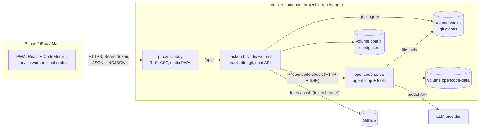
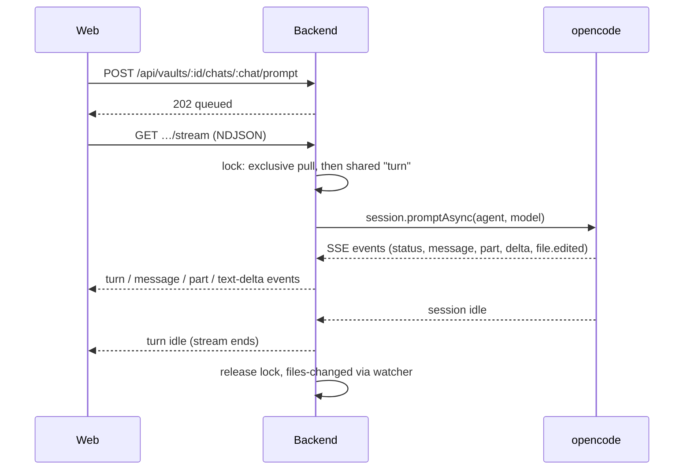

# Architecture: karpathy.app

As built on 2026-10-01. The design rationale is in [`specs/01_mvp/mvp.md`](../01_mvp/mvp.md) §2–3 and the
numbered [implementation decisions](../01_mvp/implementation-decisions.md); this page describes what exists.

## Overview

A thin backend in front of git and an agent harness, a PWA in front of the backend, all in one docker compose
stack. Only the reverse proxy publishes ports.

## Technology stack

| Layer | Technology |
|---|---|
| Web | React 19, Vite 8, TypeScript, CodeMirror 6 (`lang-markdown`, own live-preview decorations), `marked` 18 + DOMPurify, vite-plugin-pwa (Workbox), framework7-icons. No router library (hash routes), no state library (one context hook). |
| Backend | Node 22, Express, TypeScript run with `tsx` (no build step), zod validation, chokidar, `@opencode-ai/sdk` v2, `git` and `ripgrep` binaries. |
| Agent harness | `opencode serve` 1.18.25 (pinned image `ghcr.io/anomalyco/opencode`), provider-agnostic; default model `anthropic/claude-sonnet-5`, Ollama `qwen2.5:3b` in dev and tests. |
| Proxy | Caddy 2.10 built with a `caddy-dns/<provider>` module (default Cloudflare) for DNS-01. |
| Shared | `packages/shared`: TypeScript types for the API (no runtime schemas). |
| Tests | Vitest (backend projects `default`, `github`, `llm`; web unit tests for `lib/`), Playwright e2e (desktop, iPad, iPhone in Chromium and WebKit), axe-core. |
| Tooling | npm workspaces (`apps/*`, `packages/*`), ESLint flat config, `just`, GitHub Actions CI. |

## Components

### Web app (`apps/web`)

- **Shell** with three panes (sidebar, note, chat) laid out per breakpoint: phone ≤ 699 px (tab bar, push navigation),
  tablet 700–1023 px (overlays), wide ≥ 1024 px (columns).
- **Store** (`store.tsx`): one `useAppState` hook in a React context holds the token, vaults, status, open note, save
  pipeline (autosave 1.5 s, drafts, retries), the vault event stream and routing (`#/<vault>/<path>`).
- **Editor** (`Editor.tsx`, `lib/cm.ts`): CodeMirror 6 with decorations only, so the Markdown text, frontmatter and
  `[[wikilinks]]` round-trip losslessly; CRLF kept; external reloads applied as one minimal change.
- **Renderer** (`lib/markdown.ts`): `marked` + wikilink extension + DOMPurify for Read mode and chat text.
- **API client** (`lib/api.ts`, `lib/ndjson.ts`): fetch wrapper with Bearer token, typed `ApiError`, NDJSON reader.
- **Service worker**: precaches the app shell; `vault-api` NetworkFirst cache (5 s timeout) for the vault list, file
  tree and opened notes; auto-update with a re-check whenever the app becomes visible.

### Backend (`apps/backend`)

| Module | Responsibility |
|---|---|
| `main.ts` | Reads env and `*_FILE` secrets, wires the services, graceful shutdown. |
| `app.ts` | Express routes under `/api`, error mapping, NDJSON writer (15 s keepalive). `/healthz` outside auth. |
| `auth.ts` | Bearer token check (hashed, constant-time compare). |
| `vaults.ts` | Vault lifecycle (add, clone, patch, remove), file API, search, status, events, commit/push/discard, conflict resolution; per-vault runtime state. |
| `repo.ts`, `git.ts` | All git commands for one clone: changes, diff, pull procedure, commit, push, conflict sides and resolution; hardened `runGit`. |
| `files.ts`, `paths.ts` | Tree listing, versions (content hash), ripgrep search; path normalization and symlink-safe resolution. |
| `lock.ts` | Per-vault reader/writer lock with writer preference (shared: `save`, `turn`; exclusive: every git operation). |
| `watcher.ts` | chokidar on the vault root, 300 ms debounce → `files-changed` + status events. |
| `chat.ts` | Chats and turns: per-vault queue (one running turn), pull before each turn, stream fan-out, abort, adoption of busy sessions after a restart. |
| `harness/opencode.ts`, `harness/map.ts` | The only code that knows opencode: an ACP-shaped `Harness` interface and the mapping of opencode events to app events. |
| `commit-message.ts` | Proposes commit messages with a throwaway, tool-less session. |
| `config-store.ts` | Atomic, serialized writes to `/config/config.json`. |

### opencode (`deploy/opencode`)

Stock image plus a **managed config** at `/etc/opencode/opencode.json` (merged last, so a vault can't override it):
agents `vault` (edits allowed except `.git` and harness config), `vault-readonly` (default; used during conflicts) and
`commit-message` (no tools); `bash`, `webfetch`, `websearch`, `task`, `question` and `external_directory` denied;
reading `*.env` denied; snapshots, sharing and auto-update off. The image has no git binary, so opencode can't detect
a worktree and stays confined to the session directory (the vault root).

### Proxy (`deploy/proxy`)

Serves the built PWA from `/srv` with SPA fallback, proxies `/api/*` to the backend unbuffered (`flush_interval -1`),
sets CSP and security headers, and gets its certificate by DNS-01 (`TLS_MODE=dns`) or from Caddy's internal CA
(`TLS_MODE=internal`, local prod test only).

## Communication

- **Request/response** JSON over `fetch`; **streams** as NDJSON over `fetch` (no WebSockets, no SSE to the browser):
  the vault event stream (`status`, `files-changed`; never ends) and the chat stream (ends when the turn is idle).
- Turns outlive connections: a client reattaches to a running turn from any device.

## Data

| Store | Content | Owner |
|---|---|---|
| Volume `vaults` → `/vaults/<id>` | Full git clone of each vault repo (no shallow or sparse clone). The notes themselves. | backend (git), opencode (file tools) |
| Volume `config` → `/config/config.json` | `vaults` (config + `cloned` / `cloneError`), `settings`, `aiTouched`, `conflicts`, `queued` turns. | backend only |
| Volume `opencode-data` | opencode sessions = chat history. | opencode |
| Volume `caddy-data` | TLS certificates and keys. | proxy |
| Browser localStorage | Token, local drafts, tree expansion state. | web |
| Service worker cache `vault-api` | Vault list, file trees, opened notes (for offline reading); cleared on 401. | web |

No database. Git is the source of truth for notes; GitHub is the sync hub.

## System boundaries

- **Exposed:** one HTTPS origin: the PWA plus `/api/*` (full route list in `apps/backend/src/app.ts`). Every `/api`
  route needs the bearer token; `/healthz` exists only inside the stack.
- **Consumed:** GitHub over HTTPS (clone, fetch, push), the opencode HTTP API on the internal network, the LLM
  provider APIs (from opencode only), and the DNS provider API (DNS-01, from the proxy only).

## External systems

| System | Used for | Status |
|---|---|---|
| GitHub | Vault repos; fine-grained token as an HTTP extra header, never in `.git/config` | in use |
| LLM providers (Anthropic, OpenAI, OpenRouter, …) | Model behind opencode; keys only in `deploy/opencode.env` | configured, never run against a paid provider (all testing on Ollama) |
| Ollama | Dev, local prod test and CI LLM tests | in use |
| Let's Encrypt + Cloudflare DNS | Certificate via DNS-01 | built, never run against a real domain |
| ghcr.io, Docker Hub | Base images | in use |

## Infrastructure

- **Runtime = docker compose** in dev and prod (`deploy/compose.yml`). Services `proxy` (networks `edge` +
  `internal`), `backend` and `opencode` (`internal` only); backend and opencode run as uid 1000; no egress
  restriction (opencode must reach the LLM APIs). Secrets are files under `deploy/secrets/` mounted as compose secrets;
  provider keys come from `deploy/opencode.env`.
- **Dev** (`compose.dev.yml`, `just dev`): https://localhost:8443 with Caddy's internal CA, Vite with HMR (`web`
  service), bind-mounted sources, local bare repos as remotes (`GIT_REMOTE_BASE=file:///remotes/`), Ollama.
- **Local prod test** (`compose.prodtest.yml`, `just prodtest`): the prod images on https://localhost:9443 next to
  the dev stack.
- **CI** (`.github/workflows/ci.yml`): lint, typecheck, tests, web build and a compose config check on every push and
  PR; nightly GitHub and LLM test suites.
- **Production hosting: not deployed yet.** The prod-env research ([`specs/05_prod_env`](../05_prod_env/prod-env-report.md))
  decided on a Hetzner CX23 behind Tailscale with Cloudflare DNS-01; the deployment mechanism is the open change
  [`specs/07_deployments`](../07_deployments/proposal.md).
