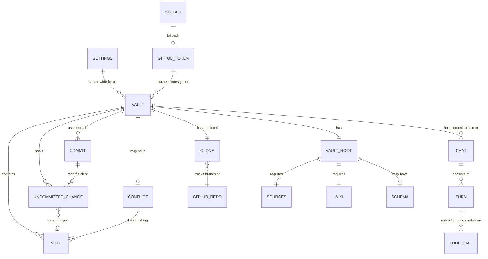
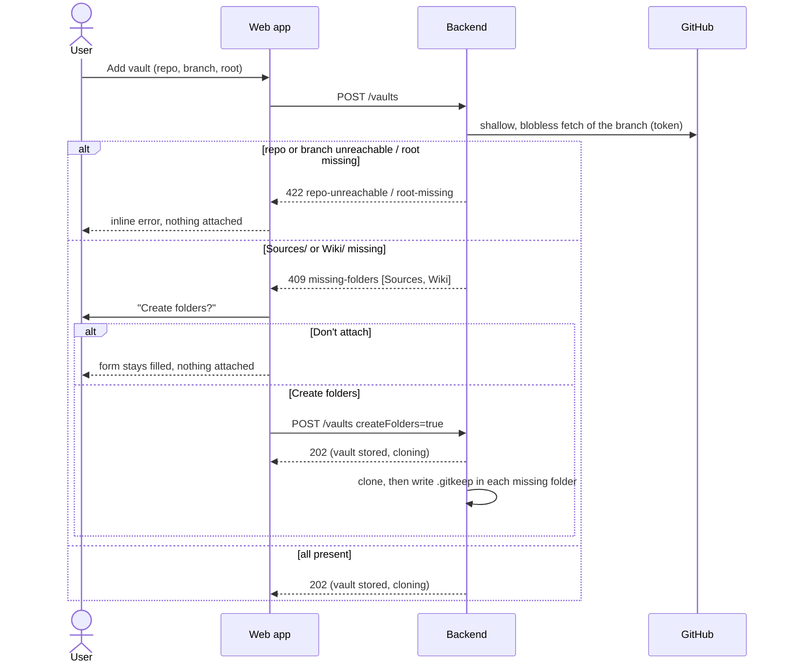
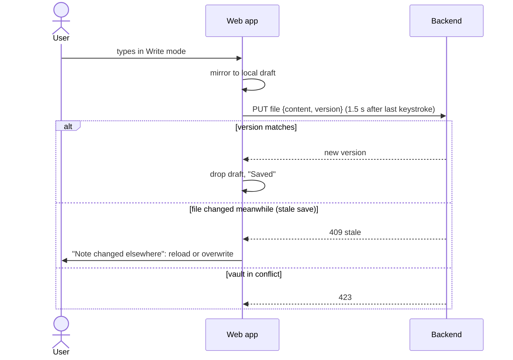
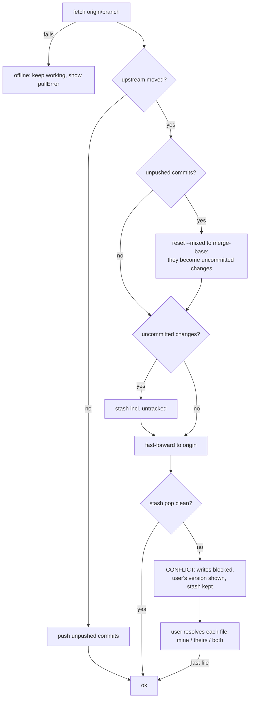

# Domain: karpathy.app

As of 2026-10-02 (MVP milestone M4 implemented, deployed to production; milestones in
[functional.md](functional.md#scope)). The canonical glossary for the team is
[`CONTEXT.md`](../../CONTEXT.md); this page restates it with the rules the code enforces and adds the terms the code
uses beyond it.

## Purpose

karpathy.app lets one person read, edit and talk to an AI about their **Markdown notes stored in GitHub repos**, from a
phone, iPad or Mac, in the browser. It brings the Obsidian + Claude Code + wiki-skills setup to devices that have no
terminal. The app keeps no content of its own: the notes stay in git, and Obsidian on other devices syncs through the
same GitHub remote. The motivation is in the [README](../../README.md#problem).

## Vocabulary

| Term | Meaning | In code |
|---|---|---|
| **Vault** | A GitHub repo (optionally a subfolder of it) whose Markdown notes the app works on. *Avoid:* workspace, project, notebook. | `VaultConfig` / `Vault` (`packages/shared`) |
| **Vault root** | The folder inside the repo that the vault starts at; the repo root unless a subfolder was configured. Nothing outside it is visible. | `VaultConfig.root` (`''` = repo root) |
| **Vault structure** | The folders a vault is expected to have under its vault root: `Sources/` and `Wiki/` (required) and `Schema/` (optional, only mentioned in the help). Only the required ones are checked, and only when a vault is attached; existing vaults are never checked or repaired. Names match case-insensitively (`wiki/` counts as `Wiki/`). | `REQUIRED_FOLDERS` (`preflight.ts`) |
| **Sources** | `Sources/`: immutable source documents (articles, mails, PDFs, clips) that humans or ingest skills add and that aren't rewritten afterwards. | |
| **Wiki** | `Wiki/`: the knowledge base the AI maintains from the sources (entities, concepts, topics, syntheses, index, log). | |
| **Schema** | `Schema/`: optional instructions for the AI (e.g. `Schema/CLAUDE.md`, methodology). | |
| **Attach preflight** | The check that runs when a vault is added, before anything is stored or cloned into the vault directory: repo and branch reachable with the GitHub token, vault root exists, required folders present. A vault that fails it was never attached. | `preflight()` |
| **Missing folders** | The required folders absent from the vault root of a repo being attached. The user decides whether to create them. | `409 missing-folders` |
| **Folder placeholder** | An empty `.gitkeep` that makes a created folder exist in git. It is an uncommitted change like any other; nothing is committed for the user. | `Vaults.createFolders` |
| **GitHub token** | The single, server-wide credential for every git operation against GitHub (clone, pull, push, preflight). Set in the app's settings or, as fallback, the deployment's `GITHUB_TOKEN` secret. Never sent to the client in full (last 4 characters only), never given to the AI, never written into a repo. | `GitHubToken`, `config.githubToken` |
| **Token source** | Where the active token comes from: `settings` (set in the app, wins), `secret` (the deployment secret, used while none is set in the app) or `none`. | `SettingsView.githubToken.source` |
| **Token test** | A check of a token, the stored one or one typed but not saved: does GitHub accept it, whose is it, its scopes and expiry, and can it reach each configured vault's repo and branch. Stores nothing. | `TokenTest` |
| **Active vault** | The one vault the UI is currently scoped to. | web `store.tsx` |
| **Vault state** | `cloning` → `ready` or `clone-failed`; `ready` ↔ `conflict`. The attach preflight comes before the vault exists, so it is not a state. | `VaultState` |
| **Note** | A file in the vault, usually `.md`. Binary files are shown but can't be edited. | `FileContent.binary` |
| **Version (of a file)** | The first 16 hex characters of the SHA-256 of a file's content. Saves, deletes and discards carry the version they started from. | `files.ts` `versionOf` |
| **Chat** | A resumable conversation with the AI, bound to exactly one vault; its reach is that vault's root. *Avoid:* session, thread, conversation. | one opencode session |
| **Turn** | One user prompt in a chat plus everything the AI reads and changes in response. States `idle`, `queued` (waiting for another turn or for the sync), `running`. | `TurnState` |
| **Consulted file / changed file** | Files the AI read (read tools) or wrote (edit/write/patch tools) during a turn, shown as chips. | `ToolCall.writes` |
| **AI-touched** | The set of paths the AI changed since the last commit. A commit that includes one of them gets the `Co-authored-by: karpathy.app agent` trailer. | `config.aiTouched` |
| **Uncommitted change** | A file that differs from its last commit, whether the user or the AI changed it; both are pooled. *Avoid:* draft, pending edit, dirty file. | `Change` |
| **Unsaved change** | An edit held only in the editor (and in a local draft) that hasn't been written to the vault yet. | web `drafts.ts` |
| **Draft** | The local browser copy of an unsaved change (`{base, text}`), kept until the server has the text. Internal term; to the user it's still an unsaved change. | localStorage `karpathy.draft:*` |
| **Commit** | The user-triggered act of recording all uncommitted changes of a vault and pushing them to GitHub in one step. There is no commit without a push attempt. *Avoid:* sync, save, publish. | `Vaults.commit` |
| **Unpushed commit** | A commit whose push failed; it is pushed again on the next pull, commit or manual retry. If GitHub has moved on meanwhile, the next pull turns it back into uncommitted changes. | `VaultStatus.unpushedCount` |
| **Commit reminder** | A prompt that appears once the number of uncommitted changes passes a threshold (default 4), offering to commit. | `Settings.commitReminderThreshold` |
| **Stale save** | A save rejected because the file changed (by the AI or a pull) since the editor loaded it. *Avoid:* conflict (reserved for git). | HTTP 409 `stale` |
| **Conflict** | A git-level clash between the vault's uncommitted changes and changes pulled from GitHub. It blocks all writes to the vault until the user resolves each clashing file: keep **mine**, **theirs** or **both**. | `VaultState` `conflict`, `conflictPaths` |
| **Busy** | What the vault is doing right now: `none`, `turn` (an AI turn holds it) or `sync` (a git operation holds it or waits for it). | `VaultStatus.busy` |
| **Pull** | The backend's sync with GitHub (fetch, fast-forward, re-apply uncommitted changes). Runs on open, before every commit and push, and before every AI turn. There is no user-facing pull button. | `Repo.pull` |
| **Write mode / Read mode** | Write mode is the default: raw Markdown with live preview, editable. Read mode is the rendered, non-editable view. *Avoid:* edit mode, source mode, preview. | web `NotePane` |
| **Harness config** | An `.opencode/`, `opencode.json` or `opencode.jsonc` inside a vault. Its presence disables chat for that vault, because it could override the AI's restrictions. | `HARNESS_CONFIG` |

### Operations

Terms for running the app, not for using it ([deployment.md](deployment.md)).

| Term | Meaning | In code |
|---|---|---|
| **Release** | A git tag `vX.Y.Z` with the three images CI built from it and the `compose.yml` attached to the GitHub release. Never changes once published; a tag whose images failed to build isn't one. *Avoid:* build, deployment. | `.github/workflows/release.yml` |
| **Pre-release** | A release from a `vX.Y.Z-rc.N` tag, from any commit. Deployable by name, never GitHub's "Latest" or `:latest`. | `guard` job |
| **Version (of a release)** | `X.Y.Z`, the tag without the `v`; also the image tag and what `/api/health` reports. Local builds report `dev`. | `APP_VERSION` |
| **Target** | A named place a release is deployed to: `local` (the Lima VM) or `hetzner`. One host with its own settings and secrets. *Avoid:* environment, stage, server. | `deploy/ansible/inventories/<target>` |
| **Deployment** | One `just deploy <target> [version]`: brings the host to the desired state, starts the release, ends with the smoke check. *Avoid:* rollout, ship. | `site.yml` |
| **Current release** | The release a target runs now; earlier ones stay for rollback. | `/opt/karpathy.app/current` |
| **Rollback** | A deployment of an older release, with today's playbook. | — |
| **Smoke check** | The end of every deployment: containers healthy, `/api/health` through the proxy with the token, the requested version. | `roles/app/tasks/smoke.yml` |
| **Alert** | A push to the operator's phone (ntfy) when something needs a person. | Beszel, Gatus, healthchecks.io |
| **Heartbeat** | A ping to healthchecks.io every 5 minutes; when it stops or reports a failure, healthchecks.io raises the alert. *Avoid:* uptime check. | `karpathy-heartbeat` |
| **Login link** | `<app url>/#token=…`, shown as a QR code by `just token <target> --qr`; logs a device in. | `lib/login-code.ts` |

## Concepts and entities

- **Settings** are server-wide: the commit reminder threshold and the **model** (`provider/model`, default
  `anthropic/claude-sonnet-5`). There is no per-chat model. The **GitHub token** is managed next to them but is
  stored separately from them (never part of `Settings`).
- The **GitHub token** is optional in the app: with none set, the deployment's `GITHUB_TOKEN` secret is used.
  Removing the stored token falls back to the secret again. A token changed in the app applies to the next git
  operation without a restart. There is one token for all vaults; one per owner would be the follow-up if vaults ever
  span several owners (a fine-grained token covers one owner's repos).
- A **vault** is identified by a slug `id`, and configured by `name`, `repo` (`owner/name`), `branch` and `root`.
  The same repo + branch + root can't be added twice, also not while the first add's preflight is still running.
  A vault exists in the config only after its attach preflight passed and, if folders were missing, the user agreed
  to create them.
- A **note** is identified by its path relative to the vault root; dot-files and `.git` are never listed.

## Actors

| Actor | What it can do |
|---|---|
| **Operator** (the same person as the user, on the Mac) | Cuts releases, deploys them to the targets, holds the vault passwords (Keychain) and gets the alerts. |
| **User** (single person, holds the bearer token) | Manage vaults and settings, read and edit notes, search, chat with the AI, review diffs, discard, commit and push, resolve conflicts. Uses the app as a PWA on phone, iPad and desktop. |
| **AI** (opencode agent, on the user's behalf) | Inside one vault root only: read notes; write notes unless the vault is in conflict (then read-only). It can't run shell commands, fetch the web, read `.env` files, edit `.git` or harness config, commit or push. |
| **Obsidian / other git clients** | Change the same GitHub repo from other devices; their changes arrive on the next pull and can cause a conflict. |
| **GitHub** | Hosts the vault repos; the backend clones, fetches and pushes with the GitHub token, and asks `GET /user` to test it. |
| **LLM provider** (e.g. Anthropic; Ollama in dev) | Runs the model behind opencode. Sees the prompts and the note content the AI reads. |

## Processes

### Attach a vault

The created folders are uncommitted changes until the user commits (ADR 0001). A failure after the preflight (network
drop, disk full) is a normal `clone-failed` vault with Retry and Edit.

### Edit a note

### AI turn

1. The user sends a prompt; the backend queues the turn (one running turn per vault; the queue survives restarts).
2. Before the turn starts the backend **pulls** under an exclusive lock, then downgrades to a shared lock without
   letting any other git operation in between.
3. opencode runs the turn with the `vault` agent (or `vault-readonly` while in conflict). Reads and writes stream to
   the UI as tool chips; written paths join the AI-touched set.
4. The lock is released when opencode reports the session idle. Changes stay uncommitted.

### Commit

1. The user opens the commit dialog; the app flushes the open note and asks for a proposed message (a tool-less AI
   agent, 15 s timeout, fallback "Update N files").
2. The backend takes the exclusive lock, **pulls**, checks that the set of changed paths is still the one the user
   reviewed (else 409 `changes-moved`), commits everything in the vault root (with the AI trailer if needed) and pushes.
3. A failed push leaves an **unpushed commit**, retried on the next pull or by the user.

### Pull and conflict

"Both" keeps the user's version at the path and writes GitHub's next to it as `<name>.conflict-YYYY-MM-DD.md`.

## Rules and constraints

- **The AI never commits or pushes** ([ADR 0001](../../docs/adr/0001-user-triggered-commits.md)); only the user's
  commit does, and it records **all** uncommitted changes of the vault root (no partial staging).
- **Everything is scoped to the vault root:** file access, search, git status/diff/add, and the AI's session
  directory. Changes outside the root are invisible.
- **Conflict blocks writes:** saves, deletes, discards and commits are refused (423); AI turns run read-only; repo,
  branch or root changes and vault removal are refused.
- **Optimistic concurrency everywhere:** saves, deletes and discards carry the file version they started from; a
  commit carries the paths the user reviewed.
- **No data loss on pull:** unpushed commits are folded back into uncommitted changes; during a conflict the stash is
  kept until every file is resolved.
- **A vault is attached only after a passing preflight.** Unreachable repo or branch and a missing vault root are
  refused and nothing is stored. Missing `Sources/` / `Wiki/` are created only with the user's consent, as uncommitted
  placeholders. Changing repo, branch or root of an existing vault (PATCH) has no preflight.
- **Removing a vault deletes only the local clone** (never the GitHub repo) and requires no uncommitted changes and no
  unpushed commits. Changing repo, branch or root has the same precondition.
- **New file names** may not contain `<>:"|?*\` or control characters, may not be Windows-reserved names, end in a dot
  or space, differ from an existing file only by case, or be harness config.
- **Chat is disabled** in vaults that contain harness config.
- **Single user:** one bearer token, one git identity, one server-wide model.
