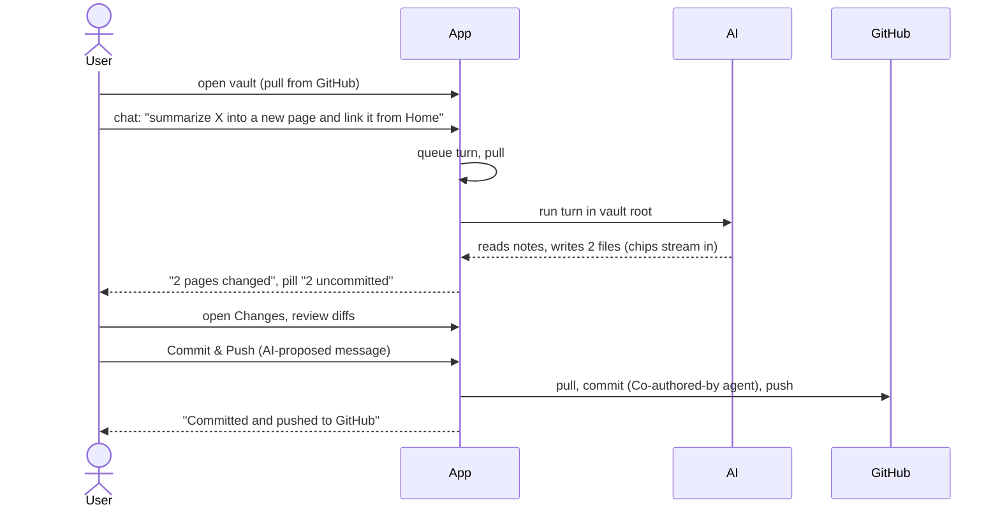
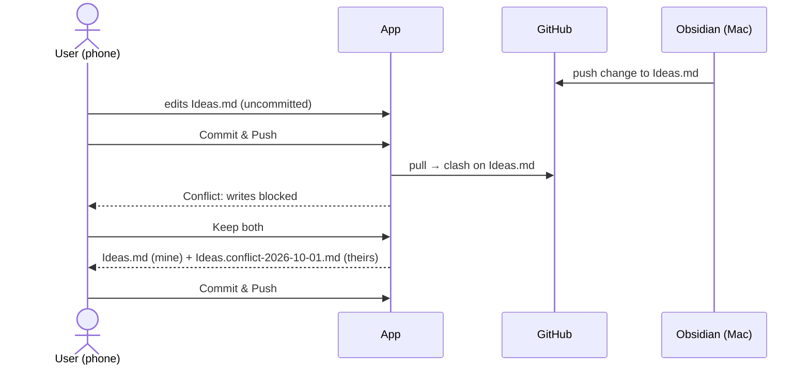
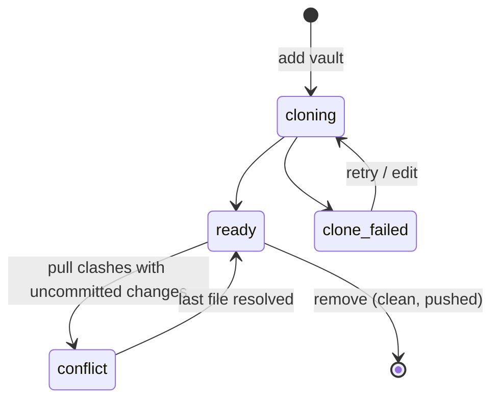
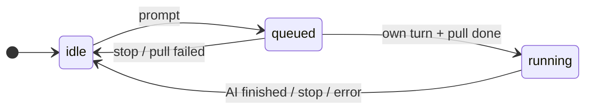

# Functional: karpathy.app

What the user can do, as built on 2026-10-01. Terms are defined in [domain.md](domain.md).

## Features

### Access

- **Token screen:** one password field; the token is checked against `/api/health` and stored on the device only.
  Any 401 later drops the token and the offline note cache and shows the screen again.
- **PWA:** installable (standalone, app icons); updates itself when a new version is deployed, re-checking whenever
  the app comes back to the foreground.

### Vaults and settings (admin modal "Vaults & settings")

- **Add vault:** name, GitHub repo `owner/name`, branch (default `main`), optional vault root. The vault clones in the
  background (list refreshes every 2 s); a failed clone shows the git error with **Retry** and **Edit**.
- **Edit vault:** name any time; repo, branch or root only when the vault has no uncommitted changes and no unpushed
  commits.
- **Remove vault:** deletes the local clone only, never the GitHub repo; same precondition.
- **Switch vault** from the vault menu (shows `name · branch`); the open note is saved first.
- **Settings:** commit reminder threshold (1–1000 changed files) and the model (`provider/model`, server-wide; the
  server rejects models opencode doesn't offer).

### Notes

- **File tree:** folders first, alphabetical, collapsed by default, expansion remembered per vault; `.md` hidden in
  names; dot-files never shown.
- **Create a note** (path prompt, `.md` added if missing, starts as `# <title>`). Refused for existing names, names
  that differ only by case, and invalid names.
- **Delete a note** (recoverable until the next commit).
- **Write mode** (default): Markdown with live preview, frontmatter shown as a block, find-in-note.
- **Read mode:** rendered, sanitized Markdown; frontmatter as a properties table.
- **Wikilinks** `[[target#heading|alias]]`: click to open (resolved by path, then by file name anywhere); links to
  missing pages are marked and say "No page “X” yet".
- **Autosave** 1.5 s after the last edit; local drafts survive reloads and crashes; status footer
  "Saving…" / "● Unsaved changes" / "Saved".
- **Live updates:** a note changed by the AI or a pull reloads silently if it has no unsaved changes; a deleted note
  shows "Keep as new note" / "Close".
- **Binary files** are shown as "Binary file — can’t be edited here".

### Search

Full-text, case-insensitive, fixed-string search over the vault root (ripgrep), plus file-name matches; results
grouped per note with up to 4 line snippets; capped at 200 hits ("refine your search"); opens the note at the hit.

### Changes and commits

- **Changes list** with kind (modified, added, deleted, renamed, untracked) and a unified diff per file.
- **Discard** one file's changes (refused if the file changed since the diff was shown).
- **Commit & Push:** proposes a message (AI, falls back to "Update N files"), editable; commits all uncommitted
  changes of the vault root and pushes. If new changes arrived since the review, the commit is refused with the list.
- **Unpushed commits:** "N unpushed commits · retry".
- **Commit reminder** when changes pass the threshold: "Later" brings it back at 2× the threshold, a second "Later"
  silences it until the count drops again.
- **Git status pill:** "Conflict" / "Syncing…" / "AI working…" / "N uncommitted" / "All committed", plus
  "· N unpushed" and "· offline".

### Conflicts

When a pull clashes with uncommitted changes: a banner says writes are blocked; each clashing file shows a line diff
of GitHub's version vs. the app's (or "deleted on GitHub / in this app"), with **Keep mine / Keep theirs / Keep both**
(default both) and a larger compare view. The vault returns to normal after the last file is resolved.

### Chat with the AI

- **Chat list** per vault (title, running/queued marker, time; delete); **new chat**; **resume** any chat, also on
  another device mid-turn.
- **Send** (Enter; Shift+Enter for a newline) and **Stop**. One turn runs per vault at a time; others wait
  ("Waiting for other chat…" / "Waiting for sync…").
- **Streaming reply** with Markdown and wikilinks, collapsible "Thinking", **tool chips** for files read and changed
  (changed ones open the note), and a footer listing the changed pages.
- **Read-only while in conflict** ("the AI can only read, not change notes").
- The AI can read and edit notes in the vault root only; its changes are uncommitted until the user commits.

## User journeys

### Ask the AI to update notes, then commit

### Edit on the phone while Obsidian changes the same note

## Inputs and outputs

| In | Out |
|---|---|
| Bearer token (once per device) | — |
| Vault config: repo, branch, root, name | A cloned vault, or a clone error |
| Note text (Markdown, any UTF-8 text file) | Saved file + new version; rendered HTML in Read mode |
| Search query | Grouped hits with line snippets |
| Chat prompt | Streamed reply, tool chips, changed notes |
| Commit message | Commit on GitHub (or an unpushed commit), toast |
| Conflict choice per file | Resolved file(s), possibly a `.conflict-<date>` copy |
| Settings: reminder threshold, model | — |

No uploads, exports, e-mail or push notifications.

## States and transitions

Note save: Saved → Unsaved changes → Saving… → Saved, with side states *retrying*, *stale* (dialog: reload or
overwrite) and *deleted* (banner).

## Permissions and visibility

Single user: whoever has the bearer token can do everything. There are no roles, no sharing and no per-vault
permissions. The AI's permissions are fixed in the managed opencode config ([architecture.md](architecture.md#opencode-deployopencode)).

## Edge cases and known limitations

- **Offline:** read-only. Cached vault list, trees and previously opened notes are shown; edits are kept as local
  drafts and saved when back online; search and chat are unavailable.
- **No rename or move** of notes or folders, no explicit folder creation, no manual pull button, no per-chat model,
  no chat rename, no global keyboard shortcuts.
- Native `prompt()` / `confirm()` dialogs for new note, delete, discard, remove vault and delete chat.
- Chat is disabled in vaults that contain `.opencode/`, `opencode.json` or `opencode.jsonc`.
- A save on page exit only works for notes under about 60 KB (browser keepalive limit); the local draft covers the rest.
- Search skips files ignored by `.gitignore` and hidden files; capped at 200 hits.
- Vaults are full clones; there is no disk-space check before adding a vault and no per-file size limit.
- Push failures aren't retried in the background, only on the next pull, commit or "retry".
- The frontmatter properties table understands simple YAML only; other values are shown raw.
- Not deployed to production yet, and never run against a paid LLM provider or a real domain certificate.
