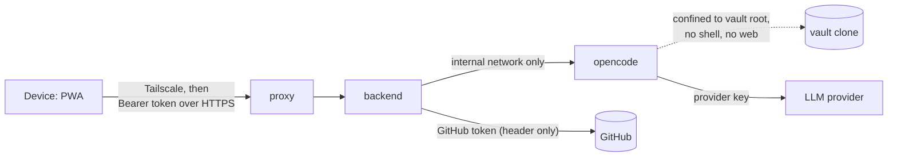

# Security: karpathy.app

The protections that exist on 2026-10-02, in the code and on the production server. The threat analysis behind the
server setup is in the [prod-env report](../05_prod_env/prod-env-report.md#security); how the server is set up is in
[deployment.md](deployment.md).

## Trust boundaries

## Authentication

- One **bearer token** guards every `/api` route; it is compared hashed and in constant time, and the backend refuses
  to start without one (`apps/backend/src/auth.ts`). `/healthz` carries no data and is reachable only inside the
  stack (Caddy proxies only `/api/*`).
- The web app keeps the token in localStorage; a 401 clears it together with the offline cache of note contents.
  The one way it travels in a URL is the login link `#token=…` (QR code): the fragment never reaches the server,
  and the app removes it from the address bar and the history at once. The QR code is a credential.

## Secrets

| Secret | Goes only to | How |
|---|---|---|
| Bearer token | backend | compose secret (`BEARER_TOKEN_FILE`) |
| GitHub token | backend | compose secret; sent per git command as an `http.https://github.com/.extraheader`, never written to `.git/config`, redacted from errors and logs |
| DNS API token | proxy | compose secret (root-owned on a server) |
| LLM provider keys | opencode | `opencode.env` (env file) |

In dev the secret files are gitignored. On a target they come from that target's encrypted Ansible Vault (password
in the operator's Keychain) and are written 0600 by tasks that don't log. opencode never receives the GitHub or
bearer token.

## Confining the AI

- **Managed opencode config** merged last (`/etc/opencode/opencode.json`), so a vault can't override it; an empty
  tmpfs `HOME` means no global config either.
- **Denied tools:** `bash`, `webfetch`, `websearch`, `task`, `question`, `external_directory`; no permission is ever
  "ask". Reading `*.env` is denied; editing `.git`, `opencode.json(c)` and `.opencode/` is denied.
- **Agents:** `vault` (edit), `vault-readonly` (default, and forced during conflicts), `commit-message` (no tools).
- **Directory confinement:** the opencode image has no git, so opencode treats the session directory (the vault root)
  as the boundary; `external_directory: deny` blocks everything outside it.
- **Harness config in a vault** (`.opencode/`, `opencode.json(c)`) disables chat for that vault and can't be created
  through the file API.
- **No commits by the AI:** only the user's commit records and pushes changes ([ADR 0001](../../docs/adr/0001-user-triggered-commits.md)).

## Input handling

- **Paths:** relative only; no `..`, NUL, absolute paths or `.git` segments; every segment is checked for symlinks
  (`paths.ts`). Git checks out symlinks as plain files (`core.symlinks=false`).
- **Git arguments:** `--end-of-options` on clone, fetch and push; branch names restricted to a safe-ref pattern; repo
  names to `owner/name`.
- **File names:** no Windows-reserved names, forbidden characters, trailing dots or spaces, or case twins.
- **Request validation** with zod; JSON body limit 10 MB.

## Rendering untrusted content

Notes and AI replies are untrusted HTML sources. Markdown is rendered with `marked` and sanitized with DOMPurify
(forms, inputs, buttons, styles, links, meta, base and dialogs removed, `style` and form attributes stripped). The
prod proxy adds a strict **CSP** (`default-src 'self'`, `script-src 'self'`, `object-src 'none'`,
`frame-ancestors 'none'`, …; `style-src 'unsafe-inline'` because CodeMirror injects styles) and `nosniff`,
`no-referrer` and `X-Frame-Options DENY`.

## Runtime hardening

- Only the proxy publishes ports (443 only, no port 80); backend and opencode are on the internal network.
- Backend and opencode run as uid 1000, not root; every service has `cap_drop: [ALL]` (the proxy keeps
  `NET_BIND_SERVICE`), `no-new-privileges` and bounded logs.
- opencode's snapshots, sharing and auto-update are off; its version is pinned.
- **Production server:** reachable only over Tailscale. The Hetzner firewall blocks all inbound traffic; the app,
  Beszel and Gatus bind the tailnet IP. SSH takes keys only, no root login. The operator logs in as `ops` (sudo);
  uid 1000, the app's user, has no login, no sudo and no Docker access, so a container breakout doesn't reach root
  directly.

## Gaps (known, not built)

- No rate limiting on the token check.
- No egress restriction: opencode can reach any host (it needs the LLM APIs).
- Single shared token: no per-device tokens or revocation other than changing the secret.
- The LLM provider sees every note the AI reads.
- The Beszel agent mounts the Docker socket (root-equivalent on the host; accepted).
- Gatus has no authentication on the tailnet; secrets appear briefly in process lists during a deployment.
- The GoDaddy API key can change every domain of the account and sits on the server.
